# OOP Four Pillars

1. What is abstraction?
2. What is encapsulation?
3. What is inheritance?
4. What is polymorphism?
5. Date/Time
6. How do you work with date/time in Java?
7. Constructors
8. What does a constructor return?
9. What does the new keyword do when creating objects?
10. What is constructor overloading?
11. What is constructor chaining?
12. What is the default constructor?
13. Access Modifiers
14. What are private fields used for?
15. What is a protected field?
16. What are getters and setters used for?

## OOP Four Pillars

### 1. Abstraction

**Definition:** Hiding implementation details while exposing only the necessary **what** (functionality) to the user, not **how** (implementation).

**Real-world analogy:**
Think of a car’s steering wheel—you know what it does (turns the car), but you don’t need to know how it’s connected to the wheels.

#### Implementation

- **Abstract Classes:**
  Define incomplete methods (without bodies) and force subclasses to fill in the details.
- **Interfaces:**
  Define a **contract** that classes must follow (Java 8+ allows default/static methods).

#### Examples

**Abstract Class:**

```java
abstract class Shape {
    abstract double area(); // Must be implemented by subclasses

    void printArea() { // Common behavior
        System.out.println("Area: " + area());
    }
}

class Circle extends Shape {
    private double radius;

    Circle(double radius) { this.radius = radius; }

    @Override
    double area() { return Math.PI * radius * radius; } // Implementation
}

class Rectangle extends Shape {
    private double width, height;

    Rectangle(double width, double height) {
        this.width = width;
        this.height = height;
    }

    @Override
    double area() { return width * height; }
}
```

**Interface:**

```java
interface Drawable {
    void draw();
    default void resize() { System.out.println("Resizing..."); }
}

class Avatar implements Drawable {
    @Override
    public void draw() { System.out.println("Drawing avatar"); }
}
```

> [!TIP]
> Use **abstract classes** for “is-a” relationships with shared code.
> Use **interfaces** for “can-do” capabilities, multiple implementation, and API contracts.

***

### 2. Encapsulation

**Definition:** Bundling data (fields) and methods (functions) that operate on that data into a single unit (class), and controlling access with access modifiers.

**Real-world analogy:**
A bank account—**balance** is private; you interact with it through **deposit** and **withdraw** methods.

#### Implementation

- **Private fields:** Hide state from the outside.
- **Public methods (getters/setters):** Controlled access and validation.

#### Example

```java
class BankAccount {
    private double balance;
    private String owner;

    public BankAccount(String owner, double initialDeposit) {
        this.owner = owner;
        if (initialDeposit > 0) this.balance = initialDeposit;
    }

    // Getter
    public double getBalance() { return balance; }

    // Setter (with validation)
    public void deposit(double amount) {
        if (amount > 0) balance += amount;
    }

    public void withdraw(double amount) {
        if (amount > 0 && amount <= balance) balance -= amount;
    }
}
```

> [!WARNING]
> **Never expose fields directly as public** unless there’s a strong reason.

> [!EXAMPLE]
> **Input validation patterns:**
> ```java
> // Age validation with business rule (over 18)
> public void setAge(int age) {
>     if (age < 18) throw new IllegalArgumentException("Must be over 18");
>     if (age > 150) throw new IllegalArgumentException("Invalid age range");
>     this.age = age;
> }
> 
> // Input range validation
> public void setScore(int score) {
>     if (score < 0 || score > 100) {
>         throw new IllegalArgumentException("Score must be 0-100");
>     }
>     this.score = score;
> }
> 
> // Boundary value handling
> public void processInput(String input) {
>     if (input == null || input.trim().isEmpty()) {
>         throw new IllegalArgumentException("Input cannot be null or empty");
>     }
>     // Process valid input
> }
> ```

***

### 3. Inheritance

**Definition:** Creating a new class that is a modified version of an existing class (parent/superclass).

**Real-world analogy:**
Different breeds of dogs inherit characteristics from the general “Dog” class.

#### Syntax

```java
class Animal {
    void makeSound() { System.out.println("Animal sound"); }
}

class Dog extends Animal {
    @Override
    void makeSound() { System.out.println("Bark"); }
}

class Cat extends Animal {
    @Override
    void makeSound() { System.out.println("Meow"); }
}
```

**Use:**
Promotes **code reuse**, **method overriding** (polymorphism), and **specialization** of behavior.

> [!INFO]
> Java supports **single inheritance** for classes (one parent), but **multiple interface implementation**.

***

### 4. Polymorphism

**Definition:** The ability of a reference to behave differently based on the runtime object it points to.

**Real-world analogy:**
A USB port: Works with keyboard, mouse, or flash drive—same interface, different behavior.

#### Types

- **Compile-time (overloading):** Same method name, different parameters.
- **Runtime (overriding):** Subclass provides a new implementation for a method from its superclass.

#### Examples

**Compile-time (overloading):**

```java
class Calculator {
    int add(int a, int b) { return a + b; }
    double add(double a, double b) { return a + b; }
    int add(int a, int b, int c) { return a + b + c; }
}
```

**Runtime (overriding):**

```java
Animal animal = new Dog();
animal.makeSound(); // Calls Dog’s makeSound()
animal = new Cat();
animal.makeSound(); // Calls Cat’s makeSound()
```

> [!TIP]
> Polymorphism supports flexible, maintainable code—change behavior without changing the interface.

***

## Date/Time Handling in Java

**Never use** `java.util.Date` or `Calendar`—use `java.time` (Java 8+) instead.

### Key Classes

| Class                 | Purpose                   | Example                                    |
| :-------------------- | :------------------------ | :----------------------------------------- |
| `LocalDate`           | Date (year-month-day)     | `2025-08-29`                               |
| `LocalTime`           | Time (hour-minute-second) | `14:30:15`                                 |
| `LocalDateTime`       | Date + Time               | `2025-08-29T14:30:15`                      |
| `ZonedDateTime`       | Date + Time + Timezone    | `2025-08-29T14:30:15+01:00[Europe/London]` |
| `Duration` / `Period` | Time spans                | `Duration.ofHours(2)`, `Period.ofDays(7)`  |

#### Example Usage

```java
import java.time.LocalDate;
import java.time.LocalDateTime;
import java.time.format.DateTimeFormatter;

LocalDate today = LocalDate.now();
LocalDateTime now = LocalDateTime.now();

// Formatting
DateTimeFormatter formatter = DateTimeFormatter.ofPattern("dd/MM/yyyy");
String formattedDate = today.format(formatter);

// Manipulation
LocalDate tomorrow = today.plusDays(1);
LocalDate lastMonth = today.minusMonths(1);

// Parsing
LocalDate parsedDate = LocalDate.parse("25/12/2025", formatter);
```

> [!TIP]
> `java.time` is **immutable** and **thread-safe**. Use `Duration` for time-based amounts, `Period` for date-based.

***

## Constructors

### What Does a Constructor Return?

**Constructors have no return type**—they **implicitly return** a reference to the new object.

```java
class Point {
    int x, y;
    Point(int x, int y) { this.x = x; this.y = y; }
}

Point p = new Point(3, 4); // Constructor returns a Point reference
```

### The `new` Keyword

Allocates memory for the object and calls its constructor.

```java
String s = new String("Hello"); // 'new' creates object, calls constructor
```

### Constructor Overloading

**Multiple constructors** with different parameter lists, providing various ways to create objects.

```java
class Student {
    String name;
    int age;
    String id;

    Student(String name) { this(name, 18, "UNKNOWN"); }

    Student(String name, int age) { this(name, age, "UNKNOWN"); }

    Student(String name, int age, String id) {
        this.name = name;
        this.age = age;
        this.id = id;
    }
}
```

### Constructor Chaining

**One constructor calls another** using `this(...)` for code reuse.

```java
class Rectangle {
    int width, height;

    Rectangle() { this(1, 1); } // No-arg constructor chains

    Rectangle(int width, int height) {
        this.width = width;
        this.height = height;
    }
}
```

### Constructor Chaining Patterns

Here are the different ways constructors can chain together for code reuse and initialization:


**Constructor Execution Order:**


**Constructor Chaining Rules and Examples:**


### Default Constructor

**If no constructor is defined**, Java provides a **public, no-arg default constructor**.
**If you define any constructor**, the default is **not provided**.

```java
class Empty { } // Has a default constructor: Empty() { }

class NonEmpty {
    NonEmpty(String s) { } // No default constructor now
}
```

### Object Lifecycle Visualization

Here's the complete lifecycle of a Java object from creation to garbage collection:


**Constructor Chaining Flow:**


**Object States Throughout Lifecycle:**

| Phase | Object State | Memory Location | Reference Count | GC Eligible |
|:------|:-------------|:---------------|:---------------|:------------|
| **Creation** | Initializing | Heap (allocated) | 0 (being created) | No |
| **Construction** | Constructing | Heap (partial) | 0 (in progress) | No |
| **Active Use** | Fully initialized | Heap (complete) | 1+ | No |
| **Reference Loss** | Orphaned | Heap (unreachable) | 0 | Yes |
| **GC Marked** | Marked for deletion | Heap (flagged) | 0 | Yes |
| **Finalized** | Being cleaned up | Heap (finalizing) | 0 | Yes |
| **Freed** | Destroyed | Memory freed | N/A | N/A |

***

## Access Modifiers

### Private

**Accessible only within the same class**—data hiding for encapsulation.

```java
class Account {
    private double balance;
    // Getter/setter for controlled access...
}
```

### Default (Package-Private)

**Accessible within the same package**.
No keyword—just omit the modifier.

```java
class PackagePrivateClass {
    int packagePrivateField;
}
```

### Protected

**Accessible within the same package + subclasses (even in different packages)**.

#### Comprehensive Protected Access Examples

**Same Package Access:**
```java
package animal;

public class Animal {
    protected String species;
    protected int age;
    
    protected void displayInfo() {
        System.out.println("Species: " + species + ", Age: " + age);
    }
}

class AnimalCaretaker {  // Same package, not a subclass
    void careFor(Animal animal) {
        animal.species = "Updated";  // ✓ Can access protected field
        animal.displayInfo();        // ✓ Can access protected method
    }
}
```

**Subclass in Different Package:**
```java
package zoo;
import animal.Animal;

public class Lion extends Animal {
    public Lion(String species, int age) {
        this.species = species;  // ✓ Can access inherited protected field
        this.age = age;          // ✓ Can access inherited protected field
    }
    
    void feed() {
        displayInfo();           // ✓ Can call inherited protected method
        System.out.println("Feeding " + species);
    }
}
```

**Non-Subclass in Different Package (Access Denied):**
```java
package veterinary;
import animal.Animal;
import zoo.Lion;

public class Vet {
    void examine(Animal animal) {
        // animal.species = "Cat";     // ✗ Compile error - not accessible
        // animal.displayInfo();       // ✗ Compile error - not accessible
    }
    
    void treatLion(Lion lion) {
        // lion.species = "Big Cat";   // ✗ Compile error - can't access via object reference
        // Must use public methods or getters instead
    }
}
```

**Real-World Framework Example:**
```java
package framework;

public abstract class Component {
    protected String name;
    protected boolean enabled = true;
    
    protected void validate() {
        if (name == null || name.isEmpty()) {
            throw new IllegalStateException("Component name is required");
        }
    }
}

package ui;
import framework.Component;

public class Button extends Component {
    public Button(String buttonName) {
        this.name = buttonName;     // ✓ Access inherited protected field
        validate();                 // ✓ Call inherited protected method
    }
    
    public void click() {
        if (enabled) {              // ✓ Use inherited protected field
            System.out.println("Button " + name + " clicked");
        }
    }
}
```

### Public

**Accessible everywhere**.

```java
public class Logger {
    public static void log(String message) {
        System.out.println(message);
    }
}
```

### Access Modifier Scope Visualization

Here's how different access modifiers control visibility across packages and inheritance hierarchies:

```mermaid
graph TB
    subgraph "Package A (com.example.base)"
        subgraph "BaseClass"
            PRIV["🔒 private field\n❌ Not accessible outside class"]
            PKG["📦 package field\n✅ Same package only"]
            PROT["🛡️ protected field\n✅ Same package + subclasses"]
            PUB["🌐 public field\n✅ Accessible everywhere"]
        end
        
        subgraph "SamePackageClass"
            SP_PRIV["❌ Can't access private"]
            SP_PKG["✅ Can access package"]
            SP_PROT["✅ Can access protected"]
            SP_PUB["✅ Can access public"]
        end
    end
    
    subgraph "Package B (com.example.other)"
        subgraph "SubClass extends BaseClass"
            SUB_PRIV["❌ Can't access private"]
            SUB_PKG["❌ Can't access package"]
            SUB_PROT["✅ Can access protected\n(inherited only)"]
            SUB_PUB["✅ Can access public"]
        end
        
        subgraph "UnrelatedClass"
            UN_PRIV["❌ Can't access private"]
            UN_PKG["❌ Can't access package"]
            UN_PROT["❌ Can't access protected"]
            UN_PUB["✅ Can access public"]
        end
    end
    
    %% Access relationships
    PRIV -.->|No Access| SP_PRIV
    PKG -.->|Same Package| SP_PKG
    PROT -.->|Same Package| SP_PROT
    PUB -.->|All Access| SP_PUB
    
    PRIV -.->|No Access| SUB_PRIV
    PKG -.->|No Access| SUB_PKG
    PROT -.->|Inheritance| SUB_PROT
    PUB -.->|All Access| SUB_PUB
    
    PRIV -.->|No Access| UN_PRIV
    PKG -.->|No Access| UN_PKG
    PROT -.->|No Access| UN_PROT
    PUB -.->|All Access| UN_PUB
    
    style PRIV fill:#ffcdd2
    style PKG fill:#fff3e0
    style PROT fill:#e1f5fe
    style PUB fill:#c8e6c9
```



**Access Modifier Decision Matrix:**

```mermaid
flowchart TD
    START["Choosing Access Modifier"] --> QUESTION1{Should this be accessible\nfrom outside the class?}
    
    QUESTION1 -->|No| PRIVATE["Use PRIVATE\n🔒 Maximum encapsulation"]
    
    QUESTION1 -->|Yes| QUESTION2{Should this be accessible\nfrom other packages?}
    
    QUESTION2 -->|No| QUESTION3{Should subclasses in\nother packages access this?}
    QUESTION3 -->|No| PACKAGE["Use PACKAGE (default)\n📦 Same package only"]
    QUESTION3 -->|Yes| PROTECTED["Use PROTECTED\n🛡️ Same package + subclasses"]
    
    QUESTION2 -->|Yes| PUBLIC["Use PUBLIC\n🌐 Universal access"]
    
    PRIVATE --> USE_CASE1["• Internal implementation\n• Sensitive data\n• Helper methods"]
    PACKAGE --> USE_CASE2["• Package-internal utilities\n• Collaboration between classes\n• Internal APIs"]
    PROTECTED --> USE_CASE3["• Framework extension points\n• Template method pattern\n• Inherited behavior"]
    PUBLIC --> USE_CASE4["• Public APIs\n• Main functionality\n• Library interfaces"]
    
    style PRIVATE fill:#ffcdd2
    style PACKAGE fill:#fff3e0
    style PROTECTED fill:#e1f5fe
    style PUBLIC fill:#c8e6c9
```



**Real-World Access Control Example:**


**Access Control Summary Table:**

| Access Level | Same Class | Same Package | Subclass (Different Package) | Different Package (Unrelated) |
|:-------------|:----------:|:------------:|:----------------------------:|:-----------------------------:|
| `private` | ✅ Yes | ❌ No | ❌ No | ❌ No |
| *default* (package) | ✅ Yes | ✅ Yes | ❌ No | ❌ No |
| `protected` | ✅ Yes | ✅ Yes | ✅ Yes (inherited only) | ❌ No |
| `public` | ✅ Yes | ✅ Yes | ✅ Yes | ✅ Yes |

***

## Quick Reference Table

| Concept           | Key Points                        | Example Use Case              |
| :---------------- | :-------------------------------- | :---------------------------- |
| **Abstraction**   | Hide details, show essentials     | Abstract classes, interfaces  |
| **Encapsulation** | Private fields + public methods   | Bank account, user profile    |
| **Inheritance**   | `extends`, code reuse, overriding | Dog, Cat extend Animal        |
| **Polymorphism**  | Many forms, same interface        | Overloading, overriding       |
| **Date/Time**     | `java.time` (Java 8+)             | LocalDate, LocalDateTime      |
| **Constructors**  | No return type, object init       | new Point(3, 4)               |
| **Overloading**   | Multiple constructors/methods     | Student(String), Student(int) |
| **Chaining**      | `this()` calls other constructor  | Rectangle(width, height)      |
| **Default**       | Java-provided no-arg constructor  | If none defined               |
| **Private**       | Class-only access                 | Hiding internal state         |
| **Protected**     | Package + subclass access         | Inherited field access        |
| **Public**        | All access                        | API methods, utility classes  |

***

## Comprehensive Example

```java
// Abstraction + Inheritance + Polymorphism
abstract class Vehicle {
    private String model; // Encapsulation

    Vehicle(String model) { this.model = model; }

    abstract void start(); // Abstraction

    public String getModel() { return model; }
}

class Car extends Vehicle {
    Car(String model) { super(model); }

    @Override
    void start() { System.out.println(getModel() + " starts with a key."); }
}

class ElectricCar extends Car {
    ElectricCar(String model) { super(model); }

    @Override
    void start() { System.out.println(getModel() + " starts silently."); }
}

// Usage
Vehicle car = new Car("Sedan");
car.start(); // "Sedan starts with a key."
car = new ElectricCar("Tesla");
car.start(); // "Tesla starts silently."
```

***

## Callouts

> [!TIP]
> **Encapsulate everything** by default—start with private fields and add getters/setters as needed.

> [!WARNING]
> **Exposing protected fields** can lead to leaky abstractions—use carefully.

> [!EXAMPLE]
> **Polymorphism allows flexible, extensible code**—change behavior without changing the interface.

***

## Tags

#java #oop #abstraction #encapsulation #inheritance #polymorphism #constructors #access-modifiers #date-time #bestpractices

***

## See Also

- \[[Java Collections]\]
- \[[Object-Oriented Design Patterns]\]
- \[[Effective Java Best Practices]\]
- \[[Unit Testing in Java]\]

#java #oop #four-pillars
