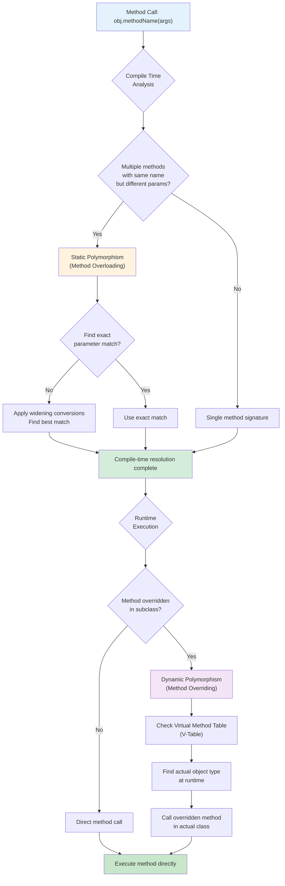
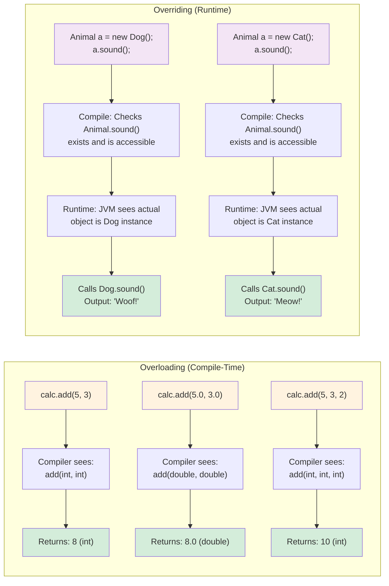
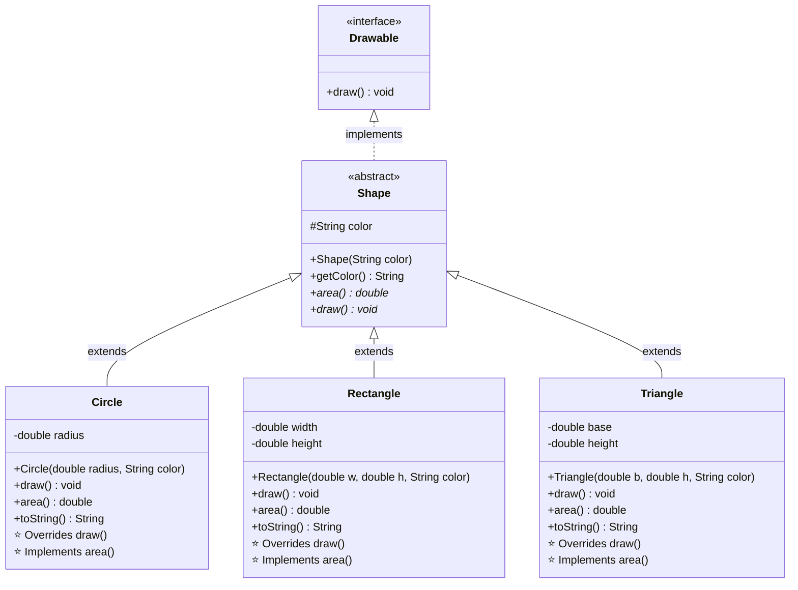
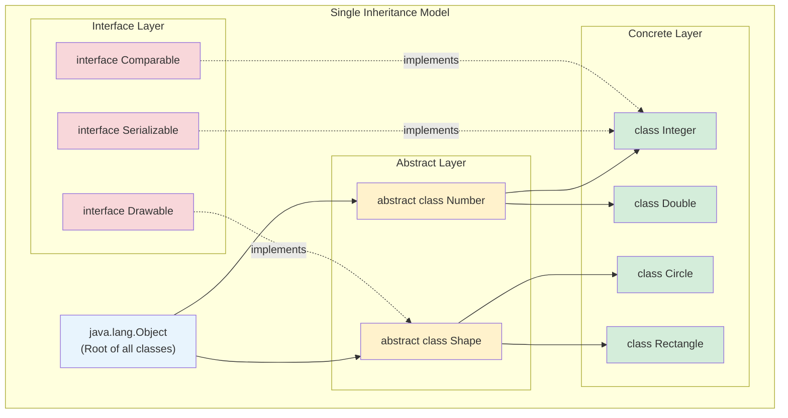
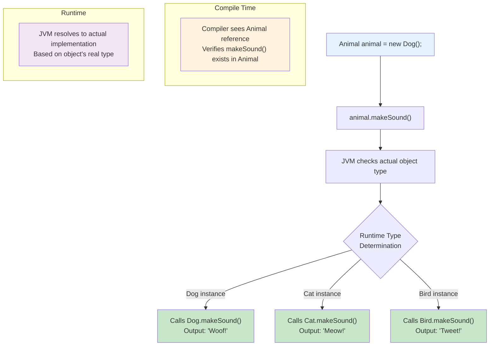

# Inheritance

1. How many parent classes can a Java class inherit from?
2. What does the final keyword do in a method name?
3. Can you inherit from classes marked with the final keyword?
4. Object Methods
5. When does it make sense to override toString()?
6. What is getClass() useful for?
7. What is hashCode() typically used for?
8. How do equals() and hashCode() relate to each other?
9. Polymorphism Types
10. What is static polymorphism?
11. What is compile-time vs runtime polymorphism?
12. Abstract Classes and Interfaces
13. What is the purpose of abstract classes?
14. What are concrete vs abstract methods?
15. What are anonymous classes?
16. How do abstract methods work in derived classes?
17. What happens when an abstract class implements an interface?
18. How do interfaces differ from abstract classes?

### Inheritance

#### How Many Parent Classes Can a Java Class Inherit From?

- **Single Inheritance**: Java allows a class to extend **only one** parent class directly.
- **No Multiple Inheritance**: Classes cannot extend multiple classes. This avoids the "diamond problem," where ambiguity arises if two parent classes have the same method.
- **Multiple Inheritance of Interfaces**: While a class can implement multiple interfaces, it can only extend one class.

```java
class Animal { }
class Mammal { }
class Dog extends Animal { } // Valid
// class MagicDog extends Animal, Mammal { } // Error: Multiple inheritance not allowed

interface Eats { void eat(); }
interface Runs { void run(); }
class Cheetah extends Animal implements Eats, Runs { } // Valid: Implements multiple interfaces
```

> [!TIP]
> Use **interfaces** when you need a class to have multiple "capabilities."
> Use **single inheritance** for "is-a" relationships.

***

#### final Keyword in Methods

- **No Overriding**: A `final` method cannot be overridden in subclasses.
- **Enforces Consistency**: Ensures the method implementation remains unchanged.
- **Used For**: Security, immutability, or when the method’s behavior must not change.

```java
class Parent {
    final void lock() {
        System.out.println("Cannot be changed!");
    }
}

class Child extends Parent {
    // @Override
    // void lock() { System.out.println("Won't compile!"); } // Error
}
```

> [!WARNING]
> **final** methods can reduce flexibility—use only when necessary.

***

#### final Classes

- **Cannot Be Subclassed**: A `final` class cannot be extended.
- **Use Cases**: Security (prevent malicious subclassing), immutability (e.g., `String`), or when the class shouldn’t be changed.
- **Testing Implications**: Final classes are harder to mock in unit tests.

```java
final class ImmutablePerson { }
// class Employee extends ImmutablePerson { } // Error: Cannot subclass final class
```

> [!TIP]
> Prefer **composition** over inheritance when you want to reuse behavior from a final class.

***

### Object Methods

#### Overriding toString()

- **Purpose**: Provides a meaningful string representation for debugging, logging, and user displays.
- **Best Practice**: Include relevant fields, exclude sensitive data.

```java
class Student {
    private String name;
    private int id;

    @Override
    public String toString() {
        return "Student{name='" + name + "', id=" + id + "}";
    }
}

Student s = new Student();
System.out.println(s); // Prints: Student{name='null', id=0}
```

***

#### getClass()

- **Returns Runtime Class**: Reveals the actual class of an object, useful for reflection and runtime type checking.
- **Example Uses**: Logging, type-safe operations, and dynamic method invocation.

```java
Object obj = "Hello";
Class<?> clazz = obj.getClass();
System.out.println(clazz.getName()); // java.lang.String
```

***

#### hashCode() and equals()

- **hashCode()**: Used by hash-based collections (`HashMap`, `HashSet`) for efficient storage and retrieval.
- **equals()**: Determines object equality.
- **Contract**: If two objects are equal (`equals()` returns `true`), their hash codes must be the same.
- **Always Override Together**: Use the same fields in both methods.

```java
class Person {
    private String name;
    private int age;

    @Override
    public boolean equals(Object o) {
        if (this == o) return true;
        if (o == null || getClass() != o.getClass()) return false;
        Person person = (Person) o;
        return age == person.age && Objects.equals(name, person.name);
    }

    @Override
    public int hashCode() {
        return Objects.hash(name, age);
    }
}
```

> [!WARNING]
> **Breaking the contract** between `equals()` and `hashCode()` can cause hard-to-find bugs in collections.

***

### Polymorphism

#### Static Polymorphism (Method Overloading)

- **Same Name, Different Parameters**: Multiple methods in the same class share a name but differ by parameter types or counts.
- **Resolved at Compile Time**: The compiler chooses the correct method based on the argument types.

```java
class Calculator {
    int add(int a, int b) { return a + b; }
    double add(double a, double b) { return a + b; }
    int add(int a, int b, int c) { return a + b + c; }
}
```

> [!NOTE]
> **Static polymorphism** is flexible but limited to one class.

***

#### Dynamic Polymorphism (Method Overriding)

- **Method Overriding**: A subclass provides its own implementation of a method defined in its superclass.
- **Determined at Runtime**: The actual method called depends on the object's runtime type.
- **Uses**: Frameworks, flexible APIs, and template patterns.

```java
class Animal {
    void sound() { System.out.println("Animal makes a sound"); }
}
class Cat extends Animal {
    @Override void sound() { System.out.println("Meow"); }
}
Animal a = new Cat();
a.sound(); // Output: Meow
```

### Polymorphism Decision Flow

Here's how Java determines which method to call in different polymorphic scenarios:



**Method Resolution Examples:**



**Polymorphism Type Comparison:**

| Aspect | Static Polymorphism (Overloading) | Dynamic Polymorphism (Overriding) |
|:-------|:---------------------------------|:----------------------------------|
| **Resolution Time** | Compile-time | Runtime |
| **Based On** | Method signature (parameters) | Object's actual type |
| **Inheritance Required** | No (same class) | Yes (inheritance hierarchy) |
| **Performance** | Faster (no runtime lookup) | Slightly slower (v-table lookup) |
| **Flexibility** | Limited to parameter variations | High (different implementations) |
| **Example Keywords** | Multiple methods, same name | `@Override`, `extends` |

***

### Abstract Classes

#### Purpose and Usage

- **Partial Implementation**: An **abstract class** can have both abstract (unimplemented) and concrete methods.
- **Framework Classes**: Useful for providing a common structure while allowing subclasses to fill in details.
- **Cannot Be Instantiated**: You can’t create an object of an abstract class directly.

```java
abstract class Shape {
    abstract double area();
    String getType() { return getClass().getSimpleName(); }
}
class Circle extends Shape {
    double radius;
    Circle(double r) { radius = r; }
    @Override double area() { return Math.PI * radius * radius; }
}
```

***

#### Concrete vs Abstract Methods

| Type         | Definition                | Example                    |
| :----------- | :------------------------ | :------------------------- |
| **Concrete** | Complete method with body | `String getType() { ... }` |
| **Abstract** | Only signature, no body   | `double area();`           |

- **Concrete** methods are inherited as-is.
- **Abstract** methods must be implemented by the first concrete subclass.

***

#### Anonymous Classes

- **Inline Implementation**: Define a class on the spot without a name, usually to implement an interface or extend a class.
- **Common in Event Handling**: E.g., GUI listeners, functional interfaces.

```java
Runnable task = new Runnable() {
    @Override public void run() {
        System.out.println("Running!");
    }
};
new Thread(task).start();
```

***

#### Abstract Classes Implementing Interfaces

- **Partial Implementation**: The abstract class can implement some interface methods, leaving others for subclasses.
- **Flexible Design**: Allows you to share common code while still requiring subclasses to implement specific behavior.

```java
interface Drawable {
    void draw();
    void resize();
}

abstract class Shape implements Drawable {
    @Override public void resize() {
        System.out.println("Resizing shape");
    }
    // draw() is still abstract—subclasses must implement
}

class Circle extends Shape {
    @Override public void draw() { System.out.println("Drawing circle"); }
}
```

***

### Interfaces vs Abstract Classes

| Feature                  | Interface                             | Abstract Class                    |
| :----------------------- | :------------------------------------ | :-------------------------------- |
| **Multiple Inheritance** | Yes (implements multiple)             | No (extends one only)             |
| **Method Types**         | Abstract + default + static (Java 8+) | Abstract + concrete               |
| **Fields**               | Only `public static final`            | Any access modifier               |
| **Constructors**         | No                                    | Yes                               |
| **Usage**                | Define contracts/capabilities         | Provide common structure/behavior |
| **Default Access**       | Methods are `public`                  | Methods can have any access       |

> [!TIP]
> **Use abstract classes** for "is-a" relationships and shared code.
> **Use interfaces** for "can-do" relationships and multiple capabilities.

***

### Quick Reference Table

| Concept                  | Key Points                          | Example Use Case           |
| :----------------------- | :---------------------------------- | :------------------------- |
| **Single Inheritance**   | Extend one class only               | `class Dog extends Animal` |
| **Final Method**         | No overriding in subclasses         | Security, immutability     |
| **Final Class**          | No subclassing                      | `String`, `Integer`        |
| **toString()**           | User-friendly object representation | Debugging, logging         |
| **getClass()**           | Runtime type information            | Reflection, type checking  |
| **hashCode()**           | Hash-based collection efficiency    | `HashMap`, `HashSet`       |
| **equals() Contract**    | Must match `hashCode()` logic       | Collections, equality      |
| **Static Polymorphism**  | Overloading (compile-time)          | Multiple method signatures |
| **Dynamic Polymorphism** | Overriding (runtime)                | Frameworks, APIs           |
| **Abstract Class**       | Partial implementation              | Template pattern           |
| **Interface**            | Contract definition                 | Multiple capabilities      |

***

### Example: Complete Hierarchy

```java
interface Drawable {
    void draw();
}

abstract class Shape implements Drawable {
    protected String color;
    
    Shape(String color) { this.color = color; }
    
    // Concrete method
    public String getColor() { return color; }
    
    // Abstract method from interface
    // public abstract void draw(); // Inherited
    
    // Additional abstract method
    public abstract double area();
}

class Circle extends Shape {
    private double radius;
    
    Circle(double radius, String color) {
        super(color);
        this.radius = radius;
    }
    
    @Override
    public void draw() {
        System.out.println("Drawing a " + color + " circle");
    }
    
    @Override
    public double area() {
        return Math.PI * radius * radius;
    }
    
    @Override
    public String toString() {
        return "Circle{radius=" + radius + ", color=" + color + "}";
    }
}
```

### Visual Inheritance Hierarchy

Here's how the complete inheritance hierarchy works with interfaces, abstract classes, and concrete implementations:



**Java Inheritance Types Diagram:**


**Method Resolution at Runtime:**


***

### Callouts

> [!TIP]
> **Always override `equals()` and `hashCode()` together** using the same fields to maintain the contract.

> [!WARNING]
> **Final classes cannot be mocked in unit tests**—prefer composition over inheritance for testing flexibility.

> [!NOTE]
> **Use interfaces for "can-do" (capabilities)** and **abstract classes for "is-a" (relationships)**.

***

### Tags

#java #inheritance #polymorphism #final #abstract-classes #interfaces #object-methods #equals #hashcode #bestpractices

***

### See Also

- \[[Java Collections Framework]\]
- \[[Object-Oriented Design]\]
- \[[Functional Interfaces]\]
- \[[Unit Testing Java]\]


