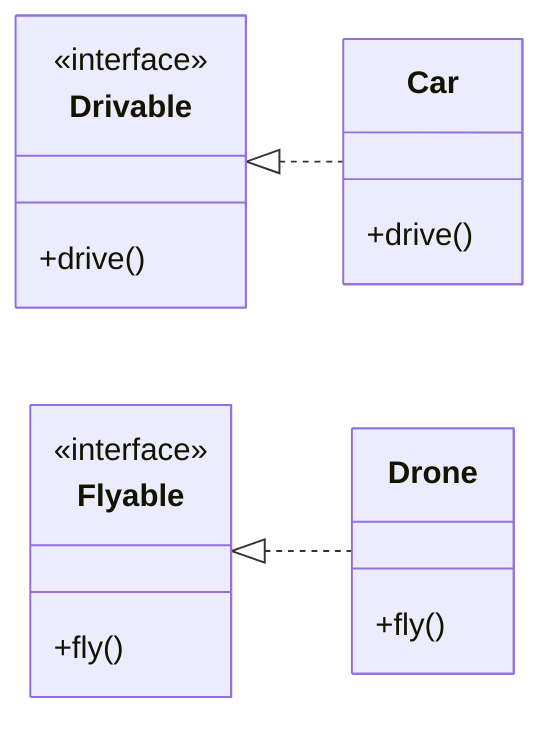
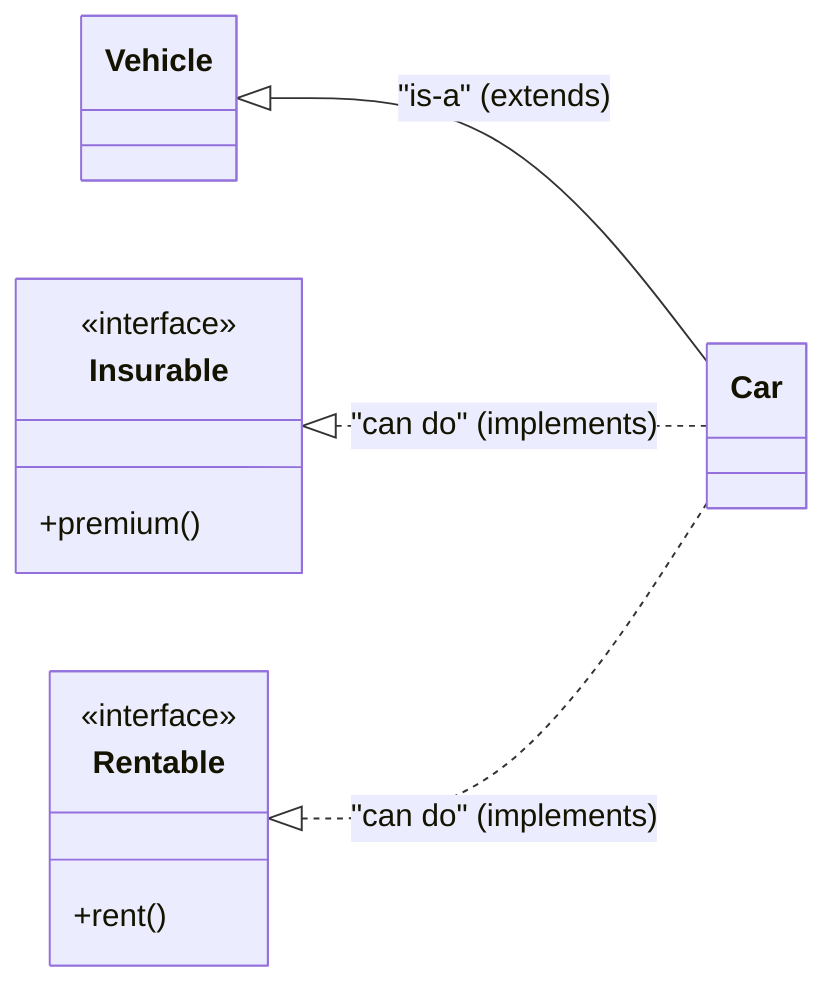
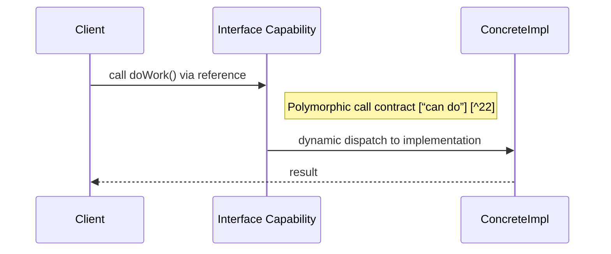

An interface models a capability or “can do” contract, and the implements keyword means a class promises it can do those behaviors by providing method bodies for the interface’s abstract methods. In contrast to class inheritance (“is-a”), implements is about attaching abilities across unrelated types while enabling polymorphism and loose coupling.[GeeksforGeeks](https://www.geeksforgeeks.org/java/interfaces-in-java/)[GeeksforGeeks](https://www.geeksforgeeks.org/java/extends-vs-implements-in-java/)[Oracle Docs](https://docs.oracle.com/javase/tutorial/java/IandI/usinginterface.html)

## Core idea: “can do”

An interface defines a set of behaviors a type can perform, commonly described as a CAN-DO relationship (e.g., Drivable means “can drive”) rather than an “is-a” relationship. A class declares implements InterfaceName to agree to the contract and must provide public implementations for all abstract methods unless the class itself is abstract.[Oracle Docs](https://docs.oracle.com/javase/tutorial/java/IandI/usinginterface.html)[GeeksforGeeks](https://www.geeksforgeeks.org/java/interfaces-in-java/)




## Syntax basics

- Define an interface with interface; methods are implicitly abstract unless declared default, and fields are implicitly public static final.[w3schools](https://www.w3schools.com/java/java_interface.asp)[GeeksforGeeks](https://www.geeksforgeeks.org/java/interfaces-in-java/)
- Implement one or many interfaces in a class: public class X extends Base implements A, B { ... } with implements after extends in the declaration order.[GeeksforGeeks](https://www.geeksforgeeks.org/java/extends-vs-implements-in-java/)[Oracle Docs](https://docs.oracle.com/javase/tutorial/java/IandI/usinginterface.html)

```java
// Java 17+
// Interface as a "can do" capability
public interface Drivable {
    // implicitly public abstract
    void drive();

    // default method (Java 8+): an opt-in behavior that implementors inherit
    default int maxSpeedKmh() { return 120; }

    // static method exists on the interface type (not inherited)
    static boolean isLegalSpeed(int kmh) { return kmh >= 0; }

    // private helper (Java 9+), usable only inside this interface
    private void log(String msg) { System.out.println("[Drivable] " + msg); }
}

// A class that "can drive"
public class Car implements Drivable {
    @Override // must be public to satisfy the interface contract
    public void drive() { System.out.println("Driving..."); }

    public static void main(String[] args) {
        Drivable d = new Car();
        d.drive();
        System.out.println(d.maxSpeedKmh());
        System.out.println(Drivable.isLegalSpeed(50));
    }
}
```

Each class that implements an interface must publicly implement all abstract methods, or be declared abstract itself, and static interface methods are called via the interface name.[drbtaneja](https://drbtaneja.com/multiple-inheritance-using-interface/)[GeeksforGeeks](https://www.geeksforgeeks.org/java/interfaces-in-java/)[Oracle Docs](https://docs.oracle.com/javase/tutorial/java/IandI/usinginterface.html)

## Multiple “can do” capabilities

A class can implement multiple interfaces to accumulate capabilities, which is how Java models multiple inheritance of type safely. This makes it straightforward to compose roles like Drivable, Floatable, and Flyable into a single concrete type without class diamond issues.[GeeksforGeeks](https://www.geeksforgeeks.org/java/interfaces-in-java/)[drbtaneja](https://drbtaneja.com/multiple-inheritance-using-interface/)[GeeksforGeeks](https://www.geeksforgeeks.org/java/extends-vs-implements-in-java/)

```java
interface Floatable { void floatOnWater(); }
interface Flyable { void fly(); }

// AmphibiousPlane "can drive", "can float", and "can fly"
class AmphibiousPlane implements Drivable, Floatable, Flyable {
    @Override public void drive() { System.out.println("Taxi on runway"); }
    @Override public void floatOnWater() { System.out.println("Floating"); }
    @Override public void fly() { System.out.println("Take off"); }
}
```

> [!TIP]
> Prefer small, focused capability interfaces (e.g., Closeable, Comparable) and compose them, which keeps implementations cohesive and testing easier.[Baeldung](https://www.baeldung.com/java-implements-vs-extends)[Oracle Docs](https://docs.oracle.com/javase/tutorial/java/IandI/usinginterface.html)

## Default, static, and private methods

- Default methods (Java 8+) let interfaces evolve behavior without breaking implementors; implementors inherit them but can override when needed.[idrsolutions](https://blog.idrsolutions.com/java-8-default-methods-explained-5-minutes/)[GeeksforGeeks](https://www.geeksforgeeks.org/java/interfaces-in-java/)
- Static methods (Java 8+) are utilities on the interface type and are not inherited by implementing classes; call them as InterfaceName.method().[drbtaneja](https://drbtaneja.com/multiple-inheritance-using-interface/)[GeeksforGeeks](https://www.geeksforgeeks.org/java/interfaces-in-java/)
- Private interface methods (Java 9+) encapsulate reusable code for default/static methods within the interface body.[Baeldung](https://www.baeldung.com/java-interface-private-methods)

```java
interface Trackable {
    default String id() { return generateId(); } // default uses a private helper
    private String generateId() { return "ID-" + System.nanoTime(); } // Java 9+
    static boolean valid(String id) { return id != null && id.startsWith("ID-"); } // Java 8+
}
```

Default and private interface methods enable API evolution with shared behavior while keeping the public surface area stable and consistent.[Baeldung](https://www.baeldung.com/java-interface-private-methods)[GeeksforGeeks](https://www.geeksforgeeks.org/java/interfaces-in-java/)

## Conflict rules for defaults

When multiple inherited defaults collide, Java applies rules to resolve ambiguity, and sometimes requires an explicit override choosing InterfaceName.super.method(). The precedence is: classes win over interfaces; more specific subinterfaces win over supertypes; otherwise the class must override and can delegate to a chosen parent default.[javadevcentral](https://javadevcentral.com/default-method-resolution-rules/)[GeeksforGeeks](https://www.geeksforgeeks.org/java/resolving-conflicts-during-multiple-inheritance-in-java/)[javabrahman](https://www.javabrahman.com/java-8/java-8-multiple-inheritance-conflict-resolution-rules-and-diamond-problem/)

```java
interface A { default void ping() { System.out.println("A"); } }
interface B { default void ping() { System.out.println("B"); } }

class C implements A, B {
    @Override
    public void ping() {
        // Must disambiguate or provide own behavior
        A.super.ping(); // explicit choice of A's default
    }
}
```

These rules avoid the classic diamond problem while keeping “can do” composition practical and predictable in real systems.[GeeksforGeeks](https://www.geeksforgeeks.org/java/resolving-conflicts-during-multiple-inheritance-in-java/)[javabrahman](https://www.javabrahman.com/java-8/java-8-multiple-inheritance-conflict-resolution-rules-and-diamond-problem/)

## Polymorphism: program to capabilities

Code often depends on interfaces rather than concrete classes so that any type that “can do” the contract can be substituted, improving testability and flexibility. This enables swapping implementations (e.g., mock vs. real) without changing callers as long as the capability contract remains stable.[dev](https://dev.java/learn/implementing-an-interface/)[Oracle Docs](https://docs.oracle.com/javase/tutorial/java/IandI/usinginterface.html)

```java
interface PaymentProcessor { void charge(long cents); }

class StripeProcessor implements PaymentProcessor {
    @Override public void charge(long cents) { /* call Stripe API */ }
}
class FakeProcessor implements PaymentProcessor {
    @Override public void charge(long cents) { /* test no-op */ }
}

class CheckoutService {
    private final PaymentProcessor processor;
    CheckoutService(PaymentProcessor processor) { this.processor = processor; }
    void checkout(long cents) { processor.charge(cents); }
}
```

Depending on PaymentProcessor allows injecting any object that “can process payments” at runtime, which is the essence of the “can do” abstraction with interfaces.[Oracle Docs](https://docs.oracle.com/javase/tutorial/java/IandI/usinginterface.html)[dev](https://dev.java/learn/implementing-an-interface/)

## Extends vs implements (concept)

- Extends models “is-a” between classes, or interface-to-interface refinement, with single inheritance for classes to avoid ambiguity.[GeeksforGeeks](https://www.geeksforgeeks.org/java/extends-vs-implements-in-java/)
- Implements models “can do” capabilities for classes and supports multiple capabilities on one class via multiple interface implementation.[GeeksforGeeks](https://www.geeksforgeeks.org/java/interfaces-in-java/)[GeeksforGeeks](https://www.geeksforgeeks.org/java/extends-vs-implements-in-java/)




## Extends vs implements (quick table)

| Aspect | extends | implements |
| :-- | :-- | :-- |
| Relationship | “is-a” between classes or interface-to-interface refinement [GeeksforGeeks](https://www.geeksforgeeks.org/java/extends-vs-implements-in-java/) | “can do” capabilities added to classes [GeeksforGeeks](https://www.geeksforgeeks.org/java/interfaces-in-java/) |
| Count | Class extends one class; interface may extend multiple interfaces [GeeksforGeeks](https://www.geeksforgeeks.org/java/extends-vs-implements-in-java/) | Class may implement many interfaces [GeeksforGeeks](https://www.geeksforgeeks.org/java/extends-vs-implements-in-java/) |
| Obligation | Subclass may override some methods; not all required [GeeksforGeeks](https://www.geeksforgeeks.org/java/extends-vs-implements-in-java/) | Must implement all abstract methods unless class is abstract [GeeksforGeeks](https://www.geeksforgeeks.org/java/extends-vs-implements-in-java/) |
| Syntax order | class C extends Base { } [GeeksforGeeks](https://www.geeksforgeeks.org/java/extends-vs-implements-in-java/) | class C extends Base implements A,B { } [Oracle Docs](https://docs.oracle.com/javase/tutorial/java/IandI/usinginterface.html) |

## Recommended Approach and Pitfalls

- Always use @Override and keep implementations public to satisfy the interface’s public contract.[GeeksforGeeks](https://www.geeksforgeeks.org/java/interfaces-in-java/)
- Name capability interfaces by ability (e.g., Drivable, Measurable), and keep them small for interface segregation and easy testing.[Baeldung](https://www.baeldung.com/java-implements-vs-extends)[Oracle Docs](https://docs.oracle.com/javase/tutorial/java/IandI/usinginterface.html)
- Remember static interface methods are not inherited; call them with InterfaceName.method(), not via an instance.[drbtaneja](https://drbtaneja.com/multiple-inheritance-using-interface/)[GeeksforGeeks](https://www.geeksforgeeks.org/java/interfaces-in-java/)

> [!WARNING]
> If two interfaces provide the same default method, the class must override and decide, optionally delegating with InterfaceName.super.method() to resolve ambiguity.[javabrahman](https://www.javabrahman.com/java-8/java-8-multiple-inheritance-conflict-resolution-rules-and-diamond-problem/)[GeeksforGeeks](https://www.geeksforgeeks.org/java/resolving-conflicts-during-multiple-inheritance-in-java/)

## Quick reference

- Define capability: interface Cap { void doIt(); default void log(){} }.[idrsolutions](https://blog.idrsolutions.com/java-8-default-methods-explained-5-minutes/)[GeeksforGeeks](https://www.geeksforgeeks.org/java/interfaces-in-java/)
- Implement capability: class X implements Cap { public void doIt(){} }.[GeeksforGeeks](https://www.geeksforgeeks.org/java/extends-vs-implements-in-java/)[Oracle Docs](https://docs.oracle.com/javase/tutorial/java/IandI/usinginterface.html)
- Multiple capabilities: class X implements A, B { ... }.[GeeksforGeeks](https://www.geeksforgeeks.org/java/extends-vs-implements-in-java/)[GeeksforGeeks](https://www.geeksforgeeks.org/java/interfaces-in-java/)
- Private helpers in interfaces (Java 9+): private void helper() { ... }.[Baeldung](https://www.baeldung.com/java-interface-private-methods)



\#java \#java/interfaces \#java/oop \#keywords \#bestpractices[GeeksforGeeks](https://www.geeksforgeeks.org/java/resolving-conflicts-during-multiple-inheritance-in-java/)[Oracle Docs](https://docs.oracle.com/javase/tutorial/java/IandI/usinginterface.html)[GeeksforGeeks](https://www.geeksforgeeks.org/java/interfaces-in-java/)[GeeksforGeeks](https://www.geeksforgeeks.org/java/extends-vs-implements-in-java/)


#java #oop #interfaces
