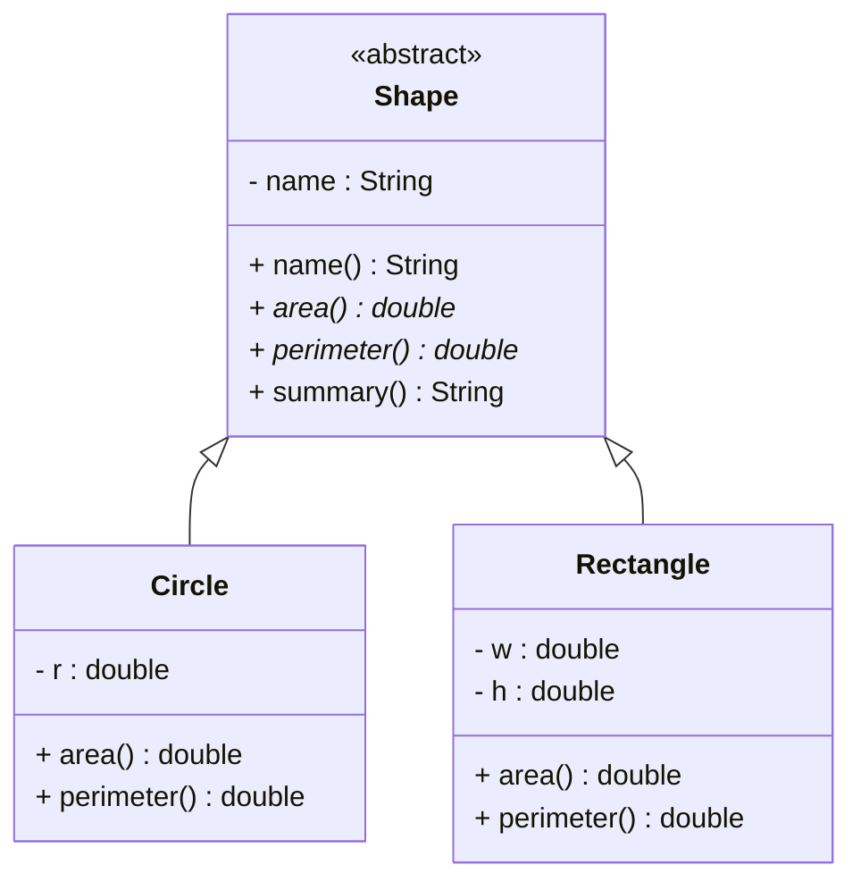
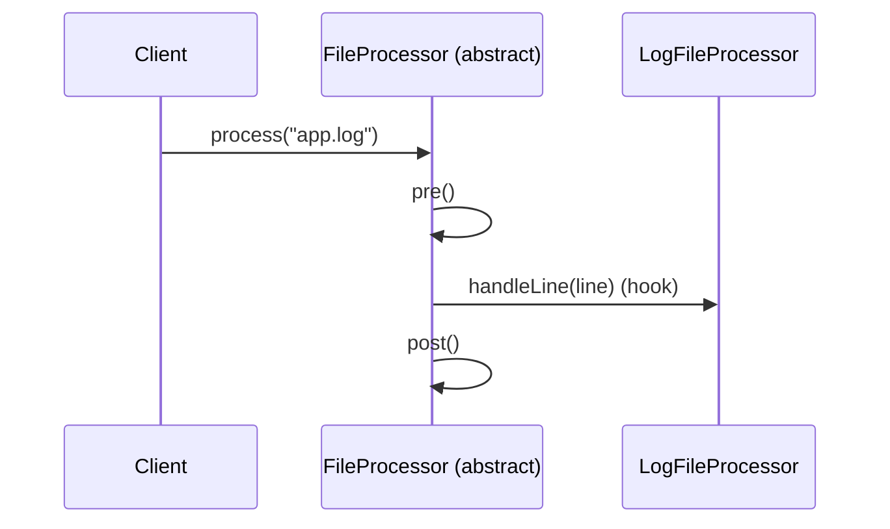

An **abstract class** is a non-instantiable base type that provides partial implementation plus abstract methods that subclasses must implement, modeling an "is-a" relationship within a related hierarchy. In contrast to interfaces’ “can do” capabilities, abstract classes define shared state, constructors, and reusable logic for concrete subclasses.

## Concept

- Abstract classes capture common structure and behavior for closely related types in the same inheritance tree (e.g., Shape → Circle, Rectangle).
- They combine concrete code reuse with abstract hooks that subclasses must fulfill, enforcing a consistent API and invariants across the hierarchy.

> [!NOTE]
> Think “is-a” hierarchy for abstract classes vs. “can do” capabilities for interfaces. Use abstract when related types share state or default behavior; use interfaces to add roles across unrelated types.

## Syntax

```java
// Java 17+
// Abstract base providing shared state, constructor, and behavior
public abstract class Shape {
    // shared state
    private final String name;

    // constructors are allowed and run via super(...) from subclasses
    protected Shape(String name) {
        this.name = name;
    }

    public final String name() {   // final to lock down identity semantics
        return name;
    }

    // abstract methods = contract to be completed by concrete subclasses
    public abstract double area();
    public abstract double perimeter();

    // reusable concrete behavior
    public String summary() {
        return "%s: area=%.2f, perim=%.2f".formatted(name, area(), perimeter());
    }
}

// Concrete subclass must implement all abstract methods (or remain abstract)
public class Circle extends Shape {
    private final double r;

    public Circle(double r) {
        super("Circle");
        this.r = r;
    }

    @Override public double area() { return Math.PI * r * r; }
    @Override public double perimeter() { return 2 * Math.PI * r; }

    public static void main(String[] args) {
        Shape s = new Circle(3.0);
        System.out.println(s.summary());
    }
}
```


## Diagram: is-a hierarchy




## Key rules

- Cannot be instantiated directly; only subclasses can be created.
- May define fields, constructors, concrete methods, and abstract methods.
- Any class with at least one abstract method must be declared abstract.
- Abstract methods cannot be private, static, or final; they must be implementable and overridable.
- A class may extend only one abstract (or concrete) class, but it may also implement multiple interfaces.

> [!WARNING]
> Avoid calling overridable/abstract methods from constructors; the subclass may observe partially constructed state.

## When to use

- There is shared state and behavior across related types, which would be duplicated without inheritance.
- A default implementation should be provided with extension points (hooks) for specifics.
- A controlled family of types should be guided via constructors, protected utilities, and invariants.


## Template Method pattern

Abstract classes pair well with the Template Method pattern: the base defines the algorithm skeleton; subclasses fill in steps.

```java
public abstract class FileProcessor {
    public final void process(String path) {
        pre();
        try (var lines = java.nio.file.Files.lines(java.nio.file.Path.of(path))) {
            lines.forEach(this::handleLine); // abstract hook
        } catch (Exception e) {
            onError(e);
        } finally {
            post();
        }
    }

    protected void pre() {}
    protected void post() {}
    protected void onError(Exception e) { e.printStackTrace(); }

    // required step
    protected abstract void handleLine(String line);
}

public class LogFileProcessor extends FileProcessor {
    @Override protected void handleLine(String line) {
        if (line.contains("ERROR")) System.out.println("Found error: " + line);
    }

    public static void main(String[] args) {
        new LogFileProcessor().process("app.log");
    }
}
```




## Abstract + sealed (Java 17)

Sealed classes let the base restrict which classes can extend it, useful for algebraic-style hierarchies with exhaustive handling.

```java
public abstract sealed class Expr permits Literal, Add {
    public abstract int eval();
}

public final class Literal extends Expr {
    private final int value;
    public Literal(int value) { this.value = value; }
    @Override public int eval() { return value; }
}

public final class Add extends Expr {
    private final Expr left, right;
    public Add(Expr left, Expr right) { this.left = left; this.right = right; }
    @Override public int eval() { return left.eval() + right.eval(); }
}

class Demo {
    public static void main(String[] args) {
        Expr e = new Add(new Literal(2), new Literal(3));
        System.out.println(e.eval()); // 5
    }
}
```


## Interfaces “can do” vs abstract “is-a”

- Interfaces model additive capabilities (“can do”) across unrelated types; no shared instance state required.
- Abstract classes model hierarchical “is-a” with shared state, constructors, and default behavior; use when concrete types are closely related.


## Comparison table (Java 17+)

| Aspect | Abstract class | Interface |
| :-- | :-- | :-- |
| Relationship | “is-a” within one hierarchy |  |
| Member state | Yes (instance fields) |  |
| Constructors | Yes |  |
| Method bodies | Yes (concrete and abstract) |  |
| Access modifiers | Any (public/protected/package/private) |  |
| Inheritance count | Single extends |  |
| Multiple roles | Implement multiple interfaces |  |
| Defaults/Statics | N/A (use concrete methods/static methods) |  |
| Sealed support | Yes (sealed abstract class) |  |

| Aspect | Abstract class | Interface |
| :-- | :-- | :-- |
| Relationship | “can do” capability across types |  |
| Member state | No instance fields (constants only) |  |
| Constructors | No |  |
| Method bodies | default/static/private (since Java 8/9) |  |
| Access modifiers | Methods are public; fields public static final |  |
| Inheritance count | N/A |  |
| Multiple roles | A class can implement many |  |
| Defaults/Statics | Yes (Java 8+ defaults/static) |  |
| Sealed support | Sealed interfaces (Java 17) |  |

## Best practices

- Favor composition and interfaces for cross-cutting “can do” roles; use an abstract base when sharing state and behavior in a tight hierarchy.
- Keep the abstract surface small and cohesive; expose protected hooks judiciously and document invariants clearly.
- Seal hierarchies (Java 17) to make assumptions explicit and enable exhaustive handling in switch expressions.

> [!TIP]
> Mark non-overridable behaviors final, and prefer protected helper methods over exposing mutable state. Keep constructors minimal and side-effect free.

## Quick reference

- Declare: abstract class Base { abstract void step(); void common(){} }
- Extend: class Sub extends Base { @Override void step(){} }
- Combine: abstract class Base implements A, B { ... }
- Control hierarchy: abstract sealed class Base permits Sub1, Sub2 { ... }


## Additional examples

Polymorphic API with shared caching logic:

```java
public abstract class CachingService {
    private final java.util.Map<String, Object> cache = new java.util.concurrent.ConcurrentHashMap<>();

    public final Object getOrLoad(String key) {
        return cache.computeIfAbsent(key, this::load); // hook below
    }

    protected abstract Object load(String key);
}

class UserService extends CachingService {
    @Override protected Object load(String key) { return "User:" + key; }

    public static void main(String[] args) {
        var svc = new UserService();
        System.out.println(svc.getOrLoad("42"));
        System.out.println(svc.getOrLoad("42")); // cached
    }
}
```

Concurrency-safe template with protected hook:

```java
public abstract class Task {
    public final void runExclusive() {
        synchronized (this) {
            before();
            try { execute(); } finally { after(); }
        }
    }
    protected void before() {}
    protected void after() {}
    protected abstract void execute();
}

class ReportTask extends Task {
    @Override protected void execute() { System.out.println("Generating report..."); }
}
```

\#java \#java/oop \#java/abstraction \#abstract-class \#bestpractices


[^1]: https://herovired.com/learning-hub/blogs/difference-between-abstract-class-and-interface/

[^2]: https://www.geeksforgeeks.org/java/difference-between-abstract-class-and-interface-in-java/

[^3]: https://stackoverflow.com/questions/18777989/how-should-i-have-explained-the-difference-between-an-interface-and-an-abstract

[^4]: https://www.reddit.com/r/java/comments/2jgbzh/what_is_the_difference_between_an_interface_and/

[^5]: https://www.digitalocean.com/community/tutorials/difference-between-abstract-class-and-interface-in-java

[^6]: https://www.baeldung.com/java-interface-vs-abstract-class

[^7]: https://www.theknowledgeacademy.com/blog/abstract-class-vs-interface-java/

[^8]: https://www.youtube.com/watch?v=PPZ_vZcF2AU

#java #oop #abstract-classes
