# SOLID Principles in Java: Learning Through Retail Systems

## Introduction: What is SOLID?

SOLID represents five fundamental principles of object-oriented design that help create maintainable, flexible, and robust software. Think of these principles as the **blueprint for building a well-organized retail store** - each department has clear responsibilities, new features can be added without disrupting existing operations, and everything works together seamlessly.

The acronym SOLID stands for:

- **S**ingle Responsibility Principle
- **O**pen/Closed Principle
- **L**iskov Substitution Principle
- **I**nterface Segregation Principle
- **D**ependency Inversion Principle

These principles were formulated by Robert C. Martin ("Uncle Bob"), with the acronym coined by Michael Feathers to make them memorable.

## Why SOLID Matters

Before diving into each principle, let's understand why SOLID is crucial through a retail lens:

|Without SOLID|With SOLID|
|---|---|
|One massive class handles checkout, inventory, and emails|Each system component has one clear job|
|Adding Apple Pay breaks credit card processing|New payment methods integrate seamlessly|
|Digital products crash the physical inventory system|All products work consistently in the cart|
|Cashiers forced to learn warehouse management systems|Each role uses only relevant tools|
|Changing from FedEx to UPS requires rewriting the entire system|Shipping providers are easily swappable|

## Single Responsibility Principle (SRP)

### The Concept

**"A class should have one, and only one, reason to change."**

Imagine a retail store where one employee tries to be the cashier, inventory manager, customer service rep, and janitor all at once. When something goes wrong, it's chaos. SRP says each class, like each employee, should have **one clear job**.

### Starting Simple: The Problem

Let's begin with a problematic design that violates SRP:

```java
// ❌ BAD: This class is trying to do everything
public class RetailOrder {
    private String orderId;
    private List<String> items;
    private double total;
    
    // Order management
    public void addItem(String item) {
        items.add(item);
    }
    
    // Price calculation
    public void calculateTotal() {
        // Complex pricing logic here
        total = items.size() * 10.99; // Simplified
    }
    
    // Payment processing
    public void processPayment(String creditCardNumber) {
        // Connect to payment gateway
        // Process the payment
        System.out.println("Processing payment...");
    }
    
    // Email notifications
    public void sendConfirmationEmail(String customerEmail) {
        // Connect to email server
        // Send email
        System.out.println("Sending email to " + customerEmail);
    }
    
    // Inventory management
    public void updateInventory() {
        // Connect to inventory database
        // Update stock levels
        System.out.println("Updating inventory...");
    }
    
    // Reporting
    public void generateInvoice() {
        // Create PDF invoice
        System.out.println("Generating invoice...");
    }
}
```

### Visual Problem: Monolithic vs Separated Responsibilities

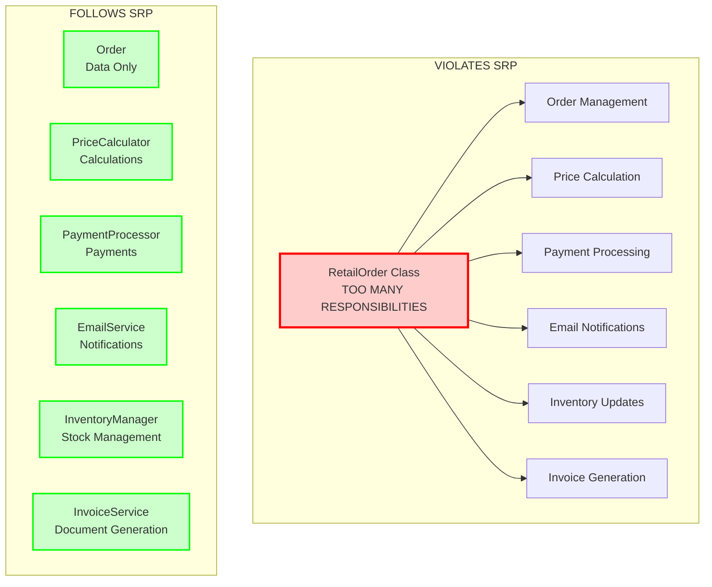

> [!WARNING] Problems with this approach
> 
> - If email format changes, you modify the Order class
> - If payment gateway changes, you modify the Order class
> - Testing is difficult - you can't test orders without email/payment/inventory
> - Multiple developers can't work on different features without conflicts

### The Solution: Applying SRP

Now let's refactor using SRP, where each class has one responsibility:

```java
// ✅ GOOD: Each class has ONE job

// 1. Order class only manages order data
public class Order {
    private String orderId;
    private List<Item> items;
    private Customer customer;
    
    public Order(String orderId, Customer customer) {
        this.orderId = orderId;
        this.customer = customer;
        this.items = new ArrayList<>();
    }
    
    public void addItem(Item item) {
        items.add(item);
    }
    
    public List<Item> getItems() {
        return new ArrayList<>(items); // Return copy for safety
    }
    
    public Customer getCustomer() {
        return customer;
    }
}

// 2. Price calculator only calculates prices
public class PriceCalculator {
    private final double TAX_RATE = 0.08;
    
    public double calculateSubtotal(List<Item> items) {
        return items.stream()
                   .mapToDouble(Item::getPrice)
                   .sum();
    }
    
    public double calculateTax(double subtotal) {
        return subtotal * TAX_RATE;
    }
    
    public double calculateTotal(List<Item> items) {
        double subtotal = calculateSubtotal(items);
        return subtotal + calculateTax(subtotal);
    }
}

// 3. Payment processor only handles payments
public class PaymentProcessor {
    public boolean processPayment(double amount, String paymentMethod) {
        // Payment gateway logic here
        System.out.println("Processing $" + amount + " via " + paymentMethod);
        return true; // Simplified - would return actual result
    }
}

// 4. Email service only sends emails
public class EmailService {
    public void sendOrderConfirmation(Order order, double total) {
        String email = order.getCustomer().getEmail();
        System.out.println("Sending confirmation to " + email);
        System.out.println("Order total: $" + total);
    }
}

// 5. Inventory manager only manages inventory
public class InventoryManager {
    public void updateStock(List<Item> items) {
        for (Item item : items) {
            System.out.println("Reducing stock for: " + item.getName());
            // Database update logic here
        }
    }
}
```

### How SRP Services Collaborate

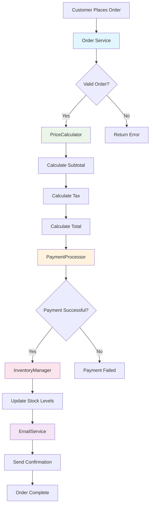

> [!TIP] Benefits of SRP
> 
> - **Easy to test**: Test payment without needing email or inventory
> - **Easy to maintain**: Change email templates without touching payments
> - **Easy to understand**: Each class has a clear, single purpose
> - **Team-friendly**: Different developers can work on different classes

## Open/Closed Principle (OCP)

### The Concept

**"Software entities should be open for extension, but closed for modification."**

Think of a retail store's payment system. When Apple Pay was introduced, stores didn't tear down and rebuild their checkout counters. They **extended** their payment systems to accept the new method while keeping existing methods working.

### Starting Simple: The Problem

Here's a payment system that violates OCP:

```java
// ❌ BAD: Adding new payment types requires modifying this class
public class PaymentHandler {
    public void handlePayment(String type, double amount) {
        if (type.equals("CREDIT_CARD")) {
            // Credit card logic
            System.out.println("Processing credit card payment: $" + amount);
            // Connect to Visa/Mastercard...
        } else if (type.equals("PAYPAL")) {
            // PayPal logic
            System.out.println("Processing PayPal payment: $" + amount);
            // Connect to PayPal API...
        } else if (type.equals("CASH")) {
            // Cash logic
            System.out.println("Processing cash payment: $" + amount);
            // Open cash register...
        }
        // To add Apple Pay, we must modify this class! ❌
    }
}
```

### The Solution: Applying OCP

Let's redesign to follow OCP using interfaces:

```java
// ✅ GOOD: Define a payment interface
public interface PaymentMethod {
    boolean processPayment(double amount);
    String getPaymentType();
    double calculateFees(double amount);
}

// Existing payment methods (closed for modification)
public class CreditCardPayment implements PaymentMethod {
    private String cardNumber;
    
    public CreditCardPayment(String cardNumber) {
        this.cardNumber = cardNumber;
    }
    
    @Override
    public boolean processPayment(double amount) {
        System.out.println("Processing credit card payment: $" + amount);
        // Connect to payment gateway
        return true;
    }
    
    @Override
    public String getPaymentType() {
        return "Credit Card";
    }
    
    @Override
    public double calculateFees(double amount) {
        return amount * 0.029; // 2.9% transaction fee
    }
}

public class PayPalPayment implements PaymentMethod {
    private String email;
    
    public PayPalPayment(String email) {
        this.email = email;
    }
    
    @Override
    public boolean processPayment(double amount) {
        System.out.println("Processing PayPal payment: $" + amount);
        // Connect to PayPal API
        return true;
    }
    
    @Override
    public String getPaymentType() {
        return "PayPal";
    }
    
    @Override
    public double calculateFees(double amount) {
        return amount * 0.034; // 3.4% transaction fee
    }
}

// ✅ NEW: Add Apple Pay without modifying existing code!
public class ApplePayPayment implements PaymentMethod {
    private String deviceId;
    
    public ApplePayPayment(String deviceId) {
        this.deviceId = deviceId;
    }
    
    @Override
    public boolean processPayment(double amount) {
        System.out.println("Processing Apple Pay payment: $" + amount);
        // Connect to Apple Pay API
        return true;
    }
    
    @Override
    public String getPaymentType() {
        return "Apple Pay";
    }
    
    @Override
    public double calculateFees(double amount) {
        return amount * 0.015; // 1.5% transaction fee
    }
}

// The checkout system never needs to change!
public class CheckoutSystem {
    public void processCheckout(Order order, PaymentMethod paymentMethod) {
        PriceCalculator calculator = new PriceCalculator();
        double total = calculator.calculateTotal(order.getItems());
        
        // Works with ANY payment method - current or future!
        if (paymentMethod.processPayment(total)) {
            double fees = paymentMethod.calculateFees(total);
            System.out.println("Payment successful via " + paymentMethod.getPaymentType());
            System.out.println("Transaction fees: $" + fees);
        }
    }
}
```

### OCP in Action: Extensible Payment Architecture

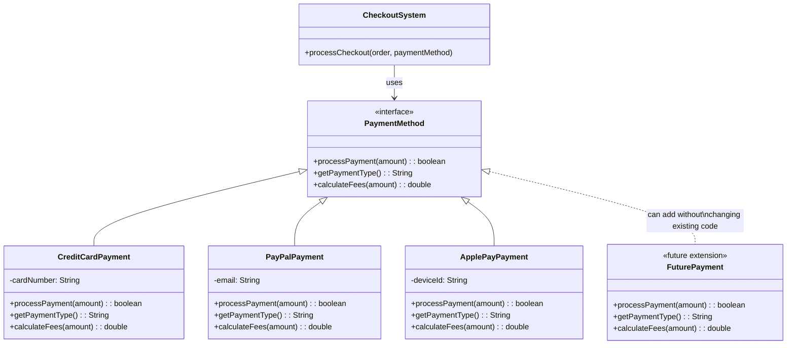

> [!NOTE] Key Insight The `CheckoutSystem` class is **closed for modification** (we never change it) but **open for extension** (we can add new payment methods anytime).

## Liskov Substitution Principle (LSP)

### The Concept

**"Objects of a superclass should be replaceable with objects of its subclasses without breaking the application."**

In a retail context, whether you're buying a book, a laptop, or a digital download, they should all work the same way in your shopping cart. The checkout process shouldn't break just because you added a different type of product.

### Starting Simple: The Problem

Here's a common violation of LSP:

```java
// ❌ BAD: Subclass changes expected behavior
public class Product {
    protected String name;
    protected double price;
    protected int stockQuantity;
    
    public void reduceStock(int quantity) {
        if (stockQuantity >= quantity) {
            stockQuantity -= quantity;
        } else {
            throw new RuntimeException("Insufficient stock!");
        }
    }
    
    public double getPrice() {
        return price;
    }
}

// This breaks LSP!
public class DigitalProduct extends Product {
    @Override
    public void reduceStock(int quantity) {
        // Digital products have unlimited stock
        // But the parent class expects stock to be reduced!
        // Do nothing? Throw exception? Both break expectations!
    }
}
```

### The Solution: Applying LSP

Let's redesign to respect LSP:

```java
// ✅ GOOD: Design with proper abstractions
public abstract class Product {
    protected String name;
    protected double basePrice;
    
    public Product(String name, double basePrice) {
        this.name = name;
        this.basePrice = basePrice;
    }
    
    // All products must implement these consistently
    public abstract boolean isAvailable(int quantity);
    public abstract void reserve(int quantity);
    public abstract double calculatePrice(int quantity);
    
    public String getName() {
        return name;
    }
}

// Physical products have limited stock
public class PhysicalProduct extends Product {
    private int stockQuantity;
    private double shippingCostPerItem;
    
    public PhysicalProduct(String name, double price, int stock, double shipping) {
        super(name, price);
        this.stockQuantity = stock;
        this.shippingCostPerItem = shipping;
    }
    
    @Override
    public boolean isAvailable(int quantity) {
        return stockQuantity >= quantity;
    }
    
    @Override
    public void reserve(int quantity) {
        if (isAvailable(quantity)) {
            stockQuantity -= quantity;
            System.out.println("Reserved " + quantity + " units of " + name);
        } else {
            throw new RuntimeException("Insufficient stock for " + name);
        }
    }
    
    @Override
    public double calculatePrice(int quantity) {
        return (basePrice * quantity) + (shippingCostPerItem * quantity);
    }
}

// Digital products have unlimited availability
public class DigitalProduct extends Product {
    private boolean isCurrentlyAvailable; // Can be disabled
    
    public DigitalProduct(String name, double price, boolean available) {
        super(name, price);
        this.isCurrentlyAvailable = available;
    }
    
    @Override
    public boolean isAvailable(int quantity) {
        return isCurrentlyAvailable; // Always available if active
    }
    
    @Override
    public void reserve(int quantity) {
        if (isAvailable(quantity)) {
            System.out.println("Reserved " + quantity + " licenses of " + name);
        } else {
            throw new RuntimeException(name + " is currently unavailable");
        }
    }
    
    @Override
    public double calculatePrice(int quantity) {
        return basePrice * quantity; // No shipping for digital
    }
}

// Shopping cart works with ALL products consistently
public class ShoppingCart {
    private List<CartItem> items = new ArrayList<>();
    
    public void addProduct(Product product, int quantity) {
        // This works for ANY product type - physical or digital!
        if (product.isAvailable(quantity)) {
            product.reserve(quantity);
            items.add(new CartItem(product, quantity));
            System.out.println("Added to cart: " + product.getName());
        } else {
            System.out.println("Cannot add " + product.getName() + " - not available");
        }
    }
    
    public double calculateTotal() {
        return items.stream()
                   .mapToDouble(item -> item.product.calculatePrice(item.quantity))
                   .sum();
    }
}
```

### LSP Design: Proper Product Hierarchy

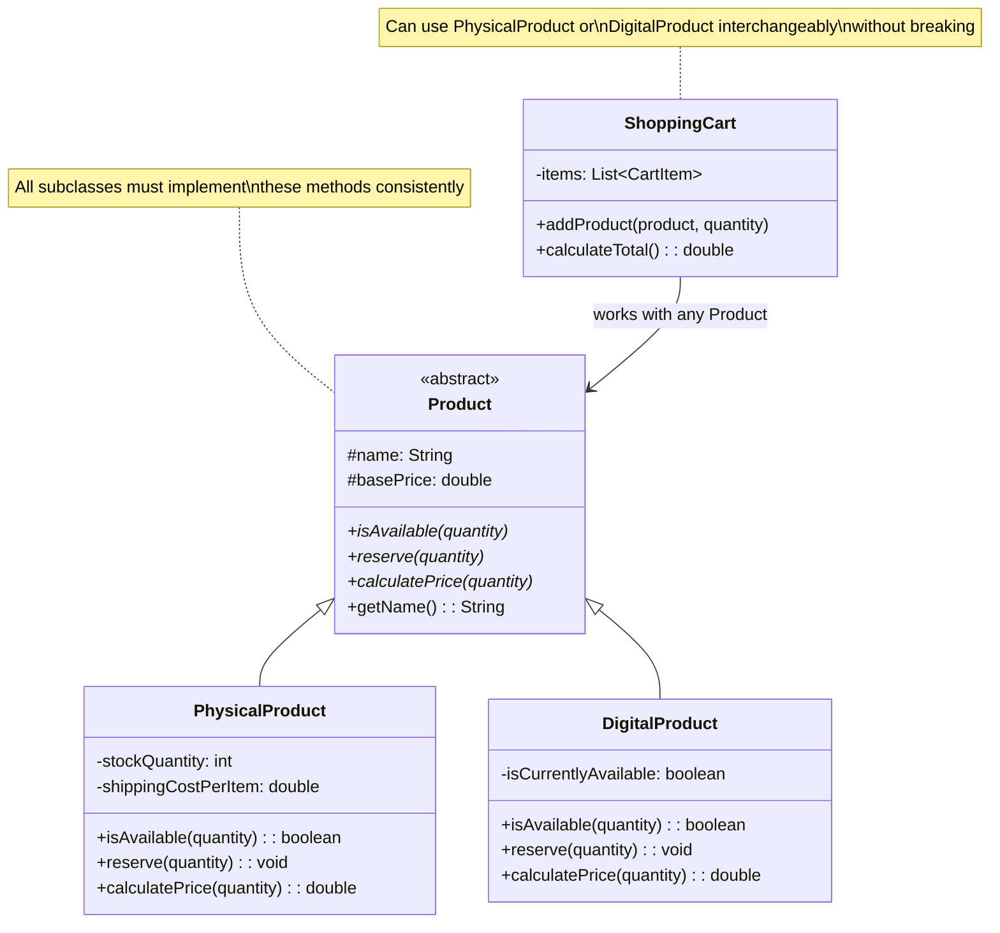

### How LSP Enables Seamless Cart Operations

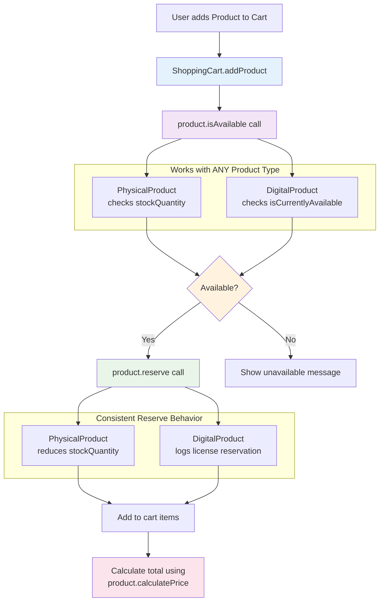

> [!TIP] LSP in Practice
> 
> - Subclasses should **extend** behavior, not **change** it
> - If you need to check the type of an object before using it, you might be violating LSP
> - Design your base classes carefully - they define the contract all subclasses must follow

***

## OCP vs LSP: Understanding the Key Differences

Many developers confuse the **Open/Closed Principle** and **Liskov Substitution Principle** because both involve inheritance and interfaces. However, they solve fundamentally different problems in retail systems.

### The Core Distinction

**OCP is about EXTENSION** - How do we add new functionality without breaking existing code?
**LSP is about SUBSTITUTION** - Do our existing object hierarchies work correctly together?

Think of it this way:
- **OCP** asks: "Can I add Apple Pay without changing my checkout system?"
- **LSP** asks: "Do digital products work the same way as physical products in my shopping cart?"

### Different Problems, Different Solutions

#### OCP: The Extension Problem

```java
// OCP VIOLATION: Adding new payment requires modifying existing code
public class PaymentProcessor {
    public void process(String type, double amount) {
        if (type.equals("CREDIT")) {
            // Credit card logic
        } else if (type.equals("PAYPAL")) {
            // PayPal logic  
        }
        // To add Apple Pay, we must modify this method!
    }
}

// OCP SOLUTION: Extension through interfaces
public interface PaymentMethod {
    void processPayment(double amount);
}

// Add new payment types WITHOUT modifying existing code
public class ApplePayPayment implements PaymentMethod {
    public void processPayment(double amount) {
        // Apple Pay logic - no existing code changed!
    }
}
```

#### LSP: The Substitution Problem

```java
// LSP VIOLATION: Subclass breaks parent's contract
public class Product {
    public void addToCart(ShoppingCart cart) {
        cart.addItem(this);
        updateInventory(); // Parent expects this to work
    }
    
    protected void updateInventory() {
        // Reduce physical stock
    }
}

public class DigitalProduct extends Product {
    @Override
    protected void updateInventory() {
        throw new UnsupportedOperationException("Digital products don't have inventory!");
        // BREAKS LSP - violates parent's contract!
    }
}

// LSP SOLUTION: Proper abstraction that works for all subtypes
public abstract class Product {
    public abstract boolean isAvailable(int quantity);
    public abstract void reserve(int quantity);
    // Contract that ALL products can fulfill consistently
}
```

### Visual Comparison: Extension vs Substitution

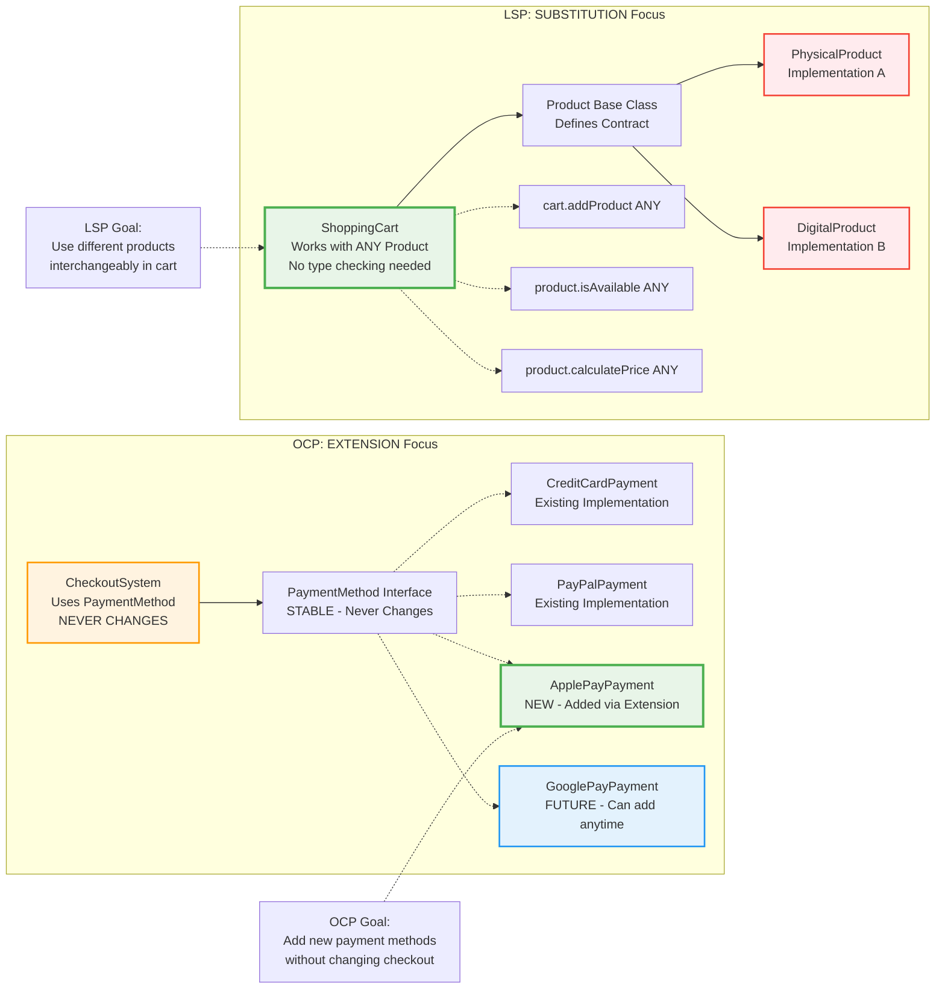

### When Each Principle Applies

**Use OCP thinking when:**
- Planning to add new features (payment methods, shipping providers)
- Designing plugin architectures
- Building systems that need frequent extensions
- **Question**: "How do I add new functionality without breaking existing code?"

**Use LSP thinking when:**
- Designing inheritance hierarchies
- Creating base classes and interfaces
- Ensuring polymorphism works correctly
- **Question**: "Can I substitute any subclass for the parent without breaking functionality?"

### Comparison Table

| Aspect | OCP (Open/Closed) | LSP (Liskov Substitution) |
|:-------|:------------------|:---------------------------|
| **Primary Goal** | Enable safe extension | Enable reliable substitution |
| **Timeline Focus** | Future-oriented | Present-oriented |
| **Code Changes** | Add new classes | Modify existing hierarchies |
| **Violation Signs** | Modifying existing classes for new features | Type checking before method calls |
| **Design Focus** | Interface design for extension | Contract design for substitution |
| **Retail Example** | Adding new payment methods | Physical vs digital products in cart |
| **Testing Strategy** | Test new implementations separately | Test all subtypes interchangeably |
| **Risk When Violated** | Fragile code that breaks with new features | Unexpected runtime exceptions |

### Practical Guidance

> [!TIP] How to Apply Both Principles Together
> 
> 1. **Start with LSP**: Design solid inheritance hierarchies where subtypes work correctly
> 2. **Add OCP**: Create interfaces that allow extension without modification
> 3. **Test thoroughly**: Ensure new extensions (OCP) don't break substitution contracts (LSP)
> 4. **Remember**: OCP helps you add features, LSP helps you use them reliably

> [!WARNING] Common Confusion
> 
> **Don't mix up the problems:**
> - If you're adding NEW functionality → Think OCP
> - If you're fixing broken inheritance → Think LSP
> - If you're doing both → Apply LSP first, then OCP

## Interface Segregation Principle (ISP)

### The Concept

**"Clients should not be forced to depend on interfaces they don't use."**

Imagine if every retail employee had to use the same massive computer system with hundreds of functions. The cashier would see inventory management, HR functions, and executive reports - overwhelming and unnecessary! ISP says to give each role only the tools they need.

### Starting Simple: The Problem

```java
// ❌ BAD: One giant interface for all employees
public interface RetailEmployee {
    // Cashier functions
    void scanItem(String itemCode);
    void processPayment(double amount);
    void printReceipt();
    
    // Manager functions
    void generateSalesReport();
    void approveRefund(double amount);
    void scheduleEmployees();
    
    // Warehouse functions
    void updateInventory(String itemCode, int quantity);
    void orderStock(String itemCode, int quantity);
    void arrangeShipment();
    
    // Customer service functions
    void handleReturn(String orderId);
    void answerCustomerQuery(String query);
    void escalateComplaint(String complaintId);
}

// Now every employee type is forced to implement everything!
public class Cashier implements RetailEmployee {
    @Override
    public void scanItem(String itemCode) {
        // Cashier needs this ✓
    }
    
    @Override
    public void generateSalesReport() {
        // Cashier doesn't need this! ✗
        throw new UnsupportedOperationException("Cashiers can't generate reports");
    }
    
    // ... forced to implement 11 more methods they don't use!
}
```

### Problem Visualization: Fat Interface vs Segregated Interfaces

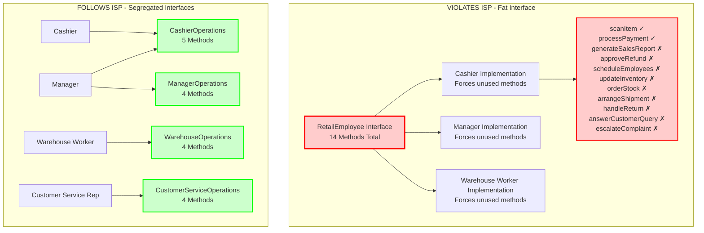

### The Solution: Applying ISP

Let's segregate interfaces by role:

```java
// ✅ GOOD: Separate interfaces for different responsibilities

// Cashier responsibilities
public interface CashierOperations {
    void scanItem(String itemCode);
    void processPayment(double amount, PaymentMethod method);
    void printReceipt(Order order);
    void openCashRegister();
    void closeCashRegister();
}

// Manager responsibilities  
public interface ManagerOperations {
    void generateDailySalesReport();
    void approveRefund(String orderId, double amount);
    void reviewEmployeePerformance(String employeeId);
    void adjustPricing(String itemCode, double newPrice);
}

// Warehouse responsibilities
public interface WarehouseOperations {
    void updateStockLevel(String itemCode, int quantity);
    void createPurchaseOrder(List<String> items);
    void scheduleDelivery(String orderId);
    void performInventoryCount();
}

// Customer service responsibilities
public interface CustomerServiceOperations {
    void processReturn(String orderId, String reason);
    void handleComplaint(String customerId, String issue);
    void checkOrderStatus(String orderId);
    void provideProductInformation(String itemCode);
}

// Now each employee implements ONLY what they need
public class Cashier implements CashierOperations {
    private double cashInRegister;
    
    @Override
    public void scanItem(String itemCode) {
        System.out.println("Scanning item: " + itemCode);
        // Lookup price, add to current transaction
    }
    
    @Override
    public void processPayment(double amount, PaymentMethod method) {
        System.out.println("Processing payment of $" + amount);
        method.processPayment(amount);
    }
    
    @Override
    public void printReceipt(Order order) {
        System.out.println("Printing receipt for order: " + order.getOrderId());
    }
    
    @Override
    public void openCashRegister() {
        System.out.println("Register opened for the day");
        cashInRegister = 200.00; // Starting cash
    }
    
    @Override
    public void closeCashRegister() {
        System.out.println("Register closed. Cash count: $" + cashInRegister);
    }
}

public class StoreManager implements ManagerOperations, CashierOperations {
    // Managers can do cashier work too, but also have additional responsibilities
    
    @Override
    public void generateDailySalesReport() {
        System.out.println("Generating sales report...");
        // Aggregate sales data
    }
    
    @Override
    public void approveRefund(String orderId, double amount) {
        System.out.println("Refund approved for order " + orderId + ": $" + amount);
    }
    
    // ... implement other methods
}

public class WarehouseWorker implements WarehouseOperations {
    @Override
    public void updateStockLevel(String itemCode, int quantity) {
        System.out.println("Updated stock for " + itemCode + ": " + quantity + " units");
    }
    
    @Override
    public void performInventoryCount() {
        System.out.println("Performing physical inventory count...");
    }
    
    // ... implement only warehouse-related methods
}
```

### ISP Implementation: Role-Based Interface Relationships

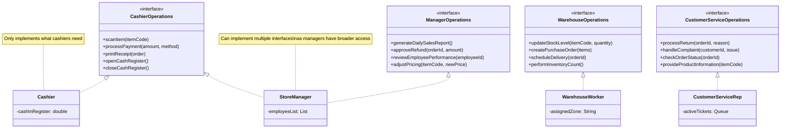

> [!NOTE] Benefits of ISP
> 
> - **Clarity**: Each role knows exactly what functions they have
> - **Flexibility**: Can combine interfaces (Manager implements both ManagerOperations and CashierOperations)
> - **Maintainability**: Changes to warehouse operations don't affect cashiers
> - **Type Safety**: Impossible to accidentally call manager functions on a cashier object

## Dependency Inversion Principle (DIP)

### The Concept

**"High-level modules should not depend on low-level modules. Both should depend on abstractions."**

Think of how a retail store handles shipping. The order fulfillment system (high-level) shouldn't directly depend on FedEx's specific API (low-level). Instead, both should work with a general "shipping service" concept. This way, you can switch from FedEx to UPS without changing your order system.

### Starting Simple: The Problem

```java
// ❌ BAD: High-level class directly depends on specific implementations
public class OrderFulfillmentSystem {
    private FedExShipping fedex = new FedExShipping();
    private MySQLInventory inventory = new MySQLInventory();
    private GmailEmailSender emailer = new GmailEmailSender();
    
    public void fulfillOrder(Order order) {
        // Tightly coupled to specific implementations!
        if (inventory.checkMySQLStock(order.getItems())) {
            fedex.shipViaFedEx(order);
            emailer.sendGmail(order.getCustomer().getEmail());
        }
    }
    
    // What if we want to use UPS? Or PostgreSQL? Or SendGrid?
    // We'd have to rewrite this entire class!
}
```

### Dependency Inversion: Before and After

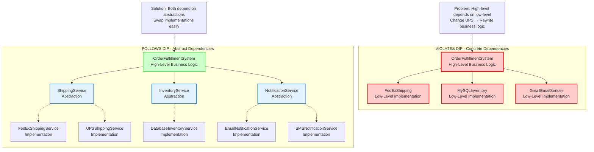

### The Solution: Applying DIP

Let's invert the dependencies using abstractions:

```java
// ✅ GOOD: Define abstractions (interfaces) for services

// Shipping abstraction
public interface ShippingService {
    String scheduleShipment(Order order);
    double calculateShippingCost(Order order);
    String trackPackage(String trackingNumber);
}

// Inventory abstraction
public interface InventoryService {
    boolean checkAvailability(List<Item> items);
    void reserveItems(List<Item> items);
    void releaseItems(List<Item> items);
}

// Notification abstraction
public interface NotificationService {
    void sendOrderConfirmation(Order order);
    void sendShippingNotification(Order order, String trackingNumber);
    void sendDeliveryNotification(Order order);
}

// Concrete implementations (low-level modules)
public class FedExShippingService implements ShippingService {
    @Override
    public String scheduleShipment(Order order) {
        // FedEx-specific API calls
        System.out.println("Scheduling FedEx shipment for order: " + order.getOrderId());
        return "FEDEX-" + order.getOrderId();
    }
    
    @Override
    public double calculateShippingCost(Order order) {
        // FedEx pricing logic
        double weight = order.getItems().size() * 0.5; // Simplified
        return weight * 3.50; // FedEx rate
    }
    
    @Override
    public String trackPackage(String trackingNumber) {
        return "FedEx tracking: " + trackingNumber + " - In Transit";
    }
}

public class UPSShippingService implements ShippingService {
    @Override
    public String scheduleShipment(Order order) {
        // UPS-specific API calls
        System.out.println("Scheduling UPS shipment for order: " + order.getOrderId());
        return "UPS-" + order.getOrderId();
    }
    
    @Override
    public double calculateShippingCost(Order order) {
        // UPS pricing logic
        double weight = order.getItems().size() * 0.5;
        return weight * 3.25; // UPS rate (slightly cheaper)
    }
    
    @Override
    public String trackPackage(String trackingNumber) {
        return "UPS tracking: " + trackingNumber + " - Out for Delivery";
    }
}

public class DatabaseInventoryService implements InventoryService {
    private String databaseType; // Could be MySQL, PostgreSQL, etc.
    
    public DatabaseInventoryService(String databaseType) {
        this.databaseType = databaseType;
    }
    
    @Override
    public boolean checkAvailability(List<Item> items) {
        System.out.println("Checking availability in " + databaseType);
        // Database queries here
        return true; // Simplified
    }
    
    @Override
    public void reserveItems(List<Item> items) {
        System.out.println("Reserving items in " + databaseType);
        // Update database
    }
    
    @Override
    public void releaseItems(List<Item> items) {
        System.out.println("Releasing items in " + databaseType);
        // Update database
    }
}

// High-level module depends on abstractions, not concrete classes
public class OrderFulfillmentSystem {
    private final ShippingService shippingService;
    private final InventoryService inventoryService;
    private final NotificationService notificationService;
    
    // Dependencies are injected through constructor
    public OrderFulfillmentSystem(
            ShippingService shipping,
            InventoryService inventory,
            NotificationService notification) {
        this.shippingService = shipping;
        this.inventoryService = inventory;
        this.notificationService = notification;
    }
    
    public void fulfillOrder(Order order) {
        // High-level business logic doesn't know or care about specific implementations
        if (inventoryService.checkAvailability(order.getItems())) {
            inventoryService.reserveItems(order.getItems());
            
            String trackingNumber = shippingService.scheduleShipment(order);
            double shippingCost = shippingService.calculateShippingCost(order);
            
            System.out.println("Shipping cost: $" + shippingCost);
            
            notificationService.sendOrderConfirmation(order);
            notificationService.sendShippingNotification(order, trackingNumber);
        } else {
            System.out.println("Items not available for order: " + order.getOrderId());
        }
    }
}

// Usage: Easy to swap implementations!
public class RetailApplication {
    public static void main(String[] args) {
        // Use FedEx for express shipping
        OrderFulfillmentSystem expressSystem = new OrderFulfillmentSystem(
            new FedExShippingService(),
            new DatabaseInventoryService("PostgreSQL"),
            new EmailNotificationService()
        );
        
        // Use UPS for standard shipping
        OrderFulfillmentSystem standardSystem = new OrderFulfillmentSystem(
            new UPSShippingService(),
            new DatabaseInventoryService("MySQL"),
            new SMSNotificationService()
        );
        
        // The high-level OrderFulfillmentSystem doesn't change!
    }
}
```

### DIP Architecture: Layered Design with Abstractions

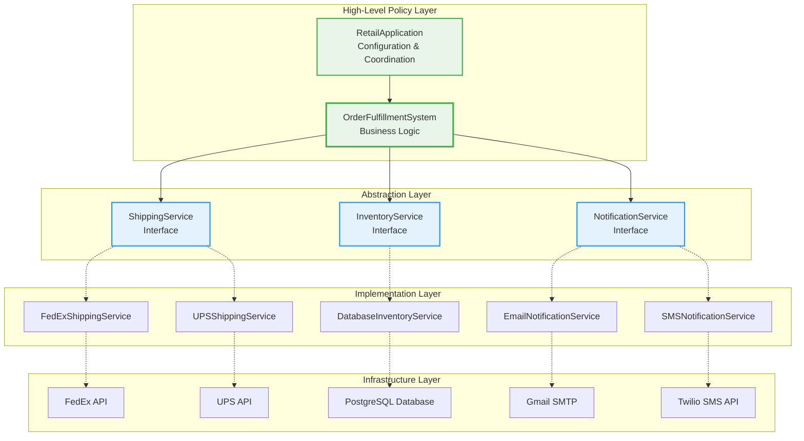

> [!TIP] DIP Benefits
> 
> - **Flexibility**: Easily switch between FedEx, UPS, DHL without code changes
> - **Testability**: Use mock implementations for unit testing
> - **Maintainability**: Changes to FedEx API don't affect your business logic
> - **Scalability**: Add new shipping providers by implementing the interface

## Putting It All Together: Complete Retail System

Let's see how all five SOLID principles work together in a cohesive retail system:

```java
// Complete example showing all SOLID principles working together

// SRP: Each class has one responsibility
// OCP: System is open for extension (new payment/shipping methods)
// LSP: All products work consistently in the system
// ISP: Interfaces are segregated by concern
// DIP: High-level modules depend on abstractions

// === PRODUCT DOMAIN (LSP) ===
public abstract class Product {
    protected String sku;
    protected String name;
    protected double basePrice;
    
    public abstract boolean isAvailable(int quantity);
    public abstract double calculatePrice(int quantity);
}

// === PAYMENT DOMAIN (OCP, ISP) ===
public interface PaymentMethod {
    PaymentResult processPayment(double amount);
}

public class PaymentResult {
    private boolean success;
    private String transactionId;
    private String message;
    // Constructor, getters...
}

// === SHIPPING DOMAIN (DIP, ISP) ===
public interface ShippingService {
    ShippingQuote getQuote(Order order);
    String scheduleShipment(Order order);
}

// === NOTIFICATION DOMAIN (SRP, ISP) ===
public interface NotificationService {
    void notifyOrderPlaced(Order order);
    void notifyOrderShipped(Order order, String trackingNumber);
}

// === CHECKOUT ORCHESTRATION (DIP, SRP) ===
public class CheckoutService {
    private final PaymentMethod paymentMethod;
    private final ShippingService shippingService;
    private final NotificationService notificationService;
    private final InventoryService inventoryService;
    private final PriceCalculator priceCalculator;
    
    // Constructor injection (DIP)
    public CheckoutService(
            PaymentMethod payment,
            ShippingService shipping,
            NotificationService notification,
            InventoryService inventory,
            PriceCalculator calculator) {
        this.paymentMethod = payment;
        this.shippingService = shipping;
        this.notificationService = notification;
        this.inventoryService = inventory;
        this.priceCalculator = calculator;
    }
    
    // Single responsibility: Orchestrate checkout
    public CheckoutResult processCheckout(ShoppingCart cart, Customer customer) {
        // 1. Verify inventory (SRP - delegated to InventoryService)
        if (!inventoryService.verifyAvailability(cart.getItems())) {
            return CheckoutResult.failure("Some items are out of stock");
        }
        
        // 2. Calculate total (SRP - delegated to PriceCalculator)
        double subtotal = priceCalculator.calculateSubtotal(cart.getItems());
        ShippingQuote shipping = shippingService.getQuote(cart.toOrder());
        double total = subtotal + shipping.getCost();
        
        // 3. Process payment (OCP - works with any payment method)
        PaymentResult paymentResult = paymentMethod.processPayment(total);
        if (!paymentResult.isSuccess()) {
            return CheckoutResult.failure("Payment failed: " + paymentResult.getMessage());
        }
        
        // 4. Create order
        Order order = cart.toOrder();
        order.setPaymentInfo(paymentResult.getTransactionId());
        
        // 5. Reserve inventory
        inventoryService.reserveItems(cart.getItems());
        
        // 6. Schedule shipping (DIP - doesn't know which shipping service)
        String trackingNumber = shippingService.scheduleShipment(order);
        
        // 7. Send notifications (ISP - only uses what it needs)
        notificationService.notifyOrderPlaced(order);
        
        return CheckoutResult.success(order, trackingNumber);
    }
}
```

### Complete SOLID Retail System Architecture

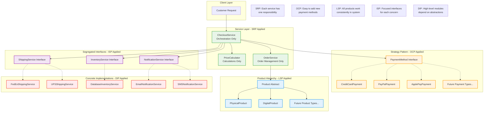

## Common Pitfalls and How to Avoid Them

> [!WARNING] Common SOLID Violations in Retail Systems

### SRP Violations

- **God Object**: `RetailSystem` class that handles everything
- **Fix**: Break into `OrderService`, `PaymentService`, `InventoryService`

### OCP Violations

- **Switch statements** for payment types
- **Fix**: Use polymorphism with `PaymentMethod` interface

### LSP Violations

- **Gift cards** that throw exceptions when trying to ship
- **Fix**: Separate `Shippable` and `NonShippable` product hierarchies

### ISP Violations

- **Universal employee interface** with 50+ methods
- **Fix**: Role-specific interfaces like `CashierOperations`, `ManagerOperations`

### DIP Violations

- **Direct instantiation**: `new FedExAPI()` in business logic
- **Fix**: Inject `ShippingService` interface

## Quick Reference Guide

|Principle|Remember|Retail Example|Code Smell to Avoid|
|---|---|---|---|
|**SRP**|One class, one job|Separate checkout from inventory|Classes with "and" in description|
|**OCP**|Extend, don't modify|Add payment methods via interface|Switch/if-else chains for types|
|**LSP**|Subtypes must substitute|All products work in cart|Type checking before method calls|
|**ISP**|Small, focused interfaces|Cashier vs Manager interfaces|Unused method implementations|
|**DIP**|Depend on abstractions|Inject shipping service|Direct instantiation of dependencies|

## Practice Exercise

> [!EXAMPLE] Build Your Own Retail Feature Try implementing a **returns processing system** using all SOLID principles:
> 
> 1. **SRP**: Separate return validation, refund processing, and inventory restocking
> 2. **OCP**: Support different return policies (30-day, 60-day, warranty)
> 3. **LSP**: Handle physical and digital product returns consistently
> 4. **ISP**: Different interfaces for customer service vs warehouse returns
> 5. **DIP**: Abstract refund methods (credit card, store credit, cash)

## Summary

The SOLID principles work together to create maintainable, flexible retail systems. By thinking of your code like a well-organized retail store - where each department has clear responsibilities, new features integrate smoothly, and systems are loosely coupled - you'll write better object-oriented Java code.

Remember: SOLID principles are **guidelines, not rules**. Apply them pragmatically, starting with the most painful problems in your codebase. As you practice, recognizing violations and applying solutions becomes second nature.

## Further Learning

- [[Design Patterns]] - Patterns that often emerge from SOLID principles
- [[Dependency Injection]] - Deep dive into DIP implementation
- [[Clean Architecture]] - Architectural patterns built on SOLID
- [[Test-Driven Development]] - How SOLID makes testing easier

---

#java #solid #design-principles #oop #retail #architecture #best-practices


