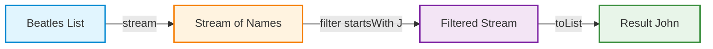
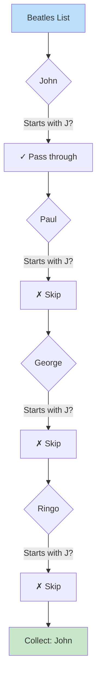
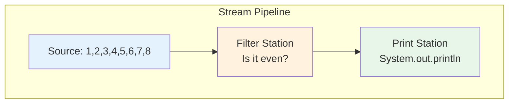
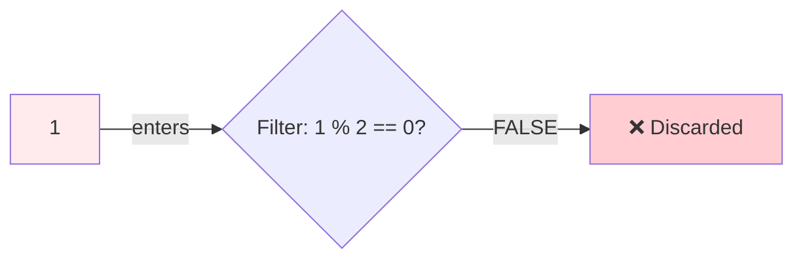
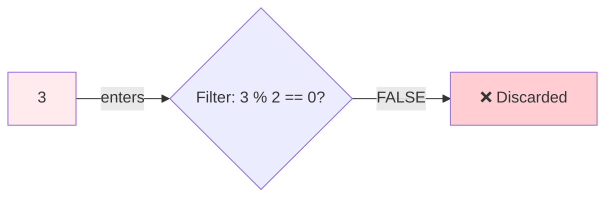
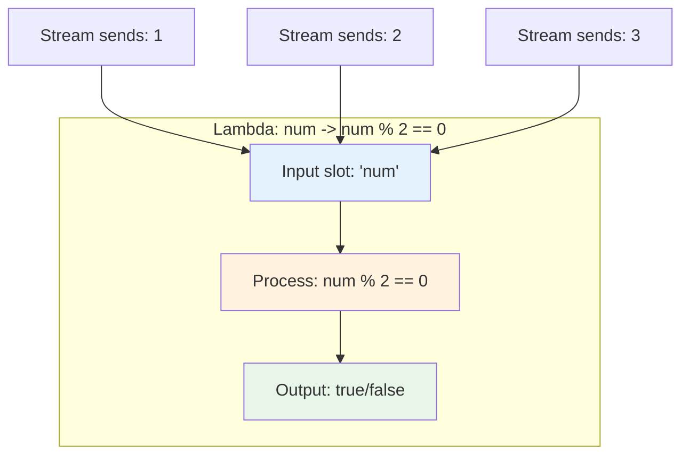

# Understanding Java Streams vs Loops: The Beatles Example

Let me help you visualize and understand Java streams by breaking down the concepts step by step. Think of streams as a conveyor belt in a factory, where your data flows through different processing stations.

## The Core Difference: Telling vs Asking

When you use a traditional for-each loop, you're like a manager walking through a warehouse, personally checking each item and deciding what to do with it. You control every step of the process.

With streams, you're more like an architect who designs a processing pipeline. You describe what transformations you want, and Java handles the actual execution for you.

## Visual Pipeline Representation

Here's how the Beatles example works as a stream pipeline:



And here's the data flow in more detail:



## Lambda Functions: Your Mini-Instructions

Lambda functions might seem mysterious at first, but they're actually quite simple. Think of them as tiny, disposable recipes that you hand to someone else to execute.

### Breaking Down the Lambda

In our example, we have:

```java
.filter(n -> n.startsWith("J"))
```

Let me decode this lambda expression `n -> n.startsWith("J")`:

The lambda has two parts separated by an arrow:

- **Left side** (`n`): This is like a placeholder name for each item that comes through. When Java processes "John", then `n` becomes "John". When it processes "Paul", then `n` becomes "Paul", and so on.
- **Arrow** (`->`): This means "goes to" or "produces". It connects your input to what you want to do with it.
- **Right side** (`n.startsWith("J")`): This is the actual work you want done. It's asking "Does this name start with J?" and returns true or false.

Think of it like giving someone a simple instruction card: "For each name you receive, check if it starts with J and tell me yes or no."

### Lambda vs Traditional Method

Without lambda (old way):

```java
// You'd need to create a whole separate method or class
class NameChecker {
    boolean checkName(String name) {
        return name.startsWith("J");
    }
}
```

With lambda (new way):

```java
// One line does the same thing!
n -> n.startsWith("J")
```

## How Loops and Streams Process Differently

### The Loop Way (Imperative)

```java
List<String> beatles = List.of("John", "Paul", "George", "Ringo");
List<String> jNames = new ArrayList<>();

for (String name : beatles) {    // You control the iteration
    if (name.startsWith("J")) {  // You check each condition
        jNames.add(name);         // You add to result manually
    }
}
```

In this approach, you're actively managing three things:

1. The iteration through each element
2. The checking of conditions
3. The building of the result collection

### The Stream Way (Declarative)

```java
List<String> beatles = List.of("John", "Paul", "George", "Ringo");

List<String> jNames = beatles.stream()      // Convert to stream
    .filter(n -> n.startsWith("J"))         // Describe the filter
    .toList();                               // Trigger execution & collect
```

With streams, you're just describing the transformation you want. Java handles the iteration, checking, and collection building for you.

## The Lazy Evaluation Magic

Here's something fascinating about streams: they're lazy! This means:

```java
Stream<String> pipeline = beatles.stream()
    .filter(n -> n.startsWith("J"));  // Nothing happens yet!
    
// The stream is just sitting there, waiting...

List<String> result = pipeline.toList();  // NOW it runs!
```

The filter doesn't actually process anything until you call `toList()`. It's like setting up dominoes but not pushing the first one until you're ready.

## When Each Approach Shines

**Use traditional loops when:**

- You need fine control over the iteration process
- You're modifying the original collection while iterating
- The logic is complex with multiple interdependent conditions
- Performance is critical and you need to optimize every operation

**Use streams when:**

- You want to express data transformations clearly
- You're chaining multiple operations together
- You might want to parallelize the operation later
- You prefer immutable, functional-style code
- You want to separate the "what" from the "how"

## Practice Exercise

To solidify your understanding, try mentally tracing through this example:

```java
List<String> names = List.of("John", "Jane", "Jack", "Mary");

// What will this produce?
List<String> result = names.stream()
    .filter(n -> n.length() == 4)    // Keep only 4-letter names
    .map(n -> n.toUpperCase())        // Convert to uppercase
    .toList();
```

Walk through it: John (4 letters) → passes filter → becomes JOHN. Jane (4 letters) → passes filter → becomes JANE. Jack (4 letters) → passes filter → becomes JACK. Mary (4 letters) → passes filter → becomes MARY. So the result is `[JOHN, JANE, JACK, MARY]`.

## Key Takeaways

Streams transform how you think about data processing in Java. Instead of micromanaging each step, you describe transformations and let Java handle the execution. Lambda functions are your compact instructions that tell each operation what to do with the data flowing through. Once you internalize this pipeline mindset, you'll find streams make many data operations clearer and more maintainable than traditional loops.


# Tracing Through a Stream: Step-by-Step Visualization

Let me walk you through exactly what happens when a stream processes your numbers, element by element. I'll show you the journey of each number as it flows through the pipeline, which will help you build a mental model of how streams actually work.

## Understanding Your Example

Looking at your code, you have a list of numbers from 1 to 8, and you want to filter for even numbers and print them. Let's fix the small issue in your code first - the `isEven()` method needs to accept a parameter:

```java
List<Integer> nums = new ArrayList<>(List.of(1, 2, 3, 4, 5, 6, 7, 8));

nums.stream()
    .filter(num -> num % 2 == 0)  // Check if even
    .forEach(num -> System.out.println(num));
```

Now, let me show you exactly what happens when this code runs.

## The Stream Pipeline: A Processing Assembly Line

Think of the stream as an assembly line where each number takes a journey through different stations. Here's the crucial insight: **the stream doesn't process all numbers at once**. Instead, it takes one number at a time and pushes it through the entire pipeline before moving to the next number.



## Element-by-Element Journey

Let me trace through what happens with each number. This is where the magic becomes clear:

### Journey of Number 1



The number 1 enters the pipeline. At the filter station, we check: is 1 even? The answer is no (1 % 2 equals 1, not 0). So number 1 is discarded and never reaches the forEach station. Nothing gets printed.

### Journey of Number 2

```mermaid
flowchart LR
    N2[2] -->|enters| F2{Filter: 2 % 2 == 0?}
    F2 -->|TRUE| P2[forEach: print(2)]
    P2 -->|output| O2["Console: 2"]
    
    style N2 fill:#e8f5e9
    style O2 fill:#c8e6c9
```

The number 2 enters the pipeline. At the filter station: is 2 even? Yes! (2 % 2 equals 0). So 2 passes through the filter and arrives at forEach, which prints "2" to the console.

### Journey of Number 3



Number 3 enters, fails the even test (3 % 2 equals 1), and gets discarded. Nothing prints.

### Journey of Number 4

```mermaid
flowchart LR
    N4[4] -->|enters| F4{Filter: 4 % 2 == 0?}
    F4 -->|TRUE| P4[forEach: print(4)]
    P4 -->|output| O4["Console: 4"]
    
    style N4 fill:#e8f5e9
    style O4 fill:#c8e6c9
```

Number 4 passes the even test and gets printed.

This pattern continues for all eight numbers. The important thing to understand is that **each element completes its entire journey before the next element starts**. This is different from what you might imagine - the stream doesn't first filter all elements and then print all elements. Instead, it processes them one at a time, completely.

## The Complete Execution Trace

Let me show you the exact sequence of operations that happen:

```
Start stream processing...

Element #1: Take 1 from list
    → Filter: Is 1 even? No
    → Discard 1
    
Element #2: Take 2 from list
    → Filter: Is 2 even? Yes
    → forEach: Print 2
    → Console output: 2
    
Element #3: Take 3 from list
    → Filter: Is 3 even? No
    → Discard 3
    
Element #4: Take 4 from list
    → Filter: Is 4 even? Yes
    → forEach: Print 4
    → Console output: 4
    
Element #5: Take 5 from list
    → Filter: Is 5 even? No
    → Discard 5
    
Element #6: Take 6 from list
    → Filter: Is 6 even? Yes
    → forEach: Print 6
    → Console output: 6
    
Element #7: Take 7 from list
    → Filter: Is 7 even? No
    → Discard 7
    
Element #8: Take 8 from list
    → Filter: Is 8 even? Yes
    → forEach: Print 8
    → Console output: 8
    
Stream processing complete.
Final output: 2, 4, 6, 8
```

## Why This Order Matters

This one-at-a-time processing is actually very clever. Consider what would happen if you had a more complex pipeline:

```java
nums.stream()
    .filter(num -> num % 2 == 0)    // Keep even numbers
    .map(num -> num * num)           // Square them
    .forEach(System.out::println);   // Print result
```

For the number 2, here's what happens:

1. Take 2 from the list
2. Filter: Is 2 even? Yes, pass it through
3. Map: Square it → 2 * 2 = 4
4. forEach: Print 4

The number 2 goes through all three operations before number 3 even starts its journey. This is called "vertical" processing as opposed to "horizontal" processing where you'd filter all elements first, then map all filtered elements, then print all mapped elements.

## Visualizing with a Real-World Analogy

Imagine you're at a theme park with a special photo booth that has three stages:

1. **Entry Gate** (filter): Only people wearing blue shirts can enter
2. **Photo Station** (map): Takes your photo and adds a funny hat to it
3. **Print Station** (forEach): Prints your photo

Now, eight friends arrive. They don't all rush to the entry gate at once, then all move to the photo station together. Instead, each person goes through the entire experience individually. Friend #1 approaches the gate - they're wearing red, so they're turned away. Friend #2 has a blue shirt, so they go through the gate, get their photo taken with the funny hat, and get it printed, all while Friend #3 is still waiting in line.

This is exactly how streams work. Each element flows through the entire pipeline before the next element starts.

## Mental Exercise to Solidify Understanding

To really cement this concept, try mentally tracing through this slightly different example:

```java
List<Integer> nums = List.of(1, 2, 3, 4);

nums.stream()
    .filter(n -> {
        System.out.println("Filtering: " + n);
        return n > 2;
    })
    .forEach(n -> System.out.println("Result: " + n));
```

Before looking at the answer below, try to predict what will be printed and in what order.

The output would be:

```
Filtering: 1
Filtering: 2
Filtering: 3
Result: 3
Filtering: 4
Result: 4
```

Notice how "Filtering" and "Result" messages are interleaved? That's because each number completes its journey through the pipeline before the next one starts. If streams processed horizontally (all filtering first, then all printing), you'd see all "Filtering" messages before any "Result" messages.

## The Key Insight

The stream doesn't create intermediate collections between operations. There's no temporary list of filtered numbers sitting in memory. Instead, elements flow through the pipeline one at a time, like water flowing through pipes. This is what makes streams memory-efficient and allows them to process even infinite sequences of data.

When you truly understand this flow, you'll see why streams are called "streams" - they're like a stream of water where each drop (element) flows through the entire path from source to destination independently. 


# Understanding Lambda Expressions: Why That Left Side Matters

Let me help you understand lambda expressions by building up from the very basics. The confusion about why we need that left-hand side parameter is actually a great question that gets to the heart of what lambdas really are.

## Starting with a Fundamental Truth

Here's the key insight that will make everything click: a lambda expression is just a compact way to write a method. That's it! It's a method without a name, which is why lambdas are sometimes called "anonymous functions." And just like any method, it needs to know what it's working with.

Think about this regular method:

```java
public boolean checkIfEven(Integer number) {
    return number % 2 == 0;
}
```

This method needs the parameter `number` because without it, what would we check? The expression `% 2 == 0` by itself is incomplete - we need to know what we're dividing by 2.

## The Evolution: From Methods to Lambdas

Let me show you the gradual transformation from a traditional approach to a lambda expression. This will help you see why each part is necessary.

### Step 1: The Old-School Approach

Before Java 8, if you wanted to filter a list, you'd write something like this:

```java
List<Integer> nums = List.of(1, 2, 3, 4, 5, 6, 7, 8);
List<Integer> evens = new ArrayList<>();

for (Integer currentNumber : nums) {
    if (currentNumber % 2 == 0) {  // Notice: we NEED currentNumber
        evens.add(currentNumber);
    }
}
```

See how `currentNumber` is essential? Without it, we'd have no idea what number we're checking.

### Step 2: Extracting to a Method

We could extract the checking logic into a method:

```java
public boolean isEven(Integer numberToCheck) {
    return numberToCheck % 2 == 0;
}

// Using it:
for (Integer currentNumber : nums) {
    if (isEven(currentNumber)) {
        evens.add(currentNumber);
    }
}
```

Again, the parameter `numberToCheck` is crucial. The method needs to receive a value to work with.

### Step 3: The Lambda Transformation

Now here's where the magic happens. Java lets us write that same `isEven` method as a lambda:

```java
// This lambda:
num -> num % 2 == 0

// Is equivalent to this method:
public boolean isEven(Integer num) {
    return num % 2 == 0;
}
```

The `num` on the left side of the arrow is the parameter, just like `numberToCheck` was in our method. We're just giving it a shorter name and skipping all the ceremony of declaring a full method.

## Breaking Down the Lambda Anatomy

Let me dissect the lambda expression `num -> num % 2 == 0` piece by piece:

```
num     ->     num % 2 == 0
 ↑              ↑
 |              |
 |              This is the METHOD BODY
 |              (what to do with the input)
 |
 This is the PARAMETER
 (a name for the input we'll receive)
```

Think of it this way: the lambda is like a little machine. The left side (`num`) is the input slot where numbers will be fed in, one at a time. The right side (`num % 2 == 0`) is the processing that happens to each input.

## Why Can't We Skip the Left Side?

You might wonder, "Why can't I just write `.filter(% 2 == 0)`?" Let me show you why this doesn't work by thinking about what happens when the stream runs.

When the stream processes your list, here's what happens internally:

```java
// For element 1:
filter calls your lambda with 1
    → Lambda receives 1 as 'num'
    → Lambda calculates: 1 % 2 == 0 (which is false)
    → Lambda returns false
    
// For element 2:
filter calls your lambda with 2
    → Lambda receives 2 as 'num'
    → Lambda calculates: 2 % 2 == 0 (which is true)
    → Lambda returns true
```

Without the parameter name `num`, how would the lambda know what value it's working with? The expression `% 2 == 0` by itself is incomplete - it's like saying "divide by 2 and check if the remainder is 0" without specifying what to divide.

## A Real-World Analogy

Imagine you're at a factory with a quality control station. You want to set up a rule for the inspector: "Accept only even-numbered products."

You can't just post a sign that says "% 2 == 0" because that's meaningless by itself. Instead, you need to give complete instructions: "For each product that comes to you, check if its number divided by 2 has a remainder of 0."

In lambda terms:

- "For each product" = the parameter (`num`)
- "that comes to you" = the arrow (`->`)
- "check if its number divided by 2 has a remainder of 0" = the body (`num % 2 == 0`)

## Visualizing Lambda Execution

Let me show you exactly what happens when your stream uses the lambda:



Each time the filter operation needs to check a number, it "calls" your lambda by putting a value into the `num` slot. The lambda then uses that `num` value in its calculation and returns the result.

## Different Lambda Scenarios

To solidify your understanding, let me show you different lambdas and explain their parameters:

### Scenario 1: Transformation

```java
// Lambda that squares a number
nums.stream()
    .map(n -> n * n)  // 'n' receives each number, returns n squared
```

Here, `n` is the input number. For the value 3, `n` becomes 3, and the lambda returns 9.

### Scenario 2: Complex Logic

```java
// Lambda that checks multiple conditions
nums.stream()
    .filter(x -> x > 5 && x < 10)  // 'x' receives each number
```

The parameter `x` represents each number. For the value 7, `x` becomes 7, and the lambda checks if 7 > 5 AND 7 < 10.

### Scenario 3: String Operations

```java
List<String> names = List.of("Alice", "Bob", "Charlie");
names.stream()
    .filter(name -> name.length() > 3)  // 'name' receives each string
```

Here, `name` receives each string from the list. When processing "Bob", `name` becomes "Bob", and the lambda checks if "Bob".length() > 3.

## The Mental Model

Here's how I want you to think about lambdas moving forward:

A lambda is a recipe that needs ingredients. The left side tells you what ingredients you'll receive and what to call them. The right side tells you what to do with those ingredients. You can't have a recipe that just says "bake at 350°F" without specifying what you're baking. Similarly, you can't have a lambda that just says `% 2 == 0` without specifying what you're checking.

When the stream calls your lambda with the value 4, it's like someone handing you an ingredient and saying "Here's 4, now follow your recipe." Your lambda takes that 4 (calling it `num` or whatever name you chose), and then executes the recipe: `4 % 2 == 0`.

## A Quick Exercise

To test your understanding, can you predict what these lambdas will do?

```java
// Lambda A
s -> s.toUpperCase()
// This receives a string 's' and returns it in uppercase

// Lambda B  
val -> val + 10
// This receives a number 'val' and returns val plus 10

// Lambda C
word -> word.contains("a")
// This receives a string 'word' and checks if it contains the letter 'a'
```

Each one needs that left-side parameter because without it, we wouldn't know what to convert to uppercase, what to add 10 to, or what to search for the letter 'a' in.

The parameter name is your choice - you could use `num`, `n`, `x`, `element`, or even `potato` if you wanted (though that would be confusing!). The important thing is that you need _some_ name to refer to the value that will be passed in when the lambda is executed.


# What `.stream()` Actually Does: Lifting the Hood

Let me help you visualize what really happens when you call `.stream()` on a collection. This is one of those moments where understanding the mechanics beneath the surface will make everything else about streams suddenly make sense.

## The Moment of Transformation

When you write `nums.stream()`, you might imagine some complex transformation happening to your list, but the reality is both simpler and more clever than you might expect. Let me walk you through what actually occurs at that precise moment.

Your original list remains completely untouched. Instead, `.stream()` creates a lightweight wrapper object that knows how to read from your list. Think of it like putting a special lens over your list that will allow you to view and process it in a new way, but the list itself doesn't change at all.

```java
List<Integer> nums = new ArrayList<>(List.of(1, 2, 3, 4, 5, 6, 7, 8));
Stream<Integer> numberStream = nums.stream();  // What happens here?
```

## The Internal Architecture

Let me show you conceptually what gets created when you call `.stream()`. Imagine Java creates something like this internally (this is simplified for clarity):

```java
// This is a conceptual representation of what happens
class StreamWrapper {
    private List<Integer> sourceData;      // Reference to your original list
    private int currentPosition = 0;       // Tracks where we are
    private Pipeline pipeline = new Pipeline();  // Holds operations to apply
    
    public StreamWrapper(List<Integer> source) {
        this.sourceData = source;  // Just stores a reference!
    }
}
```

The key insight here is that calling `.stream()` doesn't copy your data or immediately process anything. It just creates a smart wrapper that knows three critical things: where your data lives, how to iterate through it, and what operations you want to perform (which starts empty).

## A Physical World Analogy

Imagine you have a bookshelf with eight books numbered 1 through 8. When you call `.stream()`, you're not moving the books or even touching them. Instead, you're setting up a special reading station next to the bookshelf. This reading station has a mechanical arm that can pick up one book at a time, and initially, it's just sitting there, ready but inactive.

The reading station also has an empty instruction manual where you can write down what to do with each book once you start processing them. When you add `.filter()` or `.map()`, you're adding pages to this instruction manual, but still, no books have been touched yet.

## The State After `.stream()`

Let me visualize what exists in memory right after you call `.stream()`:

```
MEMORY STATE after nums.stream():

Original List (unchanged):
[1] [2] [3] [4] [5] [6] [7] [8]
 ↑
 |
 └── Stream Object (newly created):
     {
       source: reference to list above
       operations: [] (empty - no operations yet)
       state: NOT_STARTED
       iterator: ready to start at position 0
     }
```

Notice how the stream object is incredibly lightweight. It's not storing a copy of your data; it's just storing a reference to where your data lives and maintaining some state about what to do when you eventually trigger processing.

## Adding Operations: Building the Pipeline

Now, when you add operations like `.filter(num -> num % 2 == 0)`, here's what happens internally:

```java
// Conceptually, this is what happens when you add filter
nums.stream()
    .filter(num -> num % 2 == 0)  // This doesn't execute yet!
```

The stream doesn't start filtering immediately. Instead, it adds the filter operation to its internal pipeline, like adding an instruction to a recipe that hasn't been cooked yet:

```
Stream Object after adding filter:
{
  source: reference to list [1,2,3,4,5,6,7,8]
  operations: [
    Operation1: {
      type: "FILTER",
      logic: (num -> num % 2 == 0)
    }
  ]
  state: STILL_NOT_STARTED
}
```

## The Moment of Execution

The stream remains dormant, holding your list reference and your operations, until you add a terminal operation like `.forEach()`. This is when everything springs to life. Let me show you what happens internally when the terminal operation triggers:

```java
// When you complete with forEach
nums.stream()
    .filter(num -> num % 2 == 0)
    .forEach(System.out::println);  // NOW execution begins!
```

At this moment, the stream essentially does something like this internally:

```java
// Simplified internal execution (conceptual)
for (Integer element : sourceList) {
    Integer current = element;
    
    // Apply each operation in the pipeline
    // Operation 1: Filter
    if (!(current % 2 == 0)) {
        continue;  // Skip this element
    }
    
    // Terminal operation: forEach
    System.out.println(current);
}
```

## The Clever Design: Why This Approach?

You might wonder why Java doesn't just immediately filter your list when you call `.filter()`. The design is brilliant for several reasons that become clear when you understand what's happening.

First, imagine you have a list of a million numbers and you write this:

```java
nums.stream()
    .filter(n -> n % 2 == 0)
    .map(n -> n * n)
    .limit(5)  // Only want first 5 results
    .forEach(System.out::println);
```

If each operation executed immediately, Java would filter all million numbers, then square all the filtered results, and only then limit to 5. That's incredibly wasteful! Instead, with the lazy approach, the stream can stop processing after finding the first 5 even numbers, potentially examining only 10 elements instead of a million.

## The Iterator Pattern Under the Hood

At its core, a stream uses something called the Iterator pattern. When you call `.stream()`, you're essentially getting a sophisticated iterator that knows how to walk through your collection. Here's a simplified view of what the stream's internal iterator might look like:

```java
// Conceptual internal structure
class StreamIterator {
    private List<Integer> source;
    private int position = 0;
    
    boolean hasNext() {
        return position < source.size();
    }
    
    Integer next() {
        Integer value = source.get(position);
        position++;
        return value;
    }
}
```

The stream wraps this basic iteration mechanism with the ability to chain operations and apply them lazily.

## A Concrete Visualization

Let me draw you a picture of what exists in memory through the entire process:

```
Step 1: List<Integer> nums = List.of(1, 2, 3, 4);
Memory: [Array: 1,2,3,4]

Step 2: Stream<Integer> s = nums.stream();
Memory: [Array: 1,2,3,4]
        [Stream object: {source: points to array, operations: empty}]

Step 3: s.filter(n -> n % 2 == 0)
Memory: [Array: 1,2,3,4]
        [Stream object: {source: points to array, operations: [filter]}]
        
Step 4: .forEach(System.out::println)
Memory: [Array: 1,2,3,4]
        [Stream starts pulling from array]
        [Applies filter to each element]
        [Prints passing elements]
        Console output: 2, 4
```

## The "Pull" Model

Here's a crucial insight: streams use what's called a "pull" model rather than a "push" model. The terminal operation (like `forEach`) pulls data through the pipeline on demand, rather than the source pushing data through.

Think of it like a vacuum cleaner. The vacuum (terminal operation) creates suction that pulls dust (data) through the hose (pipeline) from the floor (source collection). Without the vacuum running, the dust just sits there, and the hose is just an empty tube waiting to transport something.

## Why Understanding This Matters

Understanding what `.stream()` actually does helps explain many stream behaviors that might otherwise seem mysterious. For example, now you understand why you can't reuse a stream (once the internal iterator has walked through the source, it needs to be reset), why operations are lazy (they're just being recorded, not executed), and why streams can be so memory efficient (they're not copying your data).

The next time you write `list.stream()`, picture it as creating a smart, lightweight controller that sits next to your data, ready to orchestrate a series of operations when triggered, but doing absolutely nothing until that trigger arrives. It's not magic; it's just a very clever design pattern that gives you powerful data processing capabilities with minimal overhead.

#java #streams #overview
