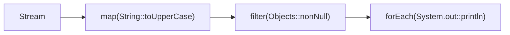

# Java '::' Method References in Streams

Syntax: `ClassName::methodName`

The :: operator in Java is a method reference: a compact way to pass an existing method (or constructor) wherever a functional interface is expected in streams, often replacing lambdas like x -> x.method() for clarity. In short, it says “use this existing method here,” letting the stream pipeline supply the arguments and handle invocation.

## What :: does

- Method references are interchangeable with lambdas that merely call a method; they improve readability without changing semantics.
- The stream supplies arguments from its elements to the referenced method based on the target functional interface’s parameter list and return type.



> [!NOTE]
> A method reference does not execute by itself; it’s just a value that conforms to a functional interface (e.g., Function, Predicate) and runs when the stream stage executes.

## Four kinds of method references

- Reference to a static method: ClassName::staticMethod
- Reference to an instance method of a particular object (bound): instanceRef::instanceMethod
- Reference to an instance method of an arbitrary object of a given type (unbound): TypeName::instanceMethod
- Reference to a constructor: ClassName::new (and array constructors like Type[]::new)


### 1) Static method reference

```java
// Equivalent: .map(s -> Integer.parseInt(s))
List<Integer> ints = List.of("1", "2", "3").stream()
    .map(Integer::parseInt)       // static method
    .toList();
```


### 2) Instance method of a particular object (bound)

```java
// System.out is a PrintStream instance; println is an instance method.
// Equivalent: .forEach(s -> System.out.println(s))
List.of("Ada", "Babbage").forEach(System.out::println);
```


### 3) Instance method of an arbitrary object of a particular type (unbound)

```java
// Each stream element becomes the receiver of length()
// Equivalent: .map(s -> s.length())
List<Integer> lengths = List.of("alpha", "beta", "gamma").stream()
    .map(String::length)
    .toList();
```


### 4) Constructor reference

```java
// Create a list via constructor in a collector
Deque<String> dq = List.of("a", "b", "c").stream()
    .collect(java.util.stream.Collectors.toCollection(java.util.ArrayDeque::new));

// Construct domain objects from data
record Person(String name, int age) {}
List<Person> people = List.of("Ada:36", "Babbage:45").stream()
    .map(s -> s.split(":"))
    .map(parts -> new Person(parts[0], Integer.parseInt(parts[1]))) // or Person::new if signature fits
    .toList();

// Array constructor for toArray
Person[] array = people.stream().toArray(Person[]::new);
```


## Reading the Syntax

- If the left side is a class and the method is static, it maps to a static call: x -> Class.method(x).
- If the left side is an instance (object), it binds that receiver: x -> instance.method(x).
- If the left side is a type and the method is non-static, it’s “unbound”: (a, b) -> a.method(b) where a is the stream element.

```java
// Unbound example: (a, b) -> a.compareToIgnoreCase(b)
java.util.Comparator<String> cmp = String::compareToIgnoreCase;

// Bound example: x -> out.println(x)
var out = System.out;
java.util.function.Consumer<String> printer = out::println;
```


## Stream-focused examples (cheatsheet)

```java
import java.util.*;
import java.util.stream.*;
import static java.util.stream.Collectors.*;

record Person(String name, int age) {
    boolean isAdult() { return age >= 18; }
    static int compareByAge(Person a, Person b) { return Integer.compare(a.age, b.age); }
}

public class StreamMethodRefExamples {
    public static void main(String[] args) {
        List<String> names = List.of("Ada", "Babbage", "Turing");

        // map: arbitrary instance method (unbound)
        List<Integer> lens = names.stream().map(String::length).toList();

        // filter: instance method on element
        List<String> withA = names.stream().filter(s -> s.startsWith("A")).toList(); // or s::startsWith requires a bound arg

        // forEach: particular instance method (bound)
        names.forEach(System.out::println);

        // reduce: static method reference
        int sum = List.of(1, 2, 3).stream().reduce(0, Integer::sum);

        // sorted: static method reference as comparator
        List<Person> people = List.of(new Person("Ada", 36), new Person("Babbage", 45), new Person("Turing", 41));
        List<Person> byAge = people.stream().sorted(Person::compareByAge).toList();

        // predicate: unbound instance method reference
        List<Person> adults = people.stream().filter(Person::isAdult).toList();

        // collectors with constructor/method references
        Map<Integer, List<Person>> byDecade = people.stream()
            .collect(groupingBy(p -> (p.age() / 10) * 10, toList()));

        // custom collection target via constructor reference
        ArrayDeque<String> deque = names.stream().collect(toCollection(ArrayDeque::new));

        // map factory using constructor reference
        Map<String, Person> map = people.stream().collect(toMap(Person::name, p -> p, (a,b) -> a, LinkedHashMap::new));
    }
}
```


## Argument Binding Rules (Mental Model)

- Static: `Function<T,R> f = Class::staticMethod` ≈ `(t) -> Class.staticMethod(t)`
- Unbound instance: `BiFunction<T,U,R> f = T::instMethod` ≈ `(t,u) -> t.instMethod(u)`
- Bound instance: `Function<U,R> f = instance::instMethod` ≈ `(u) -> instance.instMethod(u)`
- Constructor: `Supplier<T> g = T::new` ≈ `() -> new T()` and `IntFunction<T[]> h = T[]::new` ≈ `(n) -> new T[n]`


## When to Use vs Lambda

- Prefer a method reference when a lambda would only call an existing method—readability increases and intent is clearer.
- Stick with a lambda when extra logic is needed (multiple method calls, conditions, local variables), or when overload resolution gets ambiguous and a cast would hurt clarity.

> [!TIP]
> If a method reference becomes ambiguous, add an explicit target type, or revert to a simple lambda for clarity.

> [!WARNING]
> A method reference inherits any checked exceptions from the referenced method; wrap or handle as needed in the stream pipeline.

## Quick Reference

| Purpose                     | Method reference       | Lambda equivalent                  |
|-----------------------------|------------------------|------------------------------------|
| Map strings to lengths      | `String::length`       | `s -> s.length()`                  |
| Parse integers              | `Integer::parseInt`    | `s -> Integer.parseInt(s)`         |
| Print each element          | `System.out::println`  | `x -> System.out.println(x)`       |
| Sort with comparator        | `Person::compareByAge` | `(a,b) -> Person.compareByAge(a,b)`|
| Sum integers                | `Integer::sum`         | `(a,b) -> Integer.sum(a,b)`        |
| New collection in collector | `ArrayDeque::new`      | `() -> new ArrayDeque<>()`         |
| To array                    | `Person[]::new`        | `n -> new Person[n]`               |

## See Also

- [[Java Collections]]
- [[Design Patterns]]


#java #streams #method-references
