# RESTful API Visual Guide with Mermaid Diagrams

## Understanding REST APIs: The Middle Layer

Before we dive into the diagrams, let's establish what REST APIs really are. Think of a REST API as a translator and gatekeeper between your application's frontend (what users see) and your database (where data lives). When you browse Amazon and click "Add to Cart," your browser doesn't directly talk to Amazon's database. Instead, it sends a request to their REST API, which validates your request, checks permissions, and then translates it into SQL queries that the database understands.

## 1. Basic REST API Communication Flow

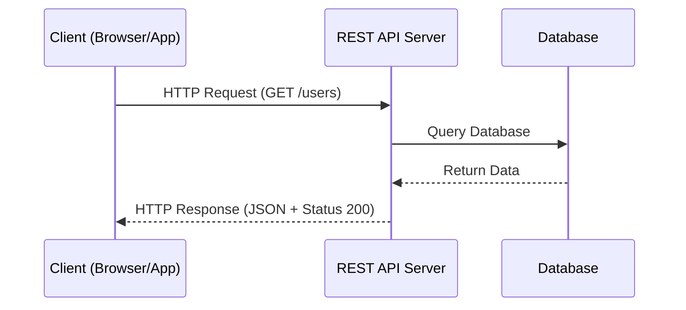

### What's Actually Happening Here:

This diagram shows the fundamental journey of every REST API request. Let me walk you through each step:

When you type a URL like `https://api.example.com/users` into your browser or when an app makes a request, you're initiating step 1. The client (your browser or app) sends an HTTP request to the REST API server. This request includes a method (GET in this case, which means "I want to read data") and a path (/users, which tells the API what resource you want).

The API server receives this request and acts as the intelligent middle layer you mentioned. It doesn't just blindly forward requests to the database. Instead, it first checks if you're authenticated (do you have a valid token?), authorized (are you allowed to see user data?), and then constructs an appropriate SQL query like `SELECT * FROM users WHERE active = true`.

The database processes this SQL query and returns raw data to the API server. This is where the API adds real value - it takes this raw database response and transforms it into a structured JSON format that's easy for any client to understand. Finally, it sends this JSON back to the client with an HTTP status code (200 means "everything worked perfectly").

## 2. HTTP Methods and CRUD Operations Explained

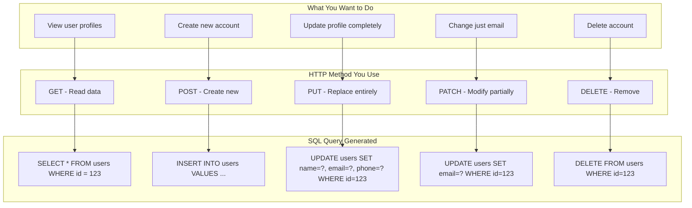

### Understanding HTTP Methods:

Each HTTP method has a specific purpose, and this is what makes REST APIs predictable and easy to use. Let me explain each one with real examples:

**GET** is for reading data without changing anything. When you browse products on an e-commerce site, your browser sends GET requests. These are safe to retry and cache because they don't modify data.

**POST** creates new resources. When you sign up for a new account or post a comment, you're using POST. Each POST request creates something new, so if you accidentally send it twice, you might create duplicates (that's why it's not "idempotent").

**PUT** completely replaces a resource. Imagine updating your user profile - if you send a PUT request with just your name, it might erase your email and phone number because PUT replaces everything.

**PATCH** is smarter - it only updates what you specify. If you just want to change your email address, PATCH lets you send only that field without affecting other data.

**DELETE** removes resources entirely. When you delete a post or cancel an account, this is the method being used.

## 3. RESTful Resource Hierarchy - Your URL Structure

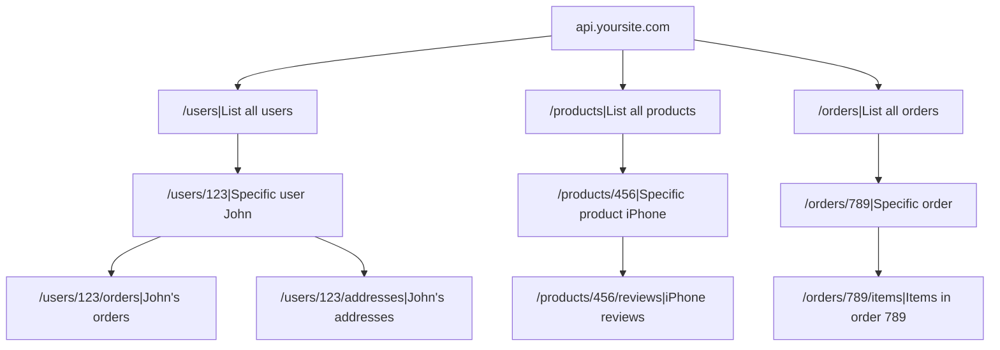

### How REST URLs Work:

REST API endpoints are essentially subdomains or paths of your main domain. The beauty of REST is that URLs represent nouns (things) not verbs (actions). This creates an intuitive structure.

Think of it like a file system on your computer. You have folders (collections) and files (individual resources). The path `/users` is like a folder containing all users. When you add `/123`, you're specifying "I want the user with ID 123." Going deeper with `/users/123/orders` means "show me the orders belonging to user 123."

This hierarchical structure makes APIs self-documenting. A developer can often guess the correct endpoint just by understanding the resource relationships.

## 4. The Complete Journey of an Authenticated Request

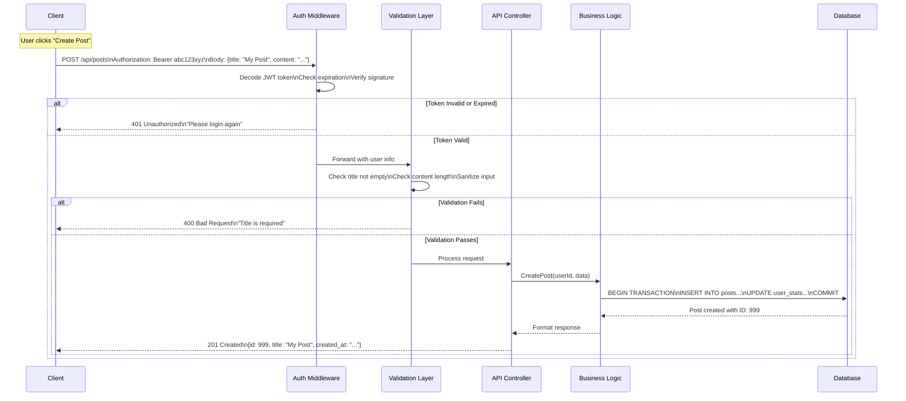

### The Authentication Flow Explained:

REST APIs are stateless - each request must prove who you are. This happens through tokens (usually JWT) or API keys sent in the request header.

When the request arrives, the authentication middleware (the first security checkpoint) examines the Authorization header. It finds something like "Bearer abc123xyz" where "abc123xyz" is your JWT token. This token is like a temporary ID card that contains your user ID and permissions, all cryptographically signed.

The middleware decodes this token and checks three things: Is the signature valid (preventing tampering)? Has it expired? Does this user still exist in our system? If any check fails, the request stops here with a 401 Unauthorized response.

Once authenticated, the request moves to validation. This layer ensures the data makes sense - required fields are present, formats are correct, and no malicious code is hiding in the input.

Finally, the validated request reaches the business logic layer, which orchestrates the actual work. It might run multiple database queries, update caches, send notifications, or trigger other services. All this complexity is hidden from the client, who just receives a clean JSON response.

## 5. HTTP Status Codes - The Response Language

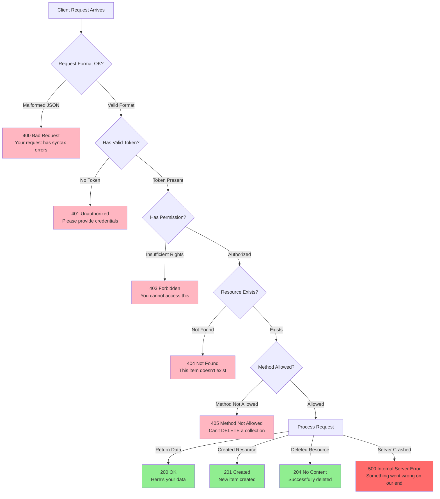

### Status Codes Tell the Story:

HTTP status codes are like traffic lights for your API requests. They immediately tell you what happened without needing to parse the response body.

The 200s (green) mean success. 200 OK is the most common - your request worked and here's the data. 201 Created specifically means a new resource was created (like after a POST request). 204 No Content means success but there's nothing to return (common after DELETE).

The 400s (yellow/orange) indicate client errors - you did something wrong. 400 means your request was malformed. 401 means you forgot to include authentication. 403 means you're logged in but not allowed to do this action. 404 is the famous "not found" error.

The 500s (red) mean the server failed. These aren't your fault. 500 is a generic server error, often indicating a bug in the API code or database issues.

## 6. Understanding Stateless Architecture

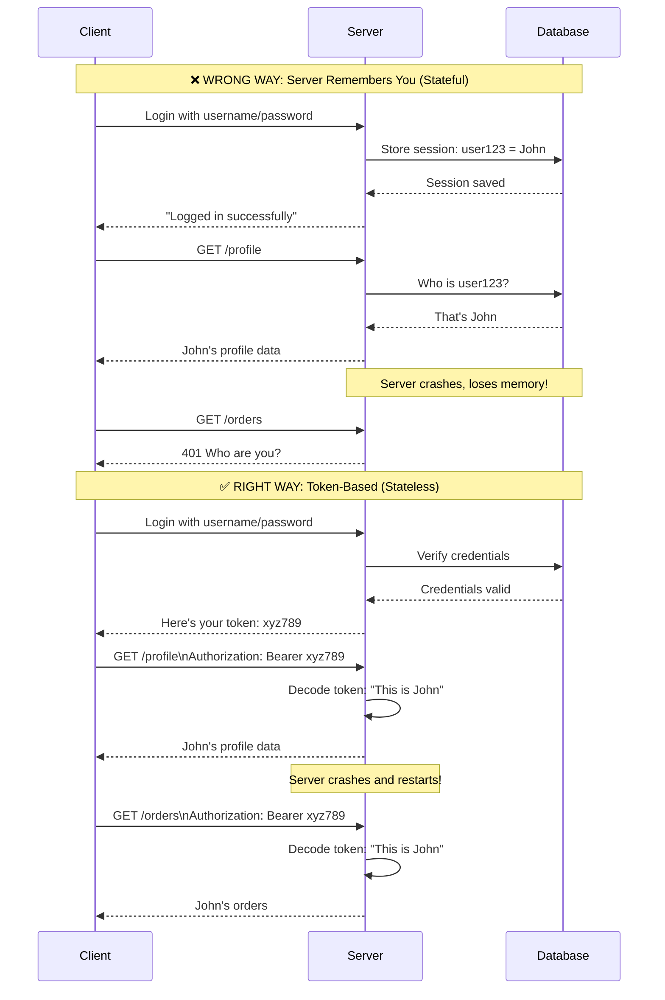

### Why Stateless Matters:

The stateless principle is crucial for scalability. In the wrong (stateful) approach, the server remembers who you are between requests. This creates problems: What if you have multiple servers? What if the server restarts? What if you need to scale to millions of users?

The stateless approach solves these issues. Every request carries its own authentication proof (the token). Any server in a cluster can handle any request because all the necessary information travels with the request itself. This is like showing your ID card every time you enter a building, rather than the security guard having to remember every face.

## 7. JWT vs API Key Authentication Detailed

```mermaid
flowchart TB
    subgraph "JWT Token Authentication Flow"
        J1[Client Login] -->|Send Credentials| J2[Server Validates]
        J2 -->|Generate JWT| J3[JWT Contains:\n- User ID\n- Permissions\n- Expiration\n- Signature]
        J3 -->|Return Token| J4[Client Stores Token]
        J4 -->|Future Requests| J5[Include Token in Header]
        J5 -->|Server Validates| J6[Decode Without DB Call]
        J6 -->|Token Valid| J7[Process Request]
        J6 -->|Token Expired| J8[Reject: Please Login Again]
    end
    
    subgraph "API Key Authentication Flow"
        A1[Request API Key] -->|Generate Key| A2[Store in Database]
        A2 -->|Return Key| A3[Client Saves Key]
        A3 -->|All Requests| A4[Include Key in Header]
        A4 -->|Server Checks| A5[Database Lookup Required]
        A5 -->|Key Found| A6[Check Permissions in DB]
        A6 -->|Authorized| A7[Process Request]
        A6 -->|Not Authorized| A8[Reject Request]
    end
```

### JWT vs API Keys Explained:

JWTs (JSON Web Tokens) are self-contained packets of information. When you login, the server creates a token containing your user ID, permissions, and an expiration time, then signs it with a secret key. This token is like a temporary passport - it has all your information embedded in it.

The brilliant part about JWTs is that the server doesn't need to remember anything or check the database for every request. It just validates the signature and reads the user information directly from the token. This makes JWTs perfect for distributed systems where you have many servers.

API keys, on the other hand, are like membership cards with just a number. When a request comes in with an API key, the server must look up that key in the database to find out who you are and what you're allowed to do. This requires a database query for every request, which can be slower but gives you more control (you can instantly revoke access by deleting the key from the database).

## 8. Pagination - Handling Large Datasets

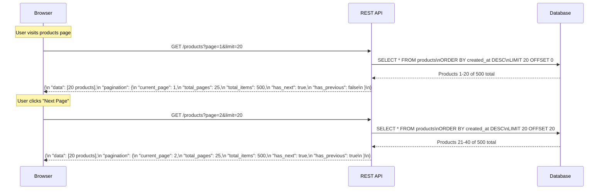

### How Pagination Works in Practice:

Pagination happens automatically through URL parameters. When browsing Amazon and scrolling through products, browsers make REST API calls like `/products?page=1&limit=20` behind the scenes.

The API translates these parameters into SQL queries using LIMIT (how many items) and OFFSET (skip how many items). For page 2 with 20 items per page, the offset is 20 (skip the first 20 items).

The response includes both the requested data and metadata about the pagination state. This metadata helps the frontend build those "Previous" and "Next" buttons and show "Page 2 of 25" indicators. The frontend then converts this JSON response into the HTML you see on the page.

## 9. Real E-commerce Purchase Flow

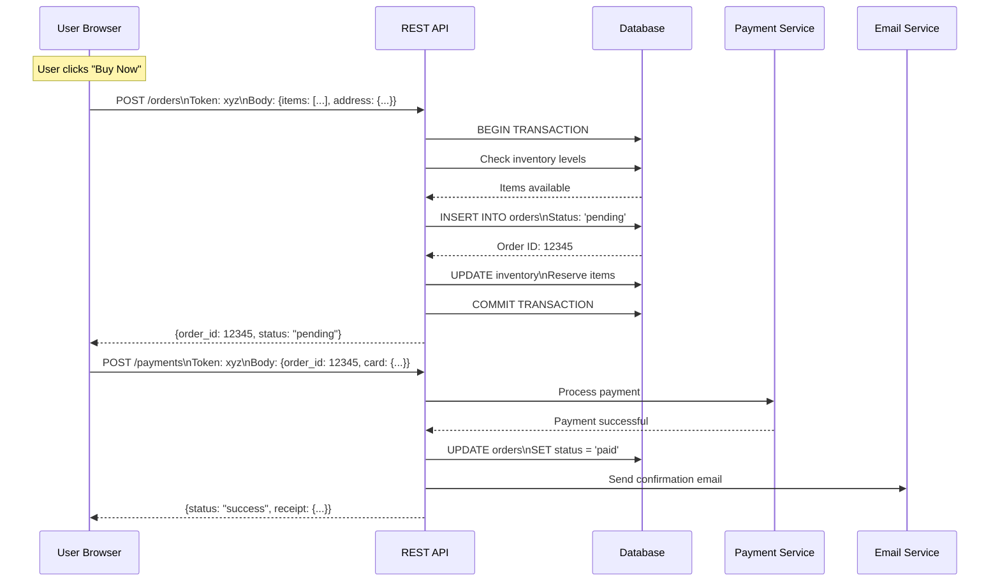

### The Shopping Cart to Database Journey:

Shopping workflows illustrate how REST APIs work in practice. When clicking "Buy Now," browsers don't directly insert rows into Amazon's database. Instead, they send a POST request to their `/orders` endpoint with authentication tokens and order details.

The API orchestrates a complex series of operations: It starts a database transaction (ensuring all-or-nothing execution), checks if items are in stock, creates the order record, reserves inventory, and processes payment through external services. If anything fails, it rolls back all changes to maintain data consistency.

This is where REST APIs shine - they encapsulate complex business logic behind simple, standardized interfaces. The frontend just sends "create an order" and receives back a success or failure response, without needing to know about inventory management, payment processing, or email notifications.

## 10. API Versioning Strategies Deep Dive

```mermaid
graph TD
    subgraph "URL Path Versioning"
        URLDesc[Most visible and clear approach]
        URL1[api.site.com/v1/users]
        URL2[api.site.com/v2/users]
        URLPro[✓ Clear in logs\n✓ Easy to route\n✓ Cache friendly]
        URLCon[✗ URL pollution\n✗ Forces version on all endpoints]
        URLDesc --> URL1
        URLDesc --> URL2
        URL1 --> URLPro
        URL2 --> URLCon
    end
    
    subgraph "Header Versioning"
        HeaderDesc[Version in custom header]
        Header1[GET /users\nAPI-Version: 1.0]
        Header2[GET /users\nAPI-Version: 2.0]
        HeaderPro[✓ Clean URLs\n✓ Version per request]
        HeaderCon[✗ Hidden from URL\n✗ Harder to test in browser]
        HeaderDesc --> Header1
        HeaderDesc --> Header2
        Header1 --> HeaderPro
        Header2 --> HeaderCon
    end
    
    subgraph "Query Parameter Versioning"
        QueryDesc[Version as URL parameter]
        Query1[api.site.com/users?version=1]
        Query2[api.site.com/users?version=2]
        QueryPro[✓ Optional parameter\n✓ Easy to implement]
        QueryCon[✗ Can conflict with filters\n✗ Not RESTful pure]
        QueryDesc --> Query1
        QueryDesc --> Query2
        Query1 --> QueryPro
        Query2 --> QueryCon
    end
    
    subgraph "Accept Header Versioning"
        AcceptDesc[Version in Accept header]
        Accept1[GET /users\nAccept: application/vnd.api+json;version=1]
        Accept2[GET /users\nAccept: application/vnd.api+json;version=2]
        AcceptPro[✓ Proper HTTP semantics\n✓ Content negotiation]
        AcceptCon[✗ Complex to implement\n✗ Hard to debug]
        AcceptDesc --> Accept1
        AcceptDesc --> Accept2
        Accept1 --> AcceptPro
        Accept2 --> AcceptCon
    end
```

### Understanding API Versioning:

API versioning is necessary because APIs evolve but existing clients (mobile apps, third-party integrations) can't always update immediately. Different strategies serve different needs:

**URL Path Versioning** (`/v1/users`, `/v2/users`) is the most common because it's immediately visible and easy to understand. When you see `/api/v2/users`, you know exactly which version you're using. The downside is that it forces you to version everything, even endpoints that haven't changed.

**Header Versioning** keeps URLs clean by putting the version in a header like `API-Version: 2.0`. This is elegant but less discoverable - you can't see the version just by looking at the URL, making debugging harder.

**Query Parameter Versioning** (`/users?version=2`) treats version as just another parameter. It's simple but can get messy when combined with other query parameters like filtering and pagination.

**Accept Header Versioning** uses HTTP's content negotiation feature. It's the most "correct" approach according to REST principles, but it's complex to implement and debug.

Most companies choose URL versioning for public APIs because it's clear and developer-friendly, even if it's not the purest REST approach.

## 11. Error Handling Flow (Fixed)

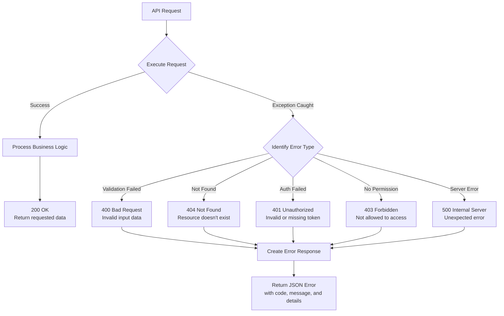

### How Error Handling Protects Your API:

Error handling in REST APIs serves two purposes: helping developers debug issues and protecting your system's security. 

When an error occurs, the API catches it and determines the appropriate response. A validation error (like an invalid email format) gets a 400 status with details about what's wrong. A missing resource returns 404. Authentication failures return 401, but critically, they don't reveal whether the username exists or if the password was wrong - this prevents attackers from harvesting valid usernames.

The error response is always structured JSON, making it easy for clients to parse and handle errors gracefully. A typical error response looks like:
```json
{
  "error": {
    "code": "VALIDATION_ERROR",
    "message": "Invalid input data",
    "details": [
      {
        "field": "email",
        "issue": "Invalid email format"
      }
    ]
  }
}
```

For 500 errors, the API logs detailed information internally but returns only a generic message to the client, preventing exposure of sensitive system details like database structure or file paths.

## 12. REST API Architecture Summary

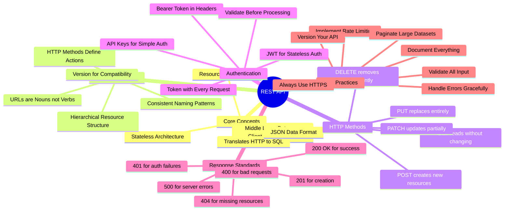

## Key Takeaways for REST API Understanding

Here are the essential concepts that make REST APIs work:

**REST APIs as the Intelligent Middle Layer:** REST APIs act as the intelligent middle layer between clients and databases. They don't just forward requests; they validate, authorize, transform, and orchestrate complex operations. When clicking "Like" on a social media post, the REST API might update multiple database tables, invalidate caches, trigger notifications, and update analytics - all from that single click.

**Stateless but Authenticated:** Every request must include authentication (usually a token in the header), making each request self-contained. This is like showing your ID card every time you enter a building rather than the guard remembering your face. This stateless design enables massive scalability because any server can handle any request.

**Resources and URLs:** REST treats everything as a resource with a unique URL. `/users/123` is user 123, `/users/123/orders` are that user's orders. The HTTP method (GET, POST, PUT, DELETE) tells the API what to do with that resource. This creates a predictable, self-documenting interface.

**JSON as the Universal Language:** While the database speaks SQL and stores data in tables, REST APIs communicate in JSON - a format that every programming language can understand. This standardization means a mobile app, web browser, and IoT device can all talk to the same API.

**E-commerce Purchase Flow:** When buying something online, clicking "Purchase" triggers a cascade of REST API calls: POST to create the order, PUT to update inventory, POST to process payment, and possibly more to send emails or update shipping. Each call is authenticated, validated, and processed independently, but together they complete the purchase.

Remember, REST APIs are essentially web services that follow specific conventions to make them predictable, scalable, and easy to use. They're the reason modern web applications can separate their frontend and backend, support multiple client types, and scale to millions of users.

#java #rest #api #http #diagrams
