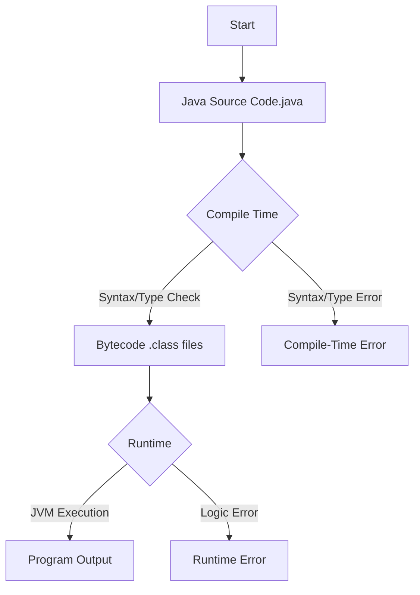

### Code-Centric Explanation

When you write Java code, two main phases happen before you get output: **compile time** and **runtime**. Here’s what each phase means, with practical code examples for clear understanding.

***

### The Compile Time Phase

**What happens?**
Your `.java` source code is transformed into `.class` bytecode files by the Java compiler (`javac`). The compiler checks for syntax errors, type mismatches, and other static issues.

**What can go wrong?**
If your code has syntax errors or type problems, the compiler will report a **compile-time error** and you must fix them before moving to the next step.

**Example: Compile-Time Error**

```java
public class CompileErrorExample {
    public static void main(String[] args) {
        int x;                         // No syntax errors here
        Sytem.out.println("Hello");    // Compile-time error: typo in System
    }
}
```

> **Output:**
> `error: cannot find symbol Sytem.out.println("Hello");`
> This prevents the program from compiling.

***

### Compiling and Generating Bytecode

**How to compile:**

```bash
javac CompileErrorExample.java
```

If there are **no errors**, you get a `.class` file (bytecode).
But in the example above, you get an error and no `.class` file is generated.

***

### The Runtime Phase

**What happens?**
The JVM loads and executes the `.class` bytecode. This is when your program logic actually runs, objects are created, and output (or errors) are produced.

**What can go wrong?**
If your logic is correct but there’s a problem during execution (e.g., division by zero, null pointer), you get a **runtime error**.

**Example: Runtime Error**

```java
public class RuntimeErrorExample {
    public static void main(String[] args) {
        int x = 10;
        int y = 0;
        System.out.println(x / y);   // ArithmeticException at runtime
    }
}
```

> **Output (when run):**
> `Exception in thread "main" java.lang.ArithmeticException: / by zero`
> The code compiles, but crashes when executed.

***

### Running Your Program

**How to run:**

```bash
java RuntimeErrorExample
```

**Possible outcomes:**

- **Correct output**: If all goes well, your code prints what you expect.
- **Runtime error**: If there’s a logical flaw, the program may crash or throw an exception.

***

### Visualizing the Process

Here’s a Mermaid diagram showing the Java compilation and execution flow:


Java Compile Time and Runtime Process Flow

***




***

### Quick Reference Table

| Phase | What Happens? | Error Type | Example Scenario |
| :-- | :-- | :-- | :-- |
| Compile Time | Source code → Bytecode (checks syntax, types) | Compile-time error | Typo in method name, missing semicolon |
| Runtime | Bytecode → Program execution | Runtime error | Division by zero, null pointer |


***

### Key Points

- **Compile time**: Transform code, check syntax and types, generate `.class` files.
- **Runtime**: Execute program logic, create objects, produce output or errors.
- **Fix compile-time errors** so your code can compile.
- **Handle runtime errors** with exception handling.

***

> [!TIP]
> Always recompile your code after making changes, and test thoroughly to catch runtime errors before production.

***

### Related Tags

\#java \#compilation \#runtime \#errorhandling \#bestpractices \#cheatsheet

***

### Additional Example: Polymorphism

**Compile-time (Method Overloading):**
When multiple methods have the same name but different parameters (overloading), the correct method is chosen at **compile time** based on arguments.

```java
class OverloadDemo {
    void add(int a, int b) { System.out.println(a + b); }
    void add(String a, String b) { System.out.println(a + b); }
}
```

**Runtime (Method Overriding):**
When a subclass provides a specific implementation for a method already defined in its superclass (overriding), the method call is resolved at **runtime** based on the object’s actual type.

```java
class Animal { void sound() { System.out.println("Some sound"); } }
class Dog extends Animal {
    @Override
    void sound() { System.out.println("Woof"); } // Runtime: Dog's sound() called
}

Animal myAnimal = new Dog();
myAnimal.sound(); // Outputs "Woof"
```


***

### Summary

- **Compile time**: Code correctness and bytecode generation.
- **Runtime**: Actual program logic, output, and dynamic errors.
- **Use code examples** and diagrams to clarify the process.

***

**Always compile first, run second, and thoroughly test to catch both types of errors before deployment.**

#java #runtime #jvm #memory-management #compile-time
