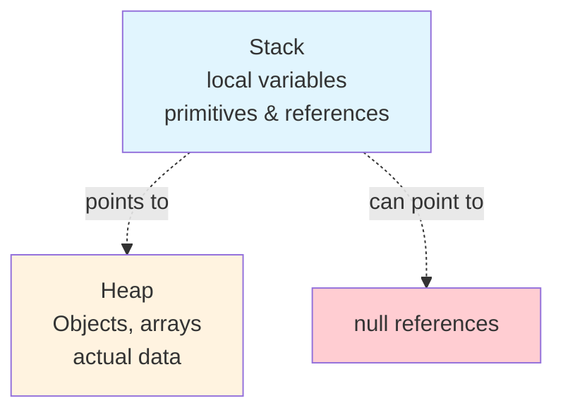
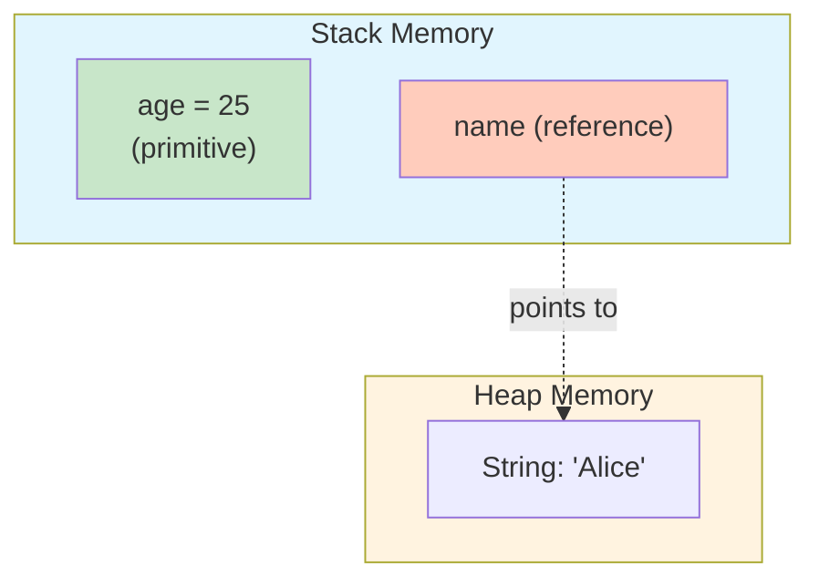
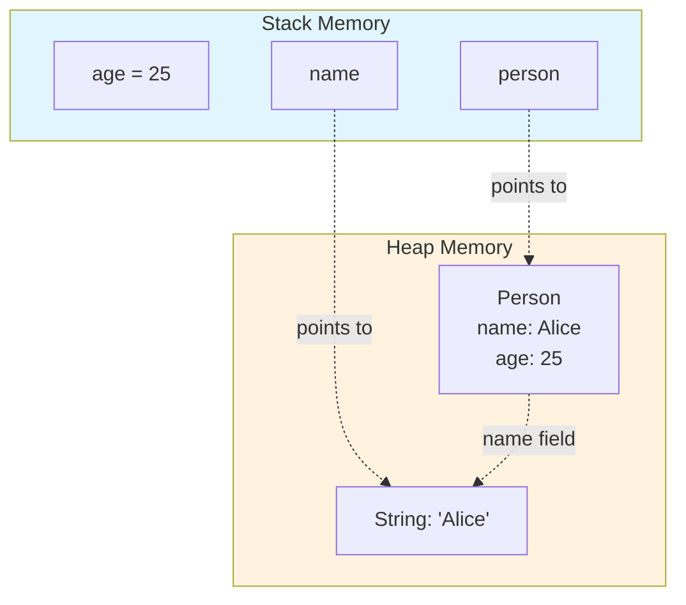
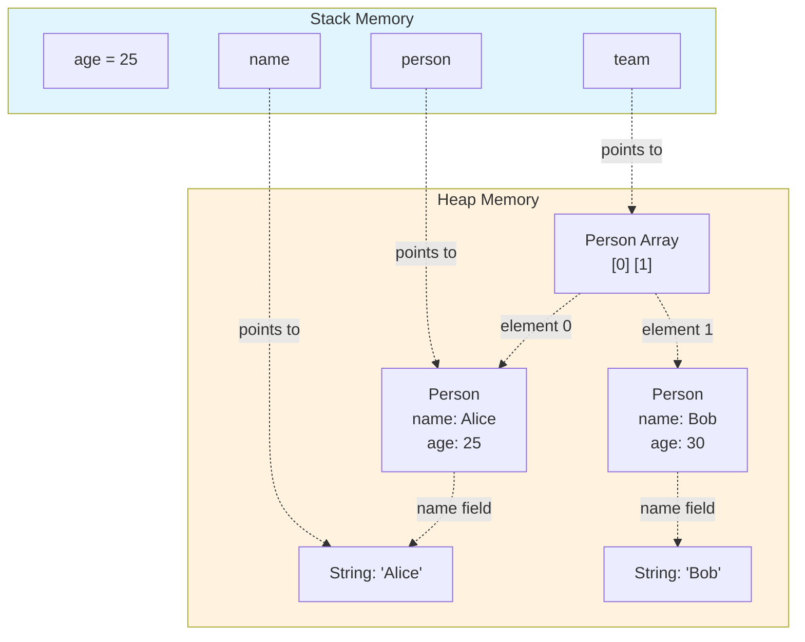
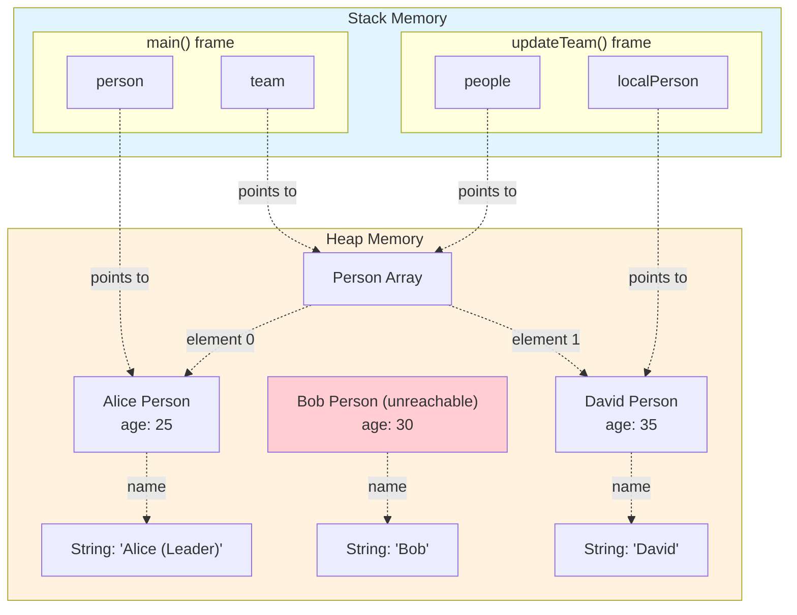
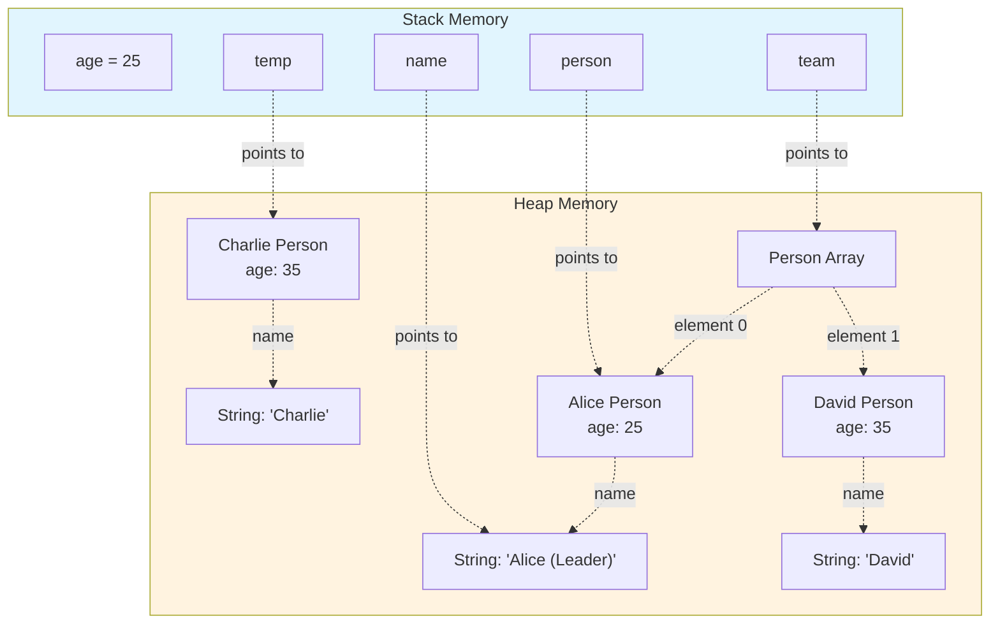
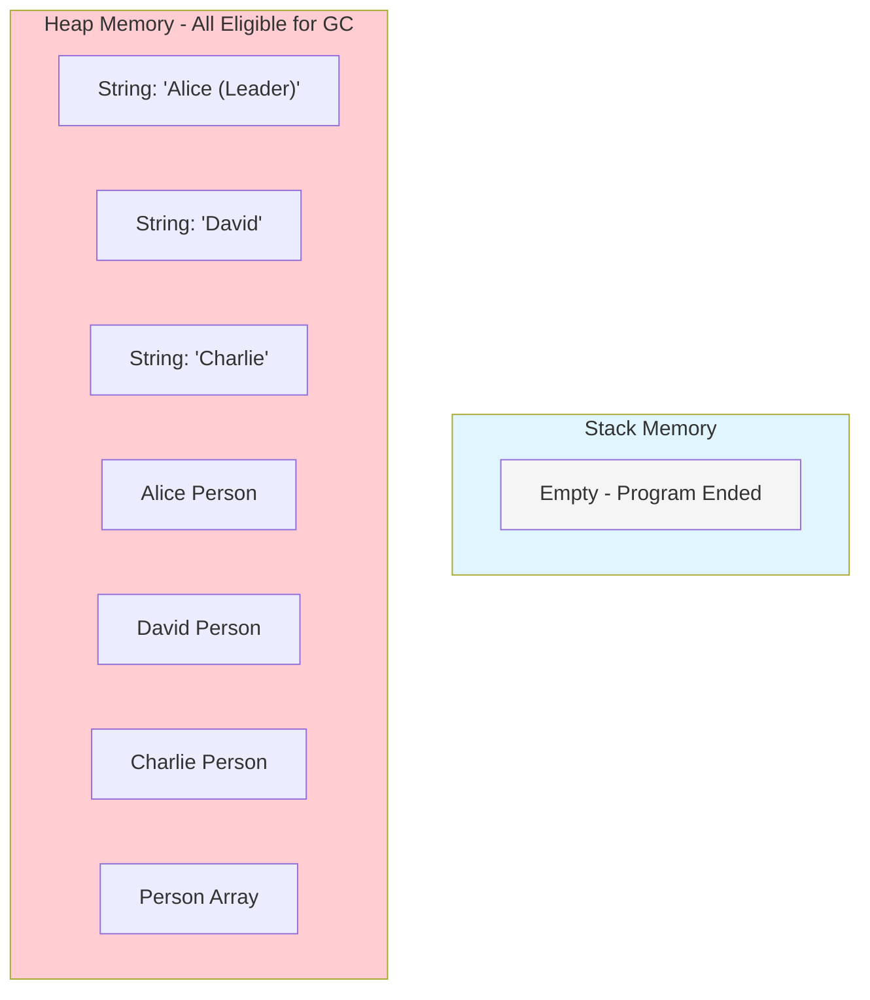
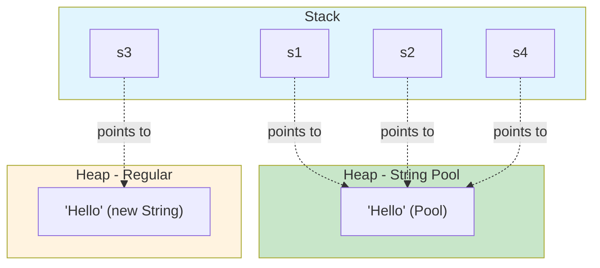

<!-- TOC -->
  * [Quick Reference Table](#quick-reference-table)
  * [Key Concepts](#key-concepts)
    * [Value Types](#value-types)
    * [Reference Types](#reference-types)
  * [Stack vs Heap](#stack-vs-heap)
    * [Example: Stack \& Heap in Action](#example-stack--heap-in-action)
  * [Garbage Collection](#garbage-collection)
  * [Passing \& Modifying](#passing--modifying)
    * [Example: Modifying Array (Reference Type)](#example-modifying-array-reference-type)
  * [Why Two Types?](#why-two-types)
  * [Common Pitfalls](#common-pitfalls)
  * [Related Concepts](#related-concepts)
  * [Practical Advice](#practical-advice)
  * [Further Reading](#further-reading)
  * [Example: Complex Object Graph](#example-complex-object-graph)
  * [Visual: Stack \& Heap](#visual-stack--heap)
  * [Tags for Obsidian](#tags-for-obsidian)
  * [Callout Blocks](#callout-blocks)
  * [Summary Table](#summary-table)
  * [Cheatsheet Bullets](#cheatsheet-bullets)
  * [Java Garbage Collection — Core Concepts](#java-garbage-collection--core-concepts)
    * [What is Garbage Collection?](#what-is-garbage-collection)
    * [How Garbage Collection Works](#how-garbage-collection-works)
    * [When Does Garbage Collection Happen?](#when-does-garbage-collection-happen)
    * [What Triggers GC?](#what-triggers-gc)
    * [Key Points](#key-points)
    * [Practical Example](#practical-example)
    * [Further Reading](#further-reading-1)
  * [Quick Reference Table](#quick-reference-table-1)
  * [Tags for Obsidian](#tags-for-obsidian-1)
  * [Callout Blocks](#callout-blocks-1)
  * [Summary](#summary)
  * [Java Stack & Heap Memory Model — Complete Interactive Example](#java-stack--heap-memory-model--complete-interactive-example)
  * [The Complete Java Code](#the-complete-java-code)
  * [Step-by-Step Memory State Diagrams](#step-by-step-memory-state-diagrams)
    * [**Step 1: Initial Variables in main()**](#step-1-initial-variables-in-main)
    * [**Step 2: After Creating Person Object**](#step-2-after-creating-person-object)
    * [**Step 3: After Creating Team Array**](#step-3-after-creating-team-array)
    * [**Step 4: Inside updateTeam() Method**](#step-4-inside-updateteam-method)
    * [**Step 5: After updateTeam() Returns**](#step-5-after-updateteam-returns)
    * [**Step 6: Program Termination**](#step-6-program-termination)
  * [Key Memory Management Concepts](#key-memory-management-concepts)
    * [**Stack Memory Characteristics**](#stack-memory-characteristics)
    * [**Heap Memory Characteristics**](#heap-memory-characteristics)
  * [Common Memory Pitfalls & Best Practices](#common-memory-pitfalls--best-practices)
  * [Advanced Example: String Pool](#advanced-example-string-pool)
  * [Memory Analysis Tools](#memory-analysis-tools)
  * [Quick Reference Card](#quick-reference-card)
    * [Tags for Obsidian](#tags-for-obsidian-2)
    * [Related Topics](#related-topics)
<!-- TOC -->

## Quick Reference Table

| Concept          | Value Types                                | Reference Types                           |
|:-----------------|:-------------------------------------------|:------------------------------------------|
| **Stored in**    | Stack (directly)                           | Heap (referenced from stack)              |
| **Examples**     | `int`, `double`, `char`, `boolean`, `enum` | Objects, Arrays, Strings                  |
| **Assignment**   | Copies value                               | Copies reference (address)                |
| **Passing**      | Pass-by-value (copy)                       | Pass-by-value (reference copy)            |
| **Modification** | Local to method                            | Visible to caller if object state changes |
| **Null**         | Not applicable                             | Can be `null`                             |

***

## Key Concepts

### Value Types

- **Stored directly in memory**; each variable holds its own copy of the data.
- **Examples**: `int`, `double`, `char`, `boolean`, `enum`.
- **Assignment**: `x = y;` copies the value of `y` into `x`. They are now independent.
- **Method parameters**: Copied by value; changes inside the method are local.


### Reference Types

- **Stored on the heap**; variable holds a reference (address) to the actual data.
- **Examples**: Objects, arrays, `String` (as objects).
- **Assignment**: `x = y;` copies the reference; both `x` and `y` point to the same object.
- **Method parameters**: Reference is copied; changes to the object’s state are visible to the caller.

> [!NOTE]
> Java is **always pass-by-value**, but for references, the value is the address, so the caller and method can both modify the same object.

***

## Stack vs Heap

- **Stack**: Fast, small, stores local variables (value types and references), last-in-first-out (LIFO). Variables go out of scope and are popped when the method exits.
- **Heap**: Larger, slower, stores actual object data referenced by variables. Objects live until garbage collected.

***

### Example: Stack \& Heap in Action

```java
public class Example {
    public static void main(String[] args) {
        int x = 5;         // value type on stack
        String s = "Hello"; // reference (to heap object)
        
        modifyPrimitive(x); // x remains 5
        modifyObject(s);    // s is unchanged, but the object could be modified
    }

    static void modifyPrimitive(int val) {
        val = 10; // local copy only
    }

    static void modifyObject(String str) {
        str = "Modified"; // local reference only
    }
}
```


***

## Garbage Collection

- **Purpose**: Free memory by reclaiming unreachable objects on the heap.
- **Process**:

1. **Identify** objects with no references (“dead” objects).
2. **Free** memory occupied by dead objects.
3. **Compact** heap to reduce fragmentation.
- **Trigger**: Automatic and periodic; not directly controlled by the programmer in Java.

> [!WARNING]
> Java does not require manual memory management, but **memory leaks** can still occur if objects are unintentionally kept referenced.

***

## Passing \& Modifying

- **Value types**: Changes in a method do not affect the original.
- **Reference types**: Changes to the object’s state are visible to all references. However, reassigning the reference inside a method does not affect the caller’s reference.


### Example: Modifying Array (Reference Type)

```java
public static void main(String[] args) {
    int[] arr = {1, 2, 3};
    modifyArray(arr); // arr now holds {4, 2, 3}
}

static void modifyArray(int[] a) {
    a[0] = 4; // modifies the original array
}
```


***

## Why Two Types?

- **Efficiency**: Value types are small and fast to copy (e.g., `int` is 4 bytes). Copying a reference is much faster than copying a large object.
- **Flexibility**: Reference types allow complex, variable-sized objects and shared state.
- **Nullability**: Only reference types can be `null`.

***

## Common Pitfalls

- **Shared state**: Multiple variables referencing the same object can lead to unintended side effects.
- **Null references**: Accessing `null` references causes `NullPointerException`.
- **Immutability**: Some reference types (e.g., `String`) are immutable—their state cannot be changed, only replaced.

***

## Related Concepts

- **Deep vs Shallow Copy**: Reference types require explicit copying if you want an independent duplicate.
- **Immutability**: Prevents unintended changes to shared objects.
- **Final variables**: Can’t be reassigned, but object state can still change.

***

## Practical Advice

- **Favor immutability** where possible to avoid shared state issues.
- **Use value types** for simple, independent data.
- **Be mindful** when passing mutable objects to methods—they can be modified.
- **Understand garbage collection basics** to debug memory leaks.

***

## Further Reading

- **Java Garbage Collection Basics**: For full details on GC algorithms and tuning.
- **Parameter Passing in Java**: Deep dive into why Java is always pass-by-value, even for references.

***

## Example: Complex Object Graph

```java
class Person {
    String name;         // reference to String
    Person nextOfKin;    // reference to Person
    int age;             // value type
    double weight;       // value type
}
```

This shows how objects can form a web of interconnected references and values.

***

## Visual: Stack \& Heap




***

## Tags for Obsidian

\#java/memory \#value-types \#reference-types \#stack \#heap \#garbage-collection \#cheatsheet \#object-model

***

## Callout Blocks

> [!TIP]
> When designing methods, consider whether you want to allow modification of passed objects. Use defensive copies if needed.

> [!WARNING]
> Remember: Java is always pass-by-value—even for references.

> [!INFO]
> For more advanced memory management, explore the `java.lang.ref` package (weak, soft, phantom references).

***

## Summary Table

| Aspect         | Value Types     | Reference Types            |
|:---------------|:----------------|:---------------------------|
| Storage        | Stack           | Heap (via stack reference) |
| Assignment     | Copies value    | Copies reference (address) |
| Pass to Method | Copy of value   | Copy of reference          |
| Modifiable?    | Local to method | Visible to all references  |
| Nullable?      | No              | Yes                        |
| GC Managed?    | No              | Yes                        |

***

## Cheatsheet Bullets

- **Value types**: `int`, `double`, `char`, `boolean`, `enum` — stored in stack, copied by value.
- **Reference types**: Objects, arrays — stored in heap, variable holds reference.
- **Assignment**: For value types, copies data; for reference types, copies address.
- **Passing to methods**: Always by value; for references, the object can be modified.
- **Garbage collection**: Reclaims unreachable heap objects automatically.
- **Null**: Only for reference types (`null` means “no object”).
- **Stack**: Fast, small, local vars, LIFO.
- **Heap**: Large, dynamic, objects/arrays, managed by GC.


## Java Garbage Collection — Core Concepts


***

### What is Garbage Collection?

**Garbage collection (GC)** is Java's automatic process for managing heap memory. Its primary job is to reclaim memory occupied by objects that are no longer reachable by the program, preventing memory leaks and managing heap space efficiently.

***

### How Garbage Collection Works

1. **Identify Dead Objects**
The GC scans the heap to detect objects that are no longer referenced by any active variables or objects in your program.
2. **Free Memory**
The memory occupied by those "dead" objects is released back to the system, making it available for new objects.
3. **Heap Compaction**
Optionally, the GC may move the remaining "live" objects closer together, reducing fragmentation and improving future allocation performance.

***

### When Does Garbage Collection Happen?

- **Automatically**: The Java Virtual Machine (JVM) decides when to run GC, typically when memory is running low, but the exact timing is not under direct programmer control.
- **Periodically**: The process runs in the background, quietly reclaiming unused memory.

> [!WARNING]
> **Memory Leaks** can still occur if objects remain reachable unnecessarily (e.g., via static collections or unclosed resources), so always ensure objects are dereferenced when no longer needed.

***

### What Triggers GC?

- **Reference Loss**: When no variables in the program refer to an object, that object becomes eligible for collection.
- **Scope Exit**: Local reference variables go out of scope when their method ends, potentially making their referenced objects eligible.
- **Reassignment**: Reassigning a reference variable can orphan the object it previously pointed to.

***

### Key Points

- **Heap vs Stack**: Only heap-allocated objects (reference types) are managed by GC. Stack-allocated variables (value types) are automatically cleared when their scope ends.
- **`null` vs. Orphaned**: Setting a reference to `null` makes its previously referenced object a candidate for GC if no other references exist.
- **Implicit**: No manual memory deallocation is needed—Java handles it for you.

***

### Practical Example

```java
public class GarbageCollectionDemo {
    public static void main(String[] args) {
        Object obj1 = new Object(); // Object created on heap
        Object obj2 = new Object(); // Another object
        obj1 = obj2; // obj1's first object is now orphaned
        // More code may run, GC may collect the orphaned object at any time
    }
}
```

Here, after `obj1 = obj2;`, the original object referenced by `obj1` is unreachable and eligible for GC.

***

### Further Reading

- **Oracle's Java Garbage Collection Basics** for detailed algorithms and tuning.
- **Jon Skeet's Java Pass-by-Value** for clarity on references and scope.

***

## Quick Reference Table

| Aspect                | Details                                   |
|:----------------------|:------------------------------------------|
| **What is collected** | Unreachable objects on the heap           |
| **Managed by**        | JVM (automatic)                           |
| **Manual control?**   | No (but `System.gc()` is a hint)          |
| **Key benefit**       | Prevents memory leaks, manages heap       |
| **Pitfalls**          | Memory leaks if objects remain referenced |

***

## Tags for Obsidian

\#java/gc \#memory \#heap \#objects \#cheatsheet

***

> [!NOTE]
> Java garbage collection is a powerful feature but not a substitute for careful resource management—always close files, streams, and database connections explicitly.

***

## Callout Blocks

> [!TIP]
> To help the garbage collector, nullify references you no longer need, especially in long-lived collections or caches.

> [!WARNING]
> Avoid using `finalize()` for critical cleanup—use `try-with-resources` and implement `AutoCloseable` for reliable resource management.

> [!INFO]
> Java offers different GC algorithms (e.g., G1, ZGC) for various workloads; tuning may be needed for high-performance applications.

***

## Summary

Java's garbage collector automatically reclaims memory from unused objects, allowing you to focus on application logic rather than manual memory management. Just remember: the GC isn’t magic—always manage resources and be mindful of object lifecycles for robust, leak-free programs.

\#java/gc \#memory \#cheatsheet

## Java Stack & Heap Memory Model — Complete Interactive Example

This comprehensive example demonstrates how Java manages memory through the stack and heap, showing object creation, method calls, reference passing, and garbage collection eligibility.

---

## The Complete Java Code

```java
public class MemoryModelDemo {
    public static void main(String[] args) {
        // Step 1: Create primitive and object variables
        int age = 25;
        String name = "Alice";
        
        // Step 2: Create a Person object
        Person person = new Person(name, age);
        
        // Step 3: Create an array of Person objects
        Person[] team = new Person[2];
        team[0] = person;
        team[1] = new Person("Bob", 30);
        
        // Step 4: Call a method that modifies objects
        updateTeam(team, age);
        
        // Step 5: Create a local object
        Person temp = new Person("Charlie", 35);
        
        // Step 6: Method ends, local variables go out of scope
        System.out.println("Team leader: " + team[0].getName());
    }
    
    static void updateTeam(Person[] people, int baseAge) {
        // Step 4a: Method parameters created
        int newAge = baseAge + 10;
        
        // Step 4b: Modify the first person's name
        people[0].setName("Alice (Leader)");
        
        // Step 4c: Create a new local Person
        Person localPerson = new Person("David", newAge);
        
        // Step 4d: Replace second array element
        people[1] = localPerson;
        
        // Step 4e: Method ends, local variables cleared
    }
}

class Person {
    private String name;
    private int age;
    
    public Person(String name, int age) {
        this.name = name;
        this.age = age;
    }
    
    public void setName(String name) {
        this.name = name;
    }
    
    public String getName() {
        return name;
    }
}
```

---

## Step-by-Step Memory State Diagrams

### **Step 1: Initial Variables in main()**

After declaring `age` and `name`:



> [!NOTE] Primitives (`age`) store actual values on the stack, while object references (`name`) point to heap objects.

---

### **Step 2: After Creating Person Object**



---

### **Step 3: After Creating Team Array**



---

### **Step 4: Inside updateTeam() Method**



> [!WARNING] The original "Bob" Person object is now unreachable and eligible for garbage collection!

---

### **Step 5: After updateTeam() Returns**



---

### **Step 6: Program Termination**



> [!INFO] When main() ends, all stack references are removed. All heap objects become unreachable and eligible for garbage collection.

---

## Key Memory Management Concepts

### **Stack Memory Characteristics**

| Aspect            | Description                                          |
|-------------------|------------------------------------------------------|
| **Storage**       | Method parameters, local variables, return addresses |
| **Access Speed**  | Very fast (LIFO structure)                           |
| **Size**          | Limited (typically 1MB default)                      |
| **Management**    | Automatic - cleared when method exits                |
| **Thread Safety** | Each thread has its own stack                        |

### **Heap Memory Characteristics**

| Aspect            | Description                          |
|-------------------|--------------------------------------|
| **Storage**       | All objects and arrays               |
| **Access Speed**  | Slower than stack                    |
| **Size**          | Much larger (configurable with -Xmx) |
| **Management**    | Garbage collector handles cleanup    |
| **Thread Safety** | Shared across all threads            |

---

## Common Memory Pitfalls & Best Practices

> [!TIP] Best Practices
> 
> - **Minimize object creation in loops** - reuse objects when possible
> - **Use primitives over wrapper classes** when you don't need null values
> - **Clear references to large objects** when done: `largeObject = null;`
> - **Use try-with-resources** for automatic resource management

> [!WARNING] Common Issues
> 
> - **Memory leaks**: Holding references to objects no longer needed
> - **Stack overflow**: Deep recursion without base case
> - **OutOfMemoryError**: Creating too many objects or very large arrays

---

## Advanced Example: String Pool

```java
public class StringPoolDemo {
    public static void main(String[] args) {
        String s1 = "Hello";           // String pool
        String s2 = "Hello";           // Same reference as s1
        String s3 = new String("Hello"); // New object in heap
        String s4 = s3.intern();       // Returns pool reference
        
        System.out.println(s1 == s2);  // true - same reference
        System.out.println(s1 == s3);  // false - different objects
        System.out.println(s1 == s4);  // true - intern() returns pool ref
    }
}
```



---

## Memory Analysis Tools

> [!INFO] JVM Memory Analysis Commands
> 
> ```bash
> # Monitor heap usage
> jstat -gc <pid> 1000
> 
> # Generate heap dump
> jmap -dump:format=b,file=heap.bin <pid>
> 
> # Analyze heap dump
> jhat heap.bin
> 
> # Set heap size
> java -Xms512m -Xmx2g MyApp
> 
> # Enable GC logging
> java -XX:+PrintGCDetails -XX:+PrintGCDateStamps MyApp
> ```

---

## Quick Reference Card


```java
// Stack allocation
int x = 10;              // Primitive on stack
Integer y = 10;          // Reference on stack, object on heap

// Heap allocation
Object obj = new Object();     // new always creates heap object
int[] arr = new int[10];       // Arrays always on heap
String str = new String("Hi"); // Explicit heap allocation

// String pool (special heap area)
String s1 = "Hello";     // String pool
String s2 = "Hello";     // Same reference as s1

// Method calls
method(x);    // Copies value to stack
method(obj);  // Copies reference to stack
```

---

> [!EXAMPLE] Real-World Scenario **Web Application Memory**: Each HTTP request creates a new thread with its own stack. Request parameters and local processing variables use stack memory. Session objects, cached data, and database connections use heap memory shared across threads.

---

### Tags for Obsidian

#java/memory #java/stack #java/heap #java/gc #java/performance #java/fundamentals #mermaid #visualization

### Related Topics

[[Java Garbage Collection]] | [[Java Memory Leaks]] | [[JVM Tuning]] | [[Thread Memory Model]]


