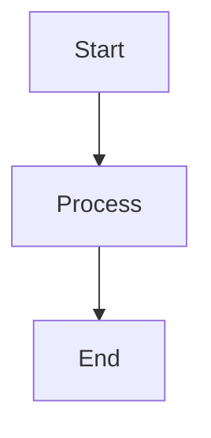

# Markdown Formatting Standards for Educational Java Content

This document establishes the definitive formatting standards for educational Java Q&A markdown files designed for optimal Obsidian compatibility. These standards ensure consistency, readability, and proper rendering across all files.

***

## File Structure Requirements

### YAML Front Matter (Required)

Every file **MUST** begin with properly formatted YAML front matter:

```yaml
---
tags: [java, specific-topics, relevant-keywords, cheatsheet]
date: YYYY-MM-DD
topic: Descriptive Title for the Content
---
```

**Critical Requirements:**
- Use `---` delimiters (never `***` or other characters)
- Include all three fields: `tags`, `date`, `topic`
- Tags must be in array format with relevant Java concepts
- Date in ISO format (YYYY-MM-DD)
- Topic should be a clear, descriptive title

### Content Organization

**Standard Structure:**
1. **Title Header** - Single `#` with descriptive title
2. **Question List** - Numbered list of all questions covered
3. **Content Sections** - Organized with `##` and `###` headers
4. **Section Separators** - Use `***` between major sections

**Example Structure:**
```markdown
# Topic Title

1. Question 1?
2. Question 2?
3. Question 3?

***

## Main Section

### Subsection

Content here...

***
```

***

## Markdown Formatting Standards

### Strict HTML Prohibition

**NEVER use HTML elements** in markdown files. All content must use pure Markdown/Obsidian syntax.

**Prohibited:**
- `<span>`, `<div>`, `<br>`, `<p>` tags
- `<style>` attributes
- HTML comments (`<!-- -->`)

**Use instead:**
- Markdown formatting (`**bold**`, `*italic*`)
- Obsidian callouts for special formatting
- Proper markdown syntax for all content

### Code Block Standards

**Requirements:**
- Always specify language for syntax highlighting: ` ```java `
- Never include `> ` prefixes inside code blocks
- Ensure proper indentation and formatting
- Use realistic, compilable examples

**Correct Format:**
```java
public class Example {
    public void method() {
        System.out.println("Hello World");
    }
}
```

**Array Syntax:** Always use `arr[0]`, never `arr[^0]` or similar incorrect syntax.

### Table Formatting

**Required Format:**
- Include header row
- Use proper alignment markers (`:--`, `:--:`, `--:`)
- Ensure consistent spacing

```markdown
| Concept | Description | Example |
|:--------|:------------|:--------|
| Value   | Details     | Code    |
```

### Obsidian Callouts

**Standard Callout Types:**
- `> [!TIP]` - Best practices and helpful hints
- `> [!WARNING]` - Important cautions and common pitfalls
- `> [!NOTE]` - Additional information and clarifications
- `> [!INFO]` - General information and context
- `> [!EXAMPLE]` - Code examples and use cases

**Format:**
```markdown
> [!TIP]
> Always use meaningful variable names for better code readability.
```

***

## Content Quality Standards

### Educational Value
- Provide comprehensive explanations for each concept
- Include practical examples and use cases
- Cover both basics and advanced aspects
- Address common misconceptions and pitfalls

### Technical Accuracy
- Ensure all code examples compile and run correctly
- Use current Java syntax and best practices
- Verify all technical information is accurate
- Include relevant performance considerations

### Consistency
- Maintain consistent terminology throughout
- Use standard Java naming conventions
- Apply uniform formatting across all sections
- Ensure consistent question numbering and organization

***

## Obsidian Compatibility Requirements

### Internal Linking
- Use `[[Link Text]]` format for internal references
- Ensure linked files exist or are clearly identified as future content
- Use descriptive link text

### Mermaid Diagrams
- Use proper mermaid syntax for diagrams
- Test diagram rendering in Obsidian
- Include meaningful styling and labels



### Tags
- Use `\#tag` format at the end of files (optional)
- Maintain tag hierarchy consistency
- Use relevant, searchable keywords

***

## Common Issues and Solutions

### YAML Front Matter Issues
**Problem:** Using `***` instead of `---`
**Solution:** Always use triple dashes for YAML delimiters

**Problem:** Missing required fields
**Solution:** Include tags, date, and topic in all files

### Code Block Issues
**Problem:** Code blocks with `> ` prefixes
**Solution:** Remove all `> ` characters from code content

**Problem:** Missing language specification
**Solution:** Always specify `java` for code blocks

### HTML Element Issues
**Problem:** HTML elements not rendering in Obsidian
**Solution:** Convert all HTML to equivalent Markdown syntax

### Syntax Errors
**Problem:** Incorrect array syntax like `arr[^0]`
**Solution:** Use standard array notation `arr[0]`

***

## File Maintenance Checklist

Before finalizing any educational Java markdown file:

- [ ] YAML front matter uses `---` delimiters
- [ ] All required YAML fields present and accurate
- [ ] No HTML elements present
- [ ] All code blocks have proper syntax highlighting
- [ ] Array syntax uses `[0]` format, not `[^0]`
- [ ] Obsidian callouts use proper syntax
- [ ] Tables have proper alignment and headers
- [ ] Section separators use `***`
- [ ] Internal links use `[[]]` format
- [ ] Mermaid diagrams render correctly
- [ ] All technical information is accurate
- [ ] Content is educationally comprehensive

***

## Best Practices

### Content Organization
- Start with simpler concepts and build complexity
- Group related questions together
- Provide clear section headings
- Use consistent formatting throughout

### Code Examples
- Use realistic, practical examples
- Include comments for complex code
- Show both correct and incorrect usage where helpful
- Test all code examples for accuracy

### Documentation Style
- Write clear, concise explanations
- Avoid jargon without explanation
- Include context for advanced topics
- Maintain consistent voice and style

***

## Enforcement

These standards are **mandatory** for all educational Java markdown files. Any file not meeting these requirements should be updated to comply before being considered complete. This ensures a professional, consistent, and Obsidian-compatible documentation set that serves as an effective learning resource.

***

**Document Version:** 1.0  
**Last Updated:** 2025-08-29  
**Purpose:** Guide Claude instances in maintaining consistent, high-quality educational Java markdown content

#java #misc #notes
