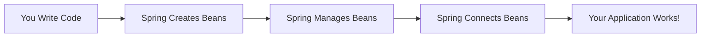
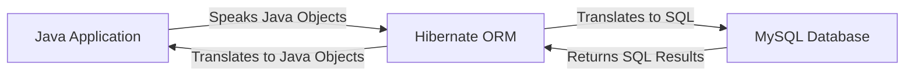
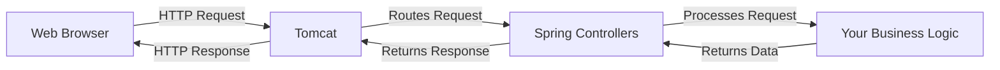
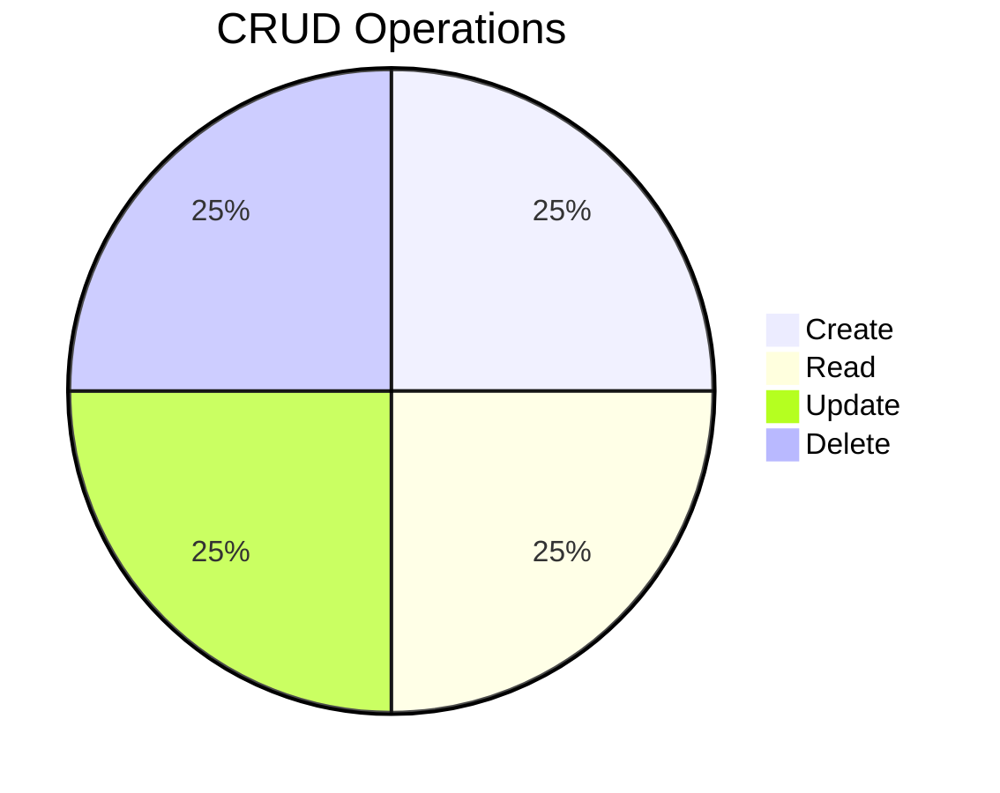
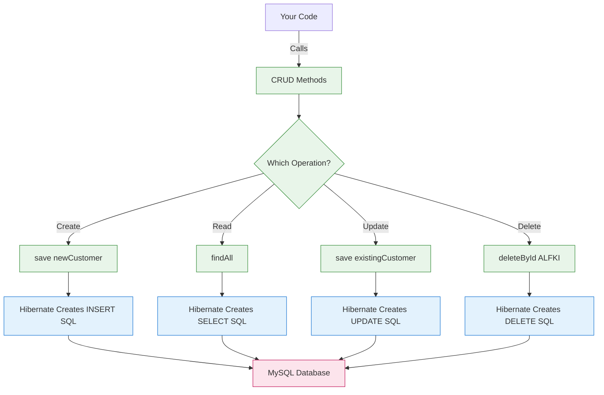
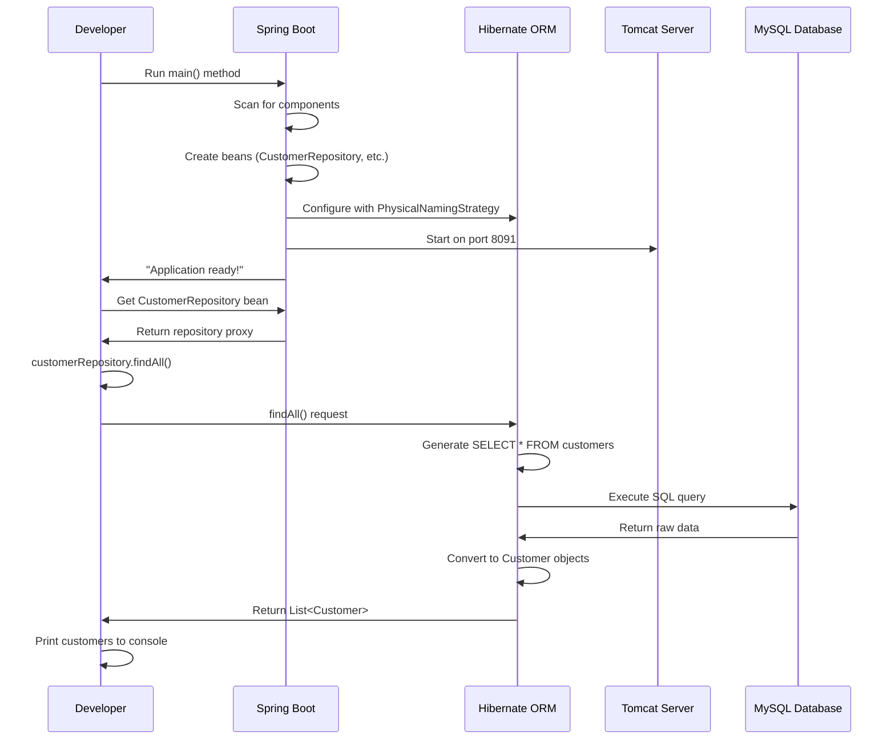
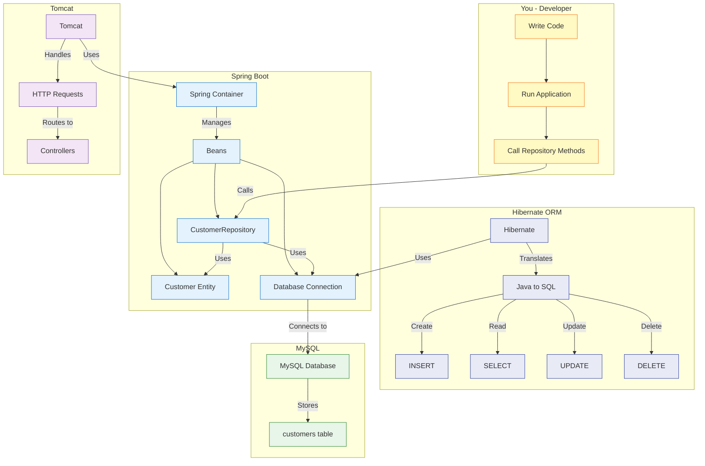

# Spring Boot Northwind Application - Ultra Beginner's Visual Guide

## Understanding the Absolute Basics: What Is Spring Boot?

Imagine you're building a house. Normally, you'd need to:
- Cut down trees for wood
- Make bricks from clay
- Create nails from metal
- Build everything from scratch

**Spring Boot is like a construction company that brings you pre-made materials**:
- Ready-to-use bricks (database connections)
- Pre-cut wood (web server)
- Already-made nails (security features)
- A team that assembles everything for you

This lets you focus on **what makes your house unique** (your business logic) instead of building everything from scratch.

> [!TIP] For Complete Beginners
> Spring Boot is a framework that helps you build Java applications **faster** by providing ready-made components for common tasks like connecting to databases and creating web services.

## What Are Beans? (The Simplest Explanation)

### Beans = Spring's Building Blocks



### Real-Life Bean Analogy

Imagine you're making a sandwich:

1. **Ingredients (Your Classes)**:
   - Bread class
   - Cheese class
   - Ham class

2. **Spring as Your Sandwich Maker**:
   - Spring creates the bread, cheese, and ham objects (beans)
   - Spring knows how to assemble them in the right order
   - You just say "I want a sandwich" and Spring makes it

### How Beans Work in Your Code

```java
// You define what a Customer is
public class Customer {
    private String customerID;
    // other fields...
}

// You define what a CustomerRepository does
public interface CustomerRepository extends JpaRepository<Customer, String> {
    // No implementation needed!
}
```

**Spring does this behind the scenes**:
1. Creates a `Customer` object when needed (a bean)
2. Creates a `CustomerRepository` implementation (a bean)
3. Knows that `CustomerRepository` needs database connection (another bean)
4. Automatically connects everything together

> [!NOTE] Key Insight for Beginners
> A "bean" is just a fancy name for **an object that Spring manages for you**. You don't create these objects with `new` - Spring creates and manages them.

## What is Hibernate ORM? (The Translator Between Java and Database)

### The Language Barrier Problem



### Real-Life Translator Analogy

Imagine you speak **only English** and your database speaks **only SQL**:

- You say: "Find me all customers from London"
- Hibernate translates this to: `SELECT * FROM customers WHERE city = 'London'`
- Database returns raw SQL results
- Hibernate translates results back to Java Customer objects
- You get to work with familiar Java objects, not database rows

### How Hibernate Works in Your Project

```mermaid
flowchart LR
    A[Customer.java] -->|@Entity| B[Hibernate]
    B -->|Creates| C[SQL Query]
    C -->|Executes| D[MySQL Database]
    D -->|Returns| E[Raw Data]
    E -->|Maps to| F[Customer Objects]
    
    classDef code fill:#e8f5e9,stroke:#388e3c;
    class A,F code;
    
    classDef orm fill:#e3f2fd,stroke:#1976d2;
    class B,C orm;
    
    classDef db fill:#fce4ec,stroke:#c2185b;
    class D,E db;
```

### Your Customer Entity Explained Simply

```java
@Entity
@Table(name = "customers", schema = "northwind")
public class Customer {
    @Id
    @Column(name = "CustomerID")
    private String customerID;
    
    @Column(name = "CompanyName")
    private String companyName;
}
```

This tells Hibernate:
- "This Java class represents a database table called 'customers'"
- "The `customerID` field maps to the 'CustomerID' column"
- "The `companyName` field maps to the 'CompanyName' column"

No need to write SQL! Hibernate does it for you.

> [!TIP] Why ORM is Magical
> Without Hibernate, you'd have to write this code for every database query:
> ```java
> ResultSet rs = statement.executeQuery("SELECT * FROM customers");
> while (rs.next()) {
>     String id = rs.getString("CustomerID");
>     String name = rs.getString("CompanyName");
>     // Create Customer object manually...
> }
> ```
> With Hibernate, you just call `customerRepository.findAll()` and get Java objects!

## What is Tomcat? (Your Application's Front Desk)

### Tomcat = Web Server Receptionist



### Real-Life Front Desk Analogy

Imagine Tomcat is the **receptionist at a hotel**:

1. A guest (web browser) arrives and says "I want room 205"
2. The receptionist (Tomcat) checks who handles room 205
3. The receptionist directs the request to the right department
4. The department gets the room ready
5. The receptionist gives the room key back to the guest

In your Spring Boot app:
- When you go to `http://localhost:8091/api/customers`
- Tomcat receives the request
- Tomcat finds your CustomerController
- Your controller gets the data from the repository
- Tomcat sends the response back to your browser

> [!NOTE] Why You Need Tomcat
> Without Tomcat (or another web server), your application would be like a store with no front door - nobody could access it over the internet!

## CRUD Operations: The Four Basic Actions

CRUD stands for **Create, Read, Update, Delete** - the four fundamental operations for working with data.

### CRUD Visualized



### Real-Life Restaurant Analogy

Imagine a restaurant menu system:

| CRUD Action | Restaurant Example            | Spring Data JPA Method      | What It Does                 |
|-------------|-------------------------------|-----------------------------|------------------------------|
| **C**reate  | Adding a new dish to the menu | `save()`                    | Adds new data to database    |
| **R**ead    | Viewing the menu              | `findAll()`, `findById()`   | Retrieves data from database |
| **U**pdate  | Changing a dish's price       | `save()` (with existing ID) | Modifies existing data       |
| **D**elete  | Removing a dish from the menu | `delete()`, `deleteById()`  | Removes data from database   |

### How CRUD Works in Your Northwind App



### Practical CRUD Examples in Your Code

```java
// CREATE: Add a new customer
Customer newCustomer = new Customer();
newCustomer.setCustomerID("VALON");
newCustomer.setCompanyName("IT Company");
customerRepository.save(newCustomer);  // Hibernate generates INSERT SQL

// READ: Get all customers
List<Customer> allCustomers = customerRepository.findAll();  // Hibernate generates SELECT SQL

// READ: Get one customer
Optional<Customer> alfkCustomer = customerRepository.findById("ALFKI");

// UPDATE: Change a customer's company name
alfkCustomer.ifPresent(customer -> {
    customer.setCompanyName("New Company Name");
    customerRepository.save(customer);  // Hibernate generates UPDATE SQL
});

// DELETE: Remove a customer
customerRepository.deleteById("VALON");  // Hibernate generates DELETE SQL
```

> [!TIP] The Magic of Spring Data JPA
> Notice that you **never write SQL** for these operations! Spring Data JPA generates the correct SQL based on:
> - Your entity mappings (`@Column` annotations)
> - The method names (`findAll()`, `save()`, etc.)
> - The ID type (`String` in your Customer entity)

## Your Complete Northwind Application Flow

### Step-by-Step Visual Guide



### What Happens When You Call customerRepository.findAll()

1. **You make the request**
   ```java
   List<Customer> customers = customerRepository.findAll();
   ```

2. **Spring Data JPA processes it**
   - Looks at your repository interface
   - Sees it extends `JpaRepository`
   - Knows `findAll()` should return all entities

3. **Hibernate creates the SQL**
   - Uses your entity mappings to know which table/columns
   - Generates: `SELECT * FROM customers`
   - Preserves exact column names thanks to naming strategy

4. **Database executes the query**
   - MySQL processes the SQL
   - Returns raw result set

5. **Hibernate converts results**
   - Maps each row to a `Customer` object
   - Sets properties based on column values
   - Returns list of Java objects

6. **You get Java objects**
   - Work with familiar Java objects
   - No SQL knowledge required

> [!WARNING] Critical Detail for Beginners
> The `PhysicalNamingStrategyStandardImpl` setting is crucial because:
> - Your database uses `CustomerID` (with capital letters)
> - Java typically uses `customerId` (camelCase)
> - Without this setting, Hibernate would look for `customer_id` (snake_case)
> - This would cause errors because the columns don't match

## The Complete Picture: All Components Working Together

### Your Northwind Application Architecture



### How Everything Connects in Your Project

1. **You write minimal code**
   - Define entities with annotations
   - Create repository interfaces
   - No SQL or implementation code needed

2. **Spring Boot sets up the foundation**
   - Creates and manages all components (beans)
   - Configures database connection
   - Starts Tomcat web server

3. **Hibernate handles database translation**
   - Converts Java objects to SQL queries
   - Maps results back to Java objects
   - Preserves exact column names with naming strategy

4. **Tomcat serves HTTP requests**
   - Listens on port 8091
   - Routes requests to your controllers
   - Sends responses back to clients

5. **MySQL stores your data**
   - Contains the Northwind database
   - Holds all customer information
   - Processes SQL queries from Hibernate

> [!TIP] For Visual Learners
> When you call `customerRepository.findAll()`:
> 1. Your code makes the request
> 2. Spring Data JPA interprets the method name
> 3. Hibernate generates `SELECT * FROM customers`
> 4. MySQL executes the query and returns results
> 5. Hibernate converts results to Customer objects
> 6. You get a list of Java objects to work with
>
> **You never see the SQL, but it's happening behind the scenes!**

## Summary Cheat Sheet for Absolute Beginners

### The Big Picture in Simple Terms

| Concept             | What It Is              | What It Does                 | Your Northwind Example                           |
|---------------------|-------------------------|------------------------------|--------------------------------------------------|
| **Spring Boot**     | Construction company    | Builds your app foundation   | Creates everything needed to run your app        |
| **Beans**           | Managed objects         | Building blocks of your app  | `CustomerRepository`, `Customer` objects         |
| **Hibernate ORM**   | Translator              | Converts Java ↔ SQL          | Turns `findAll()` into `SELECT * FROM customers` |
| **Tomcat**          | Web server receptionist | Handles HTTP requests        | Listens on port 8091 for web requests            |
| **CRUD**            | Basic data operations   | Create, Read, Update, Delete | `save()`, `findAll()`, `save()`, `delete()`      |
| **Naming Strategy** | Column name handler     | Preserves exact column names | Makes `CustomerID` work instead of `customer_id` |

### What You Need to Remember

1. **You don't write SQL** - Spring Data JPA and Hibernate do it for you
2. **You don't create implementations** - Spring generates them at runtime
3. **You work with Java objects** - Not database rows or SQL results
4. **CRUD operations are built-in** - Just extend `JpaRepository`
5. **Naming strategy is critical** - For databases like Northwind with PascalCase columns

> [!NOTE] Final Beginner Insight
> The power of Spring Boot is that **you focus on what makes your application unique** (your business logic), while Spring handles all the repetitive infrastructure code. You define *what* you want to do (get all customers), and Spring figures out *how* to do it (generate SQL, connect to database, map results).

#java #spring-boot #architecture
