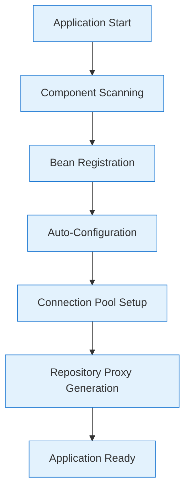
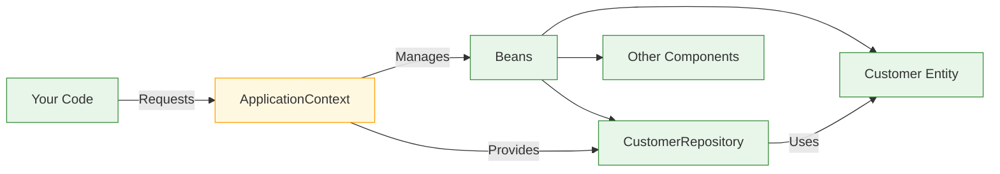
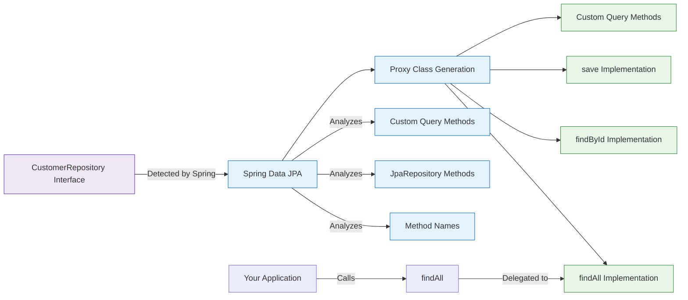
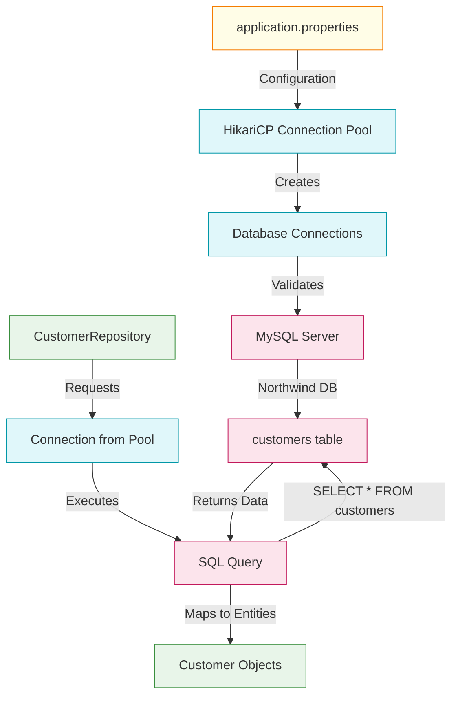
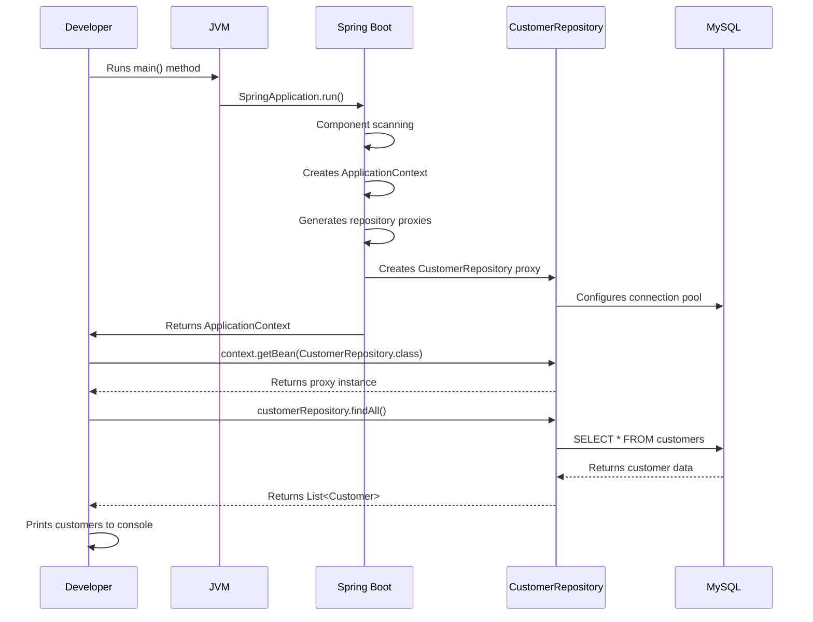
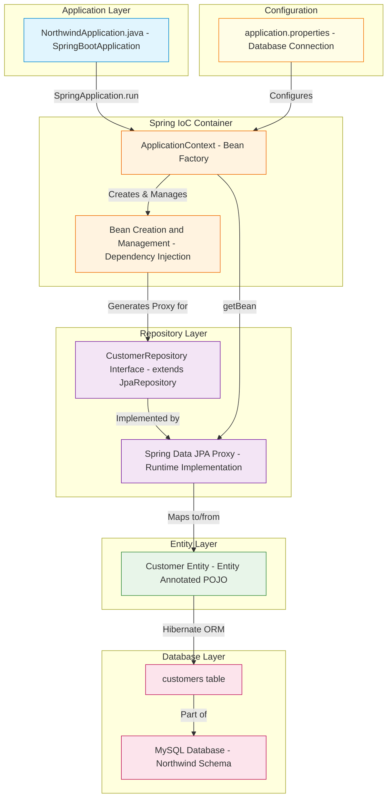

# Spring Boot Northwind Application - Visual Architecture Guide

## Application Startup Lifecycle

This diagram shows the complete sequence of events when your Spring Boot application starts.

### Startup Sequence Flow



### What Happens at Each Stage

#### Application Start
- Your `main()` method executes:
  ```java
  SpringApplication.run(NorthwindApplication.class, args);
  ```
- Spring Boot initializes the application context

#### Component Scanning
- Spring scans for components with annotations:
  - `@Component`, `@Service`, `@Repository`, `@Controller`
  - `@Entity` classes in your package structure
  - Your `CustomerRepository` interface is detected

#### Bean Registration
- Spring registers all discovered components as "beans"
- The `Customer` entity is registered as a managed entity
- Configuration properties are loaded into the context

#### Auto-Configuration
- Spring Boot configures:
  - Database connection using `application.properties`
  - Hibernate ORM settings
  - Transaction management
  - The `PhysicalNamingStrategyStandardImpl` is applied

#### Connection Pool Setup
- HikariCP connection pool is initialized
- Database credentials are validated
- Connection to MySQL `northwind` database is established

#### Repository Proxy Generation
- Spring Data JPA creates runtime implementations:
  - For `CustomerRepository` interface
  - With all standard CRUD methods
  - Proxy class is registered as a bean

#### Application Ready
- Tomcat server starts on port 8091
- Application is ready to serve requests
- Console output shows all retrieved customers

> [!NOTE] Key Insight  
> Spring Boot doesn't require you to write the implementation for `CustomerRepository` - it creates it at runtime based on the interface definition and your entity structure.

---

## Dependency Injection Flow

This diagram shows how objects connect through Spring's dependency injection system.

### Dependency Injection Process



### How Dependency Injection Works

#### Bean Creation
- Spring creates and manages all beans in the ApplicationContext
- This includes your entities, repositories, and services

#### Bean Request
- Your code requests a bean:
  ```java
  CustomerRepository customerRepository = context.getBean(CustomerRepository.class);
  ```

#### Bean Provision
- Spring provides the proxy implementation it created
- You get a working repository without writing implementation code

#### Relationship Mapping
- The repository knows how to interact with the Customer entity
- Entity fields map to database columns through JPA annotations

> [!TIP] Understanding the Magic  
> When you see `CustomerRepository customerRepository = context.getBean(CustomerRepository.class);`, you're not getting an interface - you're getting a runtime-generated implementation class that Spring created for you.

---

## Repository Proxy Generation Process

This diagram shows how Spring Data JPA creates repository implementations at runtime.

### Repository Implementation Flow



### How Repository Proxy Generation Works

#### Interface Detection
- Spring finds your repository interface:
  ```java
  public interface CustomerRepository extends JpaRepository<Customer, String> {
      // Empty interface
  }
  ```

#### Method Analysis
- Spring analyzes:
  - Methods inherited from `JpaRepository`
  - Custom query methods you might add
  - Method naming conventions for query derivation

#### Proxy Class Generation
- At runtime, Spring creates a concrete implementation
- This class implements all necessary methods
- No Java code is written to disk - it's in memory only

#### Method Implementation
- Standard methods (`findAll()`, `findById()`, `save()`) get implementations
- Query methods are generated based on method names
- SQL is created dynamically based on entity mapping

> [!WARNING] Critical Detail  
> The second type parameter in `JpaRepository<Customer, String>` must match the type of your `@Id` field. In your `Customer` entity, `customerID` is a `String`, so the repository must use `String` as the ID type.

---

## Database Connection Lifecycle

This diagram shows how database connections are established and managed.

### Connection Management Flow



### How Database Connections Work

#### 1. **Configuration**
   - Settings from `application.properties`:
     ```properties
     spring.datasource.url=jdbc:mysql://localhost:3306/northwind
     spring.datasource.username=root
     spring.datasource.password=root
     ```

#### 2. **Connection Pool Initialization**
   - HikariCP creates a pool of database connections
   - Connections are validated before being used
   - Pool size is managed automatically

#### 3. **Naming Strategy Configuration**
   - The critical setting:
     ```properties
     spring.jpa.hibernate.naming.physical-strategy=org.hibernate.boot.model.naming.PhysicalNamingStrategyStandardImpl
     ```  
   - This preserves exact column names (critical for Northwind's PascalCase columns)

#### 4. **Query Execution**
   - When you call `customerRepository.findAll()`
   - Spring gets a connection from the pool
   - Hibernate generates SQL: `SELECT * FROM customers`
   - Results are mapped to `Customer` objects

> [!TIP] Why Naming Strategy Matters  
> Without the correct naming strategy, Hibernate would look for `customer_id` instead of `CustomerID`, causing errors. Your Northwind database uses PascalCase column names, which don't match Java's camelCase conventions.

---

## Entity Mapping Process

This diagram shows how your Java entities map to database tables.

### Entity-Database Mapping

```mermaid
flowchart LR
    A[Customer.java] -->|@Entity| B[Entity Metadata]
    A -->|@Id| C[Primary Key]
    A -->|@Column| D[Column Mapping]
    A -->|@Size| E[Validation]
    
    B --> F[JPA Metamodel]
    C --> F
    D --> F
    E --> F
    
    F --> G[Hibernate ORM]
    G --> H[SQL Generation]
    H --> I[MySQL Database]
    
    I -->|northwind.customers| J[CustomerID]
    I -->|northwind.customers| K[CompanyName]
    I -->|northwind.customers| L[ContactName]
    
    classDef entity fill:#ede7f6,stroke:#673ab7;
    class A,B,C,D,E,F entity;
    
    classDef orm fill:#e3f2fd,stroke:#1976d2;
    class G,H orm;
    
    classDef db fill:#fce4ec,stroke:#c2185b;
    class I,J,K,L db;
```

### Key Mapping Concepts

| Java Annotation | Database Mapping | Purpose |
|-----------------|------------------|---------|
| `@Entity` | Table | Marks class as persistent |
| `@Table(name="...")` | Custom table name | Overrides default table name |
| `@Id` | Primary Key | Identifies unique record |
| `@Column(name="...")` | Column name | Maps field to specific column |
| `@Size(max=...)` | Validation | Enforces data constraints |

### How Entity Mapping Works

#### Entity Definition
```java
@Entity
@Table(name = "customers", schema = "northwind")
public class Customer {
    @Id
    @Column(name = "CustomerID", nullable = false)
    private String customerID;

    // Other fields...
}
```

#### Metadata Collection
- Spring processes all JPA annotations
- Builds a complete metadata model of your entity
- Understands relationships, constraints, and mappings

#### ORM Translation
- Hibernate converts entity operations to SQL
- `customerRepository.findAll()` becomes `SELECT * FROM customers`
- Object properties map to database columns

#### Validation Enforcement
- Annotations like `@Size(max = 5)` are enforced
- Prevents invalid data from being saved to the database
- Works with Spring's validation system

> [!NOTE] Key Insight  
> The `@Column(name = "CustomerID")` annotation is critical - it tells Hibernate to use the exact column name from your database rather than converting to snake_case.

---

## Request Processing Flow

This diagram shows how a simple request flows through your application.

### Request Processing Sequence



### What Happens During Request Processing

#### Application Initialization
- Spring Boot sets up the entire application context
- Database connection is established
- Repository implementations are generated

#### Bean Retrieval
- You request the repository from the context
- Spring provides the runtime-generated implementation

#### Data Retrieval
- When calling `findAll()`, Spring:
  - Gets a connection from the pool
  - Generates and executes the SQL query
  - Maps results to entity objects
- Returns the list of customers

#### Result Handling
- Your application receives fully populated Customer objects
- You can work with them as regular Java objects
- No manual SQL or result set handling is needed

> [!TIP] Understanding the Flow  
> The beauty of Spring Data JPA is that you only need to define the repository interface. All the database interaction code is generated at runtime based on your entity structure and method names.

---

## Complete Application Architecture

This diagram shows the full architecture of your Northwind application with all components.

### Full System Architecture



### How All Components Work Together

#### Application Layer
- Your `NorthwindApplication` class with `main()` method
- Entry point for the entire application
- Starts the Spring Boot process

#### Spring IoC Container
- The heart of Spring's dependency injection system
- Manages the lifecycle of all components
- Creates and wires together all beans

#### Repository Layer
- Your `CustomerRepository` interface
- Runtime-generated implementation with all CRUD methods
- Bridge between Java objects and database operations

#### Entity Layer
- `Customer` class with JPA annotations
- Represents the database table structure in Java
- Contains validation and mapping information

#### Database Layer
- MySQL server with Northwind database
- `customers` table with all customer data
- Performance-optimized with indexes

#### Configuration
- `application.properties` file
- Database connection details
- Critical naming strategy setting

> [!NOTE] Key Architecture Insight  
> The power of this architecture is in its separation of concerns. Each layer has a specific responsibility, making the application maintainable, testable, and scalable. You work with Java objects in your code, while Spring handles all the database interaction behind the scenes.

---

## Summary of Visual Insights

### Critical Visual Takeaways

| Insight | Details | Importance |
|---------|---------|------------|
| **Spring Creates Implementations at Runtime** | You define interfaces, Spring provides implementations | Eliminates boilerplate code |
| **Naming Strategy is Critical for Legacy Databases** | Without `PhysicalNamingStrategyStandardImpl`, queries would fail | Essential for Northwind compatibility |
| **ID Type Must Match Exactly** | `Customer` entity has `String customerID`<br>Repository must use `JpaRepository<Customer, String>` | Prevents runtime errors |
| **Connection Pooling is Automatic** | HikariCP manages database connections | Improves performance and resource usage |
| **Complete Separation of Concerns** | Each layer has a specific responsibility | Makes application maintainable, testable, and scalable |

> [!TIP] For Visual Learners  
> Keep these diagrams in mind as you work with your application. When you see `customerRepository.findAll()`, visualize the entire flow from your code through the proxy implementation, to the SQL query, and back to your Java objects. Understanding this flow will help you troubleshoot issues and design better applications.

#java/springboot #architecture/visual #java/jpa #database/mysql #tools/intellij
