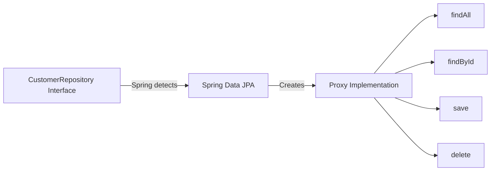
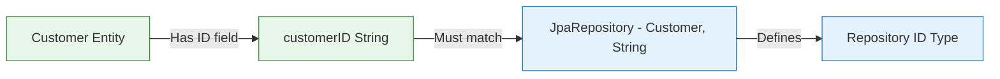
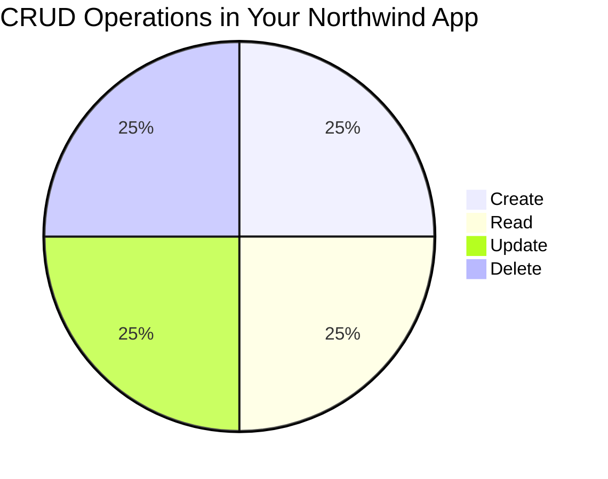
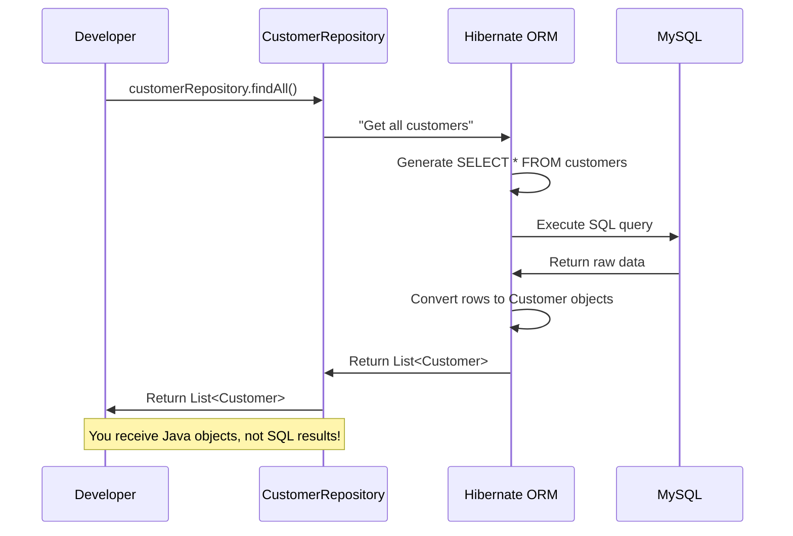
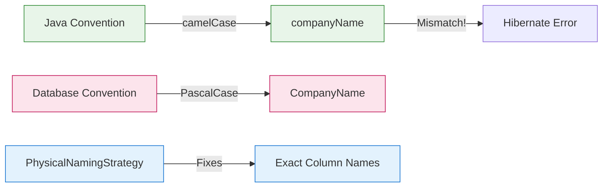

# Understanding Spring Boot Interfaces: The Magic Behind Your Northwind App

## What Are Interfaces in Spring Boot? (The Simple Truth)

### Interfaces = Your Blueprint for Data Access


### Real-Life Blueprint Analogy

Imagine you're building a house:

- **You** = The homeowner who says "I want a kitchen"
- **Interface** = The blueprint that says "Kitchen must have: sink, stove, refrigerator"
- **Spring** = The construction crew that builds the kitchen exactly to your blueprint
- **You never see the construction** - you just get a working kitchen!

In your Northwind app:
- You write `CustomerRepository` interface (the blueprint)
- Spring builds the actual implementation (the construction crew)
- You call `customerRepository.findAll()` (use your kitchen)
- No SQL knowledge required!

> [!TIP] For Absolute Beginners
> An interface is like a **promise** of what methods will exist, but it doesn't contain the actual code to make those methods work. Spring fulfills that promise for you behind the scenes.

## Your CustomerRepository Interface Explained

### What You Write (The Blueprint)

```java
package com.sparta.northwind.repository;

import com.sparta.northwind.entities.Customer;
import org.springframework.data.jpa.repository.JpaRepository;

public interface CustomerRepository extends JpaRepository<Customer, String> {
    // Empty interface - no implementation code!
}
```

### What Spring Creates (The Actual Kitchen)



### The Critical Detail You Need to Understand



- Your `Customer` entity has `@Id private String customerID;`
- This means your repository **MUST** use `String` as the ID type: `JpaRepository<Customer, String>`
- If you used `Integer` instead, your app would crash because Spring would look for numeric IDs but your database has text IDs like "ALFKI"

> [!WARNING] Common Beginner Mistake
> The second type parameter in `JpaRepository<Customer, String>` **must exactly match** the type of your `@Id` field. In your Northwind database, customer IDs are text (like "ALFKI"), not numbers!

## How CRUD Operations Work with Your Interface

### CRUD = Your 4 Basic Data Operations



### How Each CRUD Operation Maps to Your Interface

| CRUD Action | What It Does      | Your Code                                   | What Spring Does Behind the Scenes                             |
|-------------|-------------------|---------------------------------------------|----------------------------------------------------------------|
| **C**reate  | Add new customer  | `customerRepository.save(newCustomer)`      | Generates `INSERT INTO customers...` SQL                       |
| **R**ead    | Get all customers | `customerRepository.findAll()`              | Generates `SELECT * FROM customers` SQL                        |
| **R**ead    | Get one customer  | `customerRepository.findById("ALFKI")`      | Generates `SELECT * FROM customers WHERE CustomerID = 'ALFKI'` |
| **U**pdate  | Modify customer   | `customerRepository.save(existingCustomer)` | Generates `UPDATE customers SET...` SQL                        |
| **D**elete  | Remove customer   | `customerRepository.deleteById("ALFKI")`    | Generates `DELETE FROM customers WHERE...`                     |

### Real Example with Your Northwind Data

```java
// READ: Get all customers (your actual code)
List<Customer> customers = customerRepository.findAll();

// Behind the scenes, Spring does this:
String sql = "SELECT * FROM customers";
// Then converts results to Customer objects automatically
```

> [!NOTE] The Magic You Don't See
> When you call `customerRepository.findAll()`, you're not writing SQL or handling database connections - Spring does all that for you! You get back Java objects you can work with directly.

## The Complete Flow: From Interface Call to Database

### What Happens When You Call customerRepository.findAll()



### Step-by-Step Breakdown

1. **You make the request**
   ```java
   List<Customer> customers = customerRepository.findAll();
   ```

2. **Spring Data JPA processes it**
   - Looks at your empty `CustomerRepository` interface
   - Sees it extends `JpaRepository`
   - Knows `findAll()` should return all customer records

3. **Hibernate creates the SQL**
   - Uses your entity mappings to know which table/columns
   - Generates: `SELECT * FROM customers`
   - Preserves exact column names thanks to naming strategy

4. **Database executes the query**
   - MySQL processes the SQL
   - Returns raw result set with all customer data

5. **Hibernate converts results**
   - Maps each row to a `Customer` object
   - Sets properties based on column values
   - Returns list of Java objects

6. **You get Java objects**
   - Work with familiar Java objects
   - No SQL knowledge required
   - See output like: `Customer{customerID='ALFKI', companyName='Alfreds Futterkiste'...}`

> [!TIP] For Visual Learners
> When you see `customerRepository.findAll()`, imagine:
> 1. Your code asks for all customers
> 2. Spring translates this to a database request
> 3. The database returns raw data
> 4. Spring converts raw data to Java objects
> 5. You get to work with those objects directly
>
> **You never see the database interaction - it's completely hidden!**

## Why This Matters for Your Northwind Project

### The Special Case of Your Database

Your Northwind database has a unique challenge that makes understanding interfaces even more important:



- Java typically uses `camelCase` (companyName)
- Your Northwind database uses `PascalCase` (CompanyName)
- Without the naming strategy fix, Hibernate would look for `company_name`
- This would cause errors because the columns don't match

### Your Critical Configuration

```properties
spring.jpa.hibernate.naming.physical-strategy=org.hibernate.boot.model.naming.PhysicalNamingStrategyStandardImpl
```

This setting is what allows your interface methods to work correctly with your specific database!

> [!NOTE] Key Insight for Your Project
> The reason your `customerRepository.findAll()` works is because:
> 1. Your interface defines what to do (get all customers)
> 2. Spring creates the implementation
> 3. The naming strategy preserves exact column names
> 4. Hibernate generates correct SQL for your Northwind database
> 5. You get back properly mapped Customer objects

## Summary Cheat Sheet

### Interface Basics for Your Northwind App

| Concept                  | What It Is                | Your Northwind Example                |
|--------------------------|---------------------------|---------------------------------------|
| **Interface**            | Blueprint for data access | `CustomerRepository`                  |
| **Proxy Implementation** | Runtime-generated code    | Spring creates it automatically       |
| **CRUD Methods**         | Basic data operations     | `findAll()`, `save()`, `deleteById()` |
| **ID Type**              | Primary key data type     | `String` (matches customerID field)   |
| **Naming Strategy**      | Column name handler       | `PhysicalNamingStrategyStandardImpl`  |

### What You Need to Remember

1. **You write interfaces, Spring provides implementations**
   - Your `CustomerRepository` is empty but works magically
   - No need to write SQL or database connection code

2. **ID type must match exactly**
   - Customer entity has `String customerID`
   - Repository must use `JpaRepository<Customer, String>`
   - Mismatch causes runtime errors

3. **CRUD operations are built-in**
   - `findAll()` = Get all customers
   - `save()` = Create or update customer
   - `deleteById()` = Remove customer

4. **Naming strategy is critical for Northwind**
   - Without it, Hibernate would look for wrong column names
   - Your specific database uses PascalCase columns

> [!TIP] Final Beginner Insight
> When you call `customerRepository.findAll()`, you're not working with a database - you're working with **Java objects**. Spring handles all the database interaction behind the scenes, so you can focus on your business logic. This is the true power of Spring Data JPA interfaces!

#java #spring-boot #interfaces
