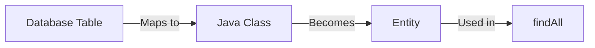
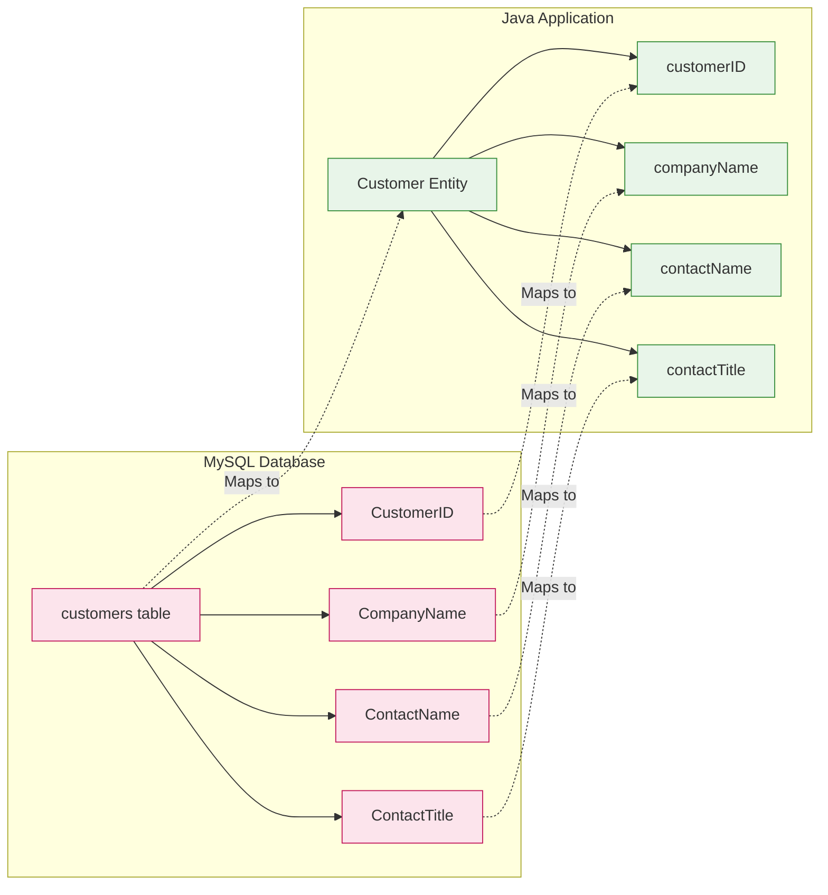
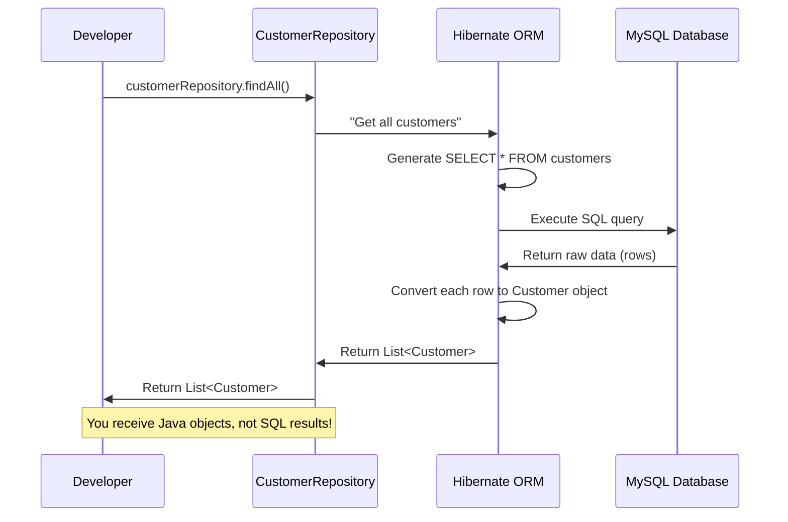
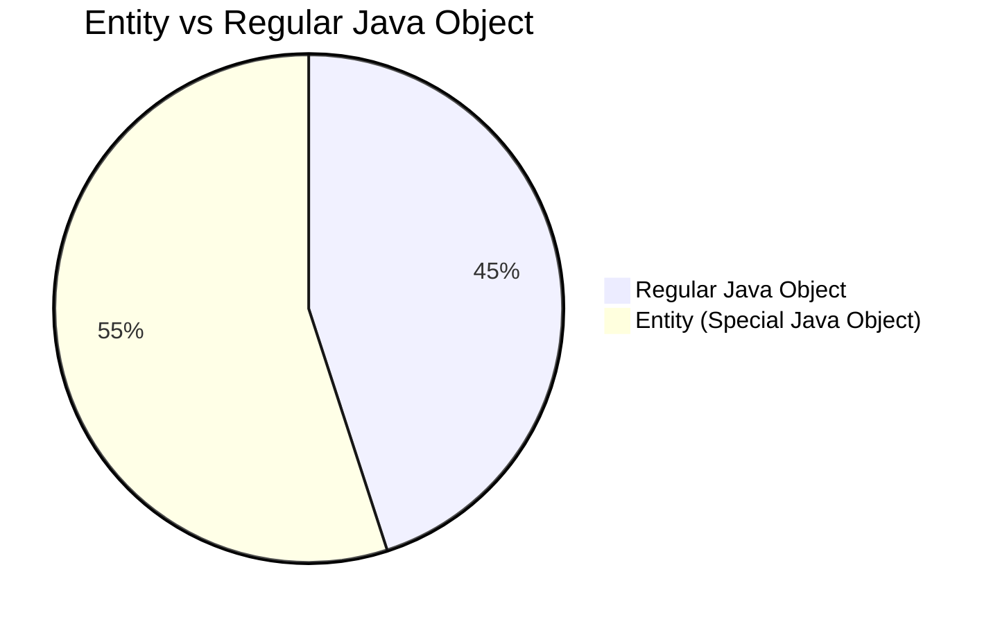
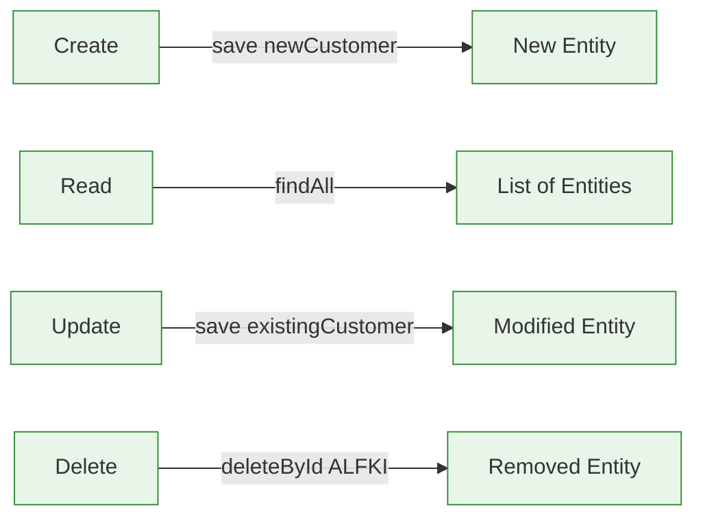
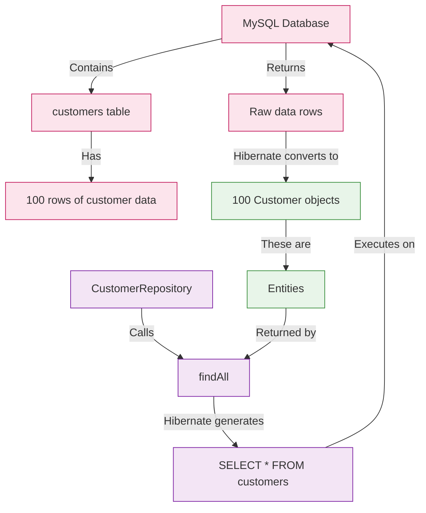

# Understanding Entities in Spring Boot - Simple Visual Guide

## What is an Entity? (The Simplest Explanation)

### Entity = Java Class + Database Table



### Real-Life Analogy: Restaurant Menu

Imagine a restaurant menu:

- **Database Table**: The physical list of dishes in the kitchen
- **Entity**: The printed menu you hold in your hands
- **findAll()**: Asking for the complete menu

When you say `customerRepository.findAll()`, you're asking for "all menu items" (all customer records), and Spring returns them as Java objects you can work with.

## Your Customer Entity Explained Visually

### Database Table vs Java Entity



### What This Means

- Each **ROW** in your database table becomes one **Java OBJECT**
- Each **COLUMN** in your table becomes a **FIELD** in your Java class
- When you call `findAll()`, you get a **LIST OF JAVA OBJECTS** (entities)

## What Happens When You Call findAll()

### Step-by-Step Visual Explanation



### Concrete Example with Your Data

When you run this code:
```java
List<Customer> customers = customerRepository.findAll();
```

You get something like this:
```
Customer{customerID='ALFKI', companyName='Alfreds Futterkiste', contactName='Maria Anders', contactTitle='Sales Representative'}
Customer{customerID='ANATR', companyName='Ana Trujillo Emparedados y helados', contactName='Ana Trujillo', contactTitle='Owner'}
```

Each of these is a **Customer entity** - a Java object representing one row from your database.

## Entity vs Regular Java Object

### What Makes an Entity Special



### Key Differences

| Feature              | Regular Java Object             | Entity                                                            |
|----------------------|---------------------------------|-------------------------------------------------------------------|
| **Annotations**      | No special annotations          | Has `@Entity`, `@Table`, `@Column`                                |
| **Database Mapping** | Not connected to database       | Maps directly to database table                                   |
| **Persistence**      | Lives only in memory            | Can be saved to/retrieved from database                           |
| **Example**          | `Person person = new Person();` | `Customer customer = customerRepository.findById("ALFKI").get();` |

### Your Customer Entity Code

```java
@Entity  // THIS MAKES IT AN ENTITY
@Table(name = "customers", schema = "northwind")
public class Customer {
    @Id  // Marks this as the primary key
    @Column(name = "CustomerID")  // Maps to database column
    private String customerID;
    
    @Column(name = "CompanyName")
    private String companyName;
    
    // Other fields...
    
    // Getters and setters
}
```

> [!TIP] The Magic Marker
> The `@Entity` annotation is what makes a regular Java class become an **entity**. Without this annotation, Spring wouldn't know it represents a database table.

## CRUD Operations with Entities

### How Entities Work with CRUD



### Real Examples with Your Northwind Data

```java
// CREATE: Add a new customer entity
Customer newCustomer = new Customer();
newCustomer.setCustomerID("VALON");
newCustomer.setCompanyName("IT Company");
customerRepository.save(newCustomer);  // This saves the entity to database

// READ: Get all customer entities
List<Customer> allCustomers = customerRepository.findAll();
// Returns list of Customer entities (Java objects)

// UPDATE: Modify an existing entity
Customer alfkCustomer = customerRepository.findById("ALFKI").get();
alfkCustomer.setCompanyName("New Company Name");
customerRepository.save(alfkCustomer);  // Updates the entity in database

// DELETE: Remove an entity
customerRepository.deleteById("VALON");  // Deletes the entity from database
```

> [!NOTE] Key Insight
> An entity is **both** a Java object **and** a representation of database data. When you modify an entity object, you're effectively modifying the database record it represents.

## Why "findAll() Returns All Entities" Makes Sense

### The Complete Picture



### Simple Translation

- **Database perspective**: "Return all rows from the customers table"
- **Java perspective**: "Return all Customer entities"
- **Your code perspective**: `List<Customer> customers = customerRepository.findAll();`

When someone says "findAll() returns all entities," they mean it returns **Java objects** (Customer objects) that represent all the records in your database table.

## Summary Cheat Sheet

### Entity Quick Reference

| Term                | What It Is                               | Your Northwind Example                          |
|---------------------|------------------------------------------|-------------------------------------------------|
| **Entity**          | Java class representing a database table | `Customer.java` class                           |
| **Entity Instance** | Java object representing a database row  | `Customer customer = new Customer()`            |
| **findAll()**       | Method that returns all entity instances | `List<Customer> = customerRepository.findAll()` |
| **ID Field**        | Unique identifier for an entity          | `customerID` field in Customer                  |

### What You Need to Remember

1. An **entity** is a Java class with `@Entity` that maps to a database table
2. An **entity instance** is a Java object representing one database row
3. `findAll()` returns a list of entity instances (Java objects)
4. You work with entities as regular Java objects, not SQL results
5. Spring handles all the database conversion automatically

> [!TIP] For Absolute Clarity
> When you see `Customer customer = customerRepository.findById("ALFKI").get();`, you're getting a **Java object** (an entity instance) that represents the customer with ID "ALFKI" from your database. You can call `customer.getCompanyName()` just like any other Java object - no SQL needed!

#java #spring-boot #jpa #entities
