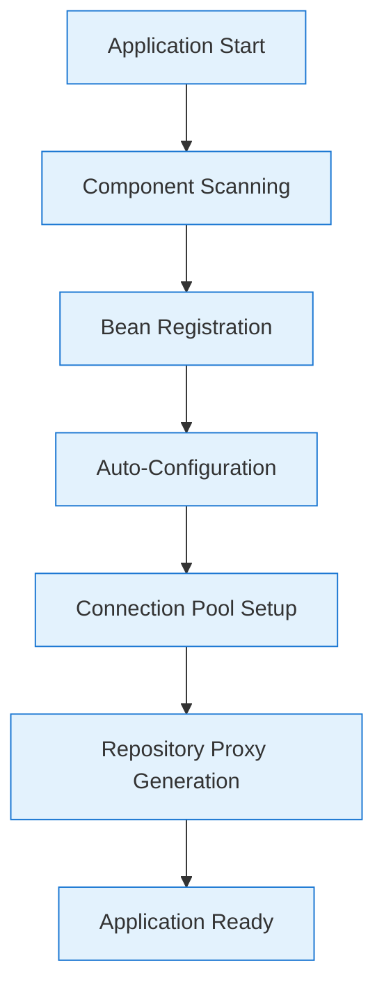
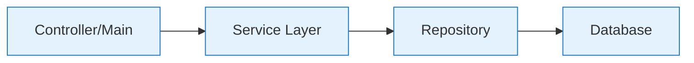
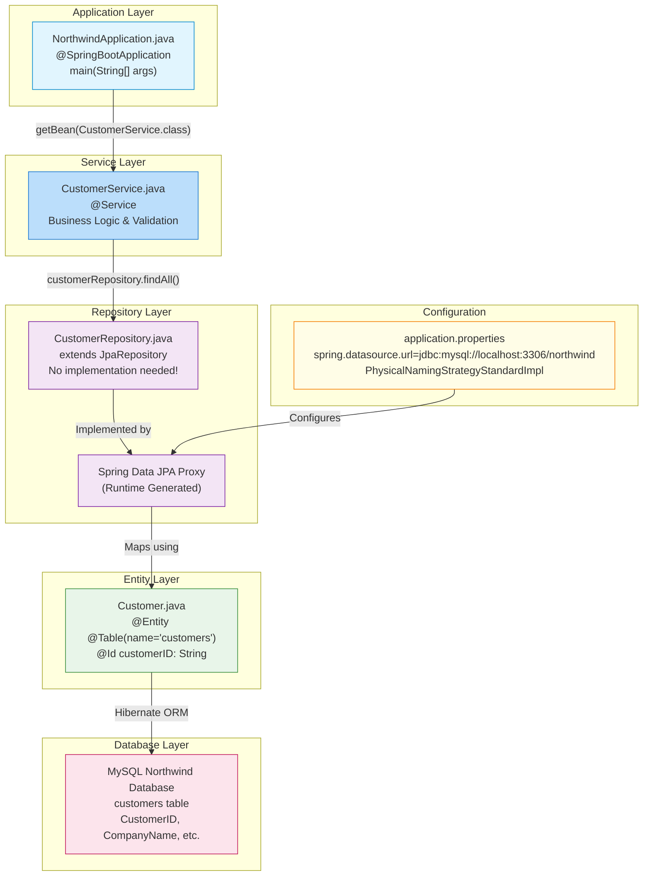

---
tags: [java/springboot, architecture/visual, java/jpa, database/mysql]
date: 2025-09-05
topic: Spring Boot Application Visual Architecture Guide with Code Examples
---

# Spring Boot Northwind Application - Visual Architecture Guide with Code Examples

## Application Startup Lifecycle

This diagram shows the complete sequence of events when your Spring Boot application starts.

### Startup Sequence Flow



### What Happens at Each Stage

#### Application Start - Actual Implementation

Your actual `main()` method that starts everything:

```java
package com.sparta.northwind;

import com.sparta.northwind.entities.Customer;
import com.sparta.northwind.repository.CustomerRepository;
import com.sparta.northwind.services.CustomerService;
import org.springframework.boot.SpringApplication;
import org.springframework.boot.autoconfigure.SpringBootApplication;
import org.springframework.context.ApplicationContext;

import java.util.List;

@SpringBootApplication
public class NorthwindApplication {

    public static void main(String[] args) {
        // Step 1: Application Start
        ApplicationContext context = SpringApplication.run(NorthwindApplication.class, args);
        
        // Step 2-6 happen automatically here!
        
        // Step 7: Application Ready - Now we can use our beans
        CustomerService customerService = context.getBean(CustomerService.class);
        
        // Using the service layer
        System.out.println("=== Testing GET Methods ===");
        Customer customerToFind = customerService.getCustomerById("ALFKI");
        System.out.println("Single customer: " + customerToFind);
        
        List<Customer> allCustomers = customerService.getAllCustomers();
        System.out.println("Total customers found: " + allCustomers.size());
    }
}
```

#### Component Scanning

Spring automatically finds these components in your project:

```java
// Your repository interface - found by @Repository (implicit through JpaRepository)
package com.sparta.northwind.repository;

public interface CustomerRepository extends JpaRepository<Customer, String> {
    // Spring finds this and creates implementation
}

// Your service class - found by @Service
package com.sparta.northwind.services;

@Service  // This annotation makes Spring find and register this class
public class CustomerService {
    // Spring manages this as a bean
}

// Your entity - found by @Entity
package com.sparta.northwind.entities;

@Entity  // This annotation makes Spring/JPA recognize this as a database entity
@Table(name = "customers", schema = "northwind")
public class Customer {
    // Spring registers this as a managed entity
}
```

#### Auto-Configuration with Your Properties

Your actual `application.properties` that Spring uses for auto-configuration:

```properties
spring.application.name=NorthwindApp
spring.datasource.url=jdbc:mysql://localhost:3306/northwind
spring.datasource.username=root
spring.datasource.password=root
server.port=8091

# Critical naming strategy configuration
spring.jpa.hibernate.naming.physical-strategy=org.hibernate.boot.model.naming.PhysicalNamingStrategyStandardImpl
```

> [!NOTE] Key Insight  
> The `@SpringBootApplication` annotation on your main class triggers all of this automatic configuration. It combines `@Configuration`, `@EnableAutoConfiguration`, and `@ComponentScan` - that's why Spring finds all your components without explicit configuration!

---

## Why We Need a Service Layer

### The Missing Piece in Our Architecture



### Your Actual Service Layer Implementation

Here's your complete `CustomerService` class showing business logic separation:

```java
package com.sparta.northwind.services;

import com.sparta.northwind.entities.Customer;
import com.sparta.northwind.repository.CustomerRepository;
import org.springframework.stereotype.Service;

import java.util.List;

@Service
public class CustomerService {

    private final CustomerRepository customerRepository;

    // Constructor injection - Spring automatically provides the repository
    public CustomerService(CustomerRepository customerRepository) {
        this.customerRepository = customerRepository;
    }

    // Simple pass-through for reading all customers
    public List<Customer> getAllCustomers() {
        return customerRepository.findAll();
    }

    // Business logic: ID validation before database access
    public Customer getCustomerById(String id) {
        // BUSINESS RULE: Customer IDs can't be longer than 5 characters
        if (id.length() > 5) {
            throw new IllegalArgumentException("Can't have ID longer than 5 characters");
        } else {
            return customerRepository.findById(id).orElse(null);
        }
    }

    // Simple save operation
    public Customer saveCustomer(Customer customer) {
        return customerRepository.save(customer);
    }

    // Business logic: Verify customer exists before updating
    public Customer updateCustomerById(String id, Customer updatedCustomer) {
        // BUSINESS RULE: Can only update existing customers
        if (customerRepository.existsById(id)) {
            updatedCustomer.setCustomerID(id); // Ensure the ID matches
            return customerRepository.save(updatedCustomer);
        } else {
            throw new IllegalArgumentException("Can't update Customer with ID " + id);
        }
    }

    // Business logic: Verify customer exists before deleting
    public void deleteCustomerById(String id) {
        // BUSINESS RULE: Can only delete existing customers
        if (customerRepository.existsById(id)) {
            customerRepository.deleteById(id);
        } else {
            throw new IllegalArgumentException("Can't delete Customer with ID " + id);
        }
    }

    // Alternative delete method
    public void deleteCustomer(Customer customer) {
        customerRepository.delete(customer);
    }
}
```

### Real Usage in Your Main Application

Here's how you actually use the service layer in your application:

```java
// From NorthwindApplication.java
CustomerService customerService = context.getBean(CustomerService.class);

// Testing UPDATE with validation
System.out.println("\n=== Testing UPDATE Method (Safe) ===");
Customer testCustomer = new Customer();
testCustomer.setCustomerID("TEST1");
testCustomer.setCompanyName("Test Company");

try {
    // This will fail because TEST1 doesn't exist - service layer validates!
    customerService.updateCustomerById("TEST1", testCustomer);
    System.out.println("Update successful");
} catch (IllegalArgumentException e) {
    System.out.println("Expected error for non-existent customer: " + e.getMessage());
    // Output: "Expected error for non-existent customer: Can't update Customer with ID TEST1"
}

// Testing DELETE with validation
System.out.println("\n=== Testing DELETE Method (Safe) ===");
try {
    // This will fail because NONEXISTENT doesn't exist - service layer validates!
    customerService.deleteCustomerById("NONEXISTENT");
    System.out.println("Delete successful");
} catch (IllegalArgumentException e) {
    System.out.println("Expected error for non-existent customer: " + e.getMessage());
    // Output: "Expected error for non-existent customer: Can't delete Customer with ID NONEXISTENT"
}
```

> [!TIP] Service Layer Purpose  
> Notice how the service layer adds validation that the repository doesn't provide. The repository just does data access, but the service enforces business rules like "can't update non-existent customers" and "ID must be 5 characters or less".

---

## Dependency Injection Explained

### What is Dependency Injection?

Dependency Injection (DI) is a design pattern where objects receive their dependencies from external sources rather than creating them internally.

### Your Actual Dependency Injection Implementation

#### Constructor Injection in CustomerService (BEST PRACTICE)

```java
@Service
public class CustomerService {
    // The dependency we need
    private final CustomerRepository customerRepository;
    
    // Constructor injection - Spring provides the repository automatically
    public CustomerService(CustomerRepository customerRepository) {
        this.customerRepository = customerRepository;
    }
    
    // Now we can use customerRepository in any method
    public List<Customer> getAllCustomers() {
        return customerRepository.findAll();
    }
}
```

#### How Spring Wires Everything Together

When you run your application, Spring automatically:

1. Creates a `CustomerRepository` implementation (proxy)
2. Creates a `CustomerService` instance
3. Passes the repository to the service constructor
4. Registers both as beans in the ApplicationContext

Here's how you retrieve the fully-wired service:

```java
// In your main method
ApplicationContext context = SpringApplication.run(NorthwindApplication.class, args);

// Spring has already injected the repository into this service
CustomerService customerService = context.getBean(CustomerService.class);

// The service has its dependency and is ready to use!
List<Customer> customers = customerService.getAllCustomers();
```

### Your Test Class Shows Dependency Injection with Mocks

```java
package com.sparta.northwind.services;

import com.sparta.northwind.entities.Customer;
import com.sparta.northwind.repository.CustomerRepository;
import org.junit.jupiter.api.BeforeEach;
import org.junit.jupiter.api.Test;
import org.junit.jupiter.api.extension.ExtendWith;
import org.mockito.InjectMocks;
import org.mockito.Mock;
import org.mockito.junit.jupiter.MockitoExtension;

@ExtendWith(MockitoExtension.class)
class CustomerServiceTest {

    @Mock  // Creates a fake repository
    private CustomerRepository customerRepository;

    @InjectMocks  // Injects the mock repository into the service
    private CustomerService customerService;
    
    @Test
    void testGetAllCustomers() {
        // The customerService has the mock repository injected
        // No database needed for testing!
        when(customerRepository.findAll()).thenReturn(testCustomers);
        
        List<Customer> result = customerService.getAllCustomers();
        
        assertEquals(2, result.size());
    }
}
```

> [!TIP] Why Constructor Injection is Best  
> In your implementation, using constructor injection with `final` fields ensures:
> - The service can't exist without its repository dependency
> - The dependency can't be changed after creation (immutable)
> - Testing is easy (just pass a mock to the constructor)

---

## Understanding Optionals in Java

### What Are Optionals?

`Optional` is a container object that may or may not contain a non-null value, helping avoid `NullPointerException`.

### How Your Repository Uses Optionals

```java
// CustomerRepository interface (implicit from JpaRepository)
public interface CustomerRepository extends JpaRepository<Customer, String> {
    // This method returns Optional<Customer>, not Customer
    Optional<Customer> findById(String id);
}
```

### Your Service Layer Handles Optionals

```java
public class CustomerService {
    
    // Method 1: Using orElse(null)
    public Customer getCustomerById(String id) {
        if (id.length() > 5) {
            throw new IllegalArgumentException("Can't have ID longer than 5 characters");
        } else {
            // findById returns Optional<Customer>
            // orElse(null) returns the customer if found, or null if not found
            return customerRepository.findById(id).orElse(null);
        }
    }
    
    // Alternative approach you could use:
    public Customer getCustomerByIdOrThrow(String id) {
        return customerRepository.findById(id)
            .orElseThrow(() -> new IllegalArgumentException("Customer not found: " + id));
    }
    
    // Another alternative using ifPresent:
    public void printCustomerInfo(String id) {
        customerRepository.findById(id)
            .ifPresent(customer -> System.out.println("Found: " + customer));
    }
}
```

### Real Example from Your Test Code

```java
@Test
void testGetCustomerById_Success() {
    // Arrange - Mock returns Optional with customer
    when(customerRepository.findById("TEST1")).thenReturn(Optional.of(testCustomer));
    
    // Act
    Customer result = customerService.getCustomerById("TEST1");
    
    // Assert
    assertNotNull(result);
    assertEquals("TEST1", result.getCustomerID());
}

@Test
void testGetCustomerById_NotFound() {
    // Arrange - Mock returns empty Optional
    when(customerRepository.findById("DUMMY")).thenReturn(Optional.empty());
    
    // Act
    Customer result = customerService.getCustomerById("DUMMY");
    
    // Assert - orElse(null) returns null when Optional is empty
    assertNull(result);
}
```

> [!TIP] Optional Best Practices  
> Your code uses `orElse(null)` which is simple but requires null checking. Consider using `orElseThrow()` for required entities to make the "not found" case explicit and avoid null checks throughout your code.

---

## Repository Layer Implementation

### Your Actual Repository Interface

```java
package com.sparta.northwind.repository;

import com.sparta.northwind.entities.Customer;
import org.springframework.data.jpa.repository.JpaRepository;

public interface CustomerRepository extends JpaRepository<Customer, String> {
    // That's it! No implementation needed
    // Spring Data JPA provides all these methods automatically:
    // - findAll()
    // - findById(String id)
    // - save(Customer customer)
    // - deleteById(String id)
    // - existsById(String id)
    // - count()
    // and many more!
}
```

### What Spring Creates Behind the Scenes

When Spring sees your repository interface, it generates something like this at runtime:

```java
// This is conceptual - Spring generates this in memory, not as Java code
public class CustomerRepositoryImpl implements CustomerRepository {
    
    @PersistenceContext
    private EntityManager entityManager;
    
    @Override
    public List<Customer> findAll() {
        // Generates: SELECT c FROM Customer c
        return entityManager.createQuery("SELECT c FROM Customer c", Customer.class)
                           .getResultList();
    }
    
    @Override
    public Optional<Customer> findById(String id) {
        // Generates: SELECT c FROM Customer c WHERE c.customerID = :id
        Customer customer = entityManager.find(Customer.class, id);
        return Optional.ofNullable(customer);
    }
    
    @Override
    public Customer save(Customer customer) {
        if (customer.getCustomerID() == null) {
            entityManager.persist(customer);  // INSERT
        } else {
            customer = entityManager.merge(customer);  // UPDATE
        }
        return customer;
    }
    
    @Override
    public void deleteById(String id) {
        Customer customer = entityManager.find(Customer.class, id);
        if (customer != null) {
            entityManager.remove(customer);
        }
    }
    
    @Override
    public boolean existsById(String id) {
        // Generates: SELECT COUNT(c) FROM Customer c WHERE c.customerID = :id
        Long count = entityManager.createQuery(
            "SELECT COUNT(c) FROM Customer c WHERE c.customerID = :id", Long.class)
            .setParameter("id", id)
            .getSingleResult();
        return count > 0;
    }
    
    // ... many more methods
}
```

---

## Entity Mapping - Your Customer Entity

### Your Complete Customer Entity Implementation

```java
package com.sparta.northwind.entities;

import jakarta.persistence.*;
import jakarta.validation.constraints.NotNull;
import jakarta.validation.constraints.Size;

@Entity
@Table(name = "customers", schema = "northwind", indexes = {
        @Index(name = "CompanyName", columnList = "CompanyName"),
        @Index(name = "City", columnList = "City"),
        @Index(name = "Region", columnList = "Region"),
        @Index(name = "PostalCode", columnList = "PostalCode")
})
public class Customer {
    @Id
    @Size(max = 5)
    @Column(name = "CustomerID", nullable = false, length = 5)
    private String customerID;

    @Size(max = 40)
    @NotNull
    @Column(name = "CompanyName", nullable = false, length = 40)
    private String companyName;

    @Size(max = 30)
    @Column(name = "ContactName", length = 30)
    private String contactName;

    @Size(max = 30)
    @Column(name = "ContactTitle", length = 30)
    private String contactTitle;

    @Size(max = 60)
    @Column(name = "Address", length = 60)
    private String address;

    @Size(max = 15)
    @Column(name = "City", length = 15)
    private String city;

    @Size(max = 15)
    @Column(name = "Region", length = 15)
    private String region;

    @Size(max = 10)
    @Column(name = "PostalCode", length = 10)
    private String postalCode;

    @Size(max = 15)
    @Column(name = "Country", length = 15)
    private String country;

    @Size(max = 24)
    @Column(name = "Phone", length = 24)
    private String phone;

    @Size(max = 24)
    @Column(name = "Fax", length = 24)
    private String fax;

    // Getters and Setters
    public String getCustomerID() {
        return customerID;
    }

    public void setCustomerID(String customerID) {
        this.customerID = customerID;
    }

    public String getCompanyName() {
        return companyName;
    }

    public void setCompanyName(String companyName) {
        this.companyName = companyName;
    }

    public String getContactName() {
        return contactName;
    }

    public void setContactName(String contactName) {
        this.contactName = contactName;
    }

    public String getContactTitle() {
        return contactTitle;
    }

    public void setContactTitle(String contactTitle) {
        this.contactTitle = contactTitle;
    }

    // ... other getters and setters ...

    @Override
    public String toString() {
        return "Customer{" +
                "customerID='" + customerID + '\'' +
                ", companyName='" + companyName + '\'' +
                ", contactName='" + contactName + '\'' +
                ", contactTitle='" + contactTitle + '\'' +
                '}';
    }
}
```

### How These Annotations Map to Your Database

| Java Field | Database Column | Annotation Effect |
|------------|-----------------|-------------------|
| `customerID` | `CustomerID` | `@Id` makes it primary key, `@Column` preserves exact name |
| `companyName` | `CompanyName` | `@NotNull` enforces required field, `@Size(max=40)` limits length |
| `city` | `City` | Has index for faster searches (from `@Index`) |

### Why the Naming Strategy is Critical

Without this configuration in `application.properties`:
```properties
spring.jpa.hibernate.naming.physical-strategy=org.hibernate.boot.model.naming.PhysicalNamingStrategyStandardImpl
```

Hibernate would convert `companyName` to `company_name` in SQL, but your database has `CompanyName`!

---

## Complete Test Implementation

### Your Actual Test Class with Mockito

```java
package com.sparta.northwind.services;

import com.sparta.northwind.entities.Customer;
import com.sparta.northwind.repository.CustomerRepository;
import org.junit.jupiter.api.BeforeEach;
import org.junit.jupiter.api.Test;
import org.junit.jupiter.api.extension.ExtendWith;
import org.mockito.InjectMocks;
import org.mockito.Mock;
import org.mockito.junit.jupiter.MockitoExtension;

import java.util.Arrays;
import java.util.List;
import java.util.Optional;

import static org.junit.jupiter.api.Assertions.*;
import static org.mockito.Mockito.*;

@ExtendWith(MockitoExtension.class)
class CustomerServiceTest {

    @Mock
    private CustomerRepository customerRepository;

    @InjectMocks
    private CustomerService customerService;

    private Customer testCustomer;
    private List<Customer> testCustomers;

    @BeforeEach
    void setUp() {
        // Using obviously fake test data to avoid confusion with real customer data
        testCustomer = new Customer();
        testCustomer.setCustomerID("TEST1");
        testCustomer.setCompanyName("Test Company Ltd");
        testCustomer.setContactName("Test User");
        
        Customer customer2 = new Customer();
        customer2.setCustomerID("TEST2");
        customer2.setCompanyName("Mock Corporation");
        customer2.setContactName("Mock Person");
        
        testCustomers = Arrays.asList(testCustomer, customer2);
    }

    @Test
    void testGetAllCustomers() {
        // Arrange - Tell the mock what to return
        when(customerRepository.findAll()).thenReturn(testCustomers);

        // Act - Call the service method
        List<Customer> result = customerService.getAllCustomers();

        // Assert - Verify the results
        assertEquals(2, result.size());
        assertEquals("TEST1", result.get(0).getCustomerID());
        assertEquals("TEST2", result.get(1).getCustomerID());
        
        // Verify the repository method was called
        verify(customerRepository).findAll();
    }

    @Test
    void testGetCustomerById_InvalidLength() {
        // Act & Assert - Test business rule validation
        IllegalArgumentException exception = assertThrows(
            IllegalArgumentException.class, 
            () -> customerService.getCustomerById("TOOLONG123")
        );
        
        assertEquals("Can't have ID longer than 5 characters", exception.getMessage());
        
        // Verify repository was never called due to validation failure
        verify(customerRepository, never()).findById(anyString());
    }

    @Test
    void testUpdateCustomerById_Success() {
        // Arrange
        when(customerRepository.existsById("TEST1")).thenReturn(true);
        when(customerRepository.save(testCustomer)).thenReturn(testCustomer);

        // Act
        Customer result = customerService.updateCustomerById("TEST1", testCustomer);

        // Assert
        assertNotNull(result);
        assertEquals("TEST1", result.getCustomerID());
        
        // Verify both repository methods were called
        verify(customerRepository).existsById("TEST1");
        verify(customerRepository).save(testCustomer);
    }

    @Test
    void testDeleteCustomerById_NotFound() {
        // Arrange
        when(customerRepository.existsById("DUMMY")).thenReturn(false);

        // Act & Assert
        IllegalArgumentException exception = assertThrows(
            IllegalArgumentException.class,
            () -> customerService.deleteCustomerById("DUMMY")
        );

        assertEquals("Can't delete Customer with ID DUMMY", exception.getMessage());
        
        // Verify existence was checked but delete was not called
        verify(customerRepository).existsById("DUMMY");
        verify(customerRepository, never()).deleteById(anyString());
    }
}
```

---

## Complete Application Flow with All Components

### How Everything Works Together - Real Code Flow

```java
// 1. Application starts
ApplicationContext context = SpringApplication.run(NorthwindApplication.class, args);

// 2. Spring has created and wired all components
// Let's trace a complete flow:

// 3. Get the service (with repository already injected)
CustomerService customerService = context.getBean(CustomerService.class);

// 4. Call service method
List<Customer> customers = customerService.getAllCustomers();

// What happens inside:
// 4a. Service delegates to repository
// Inside CustomerService.getAllCustomers():
//     return customerRepository.findAll();

// 4b. Repository (proxy) generates SQL
// Spring Data JPA generates: SELECT * FROM customers

// 4c. Hibernate executes SQL using connection from pool
// Uses settings from application.properties

// 4d. Results mapped to Customer entities
// Using @Entity, @Column annotations

// 4e. List of Customer objects returned to service
// 4f. Service returns list to main method

// 5. Use the results
for (Customer customer : customers) {
    System.out.println(customer);
    // Output: Customer{customerID='ALFKI', companyName='Alfreds Futterkiste'...}
}
```

### Complete Architecture with Your Actual Components



> [!NOTE] Key Architecture Insight  
> This complete architecture shows how your simple interface (`CustomerRepository`) becomes a fully functional data access layer through Spring's proxy generation, connected to your service layer for business logic, all configured through simple properties. You write minimal code, but get a complete, production-ready application!

---

## Summary with Your Actual Implementation

### What You've Built

| Component | Your Implementation | Purpose |
|-----------|---------------------|---------|
| **Main Application** | `NorthwindApplication.java` with `@SpringBootApplication` | Entry point, bootstraps everything |
| **Service Layer** | `CustomerService.java` with business validation | Centralizes business rules |
| **Repository** | `CustomerRepository` interface (no implementation!) | Data access layer |
| **Entity** | `Customer.java` with JPA annotations | Maps to database table |
| **Configuration** | `application.properties` with database settings | Configures entire application |
| **Tests** | `CustomerServiceTest.java` with Mockito | Unit tests without database |

### The Power of Your Architecture

Your application demonstrates professional Spring Boot development:

1. **Minimal Code**: Your repository is just an empty interface, yet provides full CRUD operations
2. **Clear Separation**: Business logic in service, data access in repository, configuration in properties
3. **Testable**: Using constructor injection and Mockito for fast, isolated tests
4. **Maintainable**: Each component has a single, clear responsibility
5. **Production-Ready**: Proper validation, error handling, and naming strategy for legacy database

> [!TIP] For Learning and Reference  
> This architecture is exactly how real Spring Boot applications are built in production. The patterns you're using (service layer, constructor injection, repository pattern, entity mapping) are industry best practices that you'll see in professional codebases.

#java/springboot #architecture/visual #java/jpa #database/mysql #dependency-injection #optional #service-layer