# Service Layer in Spring Boot - Adding Business Logic to Your Northwind App

## What is a Service Layer? (The Simple Truth)

### Service Layer = Your Business Brain


### Real-Life Analogy: Restaurant Kitchen

Imagine a restaurant:

- **Controller** = The waiter taking orders
- **Service Layer** = The head chef who checks if ingredients are available, validates recipes, ensures quality
- **Repository** = The pantry where ingredients are stored
- **Database** = The actual ingredients

The head chef (Service) doesn't just blindly grab ingredients. They check quality, validate quantities, and apply business rules before cooking!

> [!TIP] Why You Need a Service Layer  
> Without a service layer, your controllers would directly call the repository. This means business logic would be scattered everywhere! The service layer centralizes all your business rules in one place.

## Your CustomerService Implementation

### What You Built Today

```java
package com.sparta.northwind.services;

import com.sparta.northwind.entities.Customer;
import com.sparta.northwind.repository.CustomerRepository;
import org.springframework.stereotype.Service;

import java.util.List;

@Service
public class CustomerService {
    
    private final CustomerRepository customerRepository;
    
    // Constructor injection (best practice!)
    public CustomerService(CustomerRepository customerRepository) {
        this.customerRepository = customerRepository;
    }
    
    // Business logic methods here...
}
```

### The Architecture Pattern You're Using


> [!NOTE] Separation of Concerns  
> Each layer has a specific job:
> 
> - **Service**: Business logic, validation, transaction management
> - **Repository**: Data access only (no business logic)
> - **Controller/Main**: Request handling and response formatting

## Your CRUD Operations with Business Logic

### 1. READ Operations (Safe & Simple)

```java
public List<Customer> getAllCustomers() {
    return customerRepository.findAll();
}

public Customer getCustomerById(String id) {
    if (id.length() > 5) {
        throw new IllegalArgumentException("Can't have ID longer than 5 characters");
    } else {
        return customerRepository.findById(id).orElse(null);
    }
}
```

#### What Makes This "Business Logic"?


The service layer adds **validation** that the repository doesn't care about. This is business logic!

### 2. CREATE Operation (Simple Pass-Through)

```java
public Customer saveCustomer(Customer customer) {
    return customerRepository.save(customer);
}
```

> [!TIP] Room for Enhancement  
> Even though this is a simple pass-through now, you could add:
> 
> - Validation that required fields are present
> - Check for duplicate customer IDs
> - Format phone numbers consistently
> - Audit logging

### 3. UPDATE Operation (With Existence Check)

```java
public Customer updateCustomerById(String id, Customer updatedCustomer) {
    if (customerRepository.existsById(id)) {
        updatedCustomer.setCustomerID(id); // Ensure the ID matches
        return customerRepository.save(updatedCustomer);
    } else {
        throw new IllegalArgumentException("Can't update Customer with ID " + id);
    }
}
```

#### The Update Flow with Validation


### 4. DELETE Operation (With Safety Check)

```java
public void deleteCustomerById(String id) {
    if (customerRepository.existsById(id)) {
        customerRepository.deleteById(id);
    } else {
        throw new IllegalArgumentException("Can't delete Customer with ID " + id);
    }
}
```

> [!WARNING] Why This Validation Matters  
> Without this check, calling `deleteById()` on a non-existent ID would either:
> 
> - Silently do nothing (confusing!)
> - Throw a generic Spring exception (not user-friendly)
> 
> Your service layer provides clear, business-specific error messages!

## Testing Your Service Layer with Mockito

### What is Mockito? (Simple Explanation)


**Mockito** = A library that creates "fake" objects for testing. Your tests run without a real database!

### Your Test Implementation

```java
@ExtendWith(MockitoExtension.class)
class CustomerServiceTest {
    
    @Mock
    private CustomerRepository customerRepository;
    
    @InjectMocks
    private CustomerService customerService;
    
    private Customer testCustomer;
    
    @BeforeEach
    void setUp() {
        // Using obviously fake test data
        testCustomer = new Customer();
        testCustomer.setCustomerID("TEST1");
        testCustomer.setCompanyName("Test Company Ltd");
        testCustomer.setContactName("Test User");
    }
}
```

### Understanding the Annotations

| Annotation | What It Does | Your Example |
|------------|--------------|--------------|
| `@ExtendWith` | Enables Mockito in your test | Allows `@Mock` and `@InjectMocks` to work |
| `@Mock` | Creates a fake repository | `customerRepository` is fake, not real |
| `@InjectMocks` | Creates service with mock injected | `customerService` gets the fake repository |
| `@BeforeEach` | Runs before each test | Sets up test data fresh for each test |

### Example Test: Update with Non-Existent Customer

```java
@Test
void testUpdateCustomerById_NotFound() {
    // Arrange: Tell mock to return false for existsById
    when(customerRepository.existsById("DUMMY")).thenReturn(false);
    
    // Act & Assert: Verify exception is thrown
    IllegalArgumentException exception = assertThrows(
        IllegalArgumentException.class,
        () -> customerService.updateCustomerById("DUMMY", testCustomer)
    );
    
    assertEquals("Can't update Customer with ID DUMMY", exception.getMessage());
    
    // Verify repository was checked but save was never called
    verify(customerRepository).existsById("DUMMY");
    verify(customerRepository, never()).save(any(Customer.class));
}
```

#### What This Test Validates

```mermaid
flowchart LR
    A[Test Starts] --> B[Mock Setup]
    B -->|existsById returns false| C[Call updateCustomerById]
    C --> D{Service Logic}
    D -->|ID doesn't exist| E[Throw Exception]
    E --> F[Test Catches Exception]
    F --> G[Verify Exception Message]
    G --> H[Verify save NOT called]
    H --> I[Test Passes ✓]
    
    classDef setup fill:#e3f2fd,stroke:#1976d2;
    class A,B setup;
    
    classDef test fill:#e8f5e9,stroke:#388e3c;
    class C,F,G,H,I test;
    
    classDef error fill:#ffebee,stroke:#d32f2f;
    class E error;
```



> [!TIP] Why Mock Tests Are Powerful
> 
> - **Fast**: No database connection needed
> - **Isolated**: Tests only your service logic, not the database
> - **Predictable**: Mock always returns what you tell it to
> - **Safe**: Never touches real data

## Safe Testing in Your Main Application

### The Problem with Testing on Real Data

```java
// DANGEROUS! This would delete a real customer
customerService.deleteCustomerById("ALFKI"); // DON'T DO THIS!
```

### Your Safe Testing Approach

```java
System.out.println("\n=== Testing UPDATE Method (Safe) ===");
// Test validation logic without modifying real data
if (customerToFind != null) {
    System.out.println("Customer ALFKI exists - update validation would succeed");
    System.out.println("Current company: " + customerToFind.getCompanyName());
}

// Test with non-existent customer (safe)
Customer testCustomer = new Customer();
testCustomer.setCustomerID("TEST1");
testCustomer.setCompanyName("Test Company");

try {
    customerService.updateCustomerById("TEST1", testCustomer);
    System.out.println("Update successful");
} catch (IllegalArgumentException e) {
    System.out.println("Expected error for non-existent customer: " + e.getMessage());
}
```

### Safe Testing Strategy


> [!WARNING] Testing Best Practice  
> Never test DELETE or UPDATE operations on real customer data in your main method! Always use:
> 
> - Fake IDs that don't exist (TEST1, DUMMY)
> - Separate test databases for integration tests
> - Mock objects for unit tests

## Constructor Injection vs Field Injection

### What You're Using (Constructor Injection)

```java
@Service
public class CustomerService {
    private final CustomerRepository customerRepository;
    
    // Constructor injection - BEST PRACTICE!
    public CustomerService(CustomerRepository customerRepository) {
        this.customerRepository = customerRepository;
    }
}
```

### Why Constructor Injection is Better

| Aspect | Constructor Injection (Your Code) | Field Injection (Avoid) |
|--------|---------------------------------|-------------------------|
| **Testability** | Easy to mock in tests | Harder to test |
| **Immutability** | `final` fields possible | Can't use `final` |
| **Clarity** | Dependencies obvious | Hidden dependencies |
| **Required** | Won't compile without dependency | Can create incomplete objects |

```java
// BAD - Field injection (avoid this!)
@Service
public class CustomerService {
    @Autowired  // Spring injects here
    private CustomerRepository customerRepository;
    
    // No constructor needed, but harder to test!
}
```

> [!TIP] Why Your Approach is Professional  
> Constructor injection makes dependencies explicit and ensures your service can't exist without its required repository. This is exactly how production Spring Boot applications are built!

## Complete Data Flow with Service Layer

### From Request to Response


## Summary Cheat Sheet

### Service Layer Quick Reference

| Concept | What It Is | Your Implementation |
|---------|------------|---------------------|
| **Service Layer** | Business logic container | `CustomerService.java` |
| **@Service** | Marks class as service bean | Spring manages lifecycle |
| **Constructor Injection** | Dependency injection pattern | `public CustomerService(repo)` |
| **Business Validation** | Rules before data access | ID length check, existence check |
| **Mockito Testing** | Unit testing without database | `@Mock`, `@InjectMocks` |
| **Safe Testing** | Non-destructive verification | Use TEST1, DUMMY IDs |

### What You Accomplished Today

1. **Created a proper service layer** with business logic separation
2. **Added validation** for all CRUD operations
3. **Implemented constructor injection** (professional pattern)
4. **Built comprehensive unit tests** with Mockito
5. **Made main method testing safe** (no real data modification)

### Key Patterns You Learned


> [!NOTE] Next Steps  
> With your service layer in place, you're ready to:
> 
> - Add REST controllers for HTTP endpoints
> - Implement more complex business rules
> - Add transaction management
> - Create DTOs (Data Transfer Objects)
> - Add logging and monitoring

> [!TIP] Final Insight  
> Your service layer is the **brain** of your application. It decides what's allowed, validates inputs, and orchestrates operations. By keeping business logic here (not in repositories or controllers), you've created a maintainable, testable, professional Spring Boot application!

#java/springboot #service-layer #testing #mockito #bestpractices