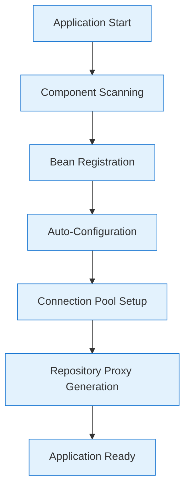
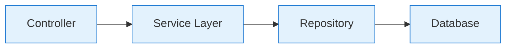
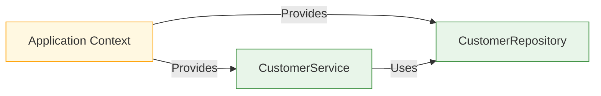
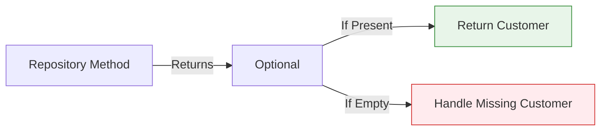
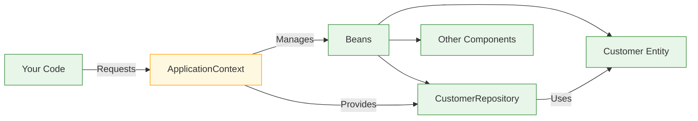
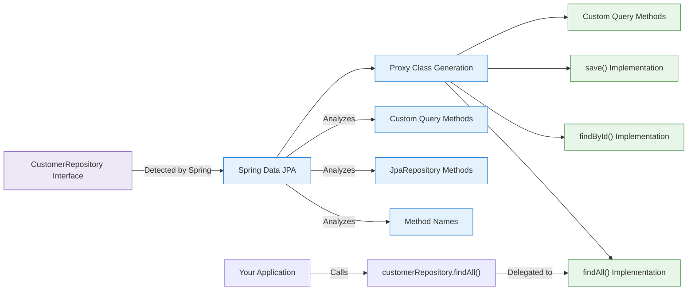
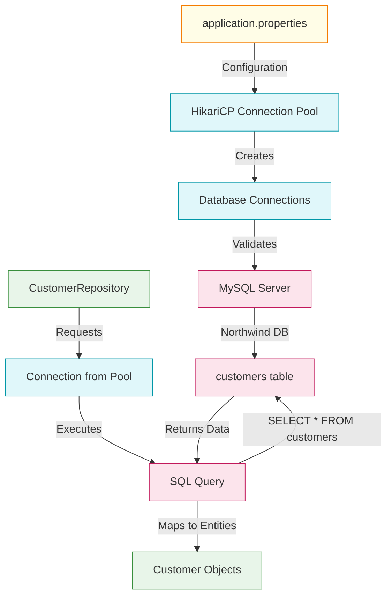
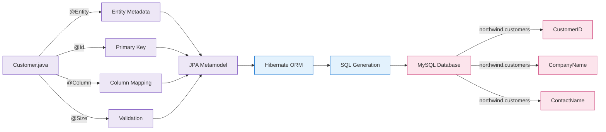
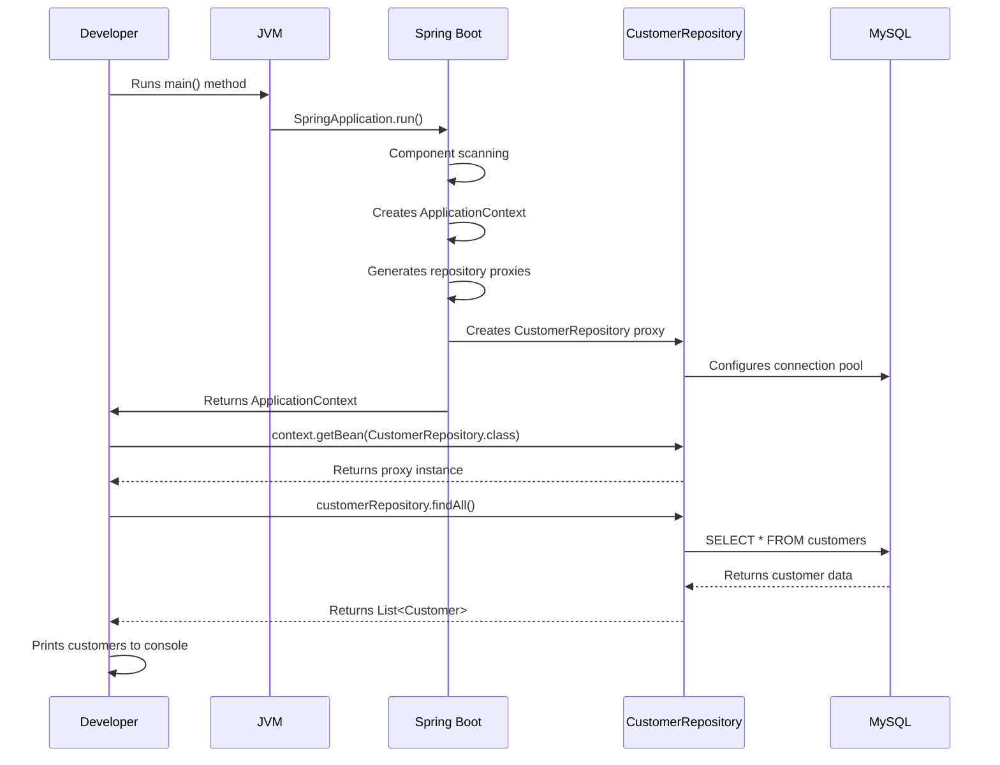
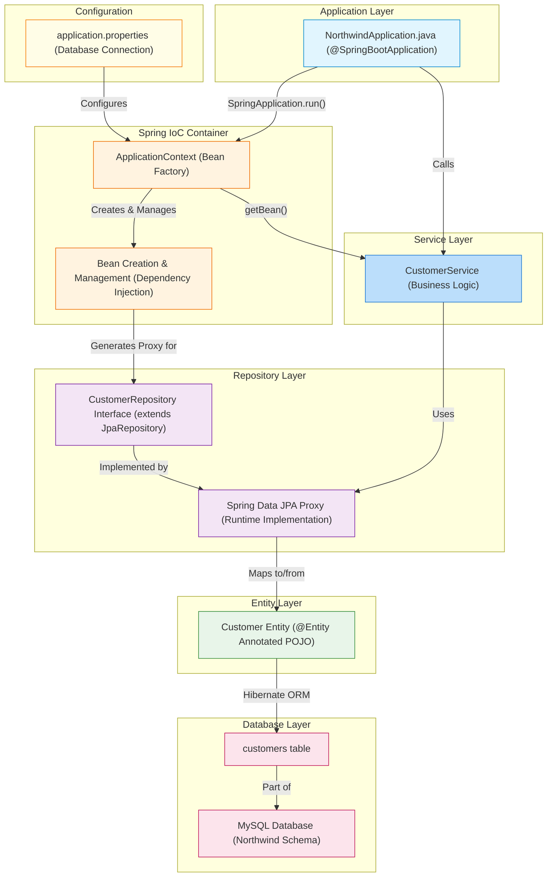

# Spring Boot Northwind Application - Visual Architecture Guide

## Application Startup Lifecycle

This diagram shows the complete sequence of events when your Spring Boot application starts.

### Startup Sequence Flow



### What Happens at Each Stage

#### Application Start
- Your `main()` method executes:
  ```java
  SpringApplication.run(NorthwindApplication.class, args);
  ```
- Spring Boot initializes the application context

#### Component Scanning
- Spring scans for components with annotations:
  - `@Component`, `@Service`, `@Repository`, `@Controller`
  - `@Entity` classes in your package structure
  - Your `CustomerRepository` interface is detected

#### Bean Registration
- Spring registers all discovered components as "beans"
- The `Customer` entity is registered as a managed entity
- Configuration properties are loaded into the context

#### Auto-Configuration
- Spring Boot configures:
  - Database connection using `application.properties`
  - Hibernate ORM settings
  - Transaction management
  - The `PhysicalNamingStrategyStandardImpl` is applied

#### Connection Pool Setup
- HikariCP connection pool is initialized
- Database credentials are validated
- Connection to MySQL `northwind` database is established

#### Repository Proxy Generation
- Spring Data JPA creates runtime implementations:
  - For `CustomerRepository` interface
  - With all standard CRUD methods
  - Proxy class is registered as a bean

#### Application Ready
- Tomcat server starts on port 8091
- Application is ready to serve requests
- Console output shows all retrieved customers

> [!NOTE] Key Insight  
> Spring Boot doesn't require you to write the implementation for `CustomerRepository` - it creates it at runtime based on the interface definition and your entity structure.

---

## Why We Need a Service Layer

### The Missing Piece in Our Architecture



### Why We Created the Service Layer

The service layer is **critical** because it:

1. **Centralizes Business Logic**  
   - Without it, business rules would be scattered across controllers
   - Example: Conflict detection and existence checking should happen in one place

2. **Enables Proper Transaction Management**  
   - Transactions should begin and end at the service level
   - Multiple repository calls should be in a single transaction

3. **Provides Separation of Concerns**  
   - Controllers handle HTTP requests/responses
   - Repositories handle data access only
   - Services handle business logic

4. **Makes Testing Easier**  
   - Business logic can be tested independently of HTTP or database

5. **Allows for Reusability**  
   - Same service can be used by REST controllers, CLI apps, scheduled tasks

### Real-World Example: Customer Validation

Without service layer (BAD):
```java
// In controller - business logic leaks into presentation layer
@PostMapping("/customers")
public Customer createCustomer(@RequestBody Customer customer) {
    if (customerRepository.existsById(customer.getCustomerID())) {
        throw new IllegalArgumentException("Customer already exists");
    }
    return customerRepository.save(customer);
}
```

With service layer (GOOD):
```java
// Controller remains clean - handles validation only
@PostMapping("/customers")
public ResponseEntity<Customer> addCustomer(@Valid @RequestBody Customer customer) {
    Customer savedCustomer = customerService.createCustomer(customer);
    return ResponseEntity.status(201).body(savedCustomer);
}

// Service contains business logic
@Service
public class CustomerService {
    public Customer createCustomer(Customer customer) {
        if (customerRepository.existsById(customer.getCustomerID())) {
            throw new ResponseStatusException(HttpStatus.CONFLICT, "Customer already exists");
        }
        return customerRepository.save(customer);
    }
}
```

> [!TIP] Service Layer Purpose  
> The service layer is where your application's **business rules** live. It's the brain of your application that decides what's allowed, what's valid, and how operations should proceed.

---

## Dependency Injection Explained

### What is Dependency Injection?

Dependency Injection (DI) is a design pattern where objects receive their dependencies from external sources rather than creating them internally.

#### Core Concept



### How Dependency Injection Works

#### Without DI (Manual Approach - BAD)

```java
public class CustomerService {
    // Manually creating dependencies (tight coupling)
    private CustomerRepository customerRepository = new CustomerRepository();
    
    // Hard to test, can't replace implementation
}
```

#### With DI (Spring Approach - GOOD)

```java
@Service
public class CustomerService {
    // Spring provides the dependency
    private final CustomerRepository customerRepository;
    
    // Constructor injection (best practice)
    public CustomerService(CustomerRepository customerRepository) {
        this.customerRepository = customerRepository;
    }
}
```

### Key Benefits of Dependency Injection

| Benefit | Explanation | Real Impact |
|---------|-------------|-------------|
| **Loose Coupling** | Classes don't create their own dependencies | Can swap implementations without changing code |
| **Testability** | Dependencies can be mocked for testing | Isolated unit tests without database |
| **Maintainability** | Clear dependency structure | Easier to understand and modify code |
| **Reusability** | Components can be used in different contexts | Same service used by REST and CLI interfaces |
| **Configuration Centralization** | Dependencies configured in one place | No scattered `new` statements |

### Types of Dependency Injection in Spring

```java
// 1. Constructor Injection (BEST PRACTICE)
@Service
public class CustomerService {
    private final CustomerRepository repo;
    
    public CustomerService(CustomerRepository repo) {
        this.repo = repo;
    }
}

// 2. Setter Injection (less common)
@Service
public class CustomerService {
    private CustomerRepository repo;
    
    @Autowired
    public void setRepo(CustomerRepository repo) {
        this.repo = repo;
    }
}

// 3. Field Injection (AVOID - makes testing harder)
@Service
public class CustomerService {
    @Autowired
    private CustomerRepository repo;
}
```

> [!TIP] Why Constructor Injection is Best  
> Constructor injection:
> - Makes dependencies **explicit**
> - Allows fields to be `final` (immutable)
> - Guarantees dependencies are available when object is created
> - Makes testing straightforward (just pass mocks to constructor)

---

## Understanding Optionals in Java

### What Are Optionals?

`Optional` is a container object that may or may not contain a non-null value. Introduced in Java 8 to help deal with null values and avoid `NullPointerException`.

### Why We Use Optionals



### How Optionals Work in Repository Methods

```java
// Repository method returns Optional
Optional<Customer> findById(String id);

// Usage in service layer
public Customer getCustomerById(String id) {
    // Using Optional to handle potential absence
    return customerRepository.findById(id)
        .orElseThrow(() -> new CustomerNotFoundException("Customer not found with ID: " + id));
}
```

### Common Optional Methods

| Method | Purpose | Example |
|--------|---------|---------|
| `isPresent()` | Checks if value exists | `if (optionalCustomer.isPresent()) { ... }` |
| `get()` | Gets value (throws if empty) | `Customer c = optionalCustomer.get();` |
| `orElse(T other)` | Default value if empty | `optionalCustomer.orElse(defaultCustomer)` |
| `orElseGet(Supplier<? extends T> supplier)` | Lazy default value | `optionalCustomer.orElseGet(() -> createNewCustomer())` |
| `orElseThrow()` | Throws exception if empty | `optionalCustomer.orElseThrow()` |
| `orElseThrow(Supplier<? extends X> exceptionSupplier)` | Custom exception | `optionalCustomer.orElseThrow(() -> new CustomerNotFoundException())` |
| `ifPresent(Consumer<? super T> consumer)` | Action if value exists | `optionalCustomer.ifPresent(c -> log.info("Found: " + c))` |
| `map(Function<? super T,? extends U> mapper)` | Transform value | `optionalCustomer.map(Customer::getName)` |

### Why We Added This Layer (Optional)

The Optional layer was added **between the repository and service layers** to:

1. **Make null handling explicit** - Forces developers to handle the "not found" case
2. **Improve code readability** - Clearer that a value might be absent
3. **Prevent NullPointerExceptions** - Encourages safe handling of missing data
4. **Provide fluent API** - Chain operations without null checks

### Real Implementation Example

```java
// Repository interface
public interface CustomerRepository extends JpaRepository<Customer, String> {
    // Returns Optional<Customer> instead of just Customer
    Optional<Customer> findById(String id);
}

// Service implementation
@Service
public class CustomerService {
    public Customer getCustomerById(String id) {
        // Explicit handling of "not found" case
        return customerRepository.findById(id)
            .orElseThrow(() -> new IllegalArgumentException("Customer not found: " + id));
    }
    
    public Customer getCustomerOrFallback(String id) {
        // Providing a default when not found
        return customerRepository.findById(id)
            .orElse(createDefaultCustomer());
    }
}
```

> [!TIP] Optional Best Practices  
> - **Use as return types** for methods that might not return a value
> - **Don't use as fields** in classes (not serializable)
> - **Don't use as method parameters** (confusing)
> - **Don't just call get()** without checking (defeats the purpose)
> - **Prefer orElseThrow()** for required entities

---

## Dependency Injection Flow

This diagram shows how objects connect through Spring's dependency injection system.

### Dependency Injection Process



### How Dependency Injection Works

#### Bean Creation
- Spring creates and manages all beans in the ApplicationContext
- This includes your entities, repositories, and services

#### Bean Request
- Your code requests a bean:
  ```java
  CustomerRepository customerRepository = context.getBean(CustomerRepository.class);
  ```

#### Bean Provision
- Spring provides the proxy implementation it created
- You get a working repository without writing implementation code

#### Relationship Mapping
- The repository knows how to interact with the Customer entity
- Entity fields map to database columns through JPA annotations

> [!TIP] Understanding the Magic  
> When you see `CustomerRepository customerRepository = context.getBean(CustomerRepository.class);`, you're not getting an interface - you're getting a runtime-generated implementation class that Spring created for you.

---

## Repository Proxy Generation Process

This diagram shows how Spring Data JPA creates repository implementations at runtime.

### Repository Implementation Flow



### How Repository Proxy Generation Works

#### Interface Detection
- Spring finds your repository interface:
  ```java
  public interface CustomerRepository extends JpaRepository<Customer, String> {
      // Empty interface
  }
  ```

#### Method Analysis
- Spring analyzes:
  - Methods inherited from `JpaRepository`
  - Custom query methods you might add
  - Method naming conventions for query derivation

#### Proxy Class Generation
- At runtime, Spring creates a concrete implementation
- This class implements all necessary methods
- No Java code is written to disk - it's in memory only

#### Method Implementation
- Standard methods (`findAll()`, `findById()`, `save()`) get implementations
- Query methods are generated based on method names
- SQL is created dynamically based on entity mapping

> [!WARNING] Critical Detail  
> The second type parameter in `JpaRepository<Customer, String>` must match the type of your `@Id` field. In your `Customer` entity, `customerID` is a `String`, so the repository must use `String` as the ID type.

---

## Database Connection Lifecycle

This diagram shows how database connections are established and managed.

### Connection Management Flow



### How Database Connections Work

#### 1. **Configuration**
   - Settings from `application.properties`:
     ```properties
     spring.datasource.url=jdbc:mysql://localhost:3306/northwind
     spring.datasource.username=root
     spring.datasource.password=root
     ```

#### 2. **Connection Pool Initialization**
   - HikariCP creates a pool of database connections
   - Connections are validated before being used
   - Pool size is managed automatically

#### 3. **Naming Strategy Configuration**
   - The critical setting:
     ```properties
     spring.jpa.hibernate.naming.physical-strategy=org.hibernate.boot.model.naming.PhysicalNamingStrategyStandardImpl
     ```  
   - This preserves exact column names (critical for Northwind's PascalCase columns)

#### 4. **Query Execution**
   - When you call `customerRepository.findAll()`
   - Spring gets a connection from the pool
   - Hibernate generates SQL: `SELECT * FROM customers`
   - Results are mapped to `Customer` objects

> [!TIP] Why Naming Strategy Matters  
> Without the correct naming strategy, Hibernate would look for `customer_id` instead of `CustomerID`, causing errors. Your Northwind database uses PascalCase column names, which don't match Java's camelCase conventions.

---

## Entity Mapping Process

This diagram shows how your Java entities map to database tables.

### Entity-Database Mapping



### Key Mapping Concepts

| Java Annotation | Database Mapping | Purpose |
|-----------------|------------------|---------|
| `@Entity` | Table | Marks class as persistent |
| `@Table(name="...")` | Custom table name | Overrides default table name |
| `@Id` | Primary Key | Identifies unique record |
| `@Column(name="...")` | Column name | Maps field to specific column |
| `@NotBlank(message="...")` | Validation | Ensures field is not null or empty |
| `@Size(max=...)` | Validation | Enforces length constraints |

### How Entity Mapping Works

#### Entity Definition
```java
@Entity
@Table(name = "customers", schema = "northwind")
public class Customer {
    @Id
    @Column(name = "CustomerID", nullable = false)
    @NotBlank(message = "Customer ID cannot be null or empty")
    private String customerID;

    // Other fields...
}
```

#### Metadata Collection
- Spring processes all JPA annotations
- Builds a complete metadata model of your entity
- Understands relationships, constraints, and mappings

#### ORM Translation
- Hibernate converts entity operations to SQL
- `customerRepository.findAll()` becomes `SELECT * FROM customers`
- Object properties map to database columns

#### Validation Enforcement
- Controller-level validation with `@Size(max = 5)` on path variables
- Entity-level validation with `@NotBlank` on required fields
- Request body validation with `@Valid` annotation
- Prevents invalid data from being processed or saved to the database
- Works with Spring's comprehensive validation system

> [!NOTE] Key Insight  
> The `@Column(name = "CustomerID")` annotation is critical - it tells Hibernate to use the exact column name from your database rather than converting to snake_case.

---

## Request Processing Flow

This diagram shows how a simple request flows through your application.

### Request Processing Sequence



### What Happens During Request Processing

#### Application Initialization
- Spring Boot sets up the entire application context
- Database connection is established
- Repository implementations are generated

#### Bean Retrieval
- You request the repository from the context
- Spring provides the runtime-generated implementation

#### Data Retrieval
- When calling `findAll()`, Spring:
  - Gets a connection from the pool
  - Generates and executes the SQL query
  - Maps results to entity objects
- Returns the list of customers

#### Result Handling
- Your application receives fully populated Customer objects
- You can work with them as regular Java objects
- No manual SQL or result set handling is needed

> [!TIP] Understanding the Flow  
> The beauty of Spring Data JPA is that you only need to define the repository interface. All the database interaction code is generated at runtime based on your entity structure and method names.

---

## Complete Application Architecture

This diagram shows the full architecture of your Northwind application with all components.

### Full System Architecture



### How All Components Work Together

#### Application Layer
- Your `NorthwindApplication` class with `main()` method
- Entry point for the entire application
- Starts the Spring Boot process

#### Spring IoC Container
- The heart of Spring's dependency injection system
- Manages the lifecycle of all components
- Creates and wires together all beans

#### Service Layer
- Your `CustomerService` class with business logic
- Handles conflict detection, existence checking, and transactions
- Coordinates between repositories for multi-step operations

#### Repository Layer
- Your `CustomerRepository` interface
- Runtime-generated implementation with all CRUD methods
- Bridge between Java objects and database operations

#### Entity Layer
- `Customer` class with JPA annotations
- Represents the database table structure in Java
- Contains validation and mapping information

#### Database Layer
- MySQL server with Northwind database
- `customers` table with all customer data
- Performance-optimized with indexes

#### Configuration
- `application.properties` file
- Database connection details
- Critical naming strategy setting

> [!NOTE] Key Architecture Insight  
> The power of this architecture is in its separation of concerns. Each layer has a specific responsibility, making the application maintainable, testable, and scalable. You work with Java objects in your code, while Spring handles all the database interaction behind the scenes.

---

## Summary of Visual Insights

### Critical Visual Takeaways

| Insight | Details | Importance |
|---------|---------|------------|
| **Spring Creates Implementations at Runtime** | You define interfaces, Spring provides implementations | Eliminates boilerplate code |
| **Naming Strategy is Critical for Legacy Databases** | Without `PhysicalNamingStrategyStandardImpl`, queries would fail | Essential for Northwind compatibility |
| **ID Type Must Match Exactly** | `Customer` entity has `String customerID`<br>Repository must use `JpaRepository<Customer, String>` | Prevents runtime errors |
| **Connection Pooling is Automatic** | HikariCP manages database connections | Improves performance and resource usage |
| **Complete Separation of Concerns** | Each layer has a specific responsibility | Makes application maintainable, testable, and scalable |
| **Service Layer is Business Brain** | Centralizes business rules and conflict detection | Prevents business logic leakage into controllers |
| **Optional Handles Missing Data** | Explicit way to handle "not found" cases | Prevents NullPointerExceptions |

> [!TIP] For Visual Learners  
> Keep these diagrams in mind as you work with your application. When you see `customerRepository.findAll()`, visualize the entire flow from your code through the service layer, to the repository proxy, to the SQL query, and back to your Java objects. Understanding this flow will help you troubleshoot issues and design better applications.

#java/springboot #architecture/visual #java/jpa #database/mysql #tools/intellij #dependency-injection #optional #service-layer