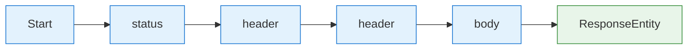
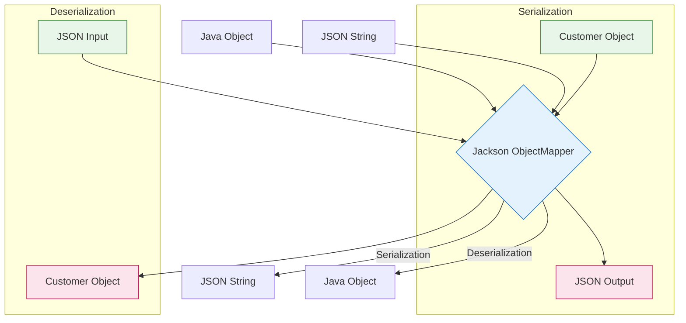
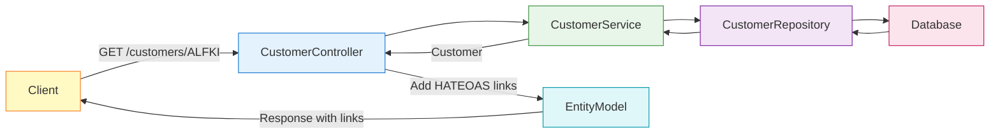
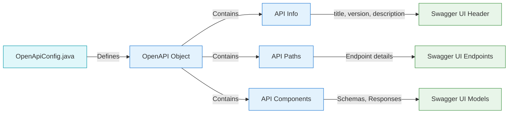
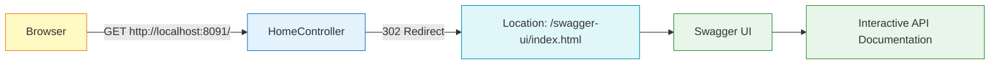
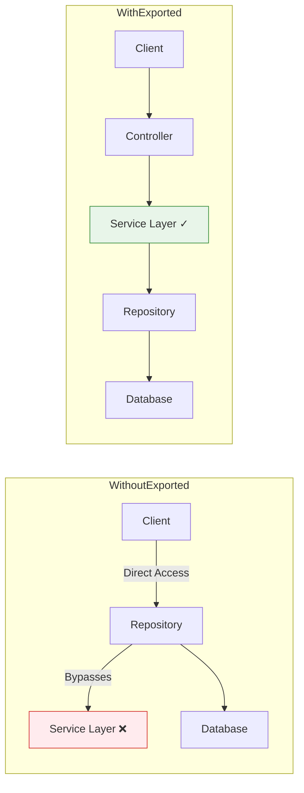
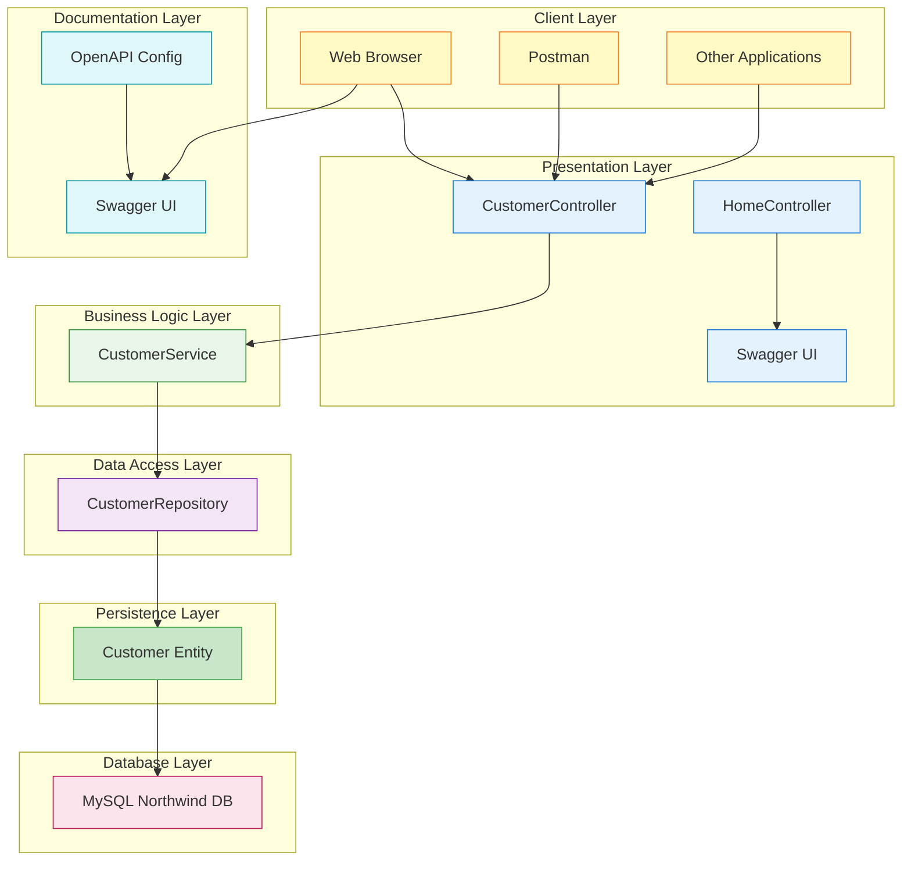

# Understanding REST Controllers and API Documentation - A Complete Deep Dive

---
tags: [java/springboot, rest/api, swagger/openapi, architecture/mvc, patterns/controller, patterns/builder]
date: 2025-09-07
topic: Deep Dive into REST Controllers, ResponseEntity, and API Documentation
---

## The Foundation: What @RestController Really Does

Let me start by explaining what's happening when you use `@RestController`. This annotation is actually a combination of two other annotations, and understanding this combination is crucial to grasping how Spring Boot handles web requests.

```java
@RestController = @Controller + @ResponseBody
```

Think of it this way: imagine you're running a restaurant. The `@Controller` annotation tells Spring "this class is a waiter who takes orders," while `@ResponseBody` adds "and whatever the kitchen sends back should go directly to the customer as food, not as a recipe card." Without `@ResponseBody`, Spring would assume you're returning the name of a view (like an HTML page), not the actual data.

Let me show you what this means with your actual code:

```java
@RestController // This single annotation does two things!
@RequestMapping("/customers")
public class CustomerController {
    
    @GetMapping("/")
    public ResponseEntity<List<Customer>> getAllCustomers() {
        List<Customer> customers = service.getAllCustomer();
        return ResponseEntity.ok(customers);
    }
}
```

If you had used just `@Controller` without `@ResponseBody`, Spring would look for a view named "customers" instead of returning the actual customer data as JSON. The `@RestController` tells Spring: "Everything I return from this class should be serialized (converted) directly into the response body, typically as JSON."

### The Controller Pattern Visualization

```mermaid
flowchart LR
    A[HTTP Request] --> B[DispatcherServlet]
    B --> C[CustomerController]
    C -->|Delegates to| D[CustomerService]
    D -->|Business Logic| E[CustomerRepository]
    E -->|Database Access| F[MySQL]
    F -->|Data| E
    E -->|Entities| D
    D -->|Processed Data| C
    C -->|HTTP Response| B
    B -->|Serialized JSON| A
    
    classDef request fill:#fff9c4,stroke:#f57f24;
    class A request;
    
    classDef controller fill:#e3f2fd,stroke:#1976d2;
    class C controller;
    
    classDef service fill:#e8f5e9,stroke:#388e3c;
    class D service;
    
    classDef repo fill:#f3e5f5,stroke:#7b1fa2;
    class E repo;
    
    classDef db fill:#fce4ec,stroke:#c2185b;
    class F db;
```



> [!TIP] REST vs Traditional Controllers  
> `@RestController` = Returns data (JSON/XML) for APIs  
> `@Controller` = Returns view names for web pages (HTML)  
> 
> Since you're building an API, not a website with pages, you use `@RestController`.

## The Single Responsibility of Controllers

Here's a critical architectural principle you're following: **controllers should only orchestrate, never implement business logic**. Think of a controller as a traffic director at a busy intersection. The traffic director doesn't drive the cars, repair them, or decide their destination - they simply direct traffic to the appropriate lanes.

Your controller demonstrates this perfectly:

```java
@RestController
@RequestMapping("/customers")
public class CustomerController {

    private final CustomerService service;

    public CustomerController(CustomerService service) {
        this.service = service;
    }

    @GetMapping("/{id}")
    public ResponseEntity<Customer> getCustomerById(@PathVariable String id) {
        // The controller ONLY:
        // 1. Receives the HTTP request
        // 2. Extracts the parameter
        // 3. Calls the service method
        // 4. Wraps the response appropriately
        Customer customer = service.getCustomerByID(id);
        
        if (customer != null) {
            return ResponseEntity.ok(customer);
        } else {
            return ResponseEntity.notFound().build();
        }
    }
}
```

Notice how the controller doesn't validate the ID length, doesn't access the database, and doesn't implement any business rules. It simply coordinates between the HTTP layer and your service layer. This separation is crucial because it means you could switch from REST to GraphQL, or add a command-line interface, without changing your business logic at all.

### Controller Responsibilities Breakdown

| Responsibility | What the Controller Does | What the Controller Should NOT Do |
|----------------|--------------------------|----------------------------------|
| **Request Handling** | Receives HTTP requests, extracts parameters | Implement business rules |
| **Response Formatting** | Wraps data in ResponseEntity with proper status codes | Directly access database |
| **Orchestration** | Calls service methods with extracted parameters | Validate business rules |
| **Error Handling** | Returns appropriate HTTP status codes for errors | Implement domain-specific logic |
| **Input Validation** | HTTP-level validation (@Valid, @Size, etc.) | Complex domain-specific business validation |

> [!NOTE] Separation of Concerns  
> Each layer has a specific job:
> - **Controller**: HTTP concerns (status codes, headers, routing) and HTTP-level validation (@Valid, @Size)
> - **Service**: Business logic, conflict detection, existence checking, transaction management
> - **Repository**: Data access only (no business logic)

## Understanding ResponseEntity in Depth

ResponseEntity is like a shipping package for your data. When you send a package through the mail, you don't just throw the item in a mailbox - you put it in a box with a shipping label that includes the address, handling instructions, and tracking information. ResponseEntity serves the same purpose for HTTP responses.

Let me break down what ResponseEntity provides:

```java
public ResponseEntity<Customer> getCustomerById(@PathVariable String id) {
    Customer customer = service.getCustomerByID(id);
    
    if (customer != null) {
        // ResponseEntity.ok() creates a response with:
        // - Status code: 200 OK
        // - Body: the customer object (will be converted to JSON)
        // - Default headers
        return ResponseEntity.ok(customer);
    } else {
        // ResponseEntity.notFound().build() creates:
        // - Status code: 404 Not Found
        // - No body
        // - Default headers
        return ResponseEntity.notFound().build();
    }
}
```

The power of ResponseEntity becomes clearer when you see all the things you can control:

```java
// You can set custom status codes
return ResponseEntity.status(HttpStatus.CREATED).body(savedCustomer);

// You can add custom headers
return ResponseEntity.ok()
    .header("X-Total-Count", String.valueOf(customers.size()))
    .header("X-Custom-Header", "CustomValue")
    .body(customers);

// You can control caching
return ResponseEntity.ok()
    .cacheControl(CacheControl.maxAge(30, TimeUnit.MINUTES))
    .body(customer);

// You can set the content type
return ResponseEntity.ok()
    .contentType(MediaType.APPLICATION_JSON)
    .body(customer);
```

### HTTP Status Code Reference

| Status Code | Name | When to Use |
|-------------|------|-------------|
| **200 OK** | OK | Successful GET/PUT/PATCH requests |
| **201 Created** | Created | After successful POST request that created a resource |
| **204 No Content** | No Content | After successful DELETE or PUT with no response body |
| **400 Bad Request** | Bad Request | Invalid request format or parameters |
| **401 Unauthorized** | Unauthorized | Missing or invalid authentication |
| **403 Forbidden** | Forbidden | Valid authentication but insufficient permissions |
| **404 Not Found** | Not Found | Resource doesn't exist |
| **409 Conflict** | Conflict | Request conflicts with current state (e.g., duplicate ID) |
| **500 Internal Server Error** | Internal Server Error | Unhandled server-side exceptions |

## The Builder Pattern in ResponseEntity

You've asked about the builder pattern, and ResponseEntity is a perfect example of this design pattern in action. The builder pattern allows you to construct complex objects step by step, and it's particularly useful when you have many optional parameters.

Think of the builder pattern like ordering a custom sandwich. Instead of having to specify everything at once ("I want whole wheat bread with turkey, swiss cheese, lettuce, tomato, mayo, no mustard, toasted"), you build it step by step:

```java
// Builder pattern in action with ResponseEntity
return ResponseEntity
    .status(HttpStatus.OK)           // Step 1: Set the status
    .header("X-Processed-By", "CustomerService")  // Step 2: Add a header
    .header("X-Request-ID", "12345")  // Step 3: Add another header
    .body(customer);                  // Step 4: Set the body

// This is much cleaner than a constructor with many parameters:
// new ResponseEntity(customer, headers, HttpStatus.OK); // Harder to read!
```

The builder pattern works by having each method return the builder object itself, allowing you to chain method calls. Here's a simplified version of how ResponseEntity's builder works internally:

```java
public class ResponseEntityBuilder<T> {
    private HttpStatus status;
    private HttpHeaders headers = new HttpHeaders();
    private T body;
    
    public ResponseEntityBuilder<T> status(HttpStatus status) {
        this.status = status;
        return this;  // Returns itself for chaining!
    }
    
    public ResponseEntityBuilder<T> header(String name, String value) {
        this.headers.add(name, value);
        return this;  // Returns itself for chaining!
    }
    
    public ResponseEntity<T> body(T body) {
        this.body = body;
        return new ResponseEntity<>(body, headers, status);
    }
}
```

### Builder Pattern Visualization



> [!TIP] Why Builder Pattern Matters  
> The builder pattern provides:
> - **Readability**: Clear expression of intent
> - **Flexibility**: Add only the parameters you need
> - **Immutability**: Final object is immutable once built
> - **Type Safety**: Compile-time checks for required parameters

## Understanding the Magic of Automatic JSON Serialization

When you return a Java object from your controller, Spring automatically converts it to JSON. This process is called serialization, and it's like translating a book from one language to another. Let me explain both serialization and deserialization:

```java
// SERIALIZATION: Java Object → JSON (when sending responses)
@GetMapping("/")
public ResponseEntity<List<Customer>> getAllCustomers() {
    List<Customer> customers = service.getAllCustomer();
    // Spring automatically converts List<Customer> to JSON array
    return ResponseEntity.ok(customers);
}

// What happens behind the scenes:
// Your Java object:
Customer {
    customerID: "ALFKI",
    companyName: "Alfreds Futterkiste",
    contactName: "Maria Anders"
}

// Becomes this JSON:
{
    "customerID": "ALFKI",
    "companyName": "Alfreds Futterkiste",
    "contactName": "Maria Anders"
}
```

And here's the opposite direction:

```java
// DESERIALIZATION: JSON → Java Object (when receiving requests)
@PostMapping
public ResponseEntity<Customer> addCustomer(@RequestBody Customer customer) {
    // @RequestBody tells Spring to convert incoming JSON to a Customer object
    Customer savedCustomer = service.createCustomer(customer);
    return ResponseEntity.status(201).body(savedCustomer);
}

// What happens behind the scenes:
// Incoming JSON:
{
    "customerID": "TEST1",
    "companyName": "Test Company"
}

// Becomes this Java object:
Customer customer = new Customer();
customer.setCustomerID("TEST1");
customer.setCompanyName("Test Company");
```

Spring uses Jackson library behind the scenes to perform this conversion. It looks at your Java class, finds all the getter methods (for serialization) or setter methods (for deserialization), and maps them to JSON properties.

### JSON Serialization Process Flow



> [!NOTE] Jackson Configuration  
> Spring Boot auto-configures Jackson with sensible defaults, but you can customize it:
> ```java
> @Configuration
> public class JacksonConfig {
>     @Bean
>     public ObjectMapper objectMapper() {
>         return new ObjectMapper()
>             .configure(DeserializationFeature.FAIL_ON_UNKNOWN_PROPERTIES, false)
>             .setDateFormat(new SimpleDateFormat("yyyy-MM-dd"));
>     }
> }
> ```

## Understanding @PathVariable and URL Parameter Mapping

Let me clarify the connection between the URL pattern and the method parameter. This is a common point of confusion, so let's trace through it step by step:

```java
@GetMapping("/{id}")  // {id} is a placeholder in the URL pattern
public ResponseEntity<Customer> getCustomerById(@PathVariable String id) {
    //                                           ^^^^^^^^^^^^^^^^^^^^^^
    //                                           This extracts the value from the URL
    Customer customer = service.getCustomerByID(id);
    //                                          ^^
    //                                          This uses the extracted value
}
```

When someone visits `/customers/ALFKI`, here's what happens:

1. Spring sees the request to `/customers/ALFKI`
2. It matches this to the pattern `/customers/{id}`
3. It extracts "ALFKI" as the value for the `{id}` placeholder
4. The `@PathVariable` annotation tells Spring to inject this value into your method parameter
5. Your method receives "ALFKI" as the `id` parameter

You can even use different names if needed:

```java
@GetMapping("/{customerId}")
public ResponseEntity<Customer> getCustomerById(@PathVariable("customerId") String id) {
    // The URL has {customerId} but the parameter is named id
    // @PathVariable("customerId") creates the connection
}
```

### URL Mapping Visualization


> [!TIP] Multiple Path Variables  
> You can have multiple path variables in a single URL:
> ```java
> @GetMapping("/orders/{customerId}/items/{itemId}")
> public ResponseEntity<OrderItem> getOrderItem(
>     @PathVariable String customerId,
>     @PathVariable String itemId) {
>     // ...
> }
> ```

## Understanding @ResponseStatus as an Alternative

While you're using ResponseEntity (which is more flexible), Spring also offers `@ResponseStatus` for simpler cases:

```java
// Using @ResponseStatus - simpler but less flexible
@GetMapping("/simple")
@ResponseStatus(HttpStatus.OK)  // Always returns 200 OK
public List<Customer> getAllCustomersSimple() {
    return service.getAllCustomer();
    // No ResponseEntity needed - Spring wraps it automatically
}

// For errors, you might throw exceptions with status codes:
@ResponseStatus(HttpStatus.NOT_FOUND)
public class CustomerNotFoundException extends RuntimeException {
    public CustomerNotFoundException(String message) {
        super(message);
    }
}
```

However, ResponseEntity gives you more control because you can decide the status code dynamically based on the result, which is why your implementation uses it.

### ResponseEntity vs @ResponseStatus Comparison

| Feature | ResponseEntity | @ResponseStatus |
|---------|----------------|-----------------|
| **Dynamic Status** | Can set status code based on runtime conditions | Fixed status code for all method invocations |
| **Flexibility** | Can add headers, modify response body | Limited to status code only |
| **Readability** | More verbose but explicit | More concise |
| **Error Handling** | Must handle errors within method | Can use exception classes with status codes |
| **Best For** | Complex responses with conditional status codes | Simple endpoints with consistent status codes |

> [!WARNING] When to Choose Which  
> Use **ResponseEntity** when:
> - You need to return different status codes based on conditions
> - You need to add custom headers
> - You want full control over the response
> 
> Use **@ResponseStatus** when:
> - All responses from a method have the same status code
> - You're throwing custom exceptions for errors
> - You want cleaner, more concise code

## HATEOAS: The Missing Piece in Your REST API

HATEOAS (Hypermedia as the Engine of Application State) is like adding a GPS to your API responses. Instead of just giving data, you also provide links to related resources. Imagine receiving directions that not only tell you where you are but also show you where you can go next.

To add HATEOAS to your project, you would add this dependency to your pom.xml:

```xml
<dependency>
    <groupId>org.springframework.boot</groupId>
    <artifactId>spring-boot-starter-hateoas</artifactId>
</dependency>
```

With HATEOAS, your response would look like this:

```json
{
    "customerID": "ALFKI",
    "companyName": "Alfreds Futterkiste",
    "contactName": "Maria Anders",
    "_links": {
        "self": {
            "href": "http://localhost:8091/customers/ALFKI"
        },
        "all-customers": {
            "href": "http://localhost:8091/customers"
        },
        "orders": {
            "href": "http://localhost:8091/customers/ALFKI/orders"
        }
    }
}
```

The client can navigate your API by following these links, just like clicking hyperlinks on a webpage. This makes your API self-descriptive and easier to explore.

### HATEOAS Implementation Example

```java
import static org.springframework.hateoas.server.mvc.WebMvcLinkBuilder.*;

@RestController
@RequestMapping("/customers")
public class CustomerHateoasController {

    @GetMapping("/{id}")
    public EntityModel<Customer> getCustomerById(@PathVariable String id) {
        Customer customer = service.getCustomerByID(id);
        
        if (customer == null) {
            return null;
        }
        
        // Create a resource with links
        EntityModel<Customer> resource = EntityModel.of(customer);
        
        // Add links to the resource
        resource.add(linkTo(methodOn(CustomerHateoasController.class).getCustomerById(id)).withSelfRel());
        resource.add(linkTo(methodOn(CustomerHateoasController.class).getAllCustomers()).withRel("all-customers"));
        resource.add(linkTo(methodOn(OrderController.class).getOrdersForCustomer(id)).withRel("orders"));
        
        return resource;
    }
}
```

### HATEOAS Architecture



> [!NOTE] HATEOAS Benefits  
> - **Discoverability**: Clients can explore the API without prior knowledge
> - **Decoupling**: Clients don't need hardcoded URLs
> - **Versioning**: Easier to change endpoint structure without breaking clients
> - **State Management**: Provides context about available next actions

## OpenAPI and Swagger: Your API's Interactive Documentation

OpenAPI (formerly known as Swagger) is a specification for describing REST APIs, while Swagger UI is a tool that creates beautiful, interactive documentation from that specification. Think of OpenAPI as the blueprint and Swagger UI as the interactive 3D model built from that blueprint.

Your configuration sets this up:

```java
@Configuration
public class OpenApiConfig {
    @Bean
    public OpenAPI customOpenAPI() {
        return new OpenAPI()
                .info(new Info()
                        .title("Northwind API")
                        .version("1.0")
                        .description("API documentation for the Northwind application"));
    }
}
```

This configuration object tells Swagger UI what to display as the main title and description of your API. The `@Bean` annotation ensures Spring manages this configuration and makes it available to the Swagger UI components.

### OpenAPI Configuration Flow



## The Power of Swagger Annotations

The `@Operation` annotations in your controller add rich documentation to each endpoint:

```java
@Operation(
    summary = "Get customer by ID",  // Short description
    description = "Retrieve a customer from the database using their unique ID"  // Detailed explanation
)
@GetMapping("/{id}")
public ResponseEntity<Customer> getCustomerById(@PathVariable String id) {
    // Method implementation
}
```

You can enhance this documentation even further:

```java
@Operation(
    summary = "Get customer by ID",
    description = "Retrieve a customer from the database using their unique ID",
    responses = {
        @ApiResponse(responseCode = "200", description = "Customer found",
                    content = @Content(schema = @Schema(implementation = Customer.class))),
        @ApiResponse(responseCode = "404", description = "Customer not found"),
        @ApiResponse(responseCode = "400", description = "Invalid ID format")
    }
)
@GetMapping("/{id}")
public ResponseEntity<Customer> getCustomerById(
    @Parameter(description = "The customer's unique identifier", example = "ALFKI")
    @PathVariable String id
) {
    // Method implementation
}
```

These annotations generate comprehensive documentation that appears in your Swagger UI, eliminating the need for separate API documentation.

### Swagger Annotation Reference

| Annotation | Purpose | Example Use Case |
|------------|---------|------------------|
| `@Operation` | Describes a single operation | `@Operation(summary = "Get customer", description = "...")` |
| `@ApiResponse` | Describes possible responses | `@ApiResponse(responseCode = "200", description = "Success")` |
| `@Parameter` | Describes a parameter | `@Parameter(description = "Customer ID", example = "ALFKI")` |
| `@Schema` | Describes data model | `@Schema(implementation = Customer.class)` |
| `@Content` | Describes response content | `@Content(schema = @Schema(implementation = Customer.class))` |

> [!TIP] Best Practices for Swagger Documentation  
> - Always include a **summary** for each endpoint
> - Provide detailed **descriptions** for complex endpoints
> - Document all possible **response codes** with descriptions
> - Add **examples** for parameters and responses
> - Use **@Schema** to document complex data structures

## The Clever Redirect to Swagger UI

Your HomeController implements a smart user experience enhancement:

```java
@RestController
public class HomeController {
    @GetMapping("/")
    public ResponseEntity<Void> redirectToSwaggerUI() {
        HttpHeaders headers = new HttpHeaders();
        headers.add("Location", "/swagger-ui/index.html");
        return ResponseEntity.status(HttpStatus.FOUND).headers(headers).build();
    }
}
```

This controller acts like a helpful receptionist. When someone arrives at your application's front door (http://localhost:8091/), instead of showing them a blank wall, it automatically guides them to the information desk (Swagger UI). The HTTP status code 302 (FOUND) tells the browser "what you're looking for is over here" and the Location header specifies where "here" is.

Without this redirect, developers would need to know the exact URL of your Swagger documentation. With it, they can simply go to your base URL and immediately see all available endpoints with try-it-out functionality.

### Swagger Redirect Flow



> [!TIP] Alternative Documentation Approaches  
> Besides Swagger UI, you can also generate:
> - **ReDoc**: A more minimalistic documentation viewer
> - **Swagger Codegen**: Client SDKs in multiple languages
> - **OpenAPI Specification**: Machine-readable API description (YAML/JSON)

## Why We Prevent Direct Repository Access

The `@RepositoryRestResource(exported = false)` annotation on your repository is a crucial security and architecture decision:

```java
@RepositoryRestResource(exported = false)  // This prevents Spring Data REST from creating endpoints
public interface CustomerRepository extends JpaRepository<Customer, String> {
}
```

Without this annotation, Spring Data REST would automatically create endpoints like:

- GET /customers (bypassing your service)
- POST /customers (bypassing validation)
- DELETE /customers/{id} (bypassing business rules)

This would be like having a secret back door to your kitchen that lets customers cook their own food, bypassing your chefs entirely. By setting `exported = false`, you ensure all requests must go through your properly controlled front door (your controllers) where your business logic can be applied consistently.

### Repository Exposure Comparison



> [!WARNING] Security Implications  
> Without `exported = false`:
> - Business rules would be bypassed
> - Validation would not be enforced
> - Transaction management might be inconsistent
> - Your API would have duplicate endpoints (your controllers + Spring Data REST)
> - Security configuration would need to be applied in two places

## The Complete JSON Serialization Process

Let me trace through exactly what happens when your controller returns 

```java
@GetMapping("/")
public ResponseEntity<List<Customer>> getAllCustomers() {
    List<Customer> customers = service.getAllCustomer();
    return ResponseEntity.ok(customers);
}
```

Here's the complete journey:

1. **Service returns Java objects**: Your service returns a `List<Customer>` with actual Java objects in memory
2. **Controller wraps in ResponseEntity**: The controller adds HTTP metadata (status code 200, headers)
3. **Spring invokes HttpMessageConverter**: Spring finds an appropriate converter (usually MappingJackson2HttpMessageConverter)
4. **Jackson serialization begins**: Jackson examines your Customer class
5. **Property discovery**: Jackson finds all properties through getter methods
6. **JSON generation**: Each property becomes a JSON field
7. **List handling**: The List becomes a JSON array
8. **Response assembly**: The JSON is combined with headers and status code
9. **Client receives response**: The browser/client gets properly formatted JSON

This entire process happens automatically because of the `@RestController` annotation, which includes `@ResponseBody`, telling Spring to serialize the return value into the response body.

### JSON Serialization Flow Diagram

```mermaid
flowchart LR
    A[Service Layer] -->|Java Objects| B[Controller]
    B -->|ResponseEntity| C[DispatcherServlet]
    C -->|HttpMessageConverter| D[Jackson ObjectMapper]
    D -->|Serialization| E[JSON String]
    E -->|HTTP Response| F[Client]
    
    classDef service fill:#e8f5e9,stroke:#388e3c;
    class A service;
    
    classDef controller fill:#e3f2fd,stroke:#1976d2;
    class B controller;
    
    classDef spring fill:#e0f7fa,stroke:#0097a7;
    class C,D spring;
    
    classDef json fill:#f3e5f5,stroke:#7b1fa2;
    class E json;
    
    classDef client fill:#fff9c4,stroke:#f57f24;
    class F client;
```



## Bringing It All Together

Your complete REST API architecture now provides a professional, self-documenting web service. When a request arrives at http://localhost:8091/customers/ALFKI, it flows through these carefully orchestrated layers, each with its specific responsibility. The controller handles HTTP concerns, the service implements business logic, the repository manages data access, and Swagger provides interactive documentation for developers.

The combination of ResponseEntity for flexible response handling, automatic JSON serialization for data transformation, and Swagger UI for documentation creates an API that's not just functional but also developer-friendly. Any developer can visit your application, be automatically redirected to comprehensive documentation, and immediately start testing your endpoints without needing Postman or any other external tools.

This architecture demonstrates professional software engineering practices: separation of concerns, single responsibility principle, proper HTTP semantics, and self-documenting code. You've built not just an API, but a complete developer experience.

### Complete API Architecture



> [!TIP] Key Takeaway  
> Remember that each piece serves a specific purpose: controllers orchestrate, services implement business logic, repositories handle data access, ResponseEntity provides HTTP flexibility, and Swagger makes everything discoverable. Understanding how these pieces fit together is what transforms you from someone who writes code to someone who architects solutions.

#java/springboot #rest-api #swagger #controllers #serialization #builder-pattern #hateoas #api-documentation