# REST Controllers and API Documentation - Completing Your Northwind Web Service

## What Are REST Controllers? (The Web Gateway to Your Application)

### Controllers = Your Application's Reception Desk

```mermaid
flowchart LR
    A[Web Browser/Client] -->|HTTP Request| B[REST Controller]
    B -->|Delegates to| C[Service Layer]
    C -->|Business Logic| D[Repository]
    D -->|Database Query| E[MySQL]
    E -->|Data| D
    D -->|Entities| C
    C -->|Processed Data| B
    B -->|HTTP Response| A

    classDef client fill:#fff9c4,stroke:#f57f24;
    class A client;

    classDef controller fill:#e3f2fd,stroke:#1976d2;
    class B controller;

    classDef service fill:#e8f5e9,stroke:#388e3c;
    class C service;

    classDef repo fill:#f3e5f5,stroke:#7b1fa2;
    class D repo;

    classDef db fill:#fce4ec,stroke:#c2185b;
    class E db;
```



Think of REST controllers as the reception desk at a hotel. When guests (HTTP requests) arrive, the receptionist (controller) doesn't clean the rooms or cook the food themselves. Instead, they direct requests to the appropriate department (service layer) and then provide the guest with the result (HTTP response). The receptionist knows how to communicate with guests in their language (HTTP) and translate that into internal hotel operations.

> [!TIP]
> Why You Need Controllers
  
> Without controllers, your service layer would be like a restaurant kitchen with no waiters - the food might be great, but customers can't order it! Controllers expose your business logic to the web, making it accessible through HTTP endpoints.

## Your CustomerController Implementation

### The Complete REST Controller

```java
package com.sparta.northwind.controllers;
import com.sparta.northwind.entities.Customer;
import com.sparta.northwind.services.CustomerService;
import io.swagger.v3.oas.annotations.Operation;
import jakarta.validation.Valid;
import jakarta.validation.ConstraintViolationException;
