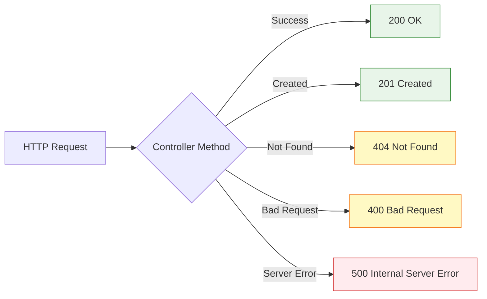
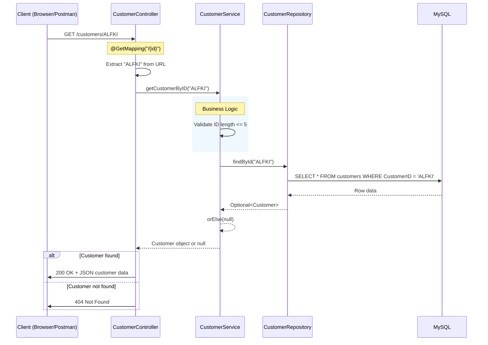
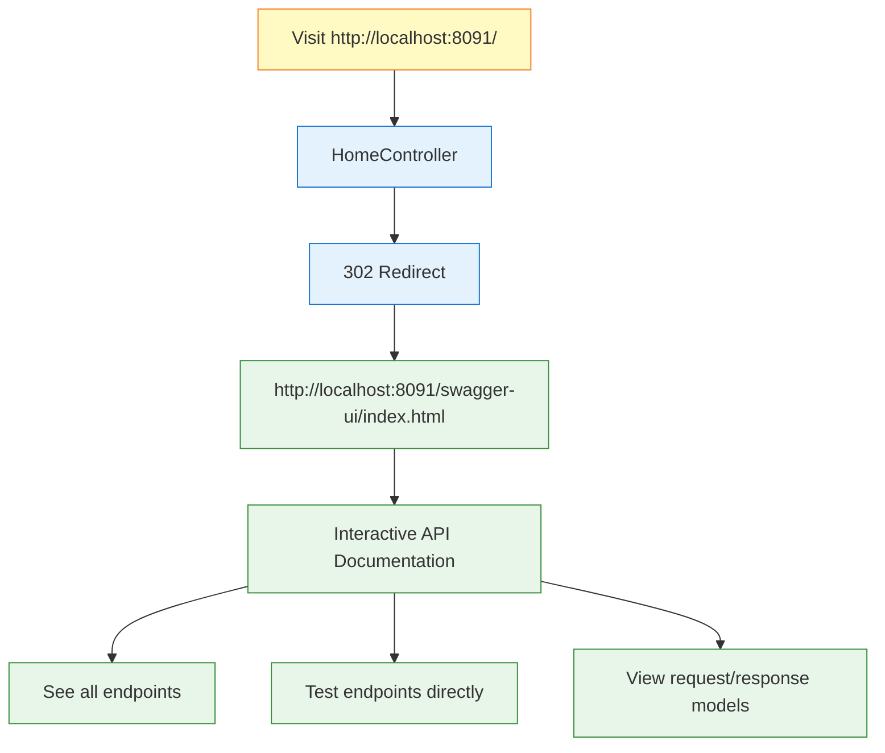
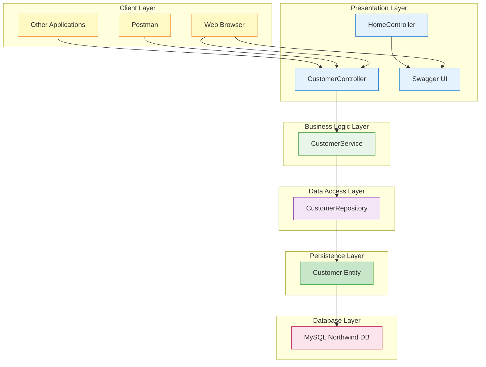

# REST Controllers and API Documentation - Completing Your Northwind Web Service

## What Are REST Controllers? (The Web Gateway to Your Application)

### Controllers = Your Application's Reception Desk

```mermaid
flowchart LR
    A[Web Browser/Client] -->|HTTP Request| B[REST Controller]
    B -->|Delegates to| C[Service Layer]
    C -->|Business Logic| D[Repository]
    D -->|Database Query| E[MySQL]
    E -->|Data| D
    D -->|Entities| C
    C -->|Processed Data| B
    B -->|HTTP Response| A

    classDef client fill:#fff9c4,stroke:#f57f24;
    class A client;

    classDef controller fill:#e3f2fd,stroke:#1976d2;
    class B controller;

    classDef service fill:#e8f5e9,stroke:#388e3c;
    class C service;

    classDef repo fill:#f3e5f5,stroke:#7b1fa2;
    class D repo;

    classDef db fill:#fce4ec,stroke:#c2185b;
    class E db;
```



Think of REST controllers as the reception desk at a hotel. When guests (HTTP requests) arrive, the receptionist (controller) doesn't clean the rooms or cook the food themselves. Instead, they direct requests to the appropriate department (service layer) and then provide the guest with the result (HTTP response). The receptionist knows how to communicate with guests in their language (HTTP) and translate that into internal hotel operations.

> [!TIP] Why You Need Controllers  
> Without controllers, your service layer would be like a restaurant kitchen with no waiters - the food might be great, but customers can't order it! Controllers expose your business logic to the web, making it accessible through HTTP endpoints.

## Your CustomerController Implementation

### The Complete REST Controller

```java
package com.sparta.northwind.controllers;

import com.sparta.northwind.entities.Customer;
import com.sparta.northwind.services.CustomerService;
import io.swagger.v3.oas.annotations.Operation;
import jakarta.validation.Valid;
import jakarta.validation.ConstraintViolationException;
import jakarta.validation.constraints.Size;
import org.springframework.http.HttpStatus;
import org.springframework.http.ResponseEntity;
import org.springframework.web.bind.annotation.*;
import org.springframework.validation.annotation.Validated;

import java.util.List;

@RestController // This combines @Controller and @ResponseBody
@RequestMapping("/customers") // Base URL for all methods in this controller
@Validated // Enables validation for path variables and request parameters
public class CustomerController {

    private final CustomerService service;

    // Constructor injection - Spring provides the service automatically
    public CustomerController(CustomerService service) {
        this.service = service;
    }

    @Operation(summary = "Get all customers", description = "Retrieve a list of all customers")
    @GetMapping("/") // Maps to GET /customers/
    public ResponseEntity<List<Customer>> getAllCustomers() {
        List<Customer> customers = service.getAllCustomer();
        return ResponseEntity.ok(customers); // Returns 200 OK with the customer list
    }

    @Operation(summary = "Get customer by ID", description = "Retrieve a customer from the database using their unique ID")
    @GetMapping("/{id}") // Maps to GET /customers/ALFKI
    public ResponseEntity<Customer> getCustomerById(
            @Size(min = 1, max = 5) @PathVariable String id) {
        Customer customer = service.getCustomerByID(id);
        return customer != null ? ResponseEntity.ok(customer) : ResponseEntity.notFound().build();
    }

    @Operation(summary = "Add a new customer", description = "Create a new customer in the database")
    @PostMapping // Maps to POST /customers
    public ResponseEntity<Customer> addCustomer(@Valid @RequestBody Customer customer) {
        Customer savedCustomer = service.createCustomer(customer); // Updated method name
        return ResponseEntity.status(201).body(savedCustomer); // 201 Created
    }

    @Operation(summary = "Update a customer", description = "Update an existing customer record in the database")
    @PutMapping("/{id}") // Maps to PUT /customers/ALFKI
    public ResponseEntity<Customer> updateCustomerById(
            @Valid @RequestBody Customer customer,
            @Size(min = 1, max = 5) @PathVariable String id) {
        // Ensure ID from URL is used, regardless of what's in request body
        customer.setCustomerID(id);
        Customer updatedCustomer = service.updateCustomer(customer);
        return updatedCustomer != null ? ResponseEntity.ok(updatedCustomer) : ResponseEntity.notFound().build();
    }

    @Operation(summary = "Delete a customer", description = "Delete a customer from the database")
    @DeleteMapping("/{id}") // Maps to DELETE /customers/ALFKI
    public ResponseEntity<Void> deleteCustomer(
            @Size(min = 1, max = 5) @PathVariable String id) {
        if (service.deleteCustomerById(id)) {
            return ResponseEntity.noContent().build(); // 204 No Content
        } else {
            return ResponseEntity.notFound().build(); // 404 Not Found
        }
    }

    // Exception handlers for validation errors
    @ExceptionHandler(IllegalArgumentException.class)
    public ResponseEntity<String> handleIllegalArgument(IllegalArgumentException e) {
        return ResponseEntity.status(HttpStatus.BAD_REQUEST).body(e.getMessage());
    }

    @ExceptionHandler(ConstraintViolationException.class)
    public ResponseEntity<String> handleConstraintViolation(ConstraintViolationException e) {
        return ResponseEntity.status(HttpStatus.BAD_REQUEST).body(e.getMessage());
    }
}
```

### Understanding the Annotations

Let me break down what each annotation does in your controller:

```mermaid
flowchart TD
    A[@RestController] --> B[Marks class as REST controller]
    A --> C[Combines @Controller + @ResponseBody]
    
    D[@RequestMapping] --> E[Sets base URL path]
    
    F[@GetMapping] --> G[Handles HTTP GET requests]
    F --> H[Read operations]
    
    I[@PostMapping] --> J[Handles HTTP POST requests]
    I --> K[Create operations]
    
    I2[@PutMapping] --> J2[Handles HTTP PUT requests]
    I2 --> K2[Update operations]
    
    I3[@DeleteMapping] --> J3[Handles HTTP DELETE requests]
    I3 --> K3[Delete operations]
    
    L[@PathVariable] --> M[Extracts values from URL]
    
    N[@RequestBody] --> O[Converts JSON to Java object]
    
    P[@Valid] --> Q[Validates request body fields]
    
    R[@Size] --> S[Validates parameter length]
    
    T[@Validated] --> U[Enables class-level validation]
    
    classDef annotation fill:#e3f2fd,stroke:#1976d2;
    class A,D,F,I,I2,I3,L,N,P,R,T annotation;
    
    classDef description fill:#e8f5e9,stroke:#388e3c;
    class B,C,E,G,H,J,K,J2,K2,J3,K3,M,O,Q,S,U description;
```

The `@RestController` annotation is particularly important. It tells Spring that this class will handle HTTP requests and automatically convert the return values to JSON. Without it, you'd need to annotate each method with `@ResponseBody` to get the same effect.

The `@Validated` annotation enables Spring's validation engine for method parameters like `@PathVariable` annotated with `@Size`. This provides automatic validation before your method is even called.

> [!NOTE] REST vs Traditional Controllers  
> `@RestController` = Returns data (JSON/XML) for APIs  
> `@Controller` = Returns view names for web pages (HTML)
>
> Since you're building an API, not a website with pages, you use `@RestController`.

## Understanding ResponseEntity

### What is ResponseEntity?

ResponseEntity gives you complete control over the HTTP response, including the status code, headers, and body. Think of it as a package that contains not just your data, but also instructions for how to deliver it.

### Your Response Patterns

```java
// Success with data (200 OK)
return ResponseEntity.ok(customers);

// Success with custom status (201 Created)
return ResponseEntity.status(201).body(savedCustomer);

// Not found (404)
return ResponseEntity.notFound().build();

// You could also add headers if needed
return ResponseEntity.ok()
    .header("Custom-Header", "value")
    .body(customer);
```

### HTTP Status Codes in Your Application



Your controller intelligently chooses the right status code based on what happened. For example, when a customer isn't found, returning a 404 status code tells the client exactly what went wrong, which is much better than returning null with a 200 OK status.

## The Complete Request Flow

### From HTTP Request to Database and Back

Let me trace a complete request through your application:



This flow shows how your application maintains clean separation of concerns. The controller handles HTTP concerns, the service handles business logic, and the repository handles data access. Each layer has a specific job and doesn't know about the implementation details of the others.

## Swagger/OpenAPI Integration

### What is Swagger?

Swagger (now called OpenAPI) is like an instruction manual for your API that writes itself. It provides an interactive web interface where developers can see all your endpoints, understand what data they need to send, and even test the API directly from their browser.

### Your OpenAPI Configuration

```java
package com.sparta.northwind;

import io.swagger.v3.oas.models.OpenAPI;
import io.swagger.v3.oas.models.info.Info;
import org.springframework.context.annotation.Bean;
import org.springframework.context.annotation.Configuration;

@Configuration
public class OpenApiConfig {

    @Bean
    public OpenAPI customOpenAPI() {
        return new OpenAPI()
                .info(new Info()
                        .title("Northwind API")
                        .version("1.0")
                        .description("API documentation for the Northwind application"));
    }
}
```

This configuration creates the basic structure for your API documentation. The `@Bean` annotation tells Spring to manage this OpenAPI object, which Swagger UI will use to generate the interactive documentation.

### The Clever Home Controller Redirect

```java
package com.sparta.northwind.controllers;

import org.springframework.http.HttpHeaders;
import org.springframework.http.HttpStatus;
import org.springframework.http.ResponseEntity;
import org.springframework.web.bind.annotation.GetMapping;
import org.springframework.web.bind.annotation.RestController;

@RestController
public class HomeController {
    @GetMapping("/")
    public ResponseEntity<Void> redirectToSwaggerUI() {
        HttpHeaders headers = new HttpHeaders();
        headers.add("Location", "/swagger-ui/index.html");
        return ResponseEntity.status(HttpStatus.FOUND).headers(headers).build();
    }
}
```

This is a clever piece of user experience design. When someone visits your application's root URL (http://localhost:8091/), instead of seeing a blank page or an error, they're automatically redirected to the Swagger UI documentation. It's like having a receptionist who automatically shows new visitors to the information desk.

### The Swagger UI Experience



With Swagger UI, developers can:

- See all available endpoints at a glance
- Understand what parameters each endpoint accepts
- View example requests and responses
- Test the API directly from the browser (no Postman needed!)
- Understand error responses and status codes

> [!TIP] Why Swagger is Revolutionary  
> Before Swagger, developers had to read lengthy documentation or guess how APIs worked. Now, your API is self-documenting and testable directly from a web browser. It's like having a live, interactive manual that's always up-to-date with your code.

## Preventing Automatic REST Exposure

### The @RepositoryRestResource Annotation

Notice this important addition to your repository:

```java
package com.sparta.northwind.repository;

import com.sparta.northwind.entities.Customer;
import org.springframework.data.jpa.repository.JpaRepository;
import org.springframework.data.rest.core.annotation.RepositoryRestResource;

@RepositoryRestResource(exported = false)  // This is crucial!
public interface CustomerRepository extends JpaRepository<Customer, String> {
}
```

Without `exported = false`, Spring Data REST would automatically create REST endpoints for your repository. This means someone could bypass your service layer and its business logic! By setting `exported = false`, you ensure all requests must go through your controller and service layers.

### Why This Matters

```mermaid
flowchart LR
    subgraph Without exported=false
        A1[Client] -->|Direct Access| B1[Repository]
        B1 -->|Bypasses| C1[Service Layer ❌]
        B1 --> D1[Database]
    end
    
    subgraph With exported=false
        A2[Client] --> B2[Controller]
        B2 --> C2[Service Layer ✓]
        C2 --> D2[Repository]
        D2 --> E2[Database]
    end
    
    classDef danger fill:#ffebee,stroke:#d32f2f;
    class C1 danger;
    
    classDef safe fill:#e8f5e9,stroke:#388e3c;
    class C2 safe;
```

By preventing direct repository access, you ensure that all your business rules (like the ID length validation in your service) are always enforced. This is a security and data integrity best practice.

## The Complete MVC Architecture

### Your Full Application Architecture Now



You now have a complete, production-ready REST API with proper separation of concerns. Each layer has a specific responsibility, making your application maintainable, testable, and scalable.

## Testing Your API Endpoints

### Using Swagger UI

When you run your application and visit http://localhost:8091/, you'll be redirected to Swagger UI where you can:

1. **View all endpoints** - See GET, POST, PUT, DELETE operations
2. **Try it out** - Click the "Try it out" button on any endpoint
3. **Send test requests** - Fill in parameters and execute
4. **See responses** - View status codes, response bodies, and headers

### Example API Calls

```bash
# Get all customers
GET http://localhost:8091/customers/

# Response: 200 OK
[
  {
    "customerID": "ALFKI",
    "companyName": "Alfreds Futterkiste",
    "contactName": "Maria Anders",
    "contactTitle": "Sales Representative"
  },
  ...
]

# Get specific customer
GET http://localhost:8091/customers/ALFKI

# Response: 200 OK
{
  "customerID": "ALFKI",
  "companyName": "Alfreds Futterkiste",
  "contactName": "Maria Anders",
  "contactTitle": "Sales Representative"
}

# Get customer with invalid ID (too long)
GET http://localhost:8091/customers/TOOLONG123

# Response: 400 Bad Request
"getCustomerById.id: size must be between 1 and 5"

# Create new customer
POST http://localhost:8091/customers
Content-Type: application/json

{
  "customerID": "TEST1",
  "companyName": "Test Company",
  "contactName": "Test User"
}

# Response: 201 Created
{
  "customerID": "TEST1",
  "companyName": "Test Company",
  "contactName": "Test User"
}

# Try to create duplicate customer
POST http://localhost:8091/customers
Content-Type: application/json

{
  "customerID": "ALFKI",  # Existing customer
  "companyName": "Another Company"
}

# Response: 409 Conflict
"Customer already exists"

# Update existing customer
PUT http://localhost:8091/customers/ALFKI
Content-Type: application/json

{
  "companyName": "Updated Company Name",
  "contactName": "Updated Contact"
}

# Response: 200 OK
{
  "customerID": "ALFKI",  # ID from URL, not request body
  "companyName": "Updated Company Name",
  "contactName": "Updated Contact"
}

# Delete customer
DELETE http://localhost:8091/customers/TEST1

# Response: 204 No Content

# Try to delete non-existent customer
DELETE http://localhost:8091/customers/NONEXISTENT

# Response: 404 Not Found
```

## Key Patterns and Best Practices You're Using

### 1. Constructor Injection Everywhere

Notice how both your controller and service use constructor injection:

```java
// In CustomerController
public CustomerController(CustomerService service) {
    this.service = service;
}

// In CustomerService
public CustomerService(CustomerRepository customerRepository) {
    this.customerRepository = customerRepository;
}
```

This creates a clean dependency chain: Controller → Service → Repository, where each component only knows about the layer directly below it.

### 2. Proper HTTP Status Codes

Your controller returns appropriate status codes:

- **200 OK** - Successful GET and PUT requests
- **201 Created** - Successful POST requests that create new resources
- **204 No Content** - Successful DELETE requests
- **400 Bad Request** - Validation errors (handled by exception handlers)
- **404 Not Found** - When a resource doesn't exist
- **409 Conflict** - When trying to create duplicate resources
- **500 Internal Server Error** - Spring handles this automatically for unhandled exceptions

### 3. RESTful URL Design

Your URLs follow REST conventions:

- `GET /customers/` - Collection of resources
- `GET /customers/{id}` - Specific resource
- `POST /customers` - Create new resource
- `PUT /customers/{id}` - Update a specific resource
- `DELETE /customers/{id}` - Delete a specific resource

Notice how the PUT endpoint uses the ID from the URL path as the definitive identifier, ensuring RESTful consistency even if the request body contains a different ID.

### 4. Clear Documentation and Validation

Using `@Operation` annotations makes your API self-documenting:

```java
@Operation(
    summary = "Get customer by ID", 
    description = "Retrieve a customer from the database using their unique ID"
)
```

This appears in Swagger UI, helping developers understand exactly what each endpoint does.

Additionally, validation annotations provide both runtime protection and documentation:

```java
@Size(min = 1, max = 5) @PathVariable String id  // Documents that IDs must be 1-5 characters
@Valid @RequestBody Customer customer              // Documents that request body will be validated
```

These constraints appear in the generated OpenAPI specification, making your validation rules visible to API consumers.

## Summary Cheat Sheet

### What You've Built

| Component | Purpose | Key Features |
|-----------|---------|--------------|
| **CustomerController** | HTTP endpoint handler | `@RestController`, `@GetMapping`, `@PostMapping`, `@PutMapping`, `@DeleteMapping` |
| **Validation Annotations** | Request validation | `@Valid`, `@Size`, `@Validated` with automatic error handling |
| **Exception Handlers** | Error response formatting | `@ExceptionHandler` for consistent error messages |
| **ResponseEntity** | HTTP response wrapper | Status codes, headers, body |
| **OpenApiConfig** | Swagger documentation setup | API title, version, description |
| **HomeController** | Root URL redirect | Redirects to Swagger UI |
| **@RepositoryRestResource** | Repository configuration | `exported = false` prevents direct access |
| **Swagger UI** | Interactive API documentation | Test endpoints from browser |

### The Complete Request Flow

1. **Client makes HTTP request** → `GET /customers/ALFKI`
2. **Spring validates request** → Checks `@Size(min = 1, max = 5)` on path variable
3. **Controller receives request** → Extracts validated ID from URL
4. **Controller calls service** → `service.getCustomerByID("ALFKI")`
5. **Service calls repository** → `repository.findById("ALFKI")` (no business validation needed)
6. **Repository queries database** → SQL executed
7. **Data flows back up** → Database → Repository → Service → Controller
8. **Controller sends HTTP response** → 200 OK with JSON or 404 Not Found

### What Makes This Professional

Your application now demonstrates professional REST API development patterns:

1. **Clean architecture** - Clear separation between HTTP handling (controllers) and business logic (services)
2. **Comprehensive validation** - Request validation at the controller level with meaningful error messages
3. **Full CRUD operations** - Complete Create, Read, Update, Delete functionality
4. **Self-documenting API** - Swagger UI provides live, interactive documentation
5. **Proper HTTP semantics** - Correct status codes and HTTP methods for all operations
6. **Conflict prevention** - Duplicate customer prevention with appropriate HTTP status codes
7. **Security by design** - Repository endpoints are not exposed directly
8. **Developer-friendly** - Automatic redirect to documentation, clear error messages
9. **Robust error handling** - Exception handlers provide consistent error responses
10. **RESTful consistency** - URL path parameters take precedence over request body IDs

> [!NOTE] Current Implementation Features  
> Your REST API already includes:
>
> ✅ **Full CRUD operations** - GET, POST, PUT, DELETE endpoints
> ✅ **Comprehensive validation** - `@Valid`, `@Size`, and `@Validated` annotations
> ✅ **Exception handling** - `@ExceptionHandler` methods for consistent error responses
> ✅ **Conflict detection** - Duplicate customer prevention in create operations
> ✅ **RESTful design** - Proper HTTP status codes and URL conventions
>
> **Future enhancements you could add:**
> - Global exception handling with `@ControllerAdvice`
> - Implementing pagination for large result sets
> - Adding authentication and authorization with Spring Security
> - Creating DTOs (Data Transfer Objects) to control what data is exposed
> - Adding PATCH endpoints for partial updates
> - Implementing API versioning

> [!TIP] Final Insight  
> You've successfully transformed your Spring Boot application from a console application into a full-fledged REST API with professional documentation. Any developer can now interact with your Northwind database through clean, well-documented HTTP endpoints. The combination of Spring Boot's conventions, your clean architecture, and Swagger's documentation makes this a production-ready API that other developers will enjoy using!

#java/springboot #rest-api #swagger #controllers #openapi #mvc #api-documentation