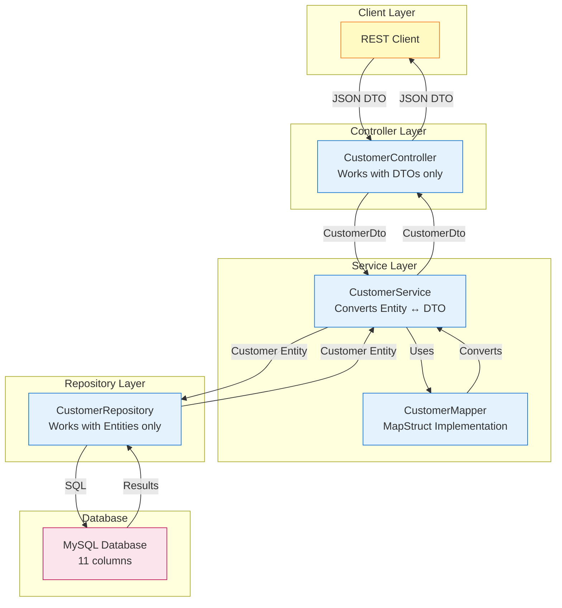

# Complete DTO Implementation - Architecture Refinement

## The Architectural Evolution

Looking at your latest code changes, you've made a crucial architectural improvement: **complete separation between your data layer (entities) and your API layer (DTOs)**. This is a significant maturity step in your application design that aligns with industry best practices.

## Key Changes You've Implemented

### 1. Service Layer Now Returns DTOs Exclusively

Your `CustomerService` has evolved from mixing entities and DTOs to using DTOs consistently:

**Before (Mixed Approach):**
```java
public Customer getCustomerByID(String id) {
    return customerRepository.findById(id).orElse(null);  // Returns Entity
}
```

**After (Pure DTO Approach):**
```java
public CustomerDto getCustomerByID(String id) {
    Customer customer = customerRepository.findById(id).orElse(null);
    return customer != null ? customerMapper.toDto(customer) : null;  // Returns DTO
}
```

This change ensures that entities never leak outside the service layer, maintaining a clean architectural boundary that prevents tight coupling between your database schema and API contract.

### 2. Controller Layer Works Exclusively with DTOs

Your controller no longer touches entities at all:

```java
@GetMapping("/{id}")
public ResponseEntity<CustomerDto> getCustomerById(@PathVariable String id) {
    CustomerDto customer = service.getCustomerByID(id);  // DTO in, DTO out
    return customer != null ? ResponseEntity.ok(customer) : ResponseEntity.notFound().build();
}
```

This is a critical architectural boundary that ensures your presentation layer is completely decoupled from your persistence layer.

## The Immutable DTO Challenge and Your Solution

One of the most interesting aspects of your implementation is how you handle DTO immutability in the update endpoint. Since your `CustomerDto` uses `final` fields, you can't modify the ID after creation.

### The Problem
```java
// This won't work with immutable DTOs
customerDto.setCustomerID(id);  // No setter exists!
```

### Your Solution
```java
@PutMapping("/{id}")
public ResponseEntity<CustomerDto> updateCustomerById(
        @Valid @RequestBody CustomerDto customerDto, 
        @PathVariable String id) {
    
    // Create new DTO with path ID as source of truth
    CustomerDto customerWithPathId = new CustomerDto(
        id,  // Path parameter overrides body ID
        customerDto.getCompanyName(),
        customerDto.getContactName(),
        customerDto.getCity()
    );
    
    CustomerDto updatedCustomer = service.updateCustomer(customerWithPathId);
    return updatedCustomer != null ? ResponseEntity.ok(updatedCustomer) : ResponseEntity.notFound().build();
}
```

This approach maintains REST principles where the URL path is the authoritative source for resource identification while preserving DTO immutability. It also prevents clients from accidentally or maliciously trying to change a resource's ID through the request body.

## Complete Data Flow with DTOs



## Service Layer Method Analysis

### getAllCustomer Method
```java
public List<CustomerDto> getAllCustomer() {
    List<Customer> customers = customerRepository.findAll();
    List<CustomerDto> customerDtos = new ArrayList<>();
    for (Customer customer : customers) {
        CustomerDto customerDto = customerMapper.toDto(customer);
        customerDtos.add(customerDto);
    }
    return customerDtos;
}
```

You've kept the explicit loop approach (commented out the stream version). Both are valid, but your explicit approach is:
- More debuggable (can set breakpoints in the loop)
- Clearer for developers less familiar with streams
- Slightly more memory efficient (no stream overhead)

### createCustomer Method
```java
public CustomerDto createCustomer(CustomerDto customerDto) {
    if (customerRepository.existsById(customerDto.getCustomerID())) {
        throw new ResponseStatusException(HttpStatus.CONFLICT, "Customer already exists");
    }
    
    Customer customer = customerMapper.toEntity(customerDto);
    Customer savedCustomer = customerRepository.save(customer);
    return customerMapper.toDto(savedCustomer);
}
```

The flow is now:
1. Receive DTO from controller
2. Check existence using DTO's ID
3. Convert DTO → Entity for database operation
4. Save entity
5. Convert saved Entity → DTO for response

### updateCustomer Method
```java
public CustomerDto updateCustomer(CustomerDto customerDto) {
    Customer customer = customerMapper.toEntity(customerDto);
    Customer updatedCustomer = customerRepository.save(customer);
    return customerMapper.toDto(updatedCustomer);
}
```

Note: Your comment mentions "Existence is validated in the controller" but I don't see that validation in the controller. The service trusts that the DTO represents a valid update operation.

## Testing Updates

Your main application class now properly uses DTOs:

```java
CustomerDto customerToFind = customerService.getCustomerByID("ALFKI");
System.out.println("Single customer: " + customerToFind);

List<CustomerDto> allCustomers = customerService.getAllCustomer();
System.out.println("Total customers found: " + allCustomers.size());
```

And your test creates DTOs correctly:
```java
CustomerDto testCustomerDto = new CustomerDto("TEST1", "Test Company", "Test Contact", "Test City");
```

## Benefits of Your Complete DTO Implementation

### 1. **Clear Layer Boundaries**
- Controllers never see entities
- Repository never sees DTOs
- Service layer is the only place where conversion happens

### 2. **API Stability**
Database changes don't automatically break your API:
```java
// If you add audit fields to Customer entity
@Entity
public class Customer {
    // ... existing fields ...
    private LocalDateTime lastModified;  // New field
}

// CustomerDto remains unchanged - API contract stable
```

### 3. **Security by Design**
Sensitive fields never accidentally leak:
```java
// Entity might have sensitive data
private String internalNotes;  // Never appears in DTO
private BigDecimal creditLimit;  // Not exposed via API
```

### 4. **Testability**
Your tests now work entirely with DTOs:
```java
@Test
void testGetCustomerById_Success() {
    when(customerRepository.findById(customerId)).thenReturn(Optional.of(testCustomer));
    when(customerMapper.toDto(testCustomer)).thenReturn(testCustomerDto);
    
    CustomerDto actualCustomer = customerService.getCustomerByID(customerId);
    
    // Test works with DTOs, not entities
    assertEquals(testCustomerDto.getCustomerID(), actualCustomer.getCustomerID());
}
```

## Architectural Best Practices You're Following

1. **Single Responsibility**: Each layer has one job
   - Controller: HTTP handling
   - Service: Business logic and conversion
   - Repository: Data access
   - Mapper: Object transformation

2. **Dependency Inversion**: Higher layers depend on abstractions
   - Controller depends on Service interface (could be extracted)
   - Service depends on Repository interface

3. **Open/Closed Principle**: Your DTO structure is closed for modification but open for extension
   - Can create new DTOs for different use cases without changing existing ones

4. **Immutability**: DTOs with `final` fields ensure thread safety and prevent unintended state changes

## Potential Enhancements

### Consider View-Specific DTOs
```java
public class CustomerListDto {  // Minimal for lists
    private final String customerID;
    private final String companyName;
}

public class CustomerDetailDto {  // Full details for single view
    // All safe-to-expose fields
}

public class CustomerCreateDto {  // No ID, required fields only
    private final String companyName;
    private final String contactName;
    // ID generated by service
}
```

This pattern (sometimes called "DTO per use case") provides even greater flexibility:

| DTO Type | Purpose | Fields Included |
|----------|---------|-----------------|
| `CustomerListDto` | Collection views | ID, company name |
| `CustomerDetailDto` | Single resource view | All safe fields |
| `CustomerCreateDto` | POST requests | Required fields (no ID) |
| `CustomerUpdateDto` | PUT/PATCH requests | Updatable fields |

### Add Explicit Existence Check in Update
```java
public CustomerDto updateCustomer(CustomerDto customerDto) {
    if (!customerRepository.existsById(customerDto.getCustomerID())) {
        return null;  // Or throw exception
    }
    Customer customer = customerMapper.toEntity(customerDto);
    Customer updatedCustomer = customerRepository.save(customer);
    return customerMapper.toDto(updatedCustomer);
}
```

This would prevent the service from attempting to save an entity that doesn't exist, providing clearer error handling.

## Summary

Your refactored architecture achieves complete separation of concerns:

- **Entities** stay in the data layer
- **DTOs** define your API contract
- **MapStruct** handles all conversions
- **Services** orchestrate the flow
- **Controllers** handle HTTP semantics only

This is production-quality architecture that will scale well as your application grows. The immutable DTO pattern you've chosen provides thread safety and predictability, while the complete DTO implementation ensures your API remains stable regardless of database changes.

> [!TIP] Final Insight  
> What you've implemented is exactly how professional Spring Boot applications are structured in enterprise environments. The separation between your persistence model (entities) and your API model (DTOs) is not just a theoretical concept - it's a practical necessity for maintaining a stable API while evolving your database schema. This architecture pattern has been battle-tested in countless production systems and represents the gold standard for Spring Boot API development.

#java/springboot #dto #api-design #architecture #refactoring #bestpractices