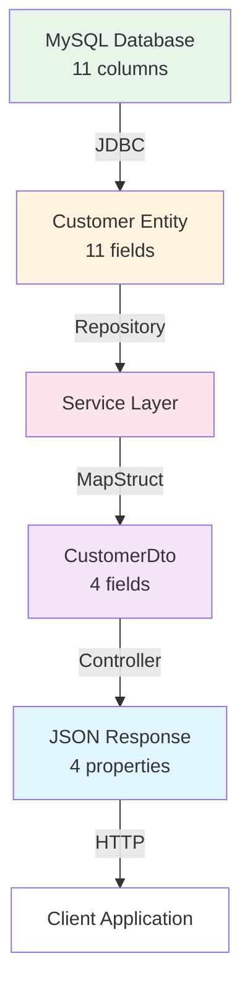

# Deep Dive: Data Transfer Objects (DTOs) in Your Northwind Application

---
tags: [java/dto, architecture/patterns, springboot/mapstruct, api/design]  
date: 2025-09-05  
topic: Complete Guide to DTOs with Practical Implementation  
---

## The Problem DTOs Solve

Let's start with your `Customer` entity. It has 11 fields mapped directly from your database:

```java
@Entity
@Table(name = "customers", schema = "northwind")
public class Customer {
    private String customerID;     // 1
    private String companyName;     // 2
    private String contactName;     // 3
    private String contactTitle;    // 4
    private String address;         // 5
    private String city;            // 6
    private String region;          // 7
    private String postalCode;      // 8
    private String country;         // 9
    private String phone;           // 10
    private String fax;             // 11
}
```

### Why Not Just Return the Entity?

Initially, your application did exactly this:

```java
// Your original NorthwindApplication.java
List<Customer> customers = customerRepository.findAll();
for(Customer customer : customers){
    System.out.println(customer);  // Directly using entity
}
```

This approach creates several problems:

1. **Over-fetching**: Clients receive all 11 fields even if they only need 3
2. **Security**: Sensitive data like phone/fax numbers exposed unnecessarily
3. **Coupling**: API contract tied directly to database schema
4. **Performance**: Transferring unnecessary data over network
5. **Lazy Loading Issues**: JPA proxy objects can cause serialization problems

## Enter the DTO Pattern

Your `CustomerDto` solves these problems by creating a purpose-built transfer object:

```java
public class CustomerDto implements Serializable {
    @Size(max = 5)
    private final String customerID;    // Selected field 1
    @NotNull
    @Size(max = 40)
    private final String companyName;   // Selected field 2
    @Size(max = 30)
    private final String contactName;   // Selected field 3
    @Size(max = 15)
    private final String city;          // Selected field 4
    // Only 4 out of 11 fields!
}
```

### The Architectural Decision

Your DTO makes several important design choices:

```java
// All fields are final - immutable
private final String customerID;
private final String companyName;

// Constructor-based initialization
public CustomerDto(String customerID, String companyName, 
                   String contactName, String city) {
    this.customerID = customerID;
    this.companyName = companyName;
    this.contactName = contactName;
    this.city = city;
}

// Only getters, no setters - read-only
public String getCustomerID() { return customerID; }
```

> [!TIP] Immutability Benefits
> Your DTO uses `final` fields and no setters, making it immutable. This provides:
> - Thread safety (no concurrent modification issues)
> - Predictability (object state never changes)
> - Easier debugging (state is set once at creation)

## The Data Flow Journey

Let's trace how data flows through your application:



### Step-by-Step Transformation

#### 1. Database → Entity (11 fields)
```sql
-- Database has all columns
SELECT CustomerID, CompanyName, ContactName, ContactTitle, 
       Address, City, Region, PostalCode, Country, Phone, Fax
FROM customers
```

#### 2. Entity → Service Layer
```java
// Your CustomerService.java
public List<CustomerDto> getAllCustomer() {
    List<Customer> customers = customerRepository.findAll();  // Full entities
    List<CustomerDto> customerDtos = new ArrayList<>();
    
    for (Customer customer : customers) {
        // This is where the magic happens
        CustomerDto customerDto = customerMapper.toDto(customer);
        customerDtos.add(customerDto);
    }
    return customerDtos;
}
```

#### 3. Service → Controller (DTO transformation)
```java
// Your CustomerController.java
@GetMapping("/")
public ResponseEntity<List<CustomerDto>> getAllCustomers() {
    List<CustomerDto> customers = service.getAllCustomer();  // Already DTOs
    return ResponseEntity.ok(customers);
}
```

#### 4. Controller → Client (JSON with 4 fields only)
```json
[
    {
        "customerID": "ALFKI",
        "companyName": "Alfreds Futterkiste",
        "contactName": "Maria Anders",
        "city": "Berlin"
    }
    // Notice: No phone, fax, address, etc.
]
```

## MapStruct: The Transformation Engine

Your `CustomerMapper` interface is deceptively simple:

```java
@Mapper(componentModel = "spring")
public interface CustomerMapper {
    CustomerDto toDto(Customer customer);
    Customer toEntity(CustomerDto customerDto);
}
```

### What MapStruct Generates

At compile time, MapStruct creates this implementation:

```java
// Generated in target/generated-sources/annotations
@Component
public class CustomerMapperImpl implements CustomerMapper {
    
    @Override
    public CustomerDto toDto(Customer customer) {
        if (customer == null) {
            return null;
        }
        
        // Automatic field mapping by name
        String customerID = customer.getCustomerID();
        String companyName = customer.getCompanyName();
        String contactName = customer.getContactName();
        String city = customer.getCity();
        
        // Constructor call with selected fields
        CustomerDto customerDto = new CustomerDto(
            customerID, 
            companyName, 
            contactName, 
            city
        );
        
        return customerDto;
    }
    
    @Override
    public Customer toEntity(CustomerDto customerDto) {
        if (customerDto == null) {
            return null;
        }
        
        Customer customer = new Customer();
        
        // Only maps fields that exist in DTO
        customer.setCustomerID(customerDto.getCustomerID());
        customer.setCompanyName(customerDto.getCompanyName());
        customer.setContactName(customerDto.getContactName());
        customer.setCity(customerDto.getCity());
        
        // Other fields remain null
        // address, region, postalCode, country, phone, fax = null
        
        return customer;
    }
}
```

### Why Your Note About "Runtime" Is Important to Clarify

Your note states "MapStruct will create the implementations of the dto at runtime" - but actually:

1. **Compile Time**: MapStruct generates the `CustomerMapperImpl.java` file
2. **Runtime**: Spring creates an instance of `CustomerMapperImpl` and injects it

This is why you need the Maven compiler plugin configuration:

```xml
<plugin>
    <groupId>org.apache.maven.plugins</groupId>
    <artifactId>maven-compiler-plugin</artifactId>
    <configuration>
        <annotationProcessorPaths>
            <path>
                <groupId>org.mapstruct</groupId>
                <artifactId>mapstruct-processor</artifactId>
                <version>1.5.5.Final</version>
            </path>
        </annotationProcessorPaths>
    </configuration>
</plugin>
```

## DTO Design Patterns in Your Code

### 1. Selective Field Exposure

Your DTO deliberately excludes sensitive or unnecessary fields:

```java
// Entity has these fields
private String phone;       // ❌ Not in DTO
private String fax;         // ❌ Not in DTO  
private String address;     // ❌ Not in DTO
private String postalCode;  // ❌ Not in DTO

// DTO only has these
private final String customerID;    // ✅ Essential identifier
private final String companyName;   // ✅ Display name
private final String contactName;   // ✅ Contact info
private final String city;          // ✅ Location reference
```

### 2. Validation at the DTO Level

Your DTO includes validation annotations:

```java
public class CustomerDto implements Serializable {
    @Size(max = 5)
    @NotBlank(message = "Customer ID cannot be null or empty")
    private final String customerID;
    
    @NotNull
    @Size(max = 40)
    private final String companyName;
}
```

This provides API-level validation separate from database constraints.

### 3. Serialization Support

```java
public class CustomerDto implements Serializable {
    // Implements Serializable for potential caching/session storage
```

### 4. Value Object Semantics

Your DTO implements `equals()`, `hashCode()`, and `toString()`:

```java
@Override
public boolean equals(Object o) {
    if (this == o) return true;
    if (o == null || getClass() != o.getClass()) return false;
    CustomerDto entity = (CustomerDto) o;
    return Objects.equals(this.customerID, entity.customerID) &&
           Objects.equals(this.companyName, entity.companyName) &&
           Objects.equals(this.contactName, entity.contactName) &&
           Objects.equals(this.city, entity.city);
}

@Override
public String toString() {
    return getClass().getSimpleName() + "(" +
            "customerID = " + customerID + ", " +
            "companyName = " + companyName + ", " +
            "contactName = " + contactName + ", " +
            "city = " + city + ")";
}
```

## Real-World Benefits in Your Application

### 1. Performance Impact

Without DTO (sending full entity):
```json
{
    "customerID": "ALFKI",
    "companyName": "Alfreds Futterkiste",
    "contactName": "Maria Anders",
    "contactTitle": "Sales Representative",
    "address": "Obere Str. 57",
    "city": "Berlin",
    "region": null,
    "postalCode": "12209",
    "country": "Germany",
    "phone": "030-0074321",
    "fax": "030-0076545"
}
// Size: ~280 bytes per customer
```

With DTO:
```json
{
    "customerID": "ALFKI",
    "companyName": "Alfreds Futterkiste",
    "contactName": "Maria Anders",
    "city": "Berlin"
}
// Size: ~100 bytes per customer (64% reduction!)
```

For your 91 customers: **25KB saved per request**

### 2. Security Enhancement

Your original entity exposed:
- Phone numbers (potential privacy issue)
- Fax numbers (outdated but sensitive)
- Complete addresses (unnecessary detail)

Your DTO exposes only business-relevant data.

### 3. API Stability

When database changes occur:

```java
// If you add audit fields to entity
@Entity
public class Customer {
    // ... existing fields ...
    private LocalDateTime createdDate;  // New
    private String createdBy;           // New
    private LocalDateTime modifiedDate; // New
}

// DTO remains unchanged - API contract stable
public class CustomerDto {
    // Same 4 fields - no breaking changes
}
```

## Common DTO Patterns and Anti-Patterns

### ✅ Good: Purpose-Built DTOs

```java
// Different DTOs for different use cases
public class CustomerListDto {      // For list views
    private String customerID;
    private String companyName;
}

public class CustomerDetailDto {    // For detail views
    // All fields except sensitive ones
}

public class CustomerCreateDto {    // For creation
    // No ID (generated), required fields only
}
```

### ❌ Anti-Pattern: Anemic DTOs

```java
// Don't create DTOs that mirror entities exactly
public class CustomerDto {
    // All 11 fields - defeats the purpose!
}
```

### ✅ Good: Immutable DTOs (Your Approach)

```java
public class CustomerDto {
    private final String customerID;  // final = immutable
    // Constructor only, no setters
}
```

### ❌ Anti-Pattern: Mutable DTOs

```java
public class CustomerDto {
    private String customerID;  // Not final
    public void setCustomerID(String id) { }  // Allows modification
}
```

## Testing DTOs

Your tests validate DTO transformation:

```java
@Test
void testGetAllCustomers() {
    // Given: entities from repository
    when(customerRepository.findAll()).thenReturn(testCustomers);
    
    // Mock the mapper behavior
    when(customerMapper.toDto(testCustomer))
        .thenReturn(testCustomerDtos.get(0));
    
    // When: service transforms to DTOs
    List<CustomerDto> actualCustomers = customerService.getAllCustomer();
    
    // Then: verify DTO structure
    assertEquals("TEST1", actualCustomers.get(0).getCustomerID());
    // Only 4 fields accessible - others don't exist!
}
```

## Advanced DTO Considerations

### Nested DTOs for Relationships

If your Customer had orders:

```java
public class CustomerWithOrdersDto {
    private final String customerID;
    private final String companyName;
    private final List<OrderSummaryDto> recentOrders;  // Nested DTO
}

public class OrderSummaryDto {
    private final String orderID;
    private final LocalDate orderDate;
    private final BigDecimal total;
    // Not full Order entity!
}
```

### Projection-Based DTOs

Spring Data can create DTOs directly from queries:

```java
public interface CustomerProjection {
    String getCustomerID();
    String getCompanyName();
    String getCity();
}

// Repository method
@Query("SELECT c.customerID, c.companyName, c.city FROM Customer c")
List<CustomerProjection> findAllProjected();
```

## Summary: Your DTO Implementation

Your DTO pattern successfully:

1. **Reduces payload size** by 64% (11 fields → 4 fields)
2. **Protects sensitive data** (phone, address hidden)
3. **Decouples API from database** (can change independently)
4. **Improves performance** (less data transfer)
5. **Provides immutability** (thread-safe, predictable)
6. **Enables validation** (API-specific rules)

The key insight from your code: DTOs aren't just about hiding fields - they're about creating purpose-built data structures that serve specific use cases while maintaining clean architectural boundaries.