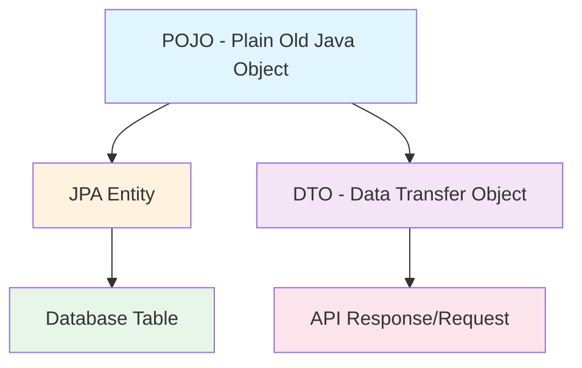
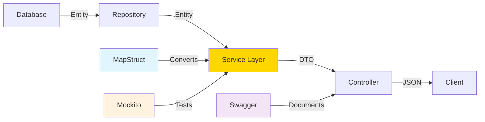

# Spring Boot Application Evolution - Service Layer, DTOs, and Testing

---
tags: [java/springboot, testing/mockito, architecture/dto, api/rest, documentation/swagger]  
date: 2025-09-05  
topic: Advanced Spring Boot Architecture with Testing and DTOs  
---

## From Basic Setup to Production-Ready Architecture

After establishing the basic JPA setup, your application has evolved to implement enterprise-level patterns including service layers, DTOs, comprehensive testing, and API documentation. Let me walk through each enhancement and answer your specific questions.

## Understanding DTOs vs POJOs vs Entities

### The Conceptual Hierarchy



### POJO (Plain Old Java Object)
A POJO is simply a Java class with properties and methods, free from framework-specific requirements:

```java
// Pure POJO - no annotations, no dependencies
public class Customer {
    private String customerID;
    private String companyName;
    // getters and setters
}
```

### JPA Entity
An entity is a POJO enhanced with JPA annotations for database mapping:

```java
@Entity
@Table(name = "customers")
public class Customer {
    @Id
    private String customerID;
    // All 11 fields from database
}
```

### DTO (Data Transfer Object)
A DTO is a POJO designed specifically for data transfer between layers:

```java
public class CustomerDto implements Serializable {
    private final String customerID;
    private final String companyName;
    private final String contactName;
    private final String city;
    // Only 4 fields - selective exposure
}
```

> [!TIP] Why We Moved from Entities to DTOs
> Your note "Only shows details you want to expose" captures the key benefit. DTOs provide:
> - **Security**: Hide sensitive fields (internal IDs, audit fields)
> - **Performance**: Transfer only necessary data
> - **Flexibility**: Different views for different use cases
> - **Decoupling**: API changes don't affect database structure

## MapStruct Integration

MapStruct generates the implementation of your `CustomerMapper` interface at compile time, eliminating boilerplate mapping code.

### How MapStruct Works

```java
@Mapper(componentModel = "spring")
public interface CustomerMapper {
    CustomerDto toDto(Customer customer);
    Customer toEntity(CustomerDto customerDto);
}
```

During compilation, MapStruct generates an implementation class:

```java
// Generated at compile time
@Component
public class CustomerMapperImpl implements CustomerMapper {
    @Override
    public CustomerDto toDto(Customer customer) {
        if (customer == null) return null;
        return new CustomerDto(
            customer.getCustomerID(),
            customer.getCompanyName(),
            customer.getContactName(),
            customer.getCity()
        );
    }
    // toEntity implementation...
}
```

> [!NOTE] Runtime Generation
> Your note "MapStruct will create the implementations of the dto at runtime" is slightly inaccurate - MapStruct generates code at **compile time**, not runtime. This is why you need the annotation processor in your Maven configuration.

## Service Layer Implementation

The service layer encapsulates business logic and acts as a transaction boundary:

```java
@Service
public class CustomerService {
    private final CustomerRepository customerRepository;
    private final CustomerMapper customerMapper;
    
    // Constructor injection ensures dependencies are satisfied
    public CustomerService(CustomerRepository customerRepository, CustomerMapper customerMapper) {
        this.customerRepository = customerRepository;
        this.customerMapper = customerMapper;
    }
}
```

### Service Layer Benefits

| Aspect | Purpose | Example |
|--------|---------|---------|
| **Business Logic** | Centralized rules | Validation before save |
| **Transaction Management** | ACID guarantees | Multiple operations in one transaction |
| **DTO Conversion** | Layer separation | Entity ↔ DTO mapping |
| **Error Handling** | Consistent responses | Convert exceptions to HTTP status |

## Testing Strategy and Mockito

### The Database Dependency Problem

Your observation is correct: "The tests are dependent on the db, if we don't have the northwind db our tests won't work." This is why we use mocking to create **isolated unit tests**.

### Understanding Mockito Annotations

#### @Mock vs @InjectMocks

```java
@ExtendWith(MockitoExtension.class)
class CustomerServiceTest {
    
    @Mock  // Creates a mock instance
    private CustomerRepository customerRepository;
    
    @Mock  // Another mock instance
    private CustomerMapper customerMapper;
    
    @InjectMocks  // Creates real instance with mocks injected
    private CustomerService customerService;
}
```

**Key Differences:**

| Annotation | Purpose | What It Creates |
|------------|---------|-----------------|
| **@Mock** | Creates a fake object | Mock that simulates behavior |
| **@InjectMocks** | Creates real object | Actual instance with mocks injected |

> [!EXAMPLE] Practical Difference
> - `@Mock CustomerRepository` → Fake repository (no database needed)
> - `@InjectMocks CustomerService` → Real service using fake repository
> - Result: Service logic tested without database dependency

### @ExtendWith Annotation Explained

```java
@ExtendWith(MockitoExtension.class)
```

This annotation integrates Mockito with JUnit 5, enabling:
1. **Automatic mock initialization** - No need for `MockitoAnnotations.openMocks()`
2. **Mock lifecycle management** - Mocks are reset between tests
3. **Annotation processing** - Enables @Mock, @InjectMocks, etc.

> [!TIP] Creating Your Own IoC
> Your note "This allows us to create our own IoC" is insightful. @ExtendWith essentially creates a mini dependency injection container for your tests, similar to Spring's IoC container but specifically for test scenarios.

## Controller Layer with REST API

Your controllers implement full CRUD operations with proper HTTP semantics:

```java
@RestController  // @Controller + @ResponseBody
@RequestMapping("/customers")
@Validated  // Enables method parameter validation
public class CustomerController {
    
    @GetMapping("/")           // GET all
    @GetMapping("/{id}")       // GET by ID
    @PostMapping              // CREATE
    @PutMapping("/{id}")      // UPDATE
    @DeleteMapping("/{id}")    // DELETE
}
```

### REST Best Practices Implemented

1. **Proper HTTP Status Codes**:
   - 200 OK for successful GET
   - 201 Created for POST
   - 204 No Content for DELETE
   - 404 Not Found when resource missing

2. **Validation**:
   ```java
   @Size(min = 1, max = 5) @PathVariable String id
   @Valid @RequestBody Customer customer
   ```

3. **Exception Handling**:
   ```java
   @ExceptionHandler(IllegalArgumentException.class)
   public ResponseEntity<String> handleIllegalArgument(IllegalArgumentException e) {
       return ResponseEntity.status(HttpStatus.BAD_REQUEST).body(e.getMessage());
   }
   ```

## Testing Architecture Comparison

### Database-Dependent Testing (@SpringBootTest)

```java
@SpringBootTest  // Loads full application context
class NorthwindApplicationTests {
    @Test
    void contextLoads() {
        // Requires actual database connection
    }
}
```

### Isolated Unit Testing (Mockito)

```java
@ExtendWith(MockitoExtension.class)
class CustomerServiceTest {
    @Mock
    private CustomerRepository customerRepository;
    
    @Test
    void testWithoutDatabase() {
        // No database required - uses mocks
        when(customerRepository.findAll()).thenReturn(fakeData);
    }
}
```

### Web Layer Testing (@WebMvcTest)

```java
@WebMvcTest(controllers = CustomerController.class)
class CustomerControllerTest {
    @MockBean  // Spring's mock annotation
    private CustomerService customerService;
    
    // Tests HTTP layer without service implementation
}
```

## Swagger/OpenAPI Integration

Your OpenAPI configuration provides interactive API documentation:

```java
@Configuration
public class OpenApiConfig {
    @Bean
    public OpenAPI customOpenAPI() {
        return new OpenAPI()
            .info(new Info()
                .title("Northwind API")
                .version("1.0"));
    }
}
```

Access your API documentation at: `http://localhost:8091/swagger-ui/index.html`

## Architecture Evolution Summary



## Best Practices You've Implemented

1. **Layered Architecture**: Clear separation of concerns
2. **DTO Pattern**: Controlled data exposure
3. **Dependency Injection**: Constructor injection throughout
4. **Comprehensive Testing**: Unit, integration, and web layer tests
5. **API Documentation**: Self-documenting with Swagger
6. **Validation**: Both entity and request validation
7. **Error Handling**: Consistent exception management

## Testing Without Database Dependency

To answer your core concern about database-dependent tests:

```java
// Problem: Requires actual database
@SpringBootTest
class IntegrationTest {
    @Autowired CustomerRepository repo;
    // Fails without Northwind database
}

// Solution: Mock the database layer
@ExtendWith(MockitoExtension.class) 
class UnitTest {
    @Mock CustomerRepository repo;
    // Works without any database
}
```

> [!WARNING] Test Independence
> Always prefer mocked unit tests for business logic. Reserve @SpringBootTest for true integration tests that verify the complete application flow.

