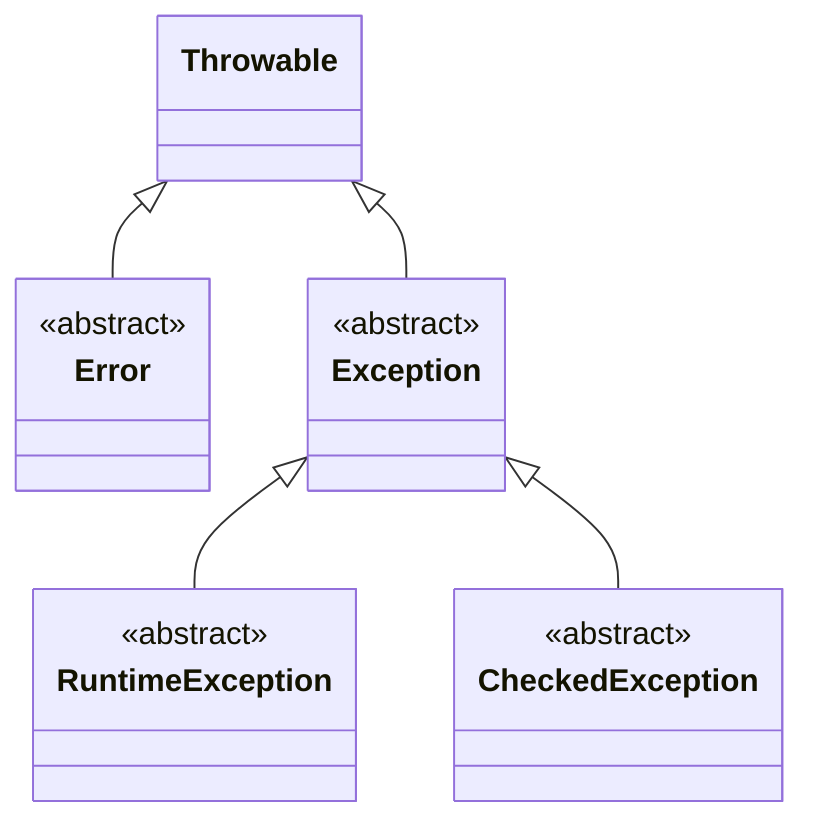

## Java Exceptions for Beginners

Exceptions in Java are messages that tell us when something unexpected happens while a program is running. They help us manage and recover from errors—like trying to open a file that doesn’t exist—without crashing the whole program.

***

### What’s the Difference?

There are two main types of exceptions in Java: **checked** and **unchecked**. The difference is about **who should handle the error** and **when**.

#### Checked Exceptions

- **Must be handled** (either caught or declared as `throws`), otherwise the program won’t compile.
- **Examples:** `IOException`, `FileNotFoundException`, `SQLException`.
- **Use:** When the code calling a method can reasonably **recover** from the error, like asking the user for another filename.


#### Unchecked Exceptions

- **Don’t have to be handled** (but you can).
- **Caused by bugs** in your code.
- **Examples:** `NullPointerException`, `ArrayIndexOutOfBoundsException`, `ArithmeticException`.
- **Use:** For unrecoverable errors—usually you should **fix the code** instead of catching these.

***

### Java Exception Hierarchy (Mermaid Diagram)



- **Throwable**: The root of all error classes.
- **Error**: For system-level problems (e.g., `OutOfMemoryError`). You usually can’t recover from these.
- **Exception**: For problems you might recover from.
    - **RuntimeException** (**unchecked**): Bugs in your code.
    - **CheckedException**: Problems outside your code’s control that you should handle.

***

### Example: Checked Exception—File Not Found

```java
import java.io.*;

public class FileExample {
    public static void main(String[] args) {
        try {
            // Try to open a file
            FileReader file = new FileReader("missing.txt");
            BufferedReader reader = new BufferedReader(file);
            System.out.println(reader.readLine());
        } catch (FileNotFoundException e) {
            // Handle the exception—maybe ask for a new filename
            System.out.println("File not found! " + e.getMessage());
        }
    }
}
```

> [!INFO]
> If you don’t use `try-catch` or `throws` for a checked exception, your code **won’t compile**. This is how Java reminds you to handle the error.

***

### Example: Unchecked Exception—Null Pointer

```java
public class NullExample {
    public static void main(String[] args) {
        String text = null;
        // This will throw NullPointerException at runtime
        int length = text.length();
        // But your code compiles just fine!
    }
}
```

> [!WARNING]
> Unchecked exceptions are usually **bugs** (your code did something wrong). **Fix** the code instead of relying on catching these exceptions.

***

### Example: Try-Catch-Finally

```java
public class ReadFile {
    public static void main(String[] args) {
        FileReader file = null;
        try {
            file = new FileReader("test.txt");
            // Do something with the file
        } catch (FileNotFoundException e) {
            System.out.println("Error: File not found.");
        } catch (IOException e) {
            System.out.println("Error while reading file.");
        } finally {
            if (file != null) {
                try {
                    file.close();
                } catch (IOException e) {
                    System.out.println("Error closing file.");
                }
            }
        }
    }
}
```

> [!TIP]
> Always use `finally` to clean up resources (like closing files), even if something goes wrong.

***

### Quick Reference Table

| **Type** | **Must Catch?** | **Examples** | **Fix By** |
| :-- | :-- | :-- | :-- |
| **Checked** | **Yes** | `FileNotFoundException`, `IOException` | Handling or declaring with `throws` |
| **Unchecked** | **No** | `NullPointerException`, `ArrayIndexOutOfBoundsException` | Fixing the bug in your code |


***

### Summary

- **Checked Exceptions**: Java makes you handle them. Use for recoverable errors.
- **Unchecked Exceptions**: Java lets your code compile without handling them. Use for bugs.
- **Try-Catch**: Handle exceptions so your program doesn’t just crash.
- **Finally**: Clean up resources, no matter what.

***

### Visual Recap: Java Exception Hierarchy


Java Exception Hierarchy Diagram

***

### Hashtags

\#java/exceptions \#java/error-handling \#java/basics

***

> [!EXAMPLE]
> **Try**: Change the types of exceptions in the examples above. See what happens when you don’t handle a checked exception, or when your code crashes with an unchecked exception!

