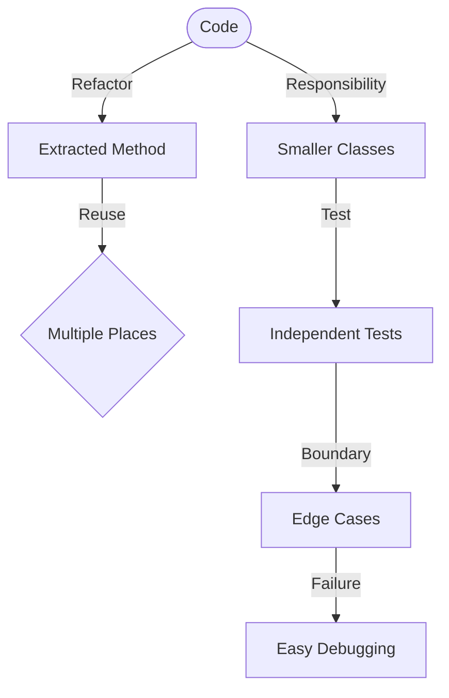

# IDE and Project Management

1. How do you extract code into a separate method?
2. What is the POM file responsible for?
3. What is class partitioning?
4. Testing
5. Why should you always test boundary values?
6. Why should you avoid loops in tests?
7. Control Flow and Operators
8. What are case statements used for?
9. What are ternary operators?
10. What does ++i mean?
11. Why is using break in loops considered bad practice?
12. What is fall-through in switch statements?
13. Arrays and Loops
14. What's the difference between i < nums.length and i < nums.length-1?
15. What are the valid index positions for an array?

## Code Refactoring in the IDE

### Extract Code into a Separate Method

**Why** do this?
To avoid repetition, improve readability, and make your code easier to maintain.
**When** do this?
Whenever you repeat the same logic in multiple places.

**How** to do it manually?

```java
// Before extraction
public void calculate() {
    int a = 5, b = 10;
    int sum = a + b;
    System.out.println("Sum: " + sum);

    int x = 20, y = 30;
    sum = x + y;
    System.out.println("Sum: " + sum);
}
```

**After extraction**:

```java
public void calculate() {
    printSum(5, 10);
    printSum(20, 30);
}

private void printSum(int a, int b) {
    int sum = a + b;
    System.out.println("Sum: " + sum);
}
```

**How** to do it in IntelliJ IDEA, Eclipse, or VS Code?

- **Select** the code block (e.g., the add-and-print logic).
- **Right-click** → **Refactor** → **Extract Method** (or Ctrl+Alt+M in IDEA).
- **IDE** will prompt you for a method name and handle parameter passing.
- **Review** the extracted method: is it reusable? Does it have a clear name?

> [!TIP]
> Use **inline method** (Ctrl+Alt+N in IDEA) to reverse this if the method becomes too trivial.

> [!EXAMPLE]
> Extracting a method can also help with **testing**: the logic is now isolated and can be tested independently.

***

### Class Partitioning (Single Responsibility Principle)

**Why** should you do this?
Large classes (“god classes”) are hard to understand, test, and maintain.

**Before partitioning** (painful to maintain):

```java
class UserOperations {
    void login(String user, String pass) { /* ... */ }
    void updateProfile(String bio) { /* ... */ }
    void sendNotification(String message) { /* ... */ }
    void generateReport() { /* ... */ }
    // ...and more!
}
```

**After partitioning**:

```java
class AuthService { void login(String user, String pass) { /* ... */ } }
class ProfileService { void updateProfile(String bio) { /* ... */ } }
class NotificationService { void sendNotification(String message) { /* ... */ } }
class ReportService { void generateReport() { /* ... */ } }
```

**Benefits**:

- **Easier to test**: Each class does one thing.
- **Easier to change**: Only need to modify one class when requirements change.
- **Looser coupling**: Classes depend less on each other.

> [!WARNING]
> **Too many tiny classes can make navigation harder**. Balance between separation and simplicity.

***

## Project Management (Maven POM)

**What** is the `pom.xml` file in a Maven project?

- **Defines project info**: Name, version, description.
- **Manages dependencies**: Libraries your project needs.
- **Controls build process**: Compile, test, package, install, deploy.
- **Configures plugins**: For code quality, documentation, deployment, etc.

**Example** (minimal `pom.xml`):

```xml
<project>
    <modelVersion>4.0.0</modelVersion>
    <artifactId>my-app</artifactId>
    <version>1.0.0</version>
    <dependencies>
        <dependency>
            <groupId>junit</groupId>
            <artifactId>junit</artifactId>
            <version>4.13</version>
            <scope>test</scope>
        </dependency>
    </dependencies>
    <build>
        <plugins>
            <plugin>
                <groupId>org.apache.maven.plugins</groupId>
                <artifactId>maven-compiler-plugin</artifactId>
                <version>3.8.1</version>
                <configuration>
                    <source>17</source>
                    <target>17</target>
                </configuration>
            </plugin>
        </plugins>
    </build>
</project>
```

**Common Maven commands**:

- `mvn compile`: Compiles the code.
- `mvn test`: Runs unit tests.
- `mvn package`: Creates a JAR/WAR file.
- `mvn clean`: Cleans the `target` directory.
- `mvn install`: Installs the artifact into your local repository.

> [!INFO]
> **Gradle** is an alternative to Maven, using a `build.gradle` file. Both are widely used.

***

## Testing in Java

### Why Test Boundary Values?

**Boundary values** are points at the edges of input ranges—**where bugs often hide**.

**Ideas for boundary testing**:

- **Empty arrays/lists** (`[]`, `0` elements).
- **Single-element arrays/lists** (``).
- **First and last elements in a collection** (`arr`, `arr[arr.length-1]`).
- **Minimum/maximum allowed values** (`Integer.MIN_VALUE`, `Integer.MAX_VALUE`).
- **Null values** if allowed by the API.
- **Excessive/very large inputs** (e.g., giant strings, huge collections).
- **Invalid inputs** (negative numbers, malformed strings).

**Example** for a sorting method:

```java
@Test void sort_EmptyArray() { sort(new int[]{}); }
@Test void sort_SingleElement() { sort(new int[]{5}); }
@Test void sort_NegativeNumbers() { sort(new int[]{-1, -3, 2}); }
@Test void sort_LargeArray() { sort(generateLargeRandomArray()); }
```

> [!TIP]
> **Don’t forget to test for invalid input and error handling!**

***

### Why Avoid Loops in Tests?

**Loops** in tests can **hide failures** and **make debugging hard**.
**Prefer**: Multiple test methods, parameterized tests, or data providers.

**Bad** – hidden failures:

```java
@Test void testAllPrimes() {
    int[] primes = {2, 3, 5, 7, 11, 13};
    for (int p : primes) {
        assertTrue(isPrime(p)); // If one fails, which one?
    }
}
```

**Good** – clear failures:

```java
@Test void testIsPrime_2() { assertTrue(isPrime(2)); }
@Test void testIsPrime_3() { assertTrue(isPrime(3)); }
// ...
@Test void testIsPrime_13() { assertTrue(isPrime(13)); }
```

**Good** – parameterized (JUnit 5):

```java
@ParameterizedTest
@ValueSource(ints = {2, 3, 5, 7, 11, 13})
void testIsPrime(int number) {
    assertTrue(isPrime(number));
}
```

> [!WARNING]
> **Avoid testing randomness** in loops. Instead, use a fixed seed or mock the random generator.

***

## Control Flow and Operators

### Case Statements (`switch`)

**When** to use `switch`?
When there are **many possible values** for a single variable.

**Example**:

```java
String day;
switch (dayOfWeek) {
    case MONDAY -> day = "Start of work week";
    case FRIDAY -> day = "TGIF!";
    case SATURDAY, SUNDAY -> day = "Weekend";
    default -> day = "Regular weekday";
}
```

**Java 14+**: `switch` expressions

```java
String day = switch (dayOfWeek) {
    case MONDAY -> "Start of work week";
    case FRIDAY -> "TGIF!";
    case SATURDAY, SUNDAY -> "Weekend";
    default -> "Regular weekday";
};
```

**Fall-through**:
Traditionally, cases “fall through” to the next unless a `break` is present.
Use this **rarely** and only with a comment!

```java
switch (month) {
    case "DEC": case "JAN": case "FEB":
        season = "Winter";
        break;
    // ...
}
```


***

### Ternary Operator (`?:`)

**What** is it?
A shortcut for simple `if-else` assignment statements.

**Example**:

```java
String result = (score >= 60) ? "Pass" : "Fail";
int max = (a > b) ? a : b;
String username = (user != null) ? user.getName() : "Guest";
```

**Where** to use it?
For simple, clear assignments.
**Avoid** nested or complex ternary expressions—they become hard to read.

***

### Pre- and Post-Increment (`++i` vs `i++`)

**What** is the difference?

- `++i`: **Pre-increment** (increments, then uses the value)
- `i++`: **Post-increment** (uses the value, then increments)

**Examples**:

```java
int i = 5;
int a = ++i; // a = 6, i = 6
int b = i++; // b = 6, i = 7
```

**In loops**:

```java
for (int j = 0; j < 10; ++j) { ... } // Either ++j or j++ is fine here
```

**Pre-increment** is **slightly more efficient** in loops, but **not enough to matter** in most cases.
**Be consistent**: Use the same style across your project.

***

### Why Avoid `break` in Loops?

**What** is the problem?
Multiple `break` statements make control flow unpredictable and code harder to read.

**Bad** (hard to follow):

```java
while (true) {
    if (condition1) break;
    doSomething();
    if (condition2) break;
    doMore();
}
```

**Better** (clear control flow):

```java
boolean keepGoing = true;
while (keepGoing && !condition1) {
    doSomething();
    keepGoing = !condition2;
    if (keepGoing) {
        doMore();
    }
}
```

**Alternatives**:

- Use **clear loop conditions**.
- Consider **extracting the loop logic into a method** and use `return`.

***

### Fall-through in `switch` Statements

**What** is it?
When a `case` has no `break`, execution “falls through” to the next `case`.

**Intentionally rare**:

```java
switch (month) {
    case "DEC": case "JAN": case "FEB":
        season = "Winter";
        break; // NOTICE: No fall-through!
    // ...
}
```

**Unintentional fall-through**:
**Mostly a bug**. Always check your `switch` blocks for missing `break`s.

***

## Arrays and Loops

### Array Loops: Bounds and Patterns

**Always use** `i < arr.length` to process all elements:

```java
int[] nums = {10, 20, 30};
for (int i = 0; i < nums.length; i++) {
    System.out.println(nums[i]);
}
```

**Use** `i < arr.length - 1` when you want to **compare adjacent elements**:

```java
for (int i = 0; i < nums.length - 1; i++) {
    System.out.println(nums[i] + " vs " + nums[i + 1]);
}
```

**Extended example**: Find minimum and maximum in one pass:

```java
int min = nums[^0], max = nums[^0];
for (int i = 1; i < nums.length; i++) {
    if (nums[i] < min) min = nums[i];
    if (nums[i] > max) max = nums[i];
}
```


***

### Valid Array Indices

**Remember**: Java arrays are **zero-indexed**.

| Declaration               | Valid Indices | Invalid Index                |
|:--------------------------|:--------------|:-----------------------------|
| `int[] arr = new int[^3]` | `0, 1, 2`     | `3`, `-1` (throws exception) |

**Always check bounds** before direct access.

**Example**:

```java
int[] arr = {100, 200, 300};
System.out.println(arr[^2]); // 300
// System.out.println(arr[^3]); // Throws ArrayIndexOutOfBoundsException
```


***

## Quick Reference Table (Expanded)

| Topic                  | Key Point                                 | Tips \& Pitfalls               |
|:-----------------------|:------------------------------------------|:-------------------------------|
| **Method Extraction**  | Select → Refactor → Extract in IDE        | Keep methods focused, reusable |
| **POM File**           | Maven project configuration file          | Add dependencies, plugins here |
| **Class Partitioning** | Split big classes by responsibility       | No “god classes”               |
| **Boundary Testing**   | Test min, max, empty, null, invalid input | Most bugs are on boundaries    |
| **Test Loops**         | Use parameterized tests or multiple       | Single failure per test method |
| **Switch Cases**       | For multiple equality branches            | Watch for missing `break`      |
| **Ternary Operator**   | `condition ? true : false`                | Don’t nest or overuse          |
| **++i**                | Pre-increment (rarely matters)            | Be consistent                  |
| **Loop Breaks**        | Avoid excessive `break` in loops          | Use clear loop conditions      |
| **Array Bounds**       | `0` to `length-1`                         | Invalid access crashes         |


***

## Visual Comparison




***

## Callouts for Best Practices

> [!TIP]
> **Extract methods early**—avoid duplicated logic.
>
> **Test edge cases**—empty collections, nulls, min, max.
>
> **Never put logic in test loops**—use JUnit’s parameterized or repeated tests.

> [!WARNING]
> **Invalid array access** will crash your program!
>
> **Nested ternary operators** are unreadable—use `if` for clarity.

> [!EXAMPLE]
> ```java > // Good: clear boundaries, avoids problems > for (int i = 0; i < arr.length; i++) { ... } > > // Bad: off-by-one risk, needs extra care > for (int i = 1; i <= arr.length; i++) { ... } > ```

***

## Tags

\#java \#ide \#maven \#gradle \#testing \#refactoring \#arrays \#loops \#control-flow \#bestpractices

***

## Summary

This expanded cheatsheet gives you **better examples, explanations, and visual aids** for Java project structure, IDE tools, testing, arrays, loops, and control flow. **Progressive depth** lets you start with quick answers and drill into details as needed. **Bookmark, tag, and extend** this note for your own projects!

***

## See Also

- [[Java Collections]]
- [[Testing Strategies]]
- [[Project Structure]]
- [[Effective Java Practices]]
