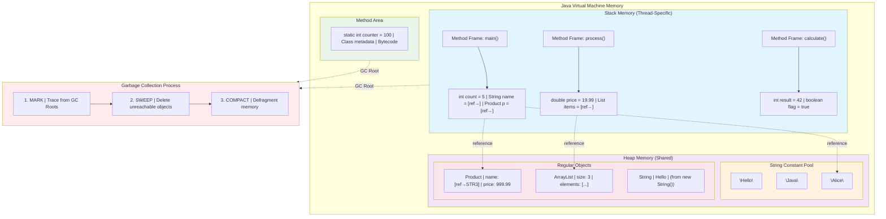
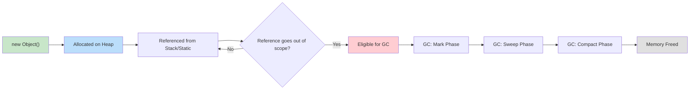

# Memory Management

1. What is stored on the stack?
2. What is stored on the heap?
3. Where are strings stored in memory?
4. What are reference types vs value types?
5. What happens to objects when they go out of scope?
6. What three things does the garbage collector do?
7. How are memory addresses different for objects with the same values?

## Java Memory Model (Overview)

Java manages memory automatically, but understanding **where things live** and **how the JVM cleans up** is crucial for writing efficient, leak-free code. The main memory areas are:

- **Stack:** Fast, temporary, method-specific storage
- **Heap:** Long-lived, general-purpose object storage
- **String Constant Pool:** Special heap area for string literals
- **Method Area:** Stores class metadata, static variables, and compiled code

***

## What is Stored on the Stack?

**Stack Memory** contains:

- **Primitive values** (`int`, `double`, `boolean`, `char`, etc.)
- **Local variables** (declared inside methods or blocks)
- **Method call frames** (parameters, return address, local vars for each method call)
- **Object references** (not the objects themselves, just the memory address/pointer)

**Stack is managed via Last-In-First-Out (LIFO)**—when a method ends, its stack frame is *popped* and memory is freed **instantly**.

### Examples

```java
public void process() {
    int age = 30;                  // Primitive on stack
    double price = 19.99;          // Primitive on stack
    String name = "Alice";         // Reference on stack, object in heap
    calculateTotal(age, price);    // Method call pushes new frame
}

private void calculateTotal(int years, double cost) {
    int discount = 10;             // Primitive on stack
    double total = cost - discount;// Primitive on stack
    System.out.println(total);
}
```

> [!TIP]
> **Stack is very fast** but **limited in size**—deep recursion or large local collections can cause **StackOverflowError**.

> [!WARNING]
> **Do NOT store large data structures in local variables**—use the heap.

***

## What is Stored on the Heap?

**Heap Memory** contains:

- **All objects** (instances of classes, arrays)
- **Instance variables** (fields inside objects)
- **Static variables** (class-level, shared across instances)
- **String objects** (except literals, see below)

Heap is **managed by the garbage collector**—objects live until no longer referenced, then are cleaned up.

### Examples

```java
class Product {
    private String name;            // Field on heap (inside Product object)
    private double price;           // Field on heap (inside Product object)

    public Product(String n, double p) {
        name = n;
        price = p;
    }
}

public class Shop {
    private static List<Product> inventory = new ArrayList<>(); // Static on heap

    public void addProduct(String name, double price) {
        Product p = new Product(name, price); // Object created on heap
        inventory.add(p);                     // Reference stored in heap List
    }
}
```

**Heap is slower to access** than stack, but **can grow as needed** (up to JVM limits).

> [!INFO]
> **Heap can fill up**—if references are retained unnecessarily, you get **OutOfMemoryError**.

***

## Where Are Strings Stored?

**Strings are special** because Java tries to **reuse identical literals** for efficiency:

| Creation Method    | Storage Location            | Behavior                  |
| :----------------- | :-------------------------- | :------------------------ |
| **String Literal** | String Constant Pool (heap) | Reuses existing string    |
| **`new String()`** | Regular Heap                | Always creates new object |

Java 7+ moved the **String Constant Pool (SCP)** from a special area (**PermGen**) to the **main heap**, making it subject to garbage collection.

### Examples

```java
String s1 = "Hello";           // SCP (heap)
String s2 = "Hello";           // SCP (heap) — same object reused
String s3 = new String("Hello"); // Heap (new object)
String s4 = new String("Hello"); // Heap (another new object)

System.out.println(s1 == s2);    // true (same object)
System.out.println(s1 == s3);    // false (different objects)
System.out.println(s3 == s4);    // false (different objects)
```

> [!TIP]
> **Use string literals** when possible to save memory.
> **Avoid `new String("literal")`** unless you explicitly need a new object.

***

## Reference Types vs Value Types

| Feature        | Value Type (Primitive)     | Reference Type (Object)             |
| :------------- | :------------------------- | :---------------------------------- |
| **Storage**    | On stack                   | On heap (object), ref on stack      |
| **Copy**       | Copies value               | Copies reference (pointer)          |
| **Examples**   | `int`, `double`, `boolean` | `String`, `Object`, arrays, classes |
| **==**         | Compares values            | Compares references                 |
| **Assignment** | `a = b` copies value       | `a = b` copies reference            |

### Examples

```java
int a = 5;
int b = a;      // Copies value (5)
b = 10;         // a still 5

List<String> listA = new ArrayList<>();
listA.add("Alice");
List<String> listB = listA;    // Copies reference
listB.add("Bob");              // Both listA and listB see the change
System.out.println(listA == listB); // true (same object)
```

> [!WARNING]
> **Mixing `==` and `.equals()`**:
> For objects, **`==` checks memory address**, **`.equals()` checks content**.
> For primitives, **`==` is always value equality**.

***

## What Happens When Objects Go Out of Scope?

When a **reference goes out of scope** (e.g., method ends, local variable dies), the **object becomes unreachable** and **eligible for garbage collection**. The JVM will **eventually reclaim its memory**.

### Ways Objects Become Eligible for GC

- **Reference set to null:** `obj = null;`
- **Reference reassigned:** `obj = new Object(); // old object now eligible`
- **Method exits:** Local references disappear, objects may become unreachable.
- **Island of isolation:** Circular references with no external access.

### Example

```java
public void demoScope() {
    List<Integer> numbers = new ArrayList<>();
    numbers.add(1); numbers.add(2); numbers.add(3);
    // numbers holds a reference to the ArrayList in heap
    processNumbers(numbers);
    // After processNumbers completes, numbers is out of scope
    // The ArrayList becomes eligible for GC
}
```

**Memory is not immediately freed**—GC runs **when the JVM decides** (based on memory pressure).

***

## Garbage Collector: What Does It Do?

The **Garbage Collector (GC)** performs three essential functions to manage memory automatically:

### Phase 1: Mark - Object Reachability Tracing

The **Mark phase** traces all reachable objects starting from **GC roots**. This creates a graph of live objects that are still in use by the application.

**How it works:**
1. **Start from GC roots** (stack variables, static variables, active threads)
2. **Follow all references** from these roots to heap objects
3. **Mark each reachable object** as "live" (using a bit flag or mark table)
4. **Recursively traverse** object references to mark transitive dependencies

**Example visualization:**
```java
class Node {
    Node next;
    String data;
}

// Before GC Mark Phase:
Node root = new Node("A");        // GC Root (stack variable)
root.next = new Node("B");
root.next.next = new Node("C");
Node orphan = new Node("X");      // Not reachable from any GC root

// Mark phase result:
// ✅ Node("A") - marked (reachable from root)
// ✅ Node("B") - marked (reachable from A)
// ✅ Node("C") - marked (reachable from B)
// ❌ Node("X") - unmarked (unreachable)
```

### Phase 2: Sweep - Memory Deallocation

The **Sweep phase** deallocates memory for all unmarked (unreachable) objects, making that memory available for future allocations.

**How it works:**
1. **Scan through the entire heap** sequentially
2. **Check each object's mark status**
3. **Deallocate unmarked objects** and add their memory to free lists
4. **Reset mark flags** for live objects (prepare for next GC cycle)
5. **Update memory management structures** (free lists, allocation pointers)

**Before/After Sweep:**
```
Before Sweep (Heap Layout):
[Node A✅] [Node B✅] [Node X❌] [Node C✅] [Other Object❌] [...]

After Sweep (Memory Reclaimed):
[Node A✅] [Node B✅] [FREE   ] [Node C✅] [FREE        ] [...]
           Memory available for new allocations
```

### Phase 3: Compact - Defragmentation

The **Compact phase** moves live objects together to eliminate fragmentation, creating larger contiguous blocks of free memory.

**How it works:**
1. **Move live objects** to one end of the heap (left-compaction)
2. **Update all references** to point to new object locations
3. **Create single large free space** instead of scattered small holes
4. **Reset allocation pointer** to the end of the compacted region

**Before/After Compaction:**
```
Before Compaction (Fragmented):
[Node A] [FREE] [Node B] [FREE] [Node C] [FREE     ] [FREE...]
↑ Small scattered free spaces, hard to use for large objects

After Compaction (Defragmented):  
[Node A] [Node B] [Node C] [          LARGE FREE SPACE        ]
↑ Objects moved together    ↑ Contiguous space for allocations
```

**Performance Benefits:**
- **Faster allocation**: Bump-the-pointer allocation instead of free list search
- **Better cache locality**: Related objects stored close together  
- **Reduced fragmentation**: Can allocate large objects without fragmentation issues

### Complete GC Cycle Example

```java
public class GCPhaseExample {
    private static List<Data> globalCache = new ArrayList<>(); // GC Root
    
    public static void main(String[] args) {
        // Create object graph
        Data important = new Data("Important");    // Referenced by 'important'
        Data temp1 = new Data("Temp1");           // Referenced by 'temp1'  
        Data temp2 = new Data("Temp2");           // Referenced by 'temp2'
        
        important.child = temp1;                   // important -> temp1 reference
        globalCache.add(important);               // Global reference to important
        
        temp1 = null; // Remove direct reference, but still reachable via important
        temp2 = null; // Remove reference, now unreachable
        
        // GC Trigger Point: Memory pressure detected
        System.gc(); // Manual trigger (normally automatic)
    }
}

// GC Phase Analysis:
// MARK: globalCache (root) -> important (✅) -> temp1 (✅), temp2 (❌ unreachable)
// SWEEP: Deallocate temp2, keep important and temp1
// COMPACT: Move important and temp1 together, create large free space
```

| Step        | Detailed Function                                    | Performance Impact         | Memory Result |
| :---------- | :--------------------------------------------------- | :------------------------- | :------------ |
| **Mark**    | Trace object graph from GC roots, mark reachable objects | CPU intensive (graph traversal) | Identifies live vs dead |
| **Sweep**   | Deallocate unmarked objects, update free lists      | Moderate (sequential scan) | Frees memory |
| **Compact** | Move objects, update references, defragment heap    | Most expensive (copying + updating) | Reduces fragmentation |

### GC Roots

- **Active threads**
- **Static variables**
- **Local variables in stack frames**
- **JNI references**

### Example

```java
public class GCExample {
    public static void main(String[] args) {
        Object a = new Object();      // Created, referenced by 'a'
        Object b = new Object();      // Created, referenced by 'b'
        a = b;                        // First object now unreachable
                                      // Eligible for GC
    }
}
```

> [!WARNING]
> **`System.gc()` is a request**—do **not rely on it** for memory management.
> The JVM decides **when and if** to run the GC.

***

## Memory Addresses and Object Identity

- **Every `new` creates a new object with a unique memory address**.
- **Objects with the same contents are still distinct** unless explicitly pooled (like string literals).
- **`==` compares addresses**, **`.equals()` compares contents**.

### Comprehensive Memory Address Examples

#### String Objects - Pool vs Heap

```java
// String Constant Pool (shared objects)
String s1 = "Hello";                 // In String Constant Pool
String s2 = "Hello";                 // Reuses same object from pool
String s3 = "Hel" + "lo";           // Compile-time concatenation, same object

// Heap Strings (distinct objects)
String s4 = new String("Hello");     // New object in heap
String s5 = new String("Hello");     // Another new object in heap
String s6 = ("Hel" + "lo").intern(); // Moved to pool, same as s1

System.out.println("=== String Pool Behavior ===");
System.out.println("s1 == s2: " + (s1 == s2));         // true (same pool object)
System.out.println("s1 == s3: " + (s1 == s3));         // true (compile-time pool)
System.out.println("s1 == s4: " + (s1 == s4));         // false (pool vs heap)
System.out.println("s4 == s5: " + (s4 == s5));         // false (different heap objects)
System.out.println("s1 == s6: " + (s1 == s6));         // true (interned to pool)

// Memory addresses (identity hash codes)
System.out.println("s1 identity: " + System.identityHashCode(s1));  // Same as s2, s3, s6
System.out.println("s2 identity: " + System.identityHashCode(s2));  // Same as s1
System.out.println("s4 identity: " + System.identityHashCode(s4));  // Unique
System.out.println("s5 identity: " + System.identityHashCode(s5));  // Unique, different from s4
```

#### Wrapper Class Caching Behavior

```java
// Integer caching (-128 to 127)
Integer i1 = 100;                    // From cache
Integer i2 = 100;                    // Same cached object
Integer i3 = Integer.valueOf(100);   // Same cached object
Integer i4 = new Integer(100);       // New heap object (deprecated)

Integer i5 = 200;                    // Outside cache range
Integer i6 = 200;                    // New object (not cached)

System.out.println("=== Integer Caching ===");
System.out.println("i1 == i2: " + (i1 == i2));         // true (cached)
System.out.println("i1 == i3: " + (i1 == i3));         // true (cached)
System.out.println("i1 == i4: " + (i1 == i4));         // false (new object)
System.out.println("i5 == i6: " + (i5 == i6));         // false (not cached, > 127)

// Boolean caching (TRUE and FALSE constants)
Boolean b1 = true;
Boolean b2 = Boolean.TRUE;
Boolean b3 = Boolean.valueOf(true);
Boolean b4 = new Boolean(true);      // New object (deprecated)

System.out.println("=== Boolean Caching ===");
System.out.println("b1 == b2: " + (b1 == b2));         // true (cached TRUE)
System.out.println("b1 == b3: " + (b1 == b3));         // true (cached TRUE)
System.out.println("b1 == b4: " + (b1 == b4));         // false (new object)
```

#### Array Object Identity

```java
// Arrays are objects with unique identities
int[] arr1 = {1, 2, 3};
int[] arr2 = {1, 2, 3};              // Different object, same contents
int[] arr3 = arr1;                   // Same object reference

System.out.println("=== Array Identity ===");
System.out.println("arr1 == arr2: " + (arr1 == arr2)); // false (different objects)
System.out.println("arr1 == arr3: " + (arr1 == arr3)); // true (same reference)
System.out.println("Arrays.equals(arr1, arr2): " + Arrays.equals(arr1, arr2)); // true (same content)

// Memory addresses for arrays
System.out.println("arr1 identity: " + System.identityHashCode(arr1));
System.out.println("arr2 identity: " + System.identityHashCode(arr2)); // Different
System.out.println("arr3 identity: " + System.identityHashCode(arr3)); // Same as arr1
```

#### Collection Object Identity

```java
List<String> list1 = Arrays.asList("A", "B", "C");
List<String> list2 = Arrays.asList("A", "B", "C");   // Different object
List<String> list3 = list1;                          // Same reference
List<String> list4 = new ArrayList<>(list1);         // New object, same content

System.out.println("=== Collection Identity ===");
System.out.println("list1 == list2: " + (list1 == list2));       // false
System.out.println("list1 == list3: " + (list1 == list3));       // true
System.out.println("list1 == list4: " + (list1 == list4));       // false
System.out.println("list1.equals(list2): " + list1.equals(list2)); // true (content)
System.out.println("list1.equals(list4): " + list1.equals(list4)); // true (content)
```

#### Custom Object Identity and equals()/hashCode()

```java
class Person {
    private String name;
    private int age;
    
    Person(String name, int age) { this.name = name; this.age = age; }
    
    // Without overriding equals/hashCode, only identity matters
}

class PersonWithEquals {
    private String name;
    private int age;
    
    PersonWithEquals(String name, int age) { this.name = name; this.age = age; }
    
    @Override
    public boolean equals(Object o) {
        if (this == o) return true;
        if (!(o instanceof PersonWithEquals)) return false;
        PersonWithEquals person = (PersonWithEquals) o;
        return age == person.age && Objects.equals(name, person.name);
    }
    
    @Override
    public int hashCode() { return Objects.hash(name, age); }
}

// Testing identity vs equality
Person p1 = new Person("Alice", 25);
Person p2 = new Person("Alice", 25);        // Same data, different object

PersonWithEquals pe1 = new PersonWithEquals("Bob", 30);
PersonWithEquals pe2 = new PersonWithEquals("Bob", 30);

System.out.println("=== Custom Object Comparison ===");
System.out.println("p1 == p2: " + (p1 == p2));               // false (different objects)
System.out.println("p1.equals(p2): " + p1.equals(p2));       // false (no equals override)

System.out.println("pe1 == pe2: " + (pe1 == pe2));           // false (different objects)
System.out.println("pe1.equals(pe2): " + pe1.equals(pe2));   // true (equals override)

// Identity hash codes (memory addresses)
System.out.println("p1 identity: " + System.identityHashCode(p1));
System.out.println("p2 identity: " + System.identityHashCode(p2));  // Different
System.out.println("pe1 identity: " + System.identityHashCode(pe1));
System.out.println("pe2 identity: " + System.identityHashCode(pe2)); // Different
```

#### Memory Address Implications for Collections

```java
// HashMap uses hashCode() and equals() for key comparison
Map<Person, String> mapNoEquals = new HashMap<>();
Map<PersonWithEquals, String> mapWithEquals = new HashMap<>();

Person keyPerson1 = new Person("Charlie", 35);
Person keyPerson2 = new Person("Charlie", 35);    // Same data, different object

PersonWithEquals keyPE1 = new PersonWithEquals("Dave", 40);
PersonWithEquals keyPE2 = new PersonWithEquals("Dave", 40); // Same data, different object

mapNoEquals.put(keyPerson1, "Value1");
mapNoEquals.put(keyPerson2, "Value2");           // Stored separately (different keys)

mapWithEquals.put(keyPE1, "Value1");
mapWithEquals.put(keyPE2, "Value2");             // Overwrites (same logical key)

System.out.println("=== HashMap Behavior ===");
System.out.println("Map without equals size: " + mapNoEquals.size());    // 2 (identity-based)
System.out.println("Map with equals size: " + mapWithEquals.size());     // 1 (content-based)
```

### Memory Address Best Practices

| Scenario | Use `==` | Use `.equals()` | Notes |
|:---------|:--------|:---------------|:------|
| **String comparison** | Only for identity | For content comparison | Use `==` only when certain of string pooling |
| **Wrapper objects** | Be careful with caching | For value comparison | Autoboxing can reuse cached objects |
| **Custom objects** | For identity checks | For logical equality | Override both `equals()` and `hashCode()` |
| **Arrays** | For same array instance | Use `Arrays.equals()` | `==` checks reference, not content |
| **Collections** | For same collection instance | For content comparison | Implement proper `equals()` for collection keys |

***

## Visual Memory Model

Here's how Java memory is organized and how objects move through their lifecycle:



**Memory Areas Explained:**

| Area | Contents | Lifetime | Access Speed |
|:-----|:---------|:---------|:-------------|
| **Stack** | Primitives, references, method frames | Method duration | Very Fast |
| **Heap - Objects** | Class instances, arrays, instance fields | Until GC eligible | Moderate |
| **Heap - String Pool** | String literals (cached) | Application lifetime | Moderate |
| **Method Area** | Class metadata, static variables, bytecode | Application lifetime | Moderate |

**Object Lifecycle Flow:**


***

## Garbage Collection Algorithms

| GC Type      | Use Case                    | Pause Time | Throughput | Notes                   |
| :----------- | :-------------------------- | :--------- | :--------- | :---------------------- |
| **Serial**   | Small, single-core apps     | High       | Low        | Simple, single-threaded |
| **Parallel** | Batch, multi-core           | Medium     | High       | Uses multiple threads   |
| **CMS**      | Low-latency, interactive    | Low        | Medium     | Concurrent, phased      |
| **G1**       | Large heaps, balanced       | Very Low   | High       | Default in modern Java  |
| **ZGC**      | Huge heaps, ultra-low pause | Ultra-Low  | High       | New, for massive apps   |

***

## Quick Reference Table

| Memory Area     | Contains                        | Cleanup Method          | Access Speed  | Max Size?        |
| :-------------- | :------------------------------ | :---------------------- | :------------ | :--------------- |
| **Stack**       | Primitives, refs, method frames | Automatic (method exit) | Very Fast     | Limited (by JVM) |
| **Heap**        | Objects, arrays, fields         | Garbage Collection      | Slower        | Up to JVM max    |
| **String Pool** | String literals                 | Garbage Collection      | Fast (cached) | Part of heap     |
| **Method Area** | Static fields, class metadata   | Garbage Collection      | Fast          | Part of heap     |

***

## Best Practices and Common Pitfalls

> [!TIP]
> - **Prefer local variables** for small, short-lived data.
> - **Avoid holding references** to objects longer than necessary—this can cause memory leaks.
> - **Use `try-with-resources`** for closable resources (files, sockets) to prevent leaks.
> - **String literals** are memory-efficient; **`new String("...")`** is usually unnecessary.
> - **Profile memory usage** with tools like VisualVM if your app is memory-heavy.

> [!WARNING]
> - **Static collections** that grow without bounds are a classic memory leak.
> - **Event listeners** that aren’t properly removed can leak memory.
> - **Deep recursion** can cause **StackOverflowError**.
> - **Large local collections** can exhaust stack memory—use the heap.

> [!EXAMPLE]
> A **real-world leak pattern**:
> ```java
> public class Cache {
>     private static Map<Long, Product> inventory = new HashMap<>();
>     public static void addProduct(Product p) {
>         inventory.put(p.getId(), p); // Products never removed!
>     }
> }
> ```
> **Solution:** Implement a size limit or cache eviction policy.

***

## Common Memory-Related Errors

- **StackOverflowError**: Too deep recursion, too many method calls, large local collections.
- **OutOfMemoryError**: Heap exhausted—too many objects retained, memory leaks.
- **PermGen/Metaspace Error**: In older JVMs, too many classes loaded (modern JVMs use Metaspace on heap).

***

## Tags

#java #memory #stack #heap #garbage-collection #string-pool #reference-types #value-types #bestpractices #cheatsheet

***

## Related Topics

- \[[Java Performance Tuning]\]
- \[[How the JVM Works]\]
- \[[Java Collections Memory Impact]\]
- \[[Effective Resource Management]\]
