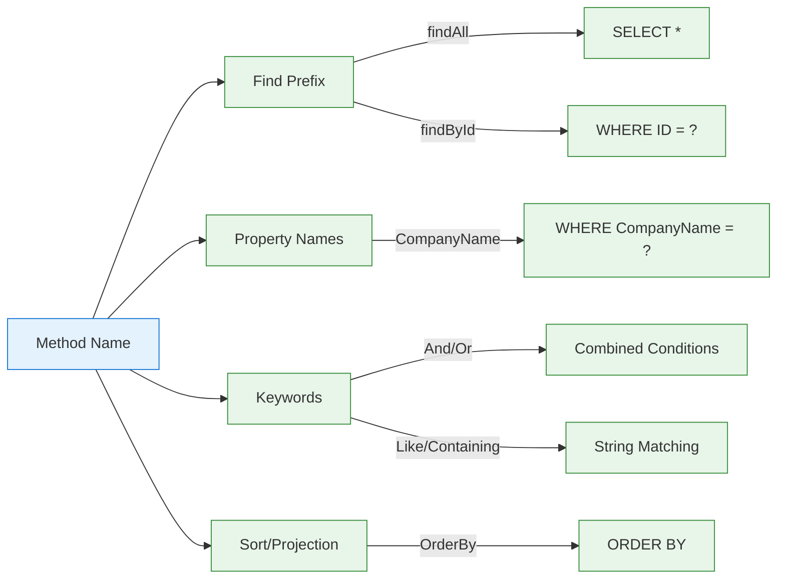
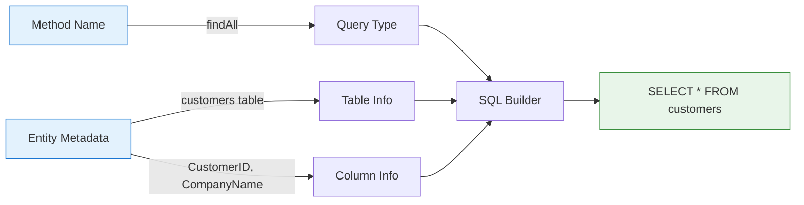
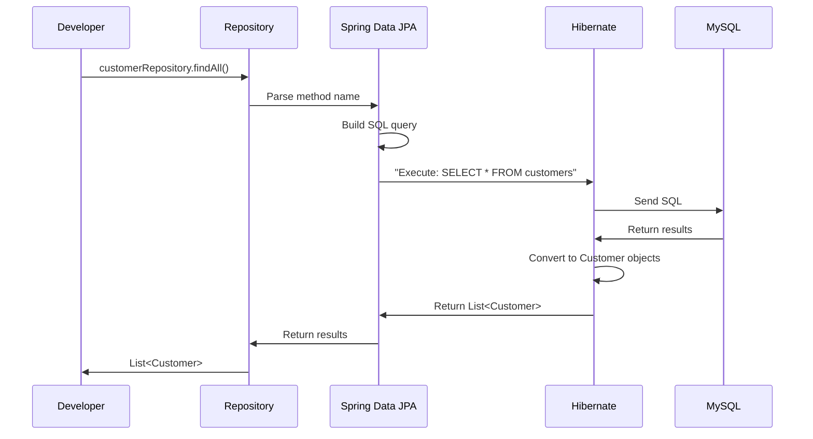
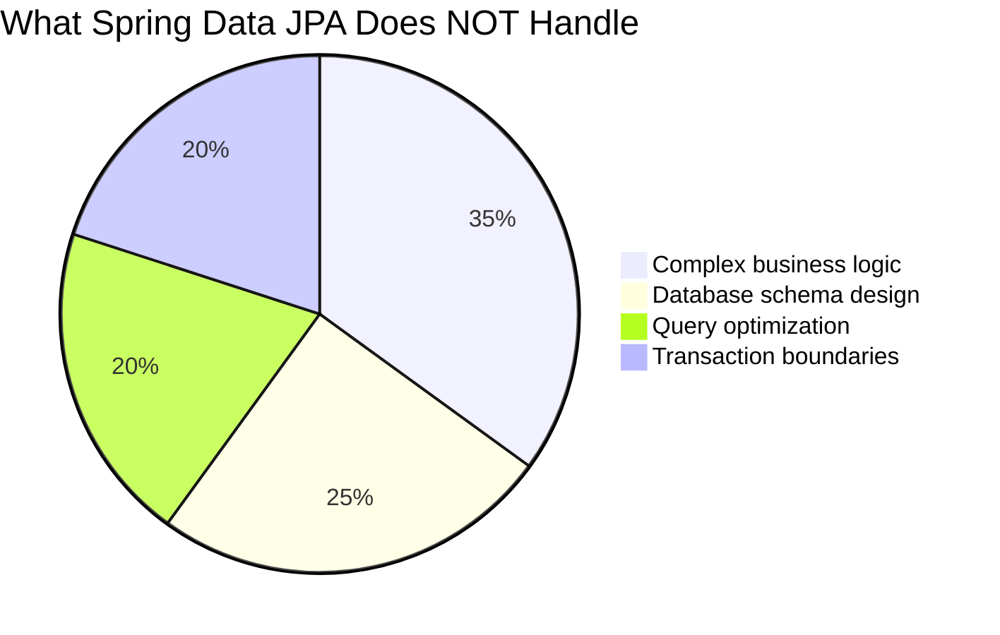

# How Spring Data JPA Generates SQL Queries: The Complete Logic

---
tags: [java/springboot, java/jpa, crud, sql, beginner]
date: 2025-09-05
topic: How Spring Data JPA Generates SQL Queries
---

## ## The Query Generation Process Explained

### How Spring Data JPA Turns Method Names into SQL

```mermaid
flowchart LR
    A[Your Method Call] -->|customerRepository.findAll()| B[Method Name Parser]
    B --> C[Entity Metadata Lookup]
    C --> D[SQL Query Builder]
    D --> E[Generated SQL]
    E --> F[Database Execution]
    F --> G[Java Objects]
    
    classDef input fill:#fff9c4,stroke:#f57f24;
    class A input;
    
    classDef process fill:#e3f2fd,stroke:#1976d2;
    class B,C,D process;
    
    classDef output fill:#e8f5e9,stroke:#388e3c;
    class E,G output;
    
    classDef db fill:#fce4ec,stroke:#c2185b;
    class F db;
```

### Real-Life Analogy: Restaurant Order Translation

Imagine you're at a restaurant where:
- **You** = Developer calling repository methods
- **Menu** = Your repository interface
- **Order** = Method name like `findAll()`
- **Kitchen Staff** = Spring Data JPA query generator
- **Chef** = Hibernate ORM
- **Food** = SQL query and results

When you order "All customers" (call `findAll()`), the kitchen staff knows exactly what ingredients (table/columns) to use and how to prepare the dish (generate SQL) based on the menu.

## ## The 4-Step Query Generation Logic

### 1. Method Name Parsing

Spring Data JPA uses a sophisticated parser to analyze your method names:



#### How It Works:

1. **Identifies the query type** from prefixes:
   - `find`/`read`/`get`/`query` → SELECT queries
   - `count` → COUNT queries
   - `exists` → EXISTS queries
   - `delete` → DELETE queries

2. **Extracts property names** from the remainder of the method name

3. **Recognizes keywords** that modify the query:
   - `And`, `Or` → Combine conditions
   - `Between`, `LessThan`, `GreaterThan` → Comparison operators
   - `Like`, `StartingWith`, `EndingWith`, `Containing` → String matching
   - `OrderBy` → Sorting

### 2. Entity Metadata Lookup

Spring checks your entity's annotations to map Java properties to database columns:

```java
@Entity
@Table(name = "customers", schema = "northwind")
public class Customer {
    @Id
    @Column(name = "CustomerID")
    private String customerID;
    
    @Column(name = "CompanyName")
    private String companyName;
    
    // Other fields...
}
```

#### Critical Metadata Used:

| Metadata | Your Northwind Example | Purpose |
|----------|------------------------|---------|
| `@Entity` | `@Entity` | Identifies this as a database-mapped class |
| `@Table` | `@Table(name = "customers")` | Specifies the database table name |
| `@Column` | `@Column(name = "CompanyName")` | Maps Java property to database column |
| `@Id` | `@Id` on customerID | Identifies primary key column |
| Naming Strategy | `PhysicalNamingStrategyStandardImpl` | Preserves exact column names |

> [!TIP] Why Naming Strategy Matters
> Without `PhysicalNamingStrategyStandardImpl`, Spring would look for `company_name` instead of `CompanyName`, causing errors with your Northwind database.

### 3. SQL Query Construction

Spring combines the parsed method name with entity metadata to build the SQL:



### 4. Database Execution & Result Conversion

The generated SQL is executed and results are converted back to Java objects:



## ## Real Examples from Your Northwind Project

### 1. Basic CRUD Methods

#### `findAll()` → `SELECT * FROM customers`

**How it works:**
1. Recognizes `findAll` as a standard method
2. Looks up entity metadata for `Customer`
3. Builds query using table name "customers"
4. Generates `SELECT * FROM customers`

#### `findById("ALFKI")` → `SELECT * FROM customers WHERE CustomerID = 'ALFKI'`

**How it works:**
1. Recognizes `findById` as a standard method
2. Identifies "CustomerID" as the primary key (from `@Id`)
3. Uses the ID value "ALFKI" as the parameter
4. Generates query with WHERE clause using exact column name

### 2. Custom Query Methods

#### Example 1: Simple Property Query
```java
List<Customer> findByCompanyName(String companyName);
```
**Generated SQL:**
```sql
SELECT * FROM customers WHERE CompanyName = ?
```

**How it works:**
1. Parses "findByCompanyName" → find by company name
2. Looks up "companyName" property in Customer entity
3. Maps to "CompanyName" column (thanks to naming strategy)
4. Creates WHERE clause with parameter

#### Example 2: Combined Conditions
```java
List<Customer> findByCityAndCountry(String city, String country);
```
**Generated SQL:**
```sql
SELECT * FROM customers WHERE City = ? AND Country = ?
```

**How it works:**
1. Parses "findByCityAndCountry" → find by city AND country
2. Recognizes "And" keyword to combine conditions
3. Maps both properties to their database columns
4. Creates WHERE clause with two parameters

#### Example 3: String Matching
```java
List<Customer> findByCompanyNameContaining(String name);
```
**Generated SQL:**
```sql
SELECT * FROM customers WHERE CompanyName LIKE ?
```
**Parameter becomes:** `%name%` (with wildcards added)

#### Example 4: Sorting
```java
List<Customer> findByCountryOrderByCompanyName(String country);
```
**Generated SQL:**
```sql
SELECT * FROM customers WHERE Country = ? ORDER BY CompanyName ASC
```

## ## The Complete Logic Flow for Your Project

### How `customerRepository.findAll()` Works in Your Northwind App

```mermaid
flowchart TD
    A[You call findAll()] --> B[Spring Data JPA]
    B --> C{Is standard method?}
    C -->|Yes| D[Use built-in implementation]
    D --> E[Get entity metadata]
    E --> F[Customer.class]
    F --> G[Check @Entity annotations]
    G --> H[Table: customers]
    G --> I[Columns: CustomerID, CompanyName, etc.]
    H --> J[Build SQL: SELECT * FROM customers]
    I --> J
    J --> K[Execute with Hibernate]
    K --> L[MySQL Database]
    L --> M[Return raw data]
    M --> N[Convert to Customer objects]
    N --> O[Return List<Customer>]
    
    classDef you fill:#fff9c4,stroke:#f57f24;
    class A you;
    
    classDef spring fill:#e3f2fd,stroke:#1976d2;
    class B,C,D,E,F,G,H,I,J,K spring;
    
    classDef db fill:#fce4ec,stroke:#c2185b;
    class L,M,N,O db;
```

### Step-by-Step Breakdown

1. **You call `customerRepository.findAll()`**
   - Just a simple method call on your repository interface

2. **Spring Data JPA recognizes it as a standard method**
   - `findAll()` is predefined in `JpaRepository`
   - No custom implementation needed

3. **Entity metadata is retrieved**
   - Spring looks at `Customer.class` annotations
   - Finds `@Entity`, `@Table(name = "customers")`
   - Maps Java properties to database columns

4. **SQL query is constructed**
   - Table name: "customers" (from `@Table`)
   - All columns included (for `findAll()`)
   - Exact column names preserved (thanks to naming strategy)

5. **Query is executed through Hibernate**
   - Hibernate sends `SELECT * FROM customers` to MySQL
   - Database returns all customer records

6. **Results are converted to Java objects**
   - Each row becomes a `Customer` object
   - Column values mapped to Java properties
   - List of objects returned to your code

> [!WARNING] Critical for Your Project
> Without the correct naming strategy:
> ```properties
> spring.jpa.hibernate.naming.physical-strategy=org.hibernate.boot.model.naming.PhysicalNamingStrategyStandardImpl
> ```
> Spring would generate:
> ```sql
> SELECT * FROM customers WHERE company_name = ?
> ```
> Instead of:
> ```sql
> SELECT * FROM customers WHERE CompanyName = ?
> ```
> This would fail because your Northwind database uses PascalCase column names!

## ## Advanced Query Generation Logic

### How Spring Handles Complex Queries

#### 1. Property Traversal (for relationships)
```java
// If Customer has an Address entity
List<Customer> findByAddress_City(String city);
```
**Generated SQL:**
```sql
SELECT c.* FROM customers c 
JOIN addresses a ON c.address_id = a.id 
WHERE a.city = ?
```

#### 2. Conditional Keywords
```java
List<Customer> findByCompanyNameStartingWithOrCityEndingWith(String prefix, String suffix);
```
**Generated SQL:**
```sql
SELECT * FROM customers 
WHERE CompanyName LIKE ? OR City LIKE ?
```
**Parameters:** `prefix + '%'` and `'%' + suffix`

#### 3. Pagination and Sorting
```java
Page<Customer> findByCountry(String country, Pageable pageable);
```
**Generated SQL (for page 0, size 10):**
```sql
SELECT * FROM customers 
WHERE Country = ? 
ORDER BY id ASC 
LIMIT 10 OFFSET 0
```

#### 4. Projection Queries
```java
// Returns only customer IDs and company names
List<CustomerSummary> findByCountry(String country);
```
**Generated SQL:**
```sql
SELECT CustomerID, CompanyName FROM customers WHERE Country = ?
```

## ## What Spring Data JPA Does NOT Do

### Common Misconceptions



### Key Limitations to Understand

1. **No Automatic Query Optimization**
   - Spring generates correct SQL, but not necessarily optimal SQL
   - For complex queries, you might need to use `@Query` with optimized JPQL

2. **No Schema Creation**
   - Spring doesn't create your database schema
   - It assumes your tables already exist (or uses `ddl-auto` for simple cases)

3. **No Business Logic**
   - It handles data access, not business rules
   - Your service layer should contain business logic

4. **Limited Complex Query Support**
   - Very complex queries might require custom `@Query` annotations
   - Example: Subqueries, complex joins, or database-specific functions

## ## Summary Cheat Sheet

### Spring Data JPA Query Generation Rules

| Method Name Pattern | Generated SQL | Your Northwind Example |
|---------------------|---------------|------------------------|
| `findAll()` | `SELECT * FROM customers` | Get all customers |
| `findById(id)` | `SELECT * FROM customers WHERE CustomerID = ?` | Get customer by ID |
| `findByCompanyName(name)` | `SELECT * FROM customers WHERE CompanyName = ?` | Find by company name |
| `findByCityAndCountry(city, country)` | `WHERE City = ? AND Country = ?` | Multiple conditions |
| `findByCompanyNameContaining(name)` | `WHERE CompanyName LIKE ?` | Partial matches |
| `countByCountry(country)` | `SELECT COUNT(*) FROM customers WHERE Country = ?` | Count records |

### What You Need to Remember

1. **Method names drive query generation** - follow the naming conventions
2. **Entity metadata is critical** - annotations map Java to database
3. **Naming strategy matters** - essential for databases like Northwind
4. **Spring does the translation** - you work with Java objects, not SQL
5. **You don't write SQL** - Spring generates it based on your method names

> [!TIP] For Your Northwind Project
> When creating custom query methods:
> 1. Start with `findBy`, `getBy`, or `readBy`
> 2. Use exact property names from your entity
> 3. Use keywords like `And`, `Or`, `Containing`
> 4. Remember your naming strategy preserves PascalCase column names
>
> Example: `findByCityAndCountry("London", "UK")` works because:
> - `City` maps to `City` column
> - `Country` maps to `Country` column
> - `And` combines the conditions

#java/springboot #java/jpa #crud #sql #beginner #query-generation