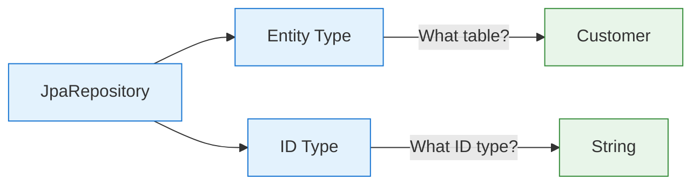
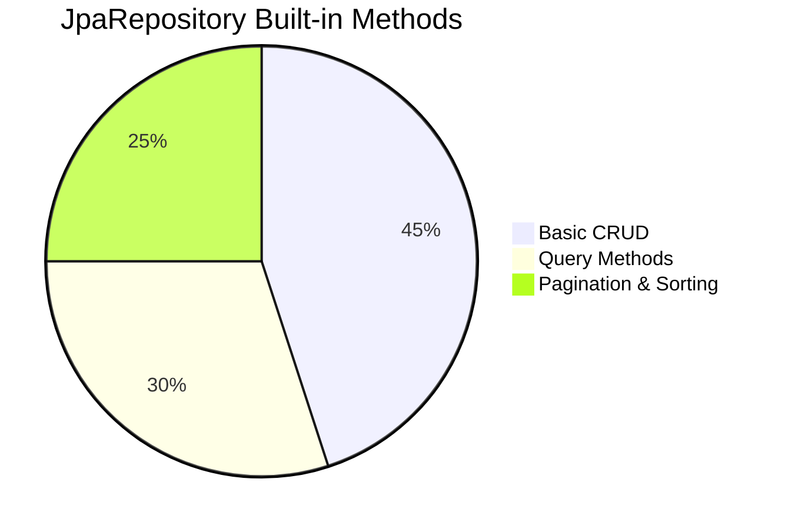
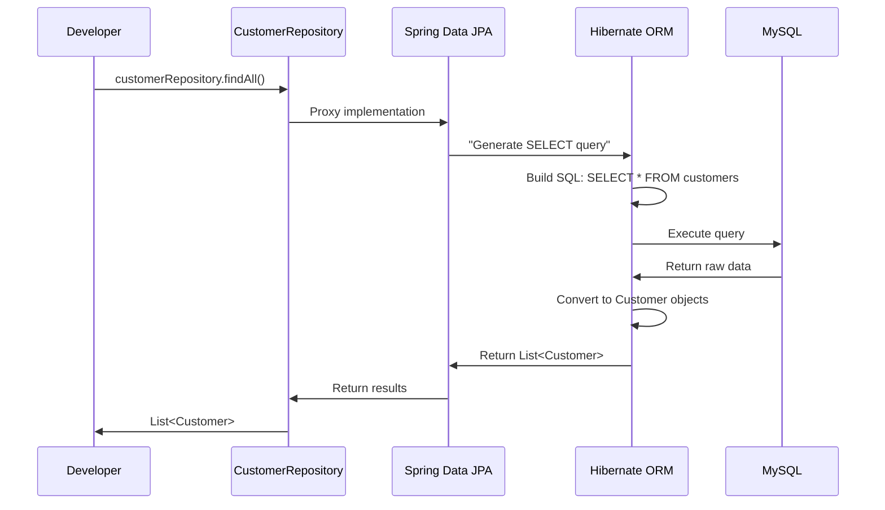
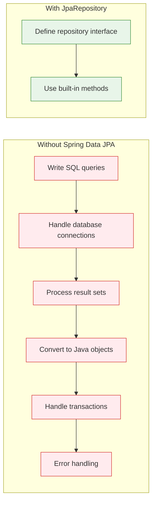

# Understanding JpaRepository - The Heart of Spring Data JPA

---
tags: [java/springboot, java/jpa, beginner, crud]
date: 2025-09-05
topic: What is JpaRepository and How It Works
---

## ## What is JpaRepository? (The Simplest Explanation)

### JpaRepository = Your Database Superpower


### Real-Life Analogy: Restaurant Menu

Imagine JpaRepository is like a **restaurant menu**:

- **You** = Customer who orders food
- **JpaRepository** = The complete menu with all dishes listed
- **Spring Data JPA** = The kitchen staff who prepares the dishes
- **You don't need to cook** - just order what you want!

When you extend JpaRepository, you're saying: "I want all the standard database operations available," and Spring provides them automatically.

## ## What JpaRepository Actually Is

### The Technical Definition

JpaRepository is a **generic interface** provided by Spring Data JPA that gives you ready-to-use database operations.

```java
public interface CustomerRepository extends JpaRepository<Customer, String> {
    // Your interface is EMPTY but has superpowers!
}
```

### The Two Critical Type Parameters



1. **Entity Type** (`Customer`):
   - Which database table you're working with
   - Matches your entity class (the Java class with `@Entity`)

2. **ID Type** (`String`):
   - The data type of your primary key
   - **MUST match** your `@Id` field type (in your Northwind app, customerID is a String)

> [!WARNING] Critical Detail
> In your Northwind application, customer IDs are text values like "ALFKI", not numbers. This is why your repository must use `String` as the ID type:
> ```java
> public interface CustomerRepository extends JpaRepository<Customer, String> {
>     // Correct for Northwind database
> }
> ```
> Using `Integer` would cause runtime errors because Spring would look for numeric IDs.

## ## What JpaRepository Gives You (The Superpowers)

### The Complete CRUD Toolkit



### Basic CRUD Operations (No Code Needed!)

| Method | What It Does | Your Northwind Example |
|--------|--------------|------------------------|
| `save()` | Create or update an entity | `customerRepository.save(newCustomer)` |
| `findAll()` | Get all entities | `customerRepository.findAll()` |
| `findById(id)` | Get one entity by ID | `customerRepository.findById("ALFKI")` |
| `delete()` | Remove an entity | `customerRepository.delete(customer)` |
| `existsById(id)` | Check if entity exists | `customerRepository.existsById("ALFKI")` |
| `count()` | Count all entities | `customerRepository.count()` |

### How These Methods Work Behind the Scenes



> [!TIP] The Magic You Don't See
> When you call `customerRepository.findAll()`, Spring Data JPA:
> 1. Knows you want all Customer entities
> 2. Generates the correct SQL (`SELECT * FROM customers`)
> 3. Executes it against your database
> 4. Converts results to Java objects
> 5. Returns them to you as a List<Customer>
>
> **You never write SQL or handle database connections!**

## ## Your Northwind Example in Action

### What Happens When You Run This Code

```java
@SpringBootApplication
public class NorthwindApplication {
    public static void main(String[] args) {
        ApplicationContext context = SpringApplication.run(NorthwindApplication.class, args);
        
        CustomerRepository customerRepository = context.getBean(CustomerRepository.class);
        List<Customer> customers = customerRepository.findAll();
        
        for(Customer customer : customers) {
            System.out.println(customer);
        }
    }
}
```

### Step-by-Step Breakdown

1. **Spring Boot Starts Up**
   - Reads your `application.properties`
   - Connects to MySQL database
   - Scans for components (including your repository)

2. **Spring Creates a Proxy Implementation**
   - Your `CustomerRepository` is just an interface
   - Spring generates a concrete class at runtime
   - This class implements all JpaRepository methods

3. **You Get a Working Repository**
   ```java
   CustomerRepository customerRepository = context.getBean(CustomerRepository.class);
   ```
   - You're not getting an interface - you're getting Spring's generated implementation
   - It's ready to use with all CRUD methods

4. **You Call findAll()**
   ```java
   List<Customer> customers = customerRepository.findAll();
   ```
   - Spring translates this to SQL: `SELECT * FROM customers`
   - Results are automatically converted to Customer objects
   - You get a list of Java objects to work with

5. **You See the Results**
   ```
   Customer{customerID='ALFKI', companyName='Alfreds Futterkiste'...}
   Customer{customerID='ANATR', companyName='Ana Trujillo Emparedados'...}
   ```

> [!NOTE] Key Insight for Your Project
> The reason this works with your Northwind database is because:
> 1. You configured the naming strategy correctly:
>    ```properties
>    spring.jpa.hibernate.naming.physical-strategy=org.hibernate.boot.model.naming.PhysicalNamingStrategyStandardImpl
>    ```
> 2. This preserves the exact column names (like `CustomerID` instead of `customer_id`)
> 3. Without this, Hibernate would look for wrong column names and fail

## ## Advanced JpaRepository Features

### Beyond Basic CRUD

JpaRepository gives you more than just basic operations:

### 1. Pagination and Sorting

```java
// Get page 0 (first page) with 10 items, sorted by company name
Page<Customer> page = customerRepository.findAll(
    PageRequest.of(0, 10, Sort.by("companyName"))
);
```

### 2. Query Methods by Convention

Just add a method to your repository interface:

```java
public interface CustomerRepository extends JpaRepository<Customer, String> {
    // Spring automatically creates the implementation!
    List<Customer> findByCompanyName(String companyName);
    
    List<Customer> findByCityAndCountry(String city, String country);
}
```

### 3. Custom Queries with @Query

For more complex needs:

```java
public interface CustomerRepository extends JpaRepository<Customer, String> {
    @Query("SELECT c FROM Customer c WHERE c.city = ?1 AND c.country = ?2")
    List<Customer> findCustomersByCityAndCountry(String city, String country);
}
```

### 4. Query by Example

```java
// Find customers with matching properties
Customer exampleCustomer = new Customer();
exampleCustomer.setCity("London");
exampleCustomer.setCountry("UK");

Example<Customer> example = Example.of(exampleCustomer);
List<Customer> results = customerRepository.findAll(example);
```

## ## Why JpaRepository is Revolutionary

### The Before and After Comparison



### What JpaRepository Solves

| Problem | Traditional Approach | JpaRepository Solution |
|---------|----------------------|------------------------|
| **Boilerplate Code** | Write repetitive DAO classes | Zero implementation code |
| **SQL Knowledge** | Need to write and optimize SQL | Automatic SQL generation |
| **Mapping Results** | Manual ResultSet processing | Automatic object mapping |
| **Transaction Management** | Manual begin/commit/rollback | Automatic transaction handling |
| **Error Handling** | Custom exception handling | Standardized exception hierarchy |

> [!TIP] For Complete Beginners
> JpaRepository is like having a personal database assistant who:
> - Knows all the SQL you need
> - Handles all the database connections
> - Converts results to Java objects
> - Manages transactions automatically
>
> You just tell it what you want ("get all customers"), and it takes care of everything else!

## ## Summary Cheat Sheet

### JpaRepository Quick Reference

| Concept | What It Is | Your Northwind Example |
|---------|------------|------------------------|
| **JpaRepository** | Core interface for data access | `CustomerRepository` |
| **Entity Type** | Which database table to use | `Customer` |
| **ID Type** | Primary key data type | `String` (matches customerID) |
| **CRUD Methods** | Basic data operations | `findAll()`, `save()`, `deleteById()` |
| **Query Methods** | Custom queries by naming | `findByCompanyName(String name)` |

### What You Need to Remember

1. **JpaRepository is an interface you extend**, not implement
2. **You get all CRUD operations for free** - no SQL needed
3. **ID type must match your entity's ID field** (String for Northwind)
4. **Spring creates the implementation at runtime** through proxies
5. **Naming strategy is critical** for databases like Northwind with PascalCase columns

> [!NOTE] Final Beginner Insight
> When you see `customerRepository.findAll()`, remember you're not working with a database - you're working with **Java objects**. JpaRepository handles all the database interaction behind the scenes, so you can focus on your business logic. This is the true power of Spring Data JPA!

#java/springboot #java/jpa #crud #beginner #interfaces