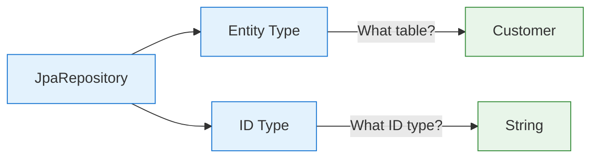
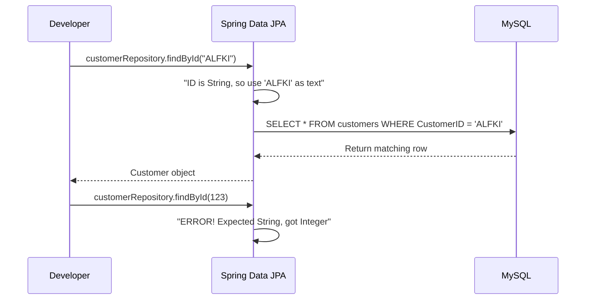
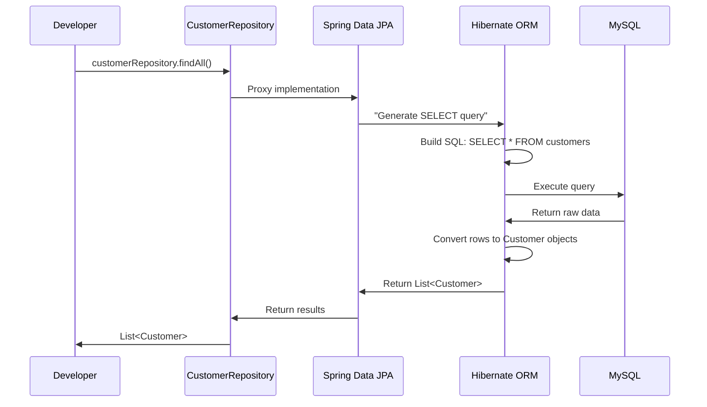
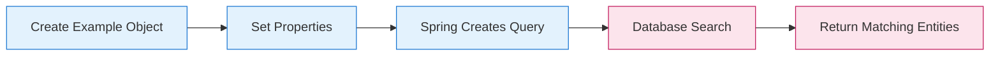

# Understanding Spring Data JPA: Deep Dive into Repositories and Generics

---
tags: [java/springboot, java/jpa, beginner, crud, generics]
date: 2025-09-05
topic: Understanding Spring Data JPA Repositories and Generics
---

## ## Why `CustomerRepository.class` in `context.getBean(CustomerRepository.class)`

### The Interface Retrieval Mechanism


### Real-Life Analogy: Restaurant Ordering System

Imagine you're at a restaurant:

- **CustomerRepository.class** = The menu category "Entrees"
- **Spring Container** = The restaurant kitchen
- **You** = The customer ordering food

When you say "I want an entree" (provide `CustomerRepository.class`), the kitchen (Spring) knows which dish to prepare, even though "entree" is just a category, not a specific dish.

### What's Actually Happening

```java
CustomerRepository customerRepository = context.getBean(CustomerRepository.class);
```

1. **You're requesting a bean of type `CustomerRepository`**
   - `CustomerRepository` is just an interface (a contract)
   - You're not asking for a specific implementation

2. **Spring provides the implementation**
   - At runtime, Spring created a proxy class that implements `CustomerRepository`
   - This proxy has all the CRUD methods (`findAll()`, `save()`, etc.)
   - You get this implementation without knowing it exists

3. **Why `.class` is needed**
   - Java needs the class object to identify what type you want
   - It's like saying "I want something that implements this interface"
   - Without it, Spring wouldn't know which repository you need

> [!TIP] For Absolute Beginners
> Think of `.class` as giving Spring a **blueprint** of what you want. Spring then builds the actual house (the implementation) based on that blueprint.

## ## Understanding `<Customer, String>` Generics

### What These Angle Brackets Mean



### The Two Critical Type Parameters

```java
public interface CustomerRepository extends JpaRepository<Customer, String> {
    // Empty interface with superpowers!
}
```

#### 1. **First Parameter: `Customer` (Entity Type)**

- **What it is**: The Java class representing your database table
- **What it does**: Tells Spring which table to work with
- **In your Northwind app**: Maps to the `customers` table

#### 2. **Second Parameter: `String` (ID Type)**

- **What it is**: The data type of your primary key field
- **What it does**: Tells Spring how to handle IDs when querying
- **In your Northwind app**: Matches `@Id private String customerID;`

### Why These Parameters Matter



- If you used `Integer` instead of `String`, calling `findById("ALFKI")` would fail
- Spring would try to convert "ALFKI" to a number, which isn't possible
- Your Northwind database uses text IDs like "ALFKI", not numbers

> [!WARNING] Critical Detail for Your Project
> In your Northwind database, customer IDs are **text values** (like "ALFKI"), not numbers. This is why your repository **must** use `String` as the ID type:
> ```java
> public interface CustomerRepository extends JpaRepository<Customer, String> {
>     // Correct for Northwind database
> }
> ```
> Using `Integer` would cause runtime errors because Spring would look for numeric IDs.

## ## What Can Go in the Generic Parameters?

### Entity Type Options (First Parameter)

| Entity Type  | When to Use                  | Northwind Example                 |
|--------------|------------------------------|-----------------------------------|
| `Customer`   | Working with customers table | Your current implementation       |
| `Product`    | Working with products table  | `JpaRepository<Product, Integer>` |
| `Order`      | Working with orders table    | `JpaRepository<Order, Integer>`   |
| `CustomType` | Working with custom entities | `JpaRepository<CustomType, UUID>` |

### ID Type Options (Second Parameter)

| ID Type    | Database Example | When to Use                                  |
|------------|------------------|----------------------------------------------|
| `String`   | "ALFKI", "ANATR" | Text-based IDs (your Northwind customers)    |
| `Long`     | 1, 2, 3          | Auto-increment numeric IDs                   |
| `Integer`  | 1, 2, 3          | Smaller numeric IDs                          |
| `UUID`     | "a1b2c3d4-..."   | Universally unique identifiers               |
| `CustomId` | Composite keys   | For tables with multiple-column primary keys |

### Real Examples from Your Project

```java
// For customers (text IDs)
public interface CustomerRepository extends JpaRepository<Customer, String> { }

// If you had orders (numeric IDs)
public interface OrderRepository extends JpaRepository<Order, Integer> { }

// If you had products with UUIDs
public interface ProductRepository extends JpaRepository<Product, UUID> { }
```

> [!TIP] How to Determine ID Type
> Look at your entity's `@Id` field:
> ```java
> @Id
> @Column(name = "CustomerID")
> private String customerID;  // This tells you ID type is String
> ```
> The data type of this field determines your repository's ID parameter.

## ## Understanding the Concrete Implementation

### What Spring Creates Behind the Scenes

```mermaid
flowchart LR
    A[Your Empty Interface] -->|Spring detects| B[Spring Data JPA]
    B -->|Creates at Runtime| C[Proxy Implementation]
    C --> D[findAll() Method]
    C --> E[findById() Method]
    C --> F[save() Method]
    C --> G[delete() Method]
    
    classDef interface fill:#ede7f6,stroke:#673ab7;
    class A interface;
    
    classDef proxy fill:#e3f2fd,stroke:#1976d2;
    class B,C proxy;
    
    classDef method fill:#e8f5e9,stroke:#388e3c;
    class D,E,F,G method;
```

### What Spring Data JPA Does NOT Do

- **It does NOT create Customer objects** - it creates a repository implementation
- **It does NOT hold customer data** - it retrieves data when needed
- **It does NOT store entities** - it's stateless between calls

### What Spring Data JPA Actually Does

1. **Creates a proxy class** that implements your repository interface
2. **Analyzes method names** to determine what SQL to generate
3. **Delegates to Hibernate** to execute the SQL and convert results
4. **Returns Java objects** (your entities) to your code

### The Complete Flow (Simplified)



> [!NOTE] Key Insight
> When you call `customerRepository.findAll()`, Spring Data JPA:
> 1. Interprets the method name
> 2. Generates the appropriate SQL query
> 3. Executes it against your database
> 4. Converts results to Customer objects
> 5. Returns them to you
>
> **You never see the database interaction - it's completely hidden!**

## ## What is `Example<Customer>` Doing?

### Query by Example: The Simple Search



### Your Code Explained

```java
// 1. Create a "prototype" customer
Customer exampleCustomer = new Customer();
exampleCustomer.setCity("London");
exampleCustomer.setCountry("UK");

// 2. Create an Example from the prototype
Example<Customer> example = Example.of(exampleCustomer);

// 3. Use the example to find matching customers
List<Customer> results = customerRepository.findAll(example);
```

### What This Does Behind the Scenes

1. **You create a "template" object** with only the properties you want to match
2. **Spring analyzes this object** and creates a query:
   ```sql
   SELECT * FROM customers WHERE city = 'London' AND country = 'UK'
   ```
3. **The repository executes this query** and returns matching customers

### Real-Life Analogy: Library Book Search

Imagine you're in a library:

- **exampleCustomer** = A blank book form where you write "London" under City and "UK" under Country
- **Example.of()** = The librarian takes your form and understands it as search criteria
- **findAll(example)** = The librarian finds all books matching your criteria

### When to Use Query by Example

| Scenario                                                | Traditional Approach      | Query by Example            |
|---------------------------------------------------------|---------------------------|-----------------------------|
| Simple search with multiple fields                      | Multiple custom methods   | One generic method          |
| Dynamic search (user selects which fields to search)    | Complex conditional logic | Simple object configuration |
| When you don't know all search criteria at compile time | Hard to implement         | Very easy to implement      |

> [!TIP] For Your Northwind Project
> If you want to find all customers in London, UK:
> ```java
> Customer exampleCustomer = new Customer();
> exampleCustomer.setCity("London");
> exampleCustomer.setCountry("UK");
> 
> List<Customer> londonCustomers = customerRepository.findAll(Example.of(exampleCustomer));
> ```
> This is much simpler than creating a custom method like `findByCityAndCountry()`!

## ## Summary Cheat Sheet

### Spring Data JPA Key Concepts

| Concept                      | What It Is                    | Your Northwind Example          |
|------------------------------|-------------------------------|---------------------------------|
| **`.class` in getBean**      | Type token for bean retrieval | `CustomerRepository.class`      |
| **First Generic Parameter**  | Entity type (database table)  | `Customer`                      |
| **Second Generic Parameter** | ID field data type            | `String` (matches customerID)   |
| **Concrete Implementation**  | Runtime-generated proxy class | Spring creates it automatically |
| **Example Query**            | Dynamic search by prototype   | `Example.of(exampleCustomer)`   |

### What You Need to Remember

1. **`.class` is needed** to tell Spring what type of bean you want
2. **Generics parameters must match your entity structure**:
   - First = Your entity class
   - Second = Your ID field type
3. **Spring creates repository implementations at runtime** - you don't write them
4. **Repositories don't store data** - they retrieve it when needed
5. **Example queries** let you do dynamic searches without writing custom methods

> [!TIP] Final Beginner Insight
> When you see `CustomerRepository customerRepository = context.getBean(CustomerRepository.class);`, remember:
> - You're getting a **working implementation** of your empty interface
> - The `<Customer, String>` tells Spring how to connect your Java code to your database
> - Spring handles all the database work behind the scenes
> - You get to work with **Java objects**, not SQL or database connections
>
> This is the true power of Spring Data JPA!

#java/springboot #java/jpa #crud #generics #beginner #query-by-example

