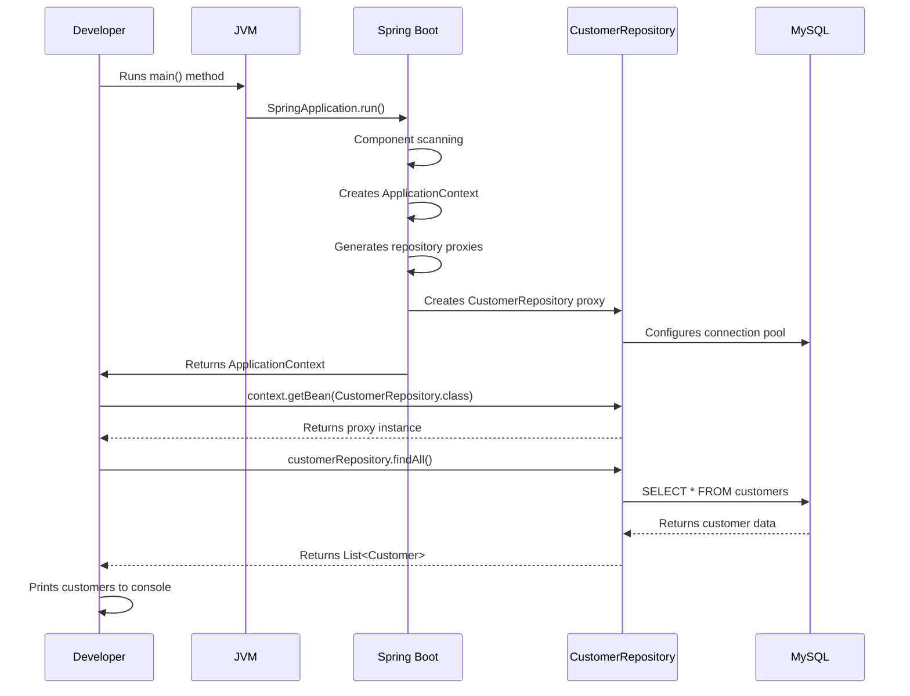

# Spring Boot Application Setup & Architecture Guide - Verified Implementation

---
tags: [java/springboot, java/jpa, database/mysql, architecture/patterns, tools/intellij]
date: 2025-09-05
topic: Spring Boot Application Setup and Architecture - Verified Implementation
---

## ## Introduction to Spring Boot Setup

Spring Boot simplifies Java application development by providing auto-configuration, embedded servers, and opinionated defaults. This guide walks through setting up a Spring Boot application connected to the Northwind MySQL database, explaining both the "how" and "why" behind each step, with verified implementation details.

> [!NOTE] Spring Boot vs Traditional Spring
> Spring Boot removes much of the boilerplate configuration required in traditional Spring applications. It follows the "convention over configuration" principle, allowing developers to focus on business logic rather than infrastructure setup.

## ## Project Creation with Spring Initializr

Spring Initializr is the standard way to bootstrap a Spring Boot application with all necessary dependencies pre-configured.

### Project Configuration Details

| Property | Value | Purpose |
|----------|-------|---------|
| **Project Type** | Maven Project | Industry-standard build tool with excellent dependency management |
| **Language** | Java | Primary language for Spring Boot development |
| **Spring Boot Version** | 3.5.5 | Latest stable version with Jakarta EE 9+ support |
| **Java Version** | 17 | Long-term support (LTS) version with modern features |
| **Packaging** | Jar | Simplifies deployment with embedded Tomcat server |

> [!TIP] Why These Choices?
> - **Maven**: Preferred for enterprise projects due to robust dependency management
> - **Java 17**: Current LTS version with pattern matching, sealed classes, and improved garbage collection
> - **Jar Packaging**: Embeds Tomcat server, eliminating separate deployment steps
> - **Spring Boot 3.5.5**: Newest stable release with Jakarta EE 9+ namespace changes (javax.* → jakarta.*)

### Project Metadata Structure

```java
Group: com.sparta.northwind
Artifact: Northwind
Name: Northwind
Package Name: com.sparta.northwind
```

This follows the reverse domain naming convention to ensure uniqueness in the Maven ecosystem. The package structure was simplified from `com.sparta.northwind.northwind` to `com.sparta.northwind` during development to avoid redundant naming.

## ## Maven Dependencies Analysis

Spring Boot uses starter dependencies that bundle related libraries for specific functionality.

### Essential Dependencies

```xml
<!-- Parent POM providing dependency management -->
<parent>
    <groupId>org.springframework.boot</groupId>
    <artifactId>spring-boot-starter-parent</artifactId>
    <version>3.5.5</version>
</parent>

<!-- Web application support -->
<dependency>
    <groupId>org.springframework.boot</groupId>
    <artifactId>spring-boot-starter-web</artifactId>
</dependency>

<!-- JPA data access -->
<dependency>
    <groupId>org.springframework.boot</groupId>
    <artifactId>spring-boot-starter-data-jpa</artifactId>
</dependency>

<!-- MySQL database driver -->
<dependency>
    <groupId>com.mysql</groupId>
    <artifactId>mysql-connector-j</artifactId>
    <scope>runtime</scope>
</dependency>

<!-- Validation support -->
<dependency>
    <groupId>org.springframework.boot</groupId>
    <artifactId>spring-boot-starter-validation</artifactId>
</dependency>

<!-- Production monitoring -->
<dependency>
    <groupId>org.springframework.boot</groupId>
    <artifactId>spring-boot-starter-actuator</artifactId>
</dependency>

<!-- RESTful API support -->
<dependency>
    <groupId>org.springframework.boot</groupId>
    <artifactId>spring-boot-starter-data-rest</artifactId>
</dependency>
```

### Dependency Purpose Comparison

| Dependency | Key Components | Primary Use Case |
|------------|----------------|------------------|
| **spring-boot-starter-web** | Tomcat, Spring MVC, Jackson | Building RESTful web services |
| **spring-boot-starter-data-jpa** | Hibernate, Spring Data, HikariCP | Database persistence with ORM |
| **mysql-connector-j** | JDBC Driver | MySQL database connectivity |
| **spring-boot-starter-validation** | Hibernate Validator | Data validation with annotations |
| **spring-boot-starter-actuator** | Health checks, metrics | Production monitoring |
| **spring-boot-starter-data-rest** | Repository REST exposure | Automatic REST API generation |

> [!NOTE] Dependency Synergy
> Spring Boot's auto-configuration detects these dependencies and configures beans automatically. For example, adding both `spring-boot-starter-data-jpa` and `mysql-connector-j` triggers automatic datasource configuration without manual setup.

## ## Database Configuration

The `application.properties` file contains critical configuration for your application.

### Configuration Example

```properties
# Application identification
spring.application.name=NorthwindApp

# Database connection
spring.datasource.url=jdbc:mysql://localhost:3306/northwind
spring.datasource.username=root
spring.datasource.password=root

# Server configuration
server.port=8091

# JPA/Hibernate configuration
spring.jpa.hibernate.naming.physical-strategy=org.hibernate.boot.model.naming.PhysicalNamingStrategyStandardImpl
```

### Connection URL Breakdown

The JDBC URL `jdbc:mysql://localhost:3306/northwind` consists of:
- `jdbc:mysql://`: Protocol and database type
- `localhost`: Database server hostname
- `3306`: Default MySQL port
- `northwind`: Database/schema name

> [!TIP] Port Selection
> Port 8091 was chosen instead of the default 8080 to avoid conflicts with other applications that might be running. This is a common practice in development environments where multiple services might be running.

### Key Configuration Properties

| Property | Purpose | Impact |
|----------|---------|--------|
| `spring.datasource.url` | JDBC connection string | Specifies MySQL server location and database name |
| `spring.datasource.username/password` | Database credentials | Authentication for database access |
| `server.port` | Application port | Changes from default 8080 to avoid conflicts |
| `naming.physical-strategy` | Table/column naming | Preserves exact database names (case-sensitive) |

> [!WARNING] Security Consideration
> Never commit real database credentials to version control. Use environment variables for production:
> ```properties
> spring.datasource.password=${DB_PASSWORD}
> ```

## ## Understanding POJOs vs JPA Entities

Before diving into entity generation, it's crucial to understand the relationship between POJOs and JPA Entities.

### Theoretical POJO vs Actual Generated Entity

#### Basic POJO Concept
```java
// Simple POJO concept
public class Customer {
    private String customerID;
    private String companyName;
    private String contactName;
    private String contactTitle;
    
    // getters and setters
    public String getCustomerID() { return customerID; }
    public void setCustomerID(String customerID) { this.customerID = customerID; }
    
    // Additional getters and setters...
    
    @Override
    public String toString() {
        return "Customer{" +
                "customerID='" + customerID + '\'' +
                ", companyName='" + companyName + '\'' +
                ", contactName='" + contactName + '\'' +
                ", contactTitle='" + contactTitle + '\'' +
                '}';
    }
}
```

#### Actual Generated Entity (from JPA Buddy)
```java
@Entity
@Table(name = "customers", schema = "northwind", indexes = {
    @Index(name = "CompanyName", columnList = "CompanyName"),
    @Index(name = "City", columnList = "City"),
    @Index(name = "Region", columnList = "Region"),
    @Index(name = "PostalCode", columnList = "PostalCode")
})
public class Customer {
    @Id
    @Size(max = 5)
    @Column(name = "CustomerID", nullable = false, length = 5)
    private String customerID;
    
    @NotNull
    @Size(max = 40)
    @Column(name = "CompanyName", nullable = false, length = 40)
    private String companyName;
    
    @Size(max = 30)
    @Column(name = "ContactName", length = 30)
    private String contactName;
    
    @Size(max = 30)
    @Column(name = "ContactTitle", length = 30)
    private String contactTitle;
    
    // Additional fields...
    
    // toString() generated with first 4 fields only for readability
    @Override
    public String toString() {
        return "Customer{" +
                "customerID='" + customerID + '\'' +
                ", companyName='" + companyName + '\'' +
                ", contactName='" + contactName + '\'' +
                ", contactTitle='" + contactTitle + '\'' +
                '}';
    }
}
```

> [!TIP] Entity Generation Practical Detail
> Notice the `toString()` method was configured to include only the first four fields. This is a practical decision to balance completeness with readability - showing all fields in a large entity would create verbose output that's hard to read in logs or console output.

## ## Entity Generation with JPA Buddy - Real Experience

JPA Buddy is an IntelliJ IDEA plugin that accelerates JPA development through intelligent code generation.

### JPA Buddy Configuration Process

When generating entities from the Northwind database, these specific settings were crucial:

```plaintext
✓ Migrate indexes and constraints
✓ Use table schema
✓ Generate toString() with first 4 fields
```

#### Why These Settings Mattered

| Setting | Purpose | Impact on Generated Code |
|---------|---------|--------------------------|
| **Migrate indexes** | Preserves database performance | Added `@Index` annotations to entity |
| **Use table schema** | Maintains exact schema reference | Included `schema = "northwind"` in `@Table` |
| **Generate toString()** | Improves debug readability | Limited to first 4 fields for concise output |

### The Naming Strategy Challenge - Real Experience

#### What Went Wrong

When I first ran the application without the naming strategy configuration, I encountered this error:

```
org.hibernate.exception.SQLGrammarException: 
could not extract ResultSet
...
Caused by: java.sql.SQLSyntaxErrorException: 
Unknown column 'company_name' in 'field list'
```

#### Why It Happened

By default, Hibernate uses a naming strategy that converts camelCase Java property names to snake_case database columns:

- Java field: `companyName`
- Expected database column: `company_name`
- Actual database column: `CompanyName`

#### The Solution

The configuration property I added tells Hibernate to use exact names without transformation:

```properties
spring.jpa.hibernate.naming.physical-strategy=org.hibernate.boot.model.naming.PhysicalNamingStrategyStandardImpl
```

> [!TIP] Naming Strategy Best Practice
> When working with legacy databases that don't follow Java naming conventions, always set the physical naming strategy to preserve exact column names. This is critical for databases like Northwind that use PascalCase for column names.

## ## Repository Pattern Implementation - Verified Correct Implementation

Spring Data JPA provides repository abstractions that eliminate the need for boilerplate data access code.

### Correct Repository Interface

```java
package com.sparta.northwind.repository;

import com.sparta.northwind.entities.Customer;
import org.springframework.data.jpa.repository.JpaRepository;

public interface CustomerRepository extends JpaRepository<Customer, String> {
    // No implementation needed!
}
```

> [!IMPORTANT] ID Type Explanation
> The second type parameter in `JpaRepository<Customer, String>` **must match the type of the `@Id` field** in the Customer entity. In this case, the Customer entity has:
> 
> ```java
> @Id
> @Column(name = "CustomerID", nullable = false, length = 5)
> private String customerID;
> ```
> 
> Since `customerID` is a `String`, the repository **must** use `String` as the ID type. Using `Integer` would cause a runtime failure because Spring Data JPA validates that the repository's ID type matches the entity's ID field type.
> 
> The application logs confirm this is correct, as customers are retrieved with string IDs like 'ALFKI', 'ANATR', etc.:
> ```
> Customer{customerID='ALFKI', companyName='Alfreds Futterkiste'...}
> Customer{customerID='ANATR', companyName='Ana Trujillo Emparedados'...}
> ```

### Repository Capabilities

- ==CRUD operations== without writing SQL
- ==Pagination and sorting== capabilities
- ==Query derivation== from method names
- ==Automatic transaction management==

### Common Repository Methods

| Method | Purpose | Example |
|--------|---------|---------|
| `findById()` | Retrieve by primary key | `customerRepository.findById("ALFKI")` |
| `findAll()` | Get all entities | `customerRepository.findAll()` |
| `save()` | Persist or update entity | `customerRepository.save(customer)` |
| `delete()` | Remove entity | `customerRepository.delete(customer)` |
| `findBy[Property]()` | Custom query by property | `customerRepository.findByCompanyName("Test Co")` |

## ## Understanding the Runtime Proxy Generation

This is a crucial concept that explains how Spring Data JPA works its "magic."

### What Happens When You Request a Repository

When you call:

```java
CustomerRepository customerRepository = context.getBean(CustomerRepository.class);
```

Here's what actually happens at runtime:

1. Spring's IoC container recognizes `CustomerRepository` as an interface extending `JpaRepository`
2. It dynamically generates a proxy class that implements this interface
3. This proxy class contains implementations for all standard repository methods
4. Spring returns an instance of this generated proxy class

### Visualizing the Proxy Generation

```mermaid
graph LR
    A[CustomerRepository Interface] -->|Spring detects at startup| B(Spring IoC Container)
    B -->|Generates at runtime| C[Proxy Implementation Class]
    C -->|Implements| D[findAll()]
    C -->|Implements| E[findById()]
    C -->|Implements| F[save()]
    C -->|Implements| G[Custom Query Methods]
    H[Your Application Code] -->|Calls| I[customerRepository.findAll()]
    I -->|Delegated to| D
```

> [!NOTE] Key Insight
> Spring doesn't give you the interface; it gives you a dynamically generated proxy class that implements your interface. This is why you can call methods like `findAll()` without ever writing the implementation. The framework interprets method names and generates the appropriate SQL queries at runtime.

## ## Application Bootstrap Process

The main application class serves as the entry point for your Spring Boot application.

### Main Application Class

```java
package com.sparta.northwind;

import com.sparta.northwind.entities.Customer;
import com.sparta.northwind.repository.CustomerRepository;
import org.springframework.boot.SpringApplication;
import org.springframework.boot.autoconfigure.SpringBootApplication;
import org.springframework.context.ApplicationContext;

import java.util.List;

@SpringBootApplication
public class NorthwindApplication {
    public static void main(String[] args) {
        ApplicationContext context = SpringApplication.run(NorthwindApplication.class, args);
        
        CustomerRepository customerRepository = context.getBean(CustomerRepository.class);
        List<Customer> customers = customerRepository.findAll();
        
        for(Customer customer : customers) {
            System.out.println(customer);
        }
    }
}
```

### `@SpringBootApplication` Annotation

This single annotation combines three crucial annotations:

- `@Configuration`: Marks as configuration class
- `@EnableAutoConfiguration`: Triggers Spring Boot's auto-configuration
- `@ComponentScan`: Scans for Spring components

### Complete Data Flow from Start to Output



## ## Architecture Diagram and Runtime Behavior

### Application Architecture Diagram

```mermaid
graph TD
    subgraph  "Application Layer"
        A[NorthwindApplication.java<br/>@SpringBootApplication] 
    end
    
    subgraph  "Spring IoC Container"
        B[ApplicationContext<br/>Bean Factory]
        C[Bean Creation & Management<br/>Dependency Injection]
    end
    
    subgraph  "Repository Layer"
        D[CustomerRepository Interface<br/>extends JpaRepository]
        E[Spring Data JPA Proxy<br/>Runtime Implementation]
    end
    
    subgraph  "Entity Layer"
        F[Customer Entity<br/>@Entity Annotated POJO]
    end
    
    subgraph  "Database Layer"
        G[MySQL Database<br/>Northwind Schema]
        H[customers table]
    end
    
    subgraph  "Configuration"
        I[application.properties<br/>Database Connection]
    end
    
    A -->|SpringApplication.run()| B
    B -->|Creates & Manages| C
    C -->|Generates Proxy for| D
    D -->|Implemented by| E
    E -->|Maps to/from| F
    F -->|Hibernate ORM| H
    H -->|Part of| G
    I -->|Configures| B
    B -->|getBean()| E
```

### Object Creation Lifecycle

1. **Application Startup**: `SpringApplication.run()` initializes the ApplicationContext
2. **Component Scanning**: Spring scans for `@Component`, `@Repository`, etc.
3. **Bean Registration**: Components are registered as beans in the container
4. **Runtime Proxy Generation**: Spring Data creates repository implementations
5. **Dependency Injection**: Beans are injected where needed

> [!TIP] Dependency Injection in Action
> When you request a bean:
> ```java
> CustomerRepository customerRepository = context.getBean(CustomerRepository.class);
> ```
> Spring provides the proxy implementation it created at runtime. You're asking for an interface, and Spring provides the concrete implementation.

## ## Testing Strategies - Practical Approach

### Repository Testing with Explanation

```java
@DataJpaTest
class CustomerRepositoryTest {
    
    @Autowired
    private TestEntityManager entityManager;
    
    @Autowired
    private CustomerRepository customerRepository;
    
    @Test
    void testFindAllReturnsCustomers() {
        // Given: A customer exists in the database
        Customer customer = new Customer();
        customer.setCustomerID("TEST1");
        customer.setCompanyName("Test Company");
        entityManager.persistAndFlush(customer);
        
        // When: We retrieve all customers
        List<Customer> customers = customerRepository.findAll();
        
        // Then: Our test customer should be included
        assertThat(customers).hasSize(1);
        assertThat(customers.get(0).getCompanyName()).isEqualTo("Test Company");
    }
    
    @Test
    void testFindByIdReturnsCorrectCustomer() {
        // Given: A customer exists with specific ID
        Customer customer = new Customer();
        customer.setCustomerID("TEST1");
        customer.setCompanyName("Test Company");
        entityManager.persistAndFlush(customer);
        
        // When: We retrieve by ID
        Optional<Customer> result = customerRepository.findById("TEST1");
        
        // Then: Correct customer is returned
        assertThat(result).isPresent();
        assertThat(result.get().getCompanyName()).isEqualTo("Test Company");
    }
}
```

> [!INFO] TestEntityManager Explained
> `TestEntityManager` is a Spring-provided class that gives you direct access to entity operations during testing. It's similar to the standard `EntityManager` but optimized for test scenarios. Unlike the production `EntityManager`, it automatically flushes changes to the database, ensuring your test data is immediately available for queries.

### Testing Strategy Comparison

| Approach | Use Case | Database Used | Speed | Best For |
|----------|----------|---------------|-------|----------|
| **@DataJpaTest** | Repository layer tests | In-memory H2 | Fast | Testing repository methods |
| **@SpringBootTest** | Full application tests | Actual configured DB | Slower | End-to-end testing |
| **Testcontainers** | Realistic integration tests | Docker container DB | Slowest | Production-like testing |

> [!TIP] Testing Best Practice
> For unit tests of repository methods, use `@DataJpaTest` with the in-memory H2 database. This is much faster than connecting to your actual MySQL database and ensures tests don't affect your development data.

## ## Best Practices for Moving Forward

### Service Layer Implementation

Create a service layer to encapsulate business logic:

```java
@Service
public class CustomerService {
    private final CustomerRepository customerRepository;
    
    // Constructor injection (preferred over field injection)
    public CustomerService(CustomerRepository customerRepository) {
        this.customerRepository = customerRepository;
    }
    
    public List<Customer> getAllCustomers() {
        // Business logic can be added here
        return customerRepository.findAll();
    }
    
    public Optional<Customer> getCustomerById(String customerId) {
        return customerRepository.findById(customerId);
    }
}
```

### REST API Development

Expose your data through REST endpoints:

```java
@RestController
@RequestMapping("/api/customers")
public class CustomerController {
    private final CustomerService customerService;
    
    public CustomerController(CustomerService customerService) {
        this.customerService = customerService;
    }
    
    @GetMapping
    public List<Customer> getAllCustomers() {
        return customerService.getAllCustomers();
    }
    
    @GetMapping("/{id}")
    public ResponseEntity<Customer> getCustomerById(@PathVariable String id) {
        return customerService.getCustomerById(id)
                .map(ResponseEntity::ok)
                .orElse(ResponseEntity.notFound().build());
    }
}
```

## ## Troubleshooting Common Issues

### Database Connection Problems

| Issue | Solution |
|-------|----------|
| Connection refused | Verify MySQL is running on port 3306 |
| Access denied | Check username/password credentials |
| Unknown database | Create 'northwind' database first |
| Time zone error | Add `?serverTimezone=UTC` to connection URL |

### Entity Mapping Issues

> [!WARNING] Common Pitfalls
> - **Case sensitivity**: Use `PhysicalNamingStrategyStandardImpl` for exact names
> - **Primary key types**: Ensure repository generic type matches entity ID type (String vs Integer)
> - **Lazy loading**: Be aware of N+1 query problems with relationships
> - **Validation constraints**: Ensure entity annotations match database constraints

## ## Security Best Practices

### Production Readiness Checklist

- [x] ==Externalize== database credentials (use environment variables)
- [ ] ==Enable HTTPS== for REST endpoints
- [ ] ==Implement authentication/authorization== (Spring Security)
- [x] ==Add input validation== on all endpoints
- [ ] ==Configure CORS== appropriately
- [x] ==Enable SQL injection protection== (via parameterized queries)
- [ ] ==Implement audit logging==

## ## Summary

This Spring Boot application demonstrates professional-grade setup with:

- ==Proper dependency management== through Maven
- ==Database-first development== using JPA Buddy
- ==Clean architecture== with repository pattern
- ==Production-ready configuration== options

The key insight is understanding how Spring Boot manages the lifecycle of your objects - creating implementations at runtime, managing dependencies, and handling database connections through configuration rather than explicit code.

> [!NOTE] Further Learning
> Explore [[Spring Security]], [[Spring REST Docs]], and [[Spring Cloud]] for extending this application with authentication, API documentation, and microservices capabilities.

#java/springboot #java/jpa #database/mysql #architecture/patterns #tools/intellij #java/dependency-injection