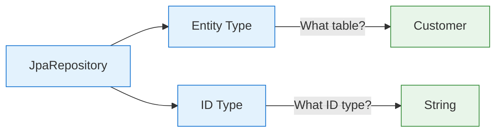
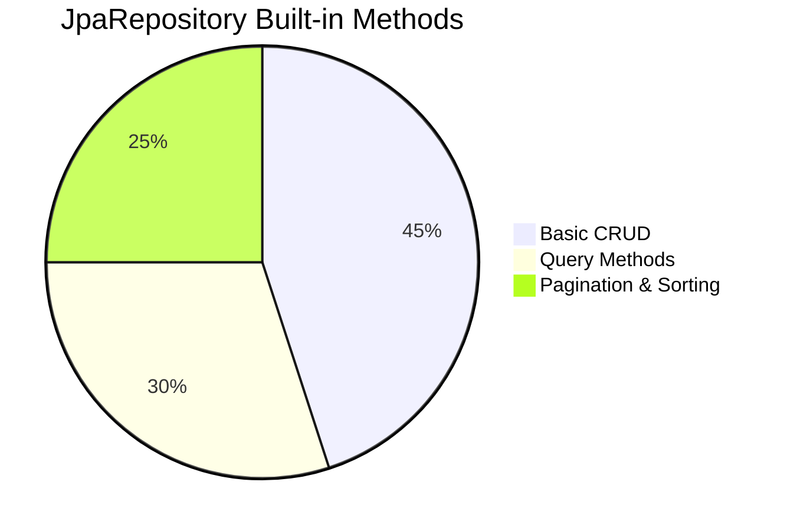
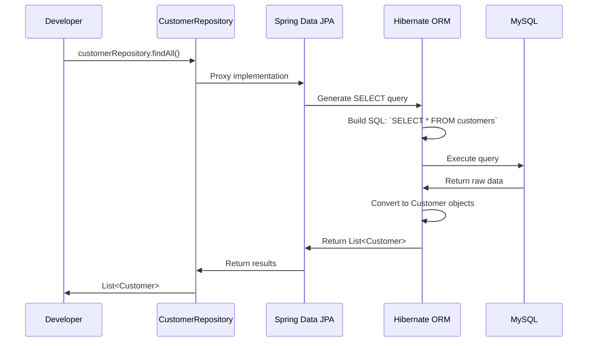

Here's the corrected version of your markdown file with syntax fixes and improved formatting:

```markdown
---
tags: [java/springboot, java/jpa, beginner, crud]
date: 2025-09-05
topic: What is JpaRepository and How It Works
---

# Understanding JpaRepository - The Heart of Spring Data JPA

## What is JpaRepository? (The Simplest Explanation)
**JpaRepository = Your Database Superpower**


> [!INFO] **Real-Life Analogy: Restaurant Menu**  
> Imagine JpaRepository is like a restaurant menu:  
> - You = Customer who orders food  
> - JpaRepository = The complete menu with all dishes listed  
> - Spring Data JPA = The kitchen staff who prepares the dishes  
> When you extend JpaRepository, you're saying: *"I want all the standard database operations available,"* and Spring provides them automatically.

---

## What JpaRepository Actually Is

### The Technical Definition
**JpaRepository** is a generic interface provided by Spring Data JPA that gives you ready-to-use database operations.

```java
public interface CustomerRepository extends JpaRepository<Customer, String> {
    // Your interface is EMPTY but has superpowers!
}
```

#### The Two Critical Type Parameters


> [!WARNING] **Critical Detail**  
> In your Northwind application, customer IDs are text values like "ALFKI", not numbers. This is why your repository must use `String` as the ID type:  
> ```java
> public interface CustomerRepository extends JpaRepository<Customer, String> {
>     // Correct for Northwind database
> }
> ```  
> Using `Integer` would cause runtime errors because Spring would look for numeric IDs.

---

## What JpaRepository Gives You (The Superpowers)

### The Complete CRUD Toolkit


#### Basic CRUD Operations (No Code Needed!)
| Method          | What It Does                     | Your Northwind Example                |
|-----------------|----------------------------------|---------------------------------------|
| `save()`        | Create or update an entity       | `customerRepository.save(newCustomer)` |
| `findAll()`     | Get all entities                 | `customerRepository.findAll()`        |
| `findById(id)`  | Get one entity by ID             | `customerRepository.findById("ALFKI")` |
| `delete()`      | Remove an entity                 | `customerRepository.delete(customer)` |
| `existsById(id)`| Check if entity exists           | `customerRepository.existsById("ALFKI")` |
| `count()`       | Count all entities               | `customerRepository.count()`          |

#### How These Methods Work Behind the Scenes


> [!TIP] **The Magic You Don't See**  
> When you call `customerRepository.findAll()`, Spring Data JPA:  
> 1. Knows you want all `Customer` entities  
> 2. Generates the correct SQL (`SELECT * FROM customers`)  
> 3. Executes it against your database  
> 4. Converts results to Java objects  
> 5. Returns them to you as a `List`  
> **You never write SQL or handle database connections!**

