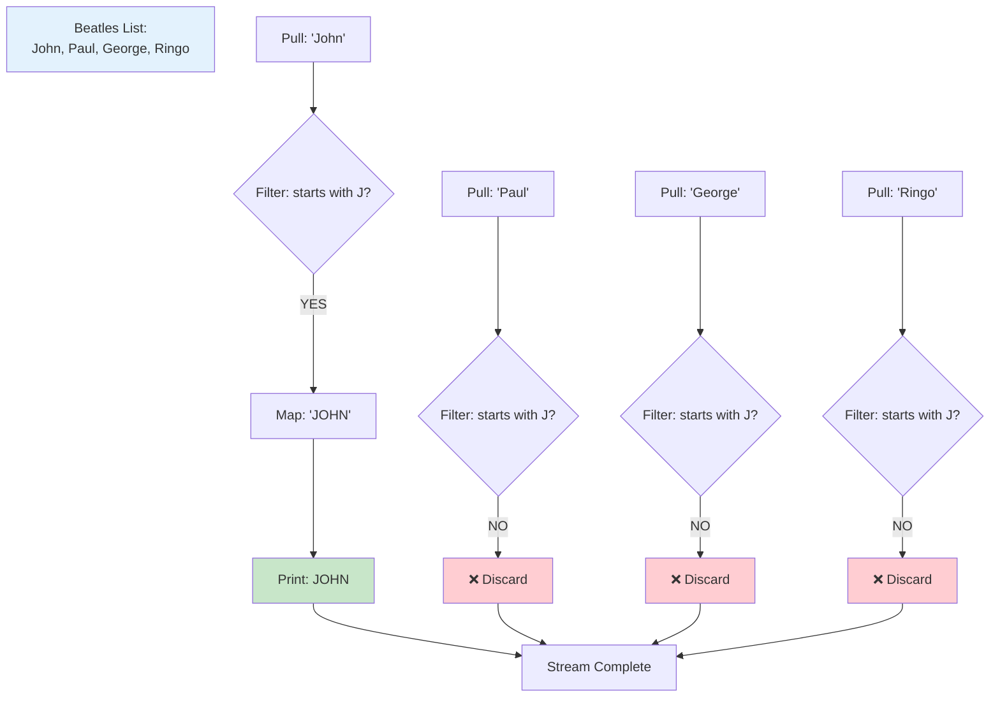

# Deep Dive: The Beatles Stream Example

Let me walk you through your Beatles example with the same level of detail we've been exploring. This is perfect because working with strings instead of numbers will help solidify your understanding that streams work with any type of data. I'll trace through exactly what happens at each stage, from the moment you call `.stream()` to when the results appear on your console.

## Setting the Stage: Your Data Structure

When you create your Beatles list, here's what exists in memory:

```java
List<String> beatles = new ArrayList<>(List.of("John", "Paul", "George", "Ringo"));
```

At this moment, you have an ArrayList in memory containing four String objects. Each string is stored as a reference, and the ArrayList maintains an internal array that holds these references. Picture it like four index cards in a box, each with a Beatle's name written on it.

## The Moment of Stream Creation

Now we reach the critical moment when you call `.stream()`:

```java
beatles.stream()
```

Remember what we discovered earlier: this doesn't copy your data or start processing anything. Instead, Java creates a lightweight Stream object that's essentially a smart controller. Let me show you what exists in memory at this exact moment:

```
Memory after beatles.stream():

ArrayList beatles:
[0] → "John"
[1] → "Paul"  
[2] → "George"
[3] → "Ringo"

Stream object (newly created):
{
    source: reference to beatles list
    currentIndex: -1 (not started)
    operations: [] (empty pipeline)
    status: "READY"
}
```

The Stream object is like a reading head on an old cassette player - it knows where the data is and how to read it, but it hasn't started moving yet.

## Building the Pipeline: Adding Filter

When you add `.filter(num -> num % 2 == 0)`, wait - I see in your code you're actually filtering for names that start with "J". Let me correct that and use your actual example:

```java
.filter(name -> name.startsWith("J"))
```

This is where understanding lambdas becomes crucial. The lambda `name -> name.startsWith("J")` is a complete instruction set. The parameter `name` is essential because when the stream eventually runs, it needs to know what variable name to use for each Beatles member's name as it processes them.

At this point, the stream's internal state looks like this:

```
Stream object after adding filter:
{
    source: reference to beatles list
    currentIndex: -1
    operations: [
        {
            type: "FILTER",
            predicate: (name -> name.startsWith("J"))
        }
    ]
    status: "PIPELINE_BUILDING"
}
```

Notice that nothing has been filtered yet! The stream is just recording that when it eventually runs, it should apply this filter.

## Adding the Transformation: Map

Next, you add a map operation:

```java
.map(name -> name.toUpperCase())
```

This lambda takes whatever name passes through and converts it to uppercase. Again, the parameter `name` is crucial - without it, how would the lambda know what to convert to uppercase? The expression `toUpperCase()` by itself is meaningless; it needs an object to call the method on.

The stream's pipeline now has two operations queued up:

```
Stream object after adding map:
{
    source: reference to beatles list
    operations: [
        { type: "FILTER", predicate: (name -> name.startsWith("J")) },
        { type: "MAP", transformer: (name -> name.toUpperCase()) }
    ]
    status: "PIPELINE_BUILDING"
}
```

## The Trigger: Terminal Operation

Everything springs to life when you add the terminal operation:

```java
.forEach(System.out::println)
```

This is the moment when the stream actually starts processing. Let me trace through what happens for each element, showing you the complete journey of each Beatle's name through your pipeline.

## Element-by-Element Processing

Let me show you exactly what happens as each name flows through the pipeline. This is where the magic becomes visible.

### Processing "John"

```
Step 1: Stream pulls "John" from position 0
Step 2: Filter operation receives "John"
        - Assigns "John" to parameter 'name'
        - Evaluates: "John".startsWith("J")
        - Result: true ✓
        - "John" passes through
Step 3: Map operation receives "John"
        - Assigns "John" to parameter 'name'  
        - Evaluates: "John".toUpperCase()
        - Result: "JOHN"
        - Outputs "JOHN"
Step 4: forEach receives "JOHN"
        - Executes: System.out.println("JOHN")
        - Console shows: JOHN
```

### Processing "Paul"

```
Step 1: Stream pulls "Paul" from position 1
Step 2: Filter operation receives "Paul"
        - Assigns "Paul" to parameter 'name'
        - Evaluates: "Paul".startsWith("J")
        - Result: false ✗
        - "Paul" is discarded
Step 3: (Map is never called for "Paul")
Step 4: (forEach is never called for "Paul")
```

Notice how "Paul" never makes it past the filter, so the map operation never even sees it. This is the efficiency of stream processing - operations are only applied to elements that need them.

### Processing "George"

```
Step 1: Stream pulls "George" from position 2
Step 2: Filter operation receives "George"
        - Assigns "George" to parameter 'name'
        - Evaluates: "George".startsWith("J")
        - Result: false ✗
        - "George" is discarded
        - No further processing
```

### Processing "Ringo"

```
Step 1: Stream pulls "Ringo" from position 3
Step 2: Filter operation receives "Ringo"
        - Assigns "Ringo" to parameter 'name'
        - Evaluates: "Ringo".startsWith("J")
        - Result: false ✗
        - "Ringo" is discarded
        - No further processing
```

## The Complete Flow Visualization

Let me create a visual representation of the entire process:



## Understanding Method References

I notice in your code you might use `System.out::println` instead of writing out a full lambda. This is called a method reference, and it's just shorthand for a lambda. These two are equivalent:

```java
// Method reference
.forEach(System.out::println)

// Equivalent lambda
.forEach(name -> System.out.println(name))
```

The method reference is saying "for each element that comes through, call System.out.println with that element as the argument." It still needs that implicit parameter - the element being processed - even though you don't see it written explicitly.

## The Alternative: Traditional Loop Approach

To truly appreciate what the stream is doing, let's write the equivalent code using a traditional loop:

```java
// Traditional approach - what you'd write without streams
List<String> beatles = new ArrayList<>(List.of("John", "Paul", "George", "Ringo"));
List<String> uppercaseJNames = new ArrayList<>();

for (String beatle : beatles) {
    if (beatle.startsWith("J")) {          // This is your filter
        String uppercase = beatle.toUpperCase();  // This is your map
        uppercaseJNames.add(uppercase);
        System.out.println(uppercase);      // This is your forEach
    }
}
```

The stream version accomplishes the same thing but separates each transformation into its own distinct step, making the code more modular and easier to understand at a glance.

## Why Each Lambda Parameter Matters

Let me reinforce why we need those parameter names in your lambdas by showing what would happen if Java tried to work without them:

```java
// Imagine if you could write (incorrectly):
.filter(startsWith("J"))  // ERROR: startsWith("J") on what?

// The filter receives "John" but has no way to reference it!
// It's like receiving a package but having no name to call it by
```

When the filter operation receives "John", it needs to bind that value to a variable name so the lambda body can reference it. That's what `name ->` does - it says "whatever string you give me, I'll call it 'name' and then check if name.startsWith('J')."

## The Collection at the End

If you wanted to collect your results instead of just printing them, you could replace `forEach` with a collecting operation:

```java
List<String> upperCaseJNames = beatles.stream()
    .filter(name -> name.startsWith("J"))
    .map(name -> name.toUpperCase())
    .toList();  // or .collect(Collectors.toList()) in older Java
```

This would give you a new list containing just ["JOHN"], while your original beatles list remains unchanged.

## A Critical Insight About State

Here's something profound to understand: throughout this entire process, your original Beatles list never changes. The stream creates a processing pipeline that reads from your list but never modifies it. This immutability is a key principle of functional programming that streams embrace.

After all the processing is complete, if you were to print your original list:

```java
System.out.println(beatles);  // Still prints [John, Paul, George, Ringo]
```

The names are still in their original form, proving that streams process data without side effects on the source.

## Putting It All Together

Your Beatles example beautifully demonstrates every concept we've discussed. The `.stream()` creates a smart controller, not a copy of your data. The filter lambda needs its parameter `name` to know what it's checking. The map lambda needs its parameter to know what to transform. And the entire pipeline doesn't execute until `forEach` triggers it, at which point each element makes its complete journey through the pipeline before the next element begins.

The elegance of streams is that they let you express your intent clearly: "From these Beatles, filter those whose names start with J, convert them to uppercase, and print each one." The stream handles all the iteration and plumbing, letting you focus on describing the transformations you want.