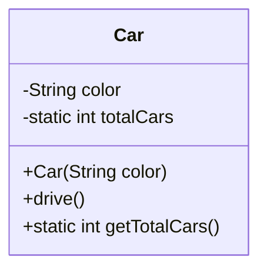
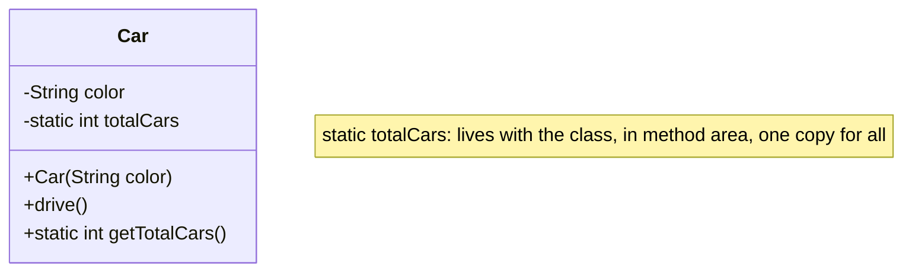

## Understanding `static` in Java

<!-- TOC -->
  * [Understanding `static` in Java](#understanding-static-in-java)
    * [The Blueprint Analogy](#the-blueprint-analogy)
    * [Why Use `static`?](#why-use-static)
      * [Example: Counting All Cars](#example-counting-all-cars)
      * [Example: Utility Functions](#example-utility-functions)
    * [When to Use `static` vs. Instance](#when-to-use-static-vs-instance)
    * [Pedagogical Breakdown](#pedagogical-breakdown)
      * [1. Ask: "Does this need per-object state?"](#1-ask-does-this-need-per-object-state)
      * [2. Ask: "Would it make sense to create an object just to use this?"](#2-ask-would-it-make-sense-to-create-an-object-just-to-use-this)
      * [3. Ask: "Is this data or behavior about all objects of this class?"](#3-ask-is-this-data-or-behavior-about-all-objects-of-this-class)
    * [Practical Examples](#practical-examples)
      * [Instance Context (Requires Object)](#instance-context-requires-object)
      * [Static Context (Uses Class Name)](#static-context-uses-class-name)
    * [Common Pitfalls](#common-pitfalls)
    * [Summary Table](#summary-table)
    * [Further Exploration](#further-exploration)
      * [Collapsible: Advanced Example with Factory Counter](#collapsible-advanced-example-with-factory-counter)
      * [Mermaid: Class vs. Object Relationship](#mermaid-class-vs-object-relationship)
    * [References](#references)
  * [Static vs. Instance: Complete Explanation](#static-vs-instance-complete-explanation)
    * [Object-Oriented Basics](#object-oriented-basics)
    * [Example: Car Counter](#example-car-counter)
    * [How Does This Work?](#how-does-this-work)
    * [Class Loading and Memory](#class-loading-and-memory)
      * [When Do Static Variables Exist?](#when-do-static-variables-exist)
      * [Where Does `totalCars` Live?](#where-does-totalcars-live)
      * [When Is Static Memory Freed?](#when-is-static-memory-freed)
    * [Thread Safety](#thread-safety)
    * [When To Use Static](#when-to-use-static)
    * [When Not To Use Static](#when-not-to-use-static)
    * [Memory Model Summary Table](#memory-model-summary-table)
    * [Visual Summary](#visual-summary)
  * [Key Insights](#key-insights)
  * [Practical Takeaways](#practical-takeaways)
  * [Further Exploration](#further-exploration-1)
<!-- TOC -->

> **Quick Reference**
>
> - **Instance** methods/fields: **require an object** (e.g., `myCar.drive()`).
> - **Static** methods/fields: **accessed via the class** (e.g., `Car.countTotalCars()`).
> - **When to use**:


- **Static**: For utility functions, constants, or data about all objects of a class.


> - **Instance**: When you need per-object state and behavior.

______________________________________________________________________

### The Blueprint Analogy


- **Classes** are blueprints (e.g., `Car`).
- **Objects** are instances created from this blueprint (e.g., `new Car()`).
- **Instance** members (methods, fields) belong to **each object** (e.g., `color`, `drive()`).
- **Static** members belong to **the class itself**, not to any single object.


______________________________________________________________________

### Why Use `static`?

> [!TIP]
> Use `static` for data or behavior that is **not unique to objects** but belongs to the **entire class**.

#### Example: Counting All Cars

Imagine you want to track how many `Car` objects exist.


- **Inefficient way**: Each `Car` keeps a list of all cars (circular, impractical).
- **Correct way**: Use a `static` counter inside the `Car` class.


```java
public class Car {
    // Instance field (unique per car)
    private String color;

    // Static field (shared by all cars)
    private static int totalCars = 0;

    // Constructor
    public Car(String color) {
        this.color = color;
        totalCars++;
    }

    // Static method
    public static int getTotalCars() {
        return totalCars;
    }

    // Instance method
    public void drive() {
        System.out.println(color + " car is driving");
    }
}
```


Now, you can call `Car.getTotalCars()` **without** creating a `Car` object.

______________________________________________________________________

#### Example: Utility Functions

The `Math` class in Java is **full of static methods**.


- `Math.sqrt(25)` – no "Math object" makes sense.
- `Math.max(10, 20)` – same logic; there’s no "max object".


**If you need to create a `Math` object, you’re missing the point of a utility class.**

______________________________________________________________________

### When to Use `static` vs. Instance


| Scenario                                   | Use static? | Use instance? | Example                    |
|:-------------------------------------------|:------------|:--------------|:---------------------------|
| Track count of all objects                 | Yes         | No            | `Car.totalCars`            |
| Access or modify individual object state   | No          | Yes           | `car1.drive()`             |
| General utility functions                  | Yes         | No            | `StringUtils.isEmpty(str)` |
| Data or behavior depending on object state | No          | Yes           | `account1.withdraw(100)`   |


______________________________________________________________________

### Pedagogical Breakdown

#### 1. Ask: "Does this need per-object state?"


- **Yes**: Use an instance method or field.
- **No**: Consider `static`.


#### 2. Ask: "Would it make sense to create an object just to use this?"


- **No**: Use `static`.
- **Yes**: Use instance.


#### 3. Ask: "Is this data or behavior about all objects of this class?"


- **Yes**: Use `static`.


______________________________________________________________________

### Practical Examples

#### Instance Context (Requires Object)


```java
BankAccount account1 = new BankAccount(100.0);
account1.

withdraw(50.0); // Needs to know which account to withdraw from
```


#### Static Context (Uses Class Name)


```java
BankAccount.calculateInterest(1000.0,0.05); // Just a calculator, no account needed
```


______________________________________________________________________

### Common Pitfalls

> [!WARNING]
> **Avoid overusing `static`.**
> It can make code harder to test and less flexible with polymorphism and inheritance.

______________________________________________________________________

### Summary Table


| Concept  | Instance              | Static                     |
|:---------|:----------------------|:---------------------------|
| Access   | `object.method()`     | `Class.method()`           |
| State    | Per object            | Across all objects         |
| Context  | Individual object     | Class itself               |
| Use Case | Object-specific logic | Utility, constants, counts |


______________________________________________________________________

### Further Exploration


- \[[Java Object Model]\]
- \[[Java Best Practices]\]
- #java/static-vs-instance


______________________________________________________________________

#### Collapsible: Advanced Example with Factory Counter

<details>
<summary>Click to expand advanced example</summary>


```java
public class Car {
    private static int nextId = 1;
    private int id;
    private String color;

    public Car(String color) {
        this.id = nextId++;
        this.color = color;
    }

    public static int getNextId() {
        return nextId;
    }
}
```


</details>

______________________________________________________________________

#### Mermaid: Class vs. Object Relationship





______________________________________________________________________

### References


- [Oracle Java Tutorial: Static Variables and Methods](https://docs.oracle.com/javase/tutorial/java/javaOO/classvars.html)
- [Effective Java, 3rd Edition, Item 17](https://www.oreilly.com/library/view/effective-java-3rd/9780134686097/) (
  Minimize mutability, consider `static` for immutable data)
- #java #static #OOP #bestpractices #objects


______________________________________________________________________

> [!NOTE]
> _Use static when the behavior is about the class, not its instances. Use instance for everything else._
> _This distinction is core to \[[Java Object-Oriented Programming]\] and \[[Java Class Design]\]._

______________________________________________________________________

**Tags:** #java/static #java/object-model #teaching #note-taking #cheatsheet

______________________________________________________________________

## Static vs. Instance: Complete Explanation

### Object-Oriented Basics


- **Classes** are blueprints. **Objects** are real instances created from those blueprints.
- **Instance fields/methods** (`color`, `drive()`) exist per-object; each `Car` has its own `color`.
- **Static fields/methods** (`totalCars`, `getTotalCars()`) belong to the **class itself**, not to any object.


### Example: Car Counter


```java

public class Car {
    private String color;           // Instance field
    private static int totalCars = 0; // Static field (shared)

    public Car(String color) {
        this.color = color;
        totalCars++;                // Increment on each new Car
    }

    public static int getTotalCars() {
        return totalCars;
    }
}

```


**Usage:**


```java

public static void main(String[] args) {
    System.out.println(Car.getTotalCars());  // 0
    Car honda = new Car("red");              // totalCars -> 1
    Car toyota = new Car("blue");            // totalCars -> 2
    System.out.println(Car.getTotalCars());  // 2
}

```


### How Does This Work?


- **`totalCars` is not stored in any `Car` object.** It lives with the `Car` **class**.
- **Every new `Car` increments `totalCars`.** The count is **shared** across all cars.
- **You can access `totalCars` without creating a `Car`** (`Car.getTotalCars()`).
- **If you try to access `color` without an object, it fails** (`Car.color` is invalid).


### Class Loading and Memory

#### When Do Static Variables Exist?


- **Not at compile time:** `totalCars` is just metadata in `.class` file.
- **Not at program start:** JVM does **not** load all classes immediately.
- **At first use:** When you first reference `Car` (e.g., `Car.getTotalCars()` or `new Car()`), JVM loads the class and
  initializes static variables in the **method area** (aka Metaspace), a special memory region for class metadata.
- **Initialization:** `private static int totalCars = 0;` runs **once**, when `Car` is loaded.


**Test Program:**


```java

System.out.println("Start");

int count = Car.getTotalCars(); // Car class loaded here
System.out.

println("Car class now loaded");

```


**Output:**


```java

Start
        Car

class now loaded

```


#### Where Does `totalCars` Live?


- **Instance variables:** Live in heap, unique per object.
- **Static variables:** Live in method area, **one per class for all objects**.
- **Classes themselves are objects** (of type `Class`); their metadata, including static fields, is managed by the JVM.


#### When Is Static Memory Freed?


- **Static variables** persist as long as the **class is loaded**.
- **Classes are unloaded** only when their `ClassLoader` is garbage collected (uncommon in simple apps).
- **In most programs**, static variables exist for the entire runtime.


> [!WARNING]
> **Static collections** can cause memory leaks if not managed—they are never garbage collected unless the class is
> unloaded.

### Thread Safety


- **Static variables are shared by all threads.**
- **Be careful with concurrent access:** Use synchronization if needed.
- **Static final for constants is safe** (immutable).


### When To Use Static


- **Utility methods:** `Math.sqrt()`, `String.format()`
- **Constants:** `public static final double PI = 3.14159;`
- **Counters or shared state:** `totalCars`
- **Factory methods:** `Car.createNewCar()`
- **Main method:** `public static void main(String[] args)`


### When Not To Use Static


- **Data/behavior specific to an object:** Use instance fields/methods.
- **Overuse can make code harder to test and mock.**
- **Avoid static for everything:** It’s **not** a substitute for good OO design.


### Memory Model Summary Table


| Aspect                 | Instance Variable   | Static Variable                |
|------------------------|---------------------|--------------------------------|
| **Memory Location**    | Heap (with object)  | Method Area (with class)       |
| **Lifetime**           | Object lifetime     | Class lifetime                 |
| **Access**             | `object.field`      | `Class.field`                  |
| **Garbage Collection** | When object is GC'd | When class+ClassLoader is GC'd |
| **Usage Example**      | `car.color`         | `Car.totalCars`                |


### Visual Summary





______________________________________________________________________

## Key Insights


- **Static variables** belong to the **class**, not instances.
- **Classes are loaded** and their static variables initialized **on first use** (not at program start).
- **Static memory** lives in the method area, persists until class unload (rare).
- **Static is powerful but should be used thoughtfully.**
- **Static is ideal for shared data/utility; instance for object-specific state.**


______________________________________________________________________

## Practical Takeaways


- **Use static for class-wide data/behavior.**
- **Use instance for object-specific data/behavior.**
- **Understand when and how memory is allocated for statics.**
- **Be aware of thread safety and memory leaks with statics.**


______________________________________________________________________

## Further Exploration


- \[[Java Class Loading Mechanism]\]
- \[[Java Memory Model]\]
- \[[Thread Safety in Java]\]
- #java/static #java/memory-model #java/class-loading #java/cheatsheet


______________________________________________________________________

> [!TIP]
> **Static variables are like whiteboards in a classroom—shared by everyone. Instance variables are individual
> notebooks—private to each student. Use each where it makes sense!**

